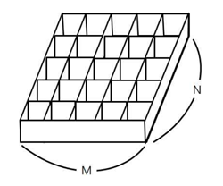
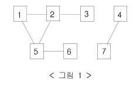
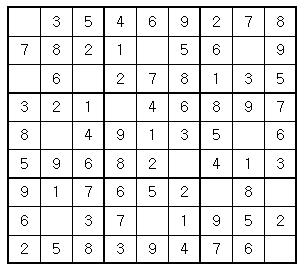
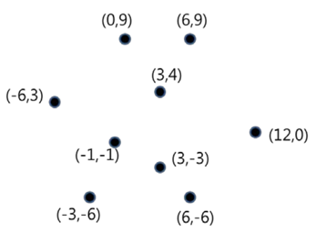

~~~
\n+(문제|입력|출력)$  \n\n#### $1
\n예제 입력 (\d+) *$  \n\n~~~\n#### 예제 입력 $1\n~~~\n
\n예제 출력 (\d+) *$  \n\n~~~\n#### 예제 출력 $1\n~~~\n
\n힌트  \n~~~\n\n#### 힌트
~~~\n#### 예제 입력 1\n  \n#### 예제 입력 1\n
\n\n~~~  \n~~~\n
\n+(출처|보기|메모|링크)$  \n\n#### $1
\n+비슷한 문제  \n\n#### 비슷한 문제
\n+알고리즘 분류 * \n\n#### 알고리즘 분류
\n+(문제를 번역한 사람|문제의 오타를 찾은 사람|잘못된 조건을 찾은 사람)  \n-$1
\n+(문제를 만든 사람|데이터를 추가한 사람|잘못된 데이터를 찾은 사람|데이터를 만든 사람)  \n-$1

^[ \t]+\n  \n
\n+## +  \n\n\n\n## 
\n+### +  \n\n\n### 
\n\n\n####   \n\n#### 

^(#### 예제 )\n~~~\n  $1\n~~~ `
~~~


## 입/출력 받아보기
입력과 출력만 사용하는 문제들로 입출력을 해봅니다


### 2557  Hello World [#]
Hello World! 를 화면에 출력하는 문제

#### 문제
Hello World!를 출력하시오.

#### 입력
없음

#### 출력
Hello World!를 출력하시오.

#### 예제 입력 1
~~~
~~~

#### 예제 출력 1
~~~
Hello World!
~~~

#### 힌트

#### 알고리즘 분류

#### 출력

#### 메모
- 모든 프로그래밍 언어의 입구 : 1st Problem
- 출력함수 기본 예제 Hello World!
- nodejs:: memory: 720268 KB
- swift:: memory: 1984 KB
- c++17:: memory: 60068 KB
- nodejs, swift는 memory를 어마어마~하게 잡아먹는다.
- c++:: <iostream> vs. <cstdio> [!]
- c++:: cout vs. printf [!]

#### 풀이 1
```javascript
// [[nodejs]]

console.log("Hello World!")
```

#### 풀이 2
```swift
// [[swift]]

print("Hello World!")
```

#### 풀이 3
```c++
// [[c++]]

#include <iostream>

int main() {
  std::cout << "Hello World!\n";
  return 0;
}
```


### 1000  A+B [#]
두 수를 입력받고 합을 출력하는 문제

#### 문제
두 수 A와 B를 입력받은 다음, A+B를 출력하는 프로그램을 작성하시오.

#### 입력
첫째 줄에 A와 B가 주어진다. (0 < A, B < 10)

#### 출력
첫째 줄에 A+B를 출력한다.

#### 예제 입력 1
~~~
1 2
~~~

#### 예제 출력 1
~~~
3
~~~

#### 힌트
[여기](https://www.acmicpc.net/help/language)를 누르면 1000번 예제 소스를 볼 수 있습니다.

#### 출처
- 문제를 만든 사람: baekjoon
- 데이터를 추가한 사람: doju

#### 비슷한 문제
1001번. A-B
1008번. A/B
2558번. A+B - 2
10950번. A+B - 3
10951번. A+B - 4
10952번. A+B - 5
10953번. A+B - 6
10998번. A×B
11021번. A+B - 7
11022번. A+B - 8

#### 알고리즘 분류
사칙연산
수학

#### 메모
- +입력문, +사칙연산
- nodejs:: memory: 721440 KB
- swift:: memory: 60092 KB
- c++17:: memory: 1984 KB
- c++:: cin vs. scanf [!]
- c++:: using namespace std [!]

#### 풀이
```javascript
// [[nodejs]]

var fs = require('fs');
var input = fs.readFileSync('/dev/stdin').toString().split(' ');
var a = parseInt(input[0]);
var b = parseInt(input[1]);

console.log(a+b);
```

#### 풀이
```swift
// [[swift]]

let input =  readLine()!

let arr = input.split(separator: " ")

var a: Int = Int(arr[0])!
var b: Int = Int(arr[1])!

print(String(a+b))
```

#### 풀이
```c++
// [[c++]]

#include <iostream>
using namespace std;

int main() {
  auto a=0, b=0;
  cin >> a >> b;
  cout << a+b << endl;
  return 0;
}


// scanf, printf
#include <iostream>

int main() {
  int a, b;
  scanf("%d %d",&a,&b);
  printf("%d\n",a+b);
  return 0;
}
```


### 1001  A-B
두 수를 입력받고 뺄셈을 한 결과를 출력하는 문제

#### 문제
A-B를 계산하시오.

#### 입력
첫째 줄에 A와 B가 주어진다. (0< A, B < 10)

#### 출력
첫째 줄에 A-B를 출력한다.

#### 예제 입력 1
~~~
3 2
~~~

#### 예제 출력 1
~~~
1
~~~

#### 힌트

#### 출처
- 문제를 만든 사람: baekjoon

#### 비슷한 문제
1000번. A+B
1008번. A/B
10998번. A×B

#### 알고리즘 분류
사칙연산
수학

#### 메모
- nodejs:: memory: 720268 KB
- swift:: memory: 60092 KB

#### 풀이
```javascript
// [[nodejs]]

var fs = require('fs');
var input = fs.readFileSync('/dev/stdin').toString().split(' ');
var a = parseInt(input[0]);
var b = parseInt(input[1]);

console.log(a-b);
```

#### 풀이
```swift
// [[swift]]

let input =  readLine()!

let arr = input.split(separator: " ")

var a: Int = Int(arr[0])!
var b: Int = Int(arr[1])!

print(String(a-b))
```


### 7287  등록
자신이 acmicpc.net에서 푼 문제의 수와 acmicpc.net 아이디를 출력하는 문제

#### 문제
자신이 온라인 저지에서 맞은 문제의 개수와 아이디를 그대로 출력하는 프로그램을 작성하시오.

#### 입력
이 문제는 입력이 없다.

#### 출력
첫 줄에 자신이 맞은 문제의 수, 둘째 줄에 아이디를 출력한다.

#### 예제 입력 1
~~~
~~~

#### 예제 출력 1
~~~
123
Your_ICPC_Team_Name
~~~

#### 힌트

#### 출처
ACM-ICPC > Regionals > Asia > Korea > Nationwide Internet Competition > Asia Regional - Daejeon Nationalwide Internet Competition 2013 J번

ACM-ICPC > Regionals > Asia > Korea > Nationwide Internet Competition > Asia Regional - Daejeon Nationalwide Internet Competition 2014 H번

ACM-ICPC > Regionals > Asia > Korea > Nationwide Internet Competition > Asia Regional - Daejeon Nationalwide Internet Competition 2015 K번

ACM-ICPC > Regionals > Asia > Korea > Nationwide Internet Competition > Asia Regional - Daejeon Nationalwide Internet Competition 2016 K번

ACM-ICPC > Regionals > Asia > Korea > Nationwide Internet Competition > Asia Regional - Daejeon Nationalwide Internet Competition 2017 K번
- 데이터를 만든 사람: baekjoon

#### 알고리즘 분류

#### 출력

#### 메모
- [BAEKJOON](https://www.acmicpc.net/)에서 맞은 문제 개수, 아이디를 찾아넣기
- crawling으로 자동으로 넣는 방법은? [!]

#### 풀이
```javascript
// [[nodejs]]

console.log("3\nhopelife")
```

#### 풀이
```swift
// [[swift]]

print("8\nhopelife")
```


### 10172  개 [#]
그림을 출력하는 문제

#### 문제
아래 예제와 같이 개를 출력하시오.

#### 입력
없음.

#### 출력
개를 출력한다.

#### 예제 입력 1
~~~
~~~

#### 예제 출력 1
~~~
|\_/|
|q p|   /}
( 0 )"""\
|"^"`    |
||_/=\\__|
~~~

#### 힌트

#### 출처
High School > PLU High School Programming Contest > PLU 2014 - Novice 3번

#### 알고리즘 분류

#### 출력

#### 메모
- 문자열 표시법
- 언어별 ", ' 사용법/처리법 [!]

#### 풀이
```javascript
// [[nodejs]]

console.log('|\\_/|\n|q p|   \/}\n( 0 )"""\\\n|"^"`    |\n||_/=\\\\__|');
```

#### 풀이
```swift
// [[swift]]

print("|\\_/|\n|q p|   /}\n( 0 )\"\"\"\\\n|\"^\"`    |\n||_/=\\\\__|")
```

#### 풀이
```c++
// [[c++]]

#include <iostream>

int main() {
  std::cout << "|\\_/|\n|q p|   /}\n( 0 )\"\"\"\\\n|\"^\"`    |\n||_/=\\\\__|\n";
  return 0;
}
```


### 10718 We love kriii
주어진 문자를 출력하는 문제1

#### 문제
ACM-ICPC 인터넷 예선, Regional, 그리고 World Finals까지 이미 2회씩 진출해버린 kriii는 미련을 버리지 못하고 왠지 모르게 올 해에도 파주 World Finals 준비 캠프에 참여했다.

대회를 뜰 줄 모르는 지박령 kriii를 위해서 격려의 문구를 출력해주자.

#### 입력
본 문제는 입력이 없다.

#### 출력
두 줄에 걸쳐 "강한친구 대한육군"을 한 줄에 한 번씩 출력한다.

#### 예제 입력 1
~~~
~~~

#### 예제 출력 1
~~~
강한친구 대한육군
강한친구 대한육군
~~~

#### 힌트

#### 출처
Contest > Coder's High > Coder's High 2015 Side Contest P1번
- 문제를 만든 사람: tae

#### 알고리즘 분류

#### 출력

#### 메모
- 개행문자(줄바꿈) 처리방법

#### 풀이
```javascript
// [[nodejs]]

console.log("강한친구 대한육군\n강한친구 대한육군");
```

#### 풀이
```swift
// [[swift]]

print("강한친구 대한육군\n강한친구 대한육군")
```

#### 메모


### 11718 그대로 출력하기 [#]
입력받은 문자를 출력하는 문제1

#### 문제
입력 받은 대로 출력하는 프로그램을 작성하시오.

#### 입력
입력이 주어진다. 입력은 최대 100줄로 이루어져 있고, 알파벳 소문자, 대문자, 공백, 숫자로만 이루어져 있다. 각 줄은 100글자를 넘지 않으며, 빈 줄은 주어지지 않는다. 또, 각 줄은 공백으로 시작하지 않고, 공백으로 끝나지 않는다.

#### 출력
입력받은 그대로 출력한다.

#### 예제 입력 1
~~~
Hello
Baekjoon
Online Judge
~~~

#### 예제 출력 1
~~~
Hello
Baekjoon
Online Judge
~~~

#### 힌트

#### 출처
- 문제를 만든 사람: baekjoon

#### 알고리즘 분류

#### 보기

#### 메모
- 여러줄을 한꺼번에 입력하는 방법은 아님
- scanf, printf로 구현해볼 것 [!]

#### 풀이
```c++
// [[c++]]

#include<iostream>

#include<string>
using namespace std;

int main() {
  string a;

  for (int i = 0; i < 100; ++i) {
    getline(cin, a);
    if (a == "") break;
    cout << a << endl;
  }
}
```


### 11719 그대로 출력하기 2 [#]
입력받은 문자를 출력하는 문제2

#### 문제
입력 받은 대로 출력하는 프로그램을 작성하시오.

#### 입력
입력이 주어진다. 입력은 최대 100줄로 이루어져 있고, 알파벳 소문자, 대문자, 공백, 숫자로만 이루어져 있다. 각 줄은 100글자를 넘지 않으며, 빈 줄이 주어질 수도 있고, 각 줄의 앞 뒤에 공백이 있을 수도 있다.

#### 출력
입력받은 그대로 출력한다.

#### 예제 입력 1
~~~
    Hello

Baekjoon
   Online Judge
~~~

#### 예제 출력 1
~~~
    Hello

Baekjoon
   Online Judge
~~~

#### 힌트

#### 출처
- 문제를 만든 사람: baekjoon

#### 알고리즘 분류

#### 보기

#### 메모
- 공백문자(띄어쓰기)가 있는 경우의 입력
- scanf, printf 시도해 볼 것 [!]

#### 풀이
```c++
// [[c++]]

#include <iostream>
#include <string>

using namespace std;

int main() {
  char a;
  a = getchar();

  while (a != -1) {
    putchar(a);
    a = getchar();
  }

  return 0;
}
```


## 사칙연산 도전하기
덧셈, 뺄셈, 곱셈, 나눗셈, 나머지 연산을 사용해 봅니다


### 1000  A+B [@]
두 수의 덧셈

#### 메모
- 입/출력 받아보기 1000번과 중복


### 1001  A-B [@]
두 수의 뺄셈

#### 메모
- 입/출력 받아보기 1001번과 중복


### 10998 A×B
두 수의 곱셈

#### 문제
두 정수 A와 B를 입력받은 다음, A×B를 출력하는 프로그램을 작성하시오.

#### 입력
첫째 줄에 A와 B가 주어진다. (0 < A, B < 10)

#### 출력
첫째 줄에 A×B를 출력한다.

#### 예제 입력 1
~~~
1 2
~~~

#### 예제 출력 1
~~~
2
~~~

#### 예제 입력 2
~~~
3 4
~~~

#### 예제 출력 2
~~~
12
~~~

#### 힌트

#### 출처
- 문제를 만든 사람: baekjoon

#### 비슷한 문제
1000번. A+B
1001번. A-B
1008번. A/B

#### 알고리즘 분류
사칙연산

#### 메모
- trivial

#### 풀이
```javascript
// [[nodejs]]

var fs = require('fs');
var input = fs.readFileSync('/dev/stdin').toString().split(' ');
var a = parseInt(input[0]);
var b = parseInt(input[1]);

console.log(a*b);
```


### 1008  A/B
두 수의 나눗셈

#### 문제
A/B를 계산하시오.

#### 입력
첫째 줄에 A와 B가 주어진다. (0 < A, B < 10)

#### 출력
첫째 줄에 A/B를 출력한다. 절대/상대 오차는 10-9 까지 허용한다.

#### 예제 입력 1
~~~
1 3
~~~

#### 예제 출력 1
~~~
0.33333333333333333333333333333333
~~~

#### 예제 입력 2
~~~
4 5
~~~

#### 예제 출력 2
~~~
0.8
~~~

#### 힌트

#### 출처
- 문제를 만든 사람: baekjoon

#### 비슷한 문제
1000번. A+B
1001번. A-B
10998번. A×B

#### 알고리즘 분류
사칙연산
수학

#### 메모
- trivial

#### 풀이
```javascript
// [[nodejs]]

var fs = require('fs');
var input = fs.readFileSync('/dev/stdin').toString().split(' ');
var a = parseInt(input[0]);
var b = parseInt(input[1]);

console.log(a/b);
```


### 10869 사칙연산
모든 사칙연산 해보기

#### 문제
두 자연수 A와 B가 주어진다. 이 때, A+B, A-B, A*B, A/B(몫), A%B(나머지)를 출력하는 프로그램을 작성하시오.

#### 입력
두 자연수 A와 B가 주어진다. (1 ≤ A, B ≤ 10,000)

#### 출력
첫째 줄에 A+B, 둘째 줄에 A-B, 셋째 줄에 A*B, 넷째 줄에 A/B, 다섯째 줄에 A%B를 출력한다.

#### 예제 입력 1
~~~
7 3
~~~

#### 예제 출력 1
~~~
10
4
21
2
1
~~~

#### 힌트

#### 알고리즘 분류
사칙연산

#### 메모
- nodejs로는 실패

#### 풀이
```swift
// [[swift]]

let input =  readLine()!

let arr = input.split(separator: " ")

var a: Int = Int(arr[0])!
var b: Int = Int(arr[1])!

print(String(a+b))
print(String(a-b))
print(String(a*b))
print(String(a/b))
print(String(a%b))
```


### 10430 나머지
나머지 연산을 하고 계산한 결과와 계산을 한 결과를 나머지 연산한 결과가 같은지를 살펴봅니다

#### 문제
(A+B)%C는 (A%C + B%C)%C 와 같을까?

(A×B)%C는 (A%C × B%C)%C 와 같을까?

세 수 A, B, C가 주어졌을 때, 위의 네가지 값을 구하는 프로그램을 작성하시오.

#### 입력
첫째 줄에 A, B, C가 순서대로 주어진다. (2 ≤ A, B, C ≤ 10000)

#### 출력
첫째 줄에 (A+B)%C, 둘째 줄에 (A%C + B%C)%C, 셋째 줄에 (A×B)%C, 넷째 줄에 (A%C × B%C)%C를 출력한다.

#### 예제 입력 1
~~~
5 8 4
~~~

#### 예제 출력 1
~~~
1
1
0
0
~~~

#### 힌트

#### 출처
- 문제를 만든 사람: baekjoon

#### 알고리즘 분류
사칙연산
나머지 연산

#### 메모
- %(mod, 나머지 연산) 의미, 사용법

#### 풀이
```swift
// [[swift]]

let input =  readLine()!

let arr = input.split(separator: " ")

var a: Int = Int(arr[0])!
var b: Int = Int(arr[1])!
var c: Int = Int(arr[2])!

print(String((a+b)%c))
print(String((a%c+b%c)%c))
print(String((a*b)%c))
print(String((a%c*b%c)%c))
```


### 2558  A+B - 2
두 수의 입력을 받아 더한 값을 출력하는 문제

#### 문제
A+B를 계산하시오.

#### 입력
첫째 줄에 A, 둘째 줄에 B가 주어진다. (0 < A, B < 10)

#### 출력
첫째 줄에 A+B를 출력한다.

#### 예제 입력 1
~~~
1
2
~~~

#### 예제 출력 1
~~~
3
~~~

#### 힌트

#### 비슷한 문제
1000번. A+B
10950번. A+B - 3
10951번. A+B - 4
10952번. A+B - 5
10953번. A+B - 6
11021번. A+B - 7
11022번. A+B - 8

#### 메모
- trivial

#### 풀이
```swift
// [[swift]]

var input: Array<Int> = []

for _ in 1...2 {
  input.append(Int(readLine()!)!)
}

print(String(input[0]+input[1]))
```


### 2839  설탕 배달
나누기, 나머지 연산을 이용하는 문제

설탕 배달 성공
시간 제한 메모리 제한  제출  정답  맞은 사람 정답 비율
1 초 128 MB  47132 11575 9491  27.083%

#### 문제
상근이는 요즘 설탕공장에서 설탕을 배달하고 있다. 상근이는 지금 사탕가게에 설탕을 정확하게 N킬로그램을 배달해야 한다. 설탕공장에서 만드는 설탕은 봉지에 담겨져 있다. 봉지는 3킬로그램 봉지와 5킬로그램 봉지가 있다.

상근이는 귀찮기 때문에, 최대한 적은 봉지를 들고 가려고 한다. 예를 들어, 18킬로그램 설탕을 배달해야 할 때, 3킬로그램 봉지 6개를 가져가도 되지만, 5킬로그램 3개와 3킬로그램 1개를 배달하면, 더 적은 개수의 봉지를 배달할 수 있다.

상근이가 설탕을 정확하게 N킬로그램 배달해야 할 때, 봉지 몇 개를 가져가면 되는지 그 수를 구하는 프로그램을 작성하시오.

#### 입력
첫째 줄에 N이 주어진다. (3 ≤ N ≤ 5000)

#### 출력
상근이가 배달하는 봉지의 최소 개수를 출력한다. 만약, 정확하게 N킬로그램을 만들 수 없다면 -1을 출력한다.

#### 예제 입력 1
~~~
18
~~~

#### 예제 출력 1
~~~
4
~~~

#### 예제 입력 2
~~~
4
~~~

#### 예제 출력 2
~~~
- 1
~~~

#### 예제 입력 3
~~~
6
~~~

#### 예제 출력 3
~~~
2
~~~

#### 예제 입력 4
~~~
9
~~~

#### 예제 출력 4
~~~
3
~~~

#### 예제 입력 5
~~~
11
~~~

#### 예제 출력 5
~~~
3
~~~

#### 힌트

#### 출처
Contest > Croatian Open Competition in Informatics > COCI 2010/2011 > Contest #7 1번
- 문제를 번역한 사람: baekjoon
- 데이터를 추가한 사람: jh05013

#### 알고리즘 분류
수학
구현

#### 메모
- 최소값 구하기
- 5킬로그램 봉지를 최대한 많이 쓰자.
- 반복문 최소화(5회) [!]

#### 풀이
```swift
// [[swift]]

func main(m: Int) -> Int {
  var n: Int = m
  var b: Int = 0

  for _ in 0...4 {
    if n%5 == 0 {
      //print(String(b + n/5))
      return b + n/5
    }
    if (n > 2) {
      n -= 3
      b += 1
    } else {
      return -1
    }
  }
  return -1
}

print(String(main(m: Int(readLine()!)!)))
```


## for문 사용해보기
for문을 사용해 봅니다


### 2741  N 찍기
1부터 N까지 숫자를 한 줄에 하나씩 출력해봅니다

#### 문제
자연수 N이 주어졌을 때, 1부터 N까지 한 줄에 하나씩 출력하는 프로그램을 작성하시오.

#### 입력
첫째 줄에 100,000보다 작거나 같은 자연수 N이 주어진다.

#### 출력
첫째 줄부터 N번째 줄 까지 차례대로 출력한다.

#### 예제 입력 1
~~~
5
~~~

#### 예제 출력 1
~~~
1
2
3
4
5
~~~

#### 힌트

#### 출처
- 문제를 만든 사람: baekjoon

#### 비슷한 문제
2742번. 기찍 N

#### 알고리즘 분류

#### 출력

#### 메모
- for(반복문) 기본문

#### 풀이
```swift
// [[swift]]

let n = Int(readLine()!)!

for i in 1...n {
   print(String(i))
}
```


### 2742  기찍 N
N부터 1까지 숫자를 한 줄에 하나씩 출력해봅니다

기찍 N 성공
시간 제한 메모리 제한  제출  정답  맞은 사람 정답 비율
1 초 128 MB  28244 17938 16509 65.284%

#### 문제
자연수 N이 주어졌을 때, N부터 1까지 한 줄에 하나씩 출력하는 프로그램을 작성하시오.

#### 입력
첫째 줄에 100,000보다 작거나 같은 자연수 N이 주어진다.

#### 출력
첫째 줄부터 N번째 줄 까지 차례대로 출력한다.

#### 예제 입력 1
~~~
5
~~~

#### 예제 출력 1
~~~
5
4
3
2
1
~~~

#### 힌트

#### 출처
- 문제를 만든 사람: baekjoon

#### 비슷한 문제
2741번. N 찍기

#### 알고리즘 분류

#### 출력

#### 메모

#### 풀이
```swift
// [[swift]]

let n = Int(readLine()!)!

for i in (1...n).reversed() {
    print(String(i))
}
```


### 2739  구구단
구구단을 출력해봅니다

#### 문제
N을 입력받은 뒤, 구구단 N단을 출력하는 프로그램을 작성하시오. 출력 형식에 맞춰서 출력하면 된다.

#### 입력
첫째 줄에 N이 주어진다. N은 1보다 크거나 같고, 9보다 작거나 같다.

#### 출력
출력형식과 같게 N*1부터 N*9까지 출력한다.

#### 예제 입력 1
~~~
2
~~~

#### 예제 출력 1
~~~
2 * 1 = 2
2 * 2 = 4
2 * 3 = 6
2 * 4 = 8
2 * 5 = 10
2 * 6 = 12
2 * 7 = 14
2 * 8 = 16
2 * 9 = 18
~~~

#### 힌트

#### 알고리즘 분류

#### 출력

#### 메모
- for(반복문)의 전형적 문제

#### 풀이
```swift
// [[swift]]

let n = Int(readLine()!)!

for i in (1...9) {
    print("\(n) * \(i) = \(n*i)")
}
```


### 2438  별찍기 - 1
첫째 줄에는 별 1개, 둘째 줄에는 별 2개, N번째 줄에는 별 N개 출력해 봅니다

#### 문제
첫째 줄에는 별 1개, 둘째 줄에는 별 2개, N번째 줄에는 별 N개를 찍는 문제

#### 입력
첫째 줄에 N (1<=N<=100)이 주어진다.

#### 출력
첫째 줄부터 N번째 줄 까지 차례대로 별을 출력한다.

#### 예제 입력 1
~~~
5
~~~

#### 예제 출력 1
~~~
*
**
***
****
*****
~~~

#### 힌트

#### 출처
- 문제를 만든 사람: baekjoon
- 문제의 오타를 찾은 사람: grace0068 hchanhong

#### 알고리즘 분류

#### 출력

#### 메모

#### 풀이
```swift
// [[swift]]

let n = Int(readLine()!)!

for i in 1...n {
  for _ in 1...i {
      print("*", terminator:"")
  }
  //print("\n", terminator:"")
  print("")
}
```


### 2439  별찍기 - 2
첫째 줄에는 별 1개, 둘째 줄에는 별 2개, N번째 줄에는 별 N개 출력해 봅니다. (오른쪽 정렬)

#### 문제
첫째 줄에는 별 1개, 둘째 줄에는 별 2개, N번째 줄에는 별 N개를 찍는 문제

하지만, 오른쪽을 기준으로 정렬한 별 (예제 참고)을 출력하시오.

#### 입력
첫째 줄에 N (1<=N<=100)이 주어진다.

#### 출력
첫째 줄부터 N번째 줄 까지 차례대로 별을 출력한다.

#### 예제 입력 1
~~~
5
~~~

#### 예제 출력 1
~~~
    *
   **
  ***
 ****
*****
~~~

#### 힌트

#### 출처
- 문제를 만든 사람: baekjoon
- 문제의 오타를 찾은 사람: namnamseo

#### 알고리즘 분류

#### 출력

#### 메모
- 공백문자 처리 방법이 여러 가지 있을 듯 [!]

#### 풀이
```swift
// [[swift]]

let n: Int = Int(readLine()!)!

for i in 1...n {
  print(String(repeating: " ", count: n-i) + String(repeating: "*", count: i))
}
```


### 2440  별찍기 - 3
첫째 줄에는 별 N개, 둘째 줄에는 별 N-1개, ..., N번째 줄에는 별 1개를 출력해 봅니다.

#### 문제
첫째 줄에는 별 N개, 둘째 줄에는 별 N-1개, ..., N번째 줄에는 별 1개를 찍는 문제

#### 입력
첫째 줄에 N (1<=N<=100)이 주어진다.

#### 출력
첫째 줄부터 N번째 줄 까지 차례대로 별을 출력한다.

#### 예제 입력 1
~~~
5
~~~

#### 예제 출력 1
~~~
*****
****
***
**
*
~~~

#### 힌트

#### 출처
- 문제를 만든 사람: baekjoon
- 잘못된 데이터를 찾은 사람: jms100300

#### 알고리즘 분류

#### 출력

#### 메모
- for문 내림차순으로 돌리기

#### 풀이
```swift
// [[swift]]

let n: Int = Int(readLine()!)!

for i in (1...n).reversed() {
  print(String(repeating: "*", count: i))
}
```


### 2441  별찍기 - 4
첫째 줄에는 별 N개, 둘째 줄에는 별 N-1개, ..., N번째 줄에는 별 1개를 출력해 봅니다. (오른쪽 정렬)

#### 문제
첫째 줄에는 별 N개, 둘째 줄에는 별 N-1개, ..., N번째 줄에는 별 1개를 찍는 문제

하지만, 오른쪽을 기준으로 정렬한 별 (예제 참고)을 출력하시오.

#### 입력
첫째 줄에 N (1<=N<=100)이 주어진다.

#### 출력
첫째 줄부터 N번째 줄 까지 차례대로 별을 출력한다.

#### 예제 입력 1
~~~
5
~~~

#### 예제 출력 1
~~~
*****
 ****
  ***
   **
    *
~~~

#### 힌트

#### 출처
- 문제를 만든 사람: baekjoon

#### 메모
- 공백문자 + 거꾸로

#### 풀이
```swift
// [[swift]]

let n: Int = Int(readLine()!)!

for i in (1...n).reversed() {
  print(String(repeating: " ", count: n-i) + String(repeating: "*", count: i))
}
```


### 1924  2007년
2007년 x월 y일이 무슨 요일인지 알아내보기

#### 문제
오늘은 2007년 1월 1일 월요일이다. 그렇다면 2007년 x월 y일은 무슨 요일일까? 이를 알아내는 프로그램을 작성하시오.

#### 입력
첫째 줄에 빈 칸을 사이에 두고 x(1≤x≤12)와 y(1≤y≤31)이 주어진다. 참고로 2007년에는 1, 3, 5, 7, 8, 10, 12월은 31일까지, 4, 6, 9, 11월은 30일까지, 2월은 28일까지 있다.

#### 출력
첫째 줄에 x월 y일이 무슨 요일인지에 따라 SUN, MON, TUE, WED, THU, FRI, SAT중 하나를 출력한다.

#### 예제 입력 1
~~~
1 1
~~~

#### 예제 출력 1
~~~
MON
~~~

#### 힌트

#### 알고리즘 분류
구현

#### 메모
- 배열 사용하지 않는 방법이 있을까? [!]

#### 풀이
```swift
// [[swift]]

let dates: Array<Int> = [0,31,28,31,30,31,30,31,31,30,31,30,31]
let days: Array<String> = ["SUN", "MON", "TUE", "WED", "THU", "FRI", "SAT"]
var diff: Int = 0

func getDay(_ month: Int, _ date: Int) -> Int {
    for i in 0...month-1 {
        diff += dates[i]
    }

    return diff + date
}

func getDate(_ diff: Int) -> String {
  return days[diff%7]
}

let input =  readLine()!
let arr = input.split(separator: " ")

var month: Int = Int(arr[0])!
var date: Int = Int(arr[1])!

print(getDate(getDay(month, date)))
```


### 8393  합
1부터 N까지 합을 구합니다

#### 문제
n이 주어졌을 때, 1부터 n까지 합을 구하는 프로그램을 작성하시오.

#### 입력
첫째 줄에 n (1 ≤ n ≤ 10,000)이 주어진다.

#### 출력
1부터 n까지 합을 출력한다.

#### 예제 입력 1
~~~
3
~~~

#### 예제 출력 1
~~~
6
~~~

#### 힌트

#### 출처
Contest > Algorithmic Engagements > PA 2006 0-1번
- 문제를 번역한 사람: baekjoon

#### 메모
- for문 전형적 학습 문제

#### 풀이
```swift
// [[swift]]

let n: Int = Int(readLine()!)!
var sum: Int = 0

for i in 1...n {
  sum += i
}

print(String(sum))
```


### 11720 숫자의 합
주어진 수를 모두 더하는 문제

#### 문제
N개의 숫자가 공백 없이 쓰여있다. 이 숫자를 모두 합해서 출력하는 프로그램을 작성하시오.

#### 입력
첫째 줄에 숫자의 개수 N (1 ≤ N ≤ 100)이 주어진다. 둘째 줄에 숫자 N개가 공백없이 주어진다.

#### 출력
입력으로 주어진 숫자 N개의 합을 출력한다.

#### 예제 입력 1
~~~
1
1
~~~

#### 예제 출력 1
~~~
1
~~~

#### 예제 입력 2
~~~
5
54321
~~~

#### 예제 출력 2
~~~
15
~~~

#### 예제 입력 3
~~~
25
7000000000000000000000000
~~~

#### 예제 출력 3
~~~
7
~~~

#### 예제 입력 4
~~~
11
10987654321
~~~

#### 예제 출력 4
~~~
46
~~~

#### 힌트

#### 출처
- 문제를 만든 사람: baekjoon
- 데이터를 추가한 사람: jh05013

#### 알고리즘 분류

#### 출력

#### 메모
- 문자열 자르기 + 문자 -> 숫자 [!]

#### 풀이
```swift
// [[swift]]

var input: Array<Int> = []
var n: Int = 0
var nArray: Array<Character?> = []
var sum = 0

for i in 1...2 {
    if (i==1) {
        n = Int(readLine()!)!
    } else {
        nArray = Array(readLine()!)
    }
}

for i in 0..<n {
    sum += Int(String(nArray[i]!))!
}

print(sum)
```


### 11721 열 개씩 끊어 출력하기

#### 문제
알파벳 소문자와 대문자로만 이루어진 길이가 N인 단어가 주어진다.

한 줄에 10글자씩 끊어서 출력하는 프로그램을 작성하시오.

#### 입력
첫째 줄에 단어가 주어진다. 단어는 알파벳 소문자와 대문자로만 이루어져 있으며, 길이는 100을 넘지 않는다. 길이가 0인 단어는 주어지지 않는다.

#### 출력
입력으로 주어진 단어를 열 개씩 끊어서 한 줄에 하나씩 출력한다. 단어의 길이가 10의 배수가 아닌 경우에는 마지막 줄에는 10개 미만의 글자만 출력할 수도 있다.

#### 예제 입력 1
~~~
BaekjoonOnlineJudge
~~~

#### 예제 출력 1
~~~
BaekjoonOn
lineJudge
~~~

#### 예제 입력 2
~~~
OneTwoThreeFourFiveSixSevenEightNineTen
~~~

#### 예제 출력 2
~~~
OneTwoThre
eFourFiveS
ixSevenEig
htNineTen
~~~

#### 힌트

#### 출처
- 문제를 만든 사람: baekjoon
- 문제의 오타를 찾은 사람: eric00513

#### 알고리즘 분류

#### 출력

#### 메모
- 문자열 일정 개수로 자르기
- c++로 구현해 볼 것 [!]

#### 풀이
```swift
// [[swift]]
3
let input: String = readLine()!

var len = input.characters.count
var n: Int = Int(len/10)

for i in 0...n {
  if (i < n) {
    let index0 = input.index(input.startIndex, offsetBy: i*10)
    let index1 = input.index(input.startIndex, offsetBy: i*10+10)
    print(input[index0..<index1])
  } else if len%10 != 0 {
    let index2 = input.index(input.startIndex, offsetBy: i*10)
    let index3 = input.index(input.endIndex, offsetBy: 0)
    print(input[index2..<index3])
  }
}
```


### 15552 빠른 A+B

#### 문제
본격적으로 for문 문제를 풀기 전에 주의해야 할 점이 있다. 입출력 방식이 느리면 여러 줄을 입력받거나 출력할 때 시간초과가 날 수 있다는 점이다.

C++을 사용하고 있고 cin/cout을 사용하고자 한다면, cin.tie(NULL)과 sync_with_stdio(false)를 먼저 적용해 주자. 단, 이렇게 하면 더 이상 scanf/printf/puts/getchar/putchar 등 C의 입출력 방식을 사용하면 안 된다. 또한 endl 대신 개행문자를 쓰자.

Java를 사용하고 있다면, Scanner와 System.out.println 대신 BufferedReader와 BufferedWriter를 사용할 수 있다. BufferedWriter.flush는 맨 마지막에 한 번만 하면 된다.

Python을 사용하고 있다면, input 대신 sys.stdin.readline을 사용할 수 있다. 단, 이 때는 맨 끝의 개행문자까지 같이 입력받기 때문에 문자열을 저장하고 싶을 경우 .rstrip()을 추가로 해 주는 것이 좋다.

또한 입력과 출력 스트림은 별개이므로, 테스트케이스를 전부 입력받아서 저장한 뒤 전부 출력할 필요는 없다. 테스트케이스를 하나 받은 뒤 하나 출력해도 된다. 이 문제는 메모리 제한이 작아서 테스트케이스를 전부 저장할 수 없도록 설계되었다.

자세한 설명 및 기타 BOJ 팁은 [이 글](https://www.acmicpc.net/blog/view/55)을 참고하자.

#### 입력
첫 줄에 테스트케이스의 개수 T가 주어진다. T는 최대 1,000,000이다. 다음 T줄에는 각각 두 정수 A와 B가 주어진다. A와 B는 1 이상, 1,000 이하이다.

#### 출력
각 테스트케이스마다 A+B를 한 줄에 하나씩 순서대로 출력한다.

#### 예제 입력 1
~~~
5
1 1
12 34
5 500
40 60
1000 1000
~~~

#### 예제 출력 1
~~~
2
46
505
100
2000
~~~

#### 힌트

#### 출처
- 문제를 만든 사람: jh05013

#### 메모
- 해당 언어에서 가장 빠른 구현법은?
- 메모리를 아끼자!
- cio/cout vs scanf/printf [!]
- cin/cout 사용시 적용하면 좋은 조건? [!]

#### 풀이
```c++
// [[c++]]

#include <iostream>

int main() {
  int t, a, b;
  scanf("%d",&t);

  while(t--) {
    scanf("%d %d",&a,&b);
    printf("%d\n",a+b);
  }

  return 0;
}
```


## if문 사용해보기


### 9498 시험성적
시험 점수를 입력받고 성적 출력해보기

#### 문제
시험 점수를 입력받아 90 ~ 100점은 A, 80 ~ 89점은 B, 70 ~ 79점은 C, 60 ~ 69점은 D, 나머지 점수는 F를 출력하는 프로그램을 작성하시오.

#### 입력
첫째 줄에 시험 점수가 주어진다. 시험 점수는 0보다 크거나 같고, 100보다 작거나 같은 자연수이다.

#### 출력
시험 성적을 출력한다.

#### 예제 입력 1
~~~
100
~~~

#### 예제 출력 1
~~~
A
~~~

#### 힌트

#### 출처
- 문제를 만든 사람: baekjoon

#### 알고리즘 분류
구현

#### 메모
- if/else문 기본 문제
- switch/case문으로 구현해 볼 것 [!]

#### 풀이
```swift
// [[swift]]

let input: Int = Int(readLine()!)!
var grade: String = "F"

if input >= 90 {
  grade = "A"
} else if (input >= 80) {
  grade = "B"
}  else if (input >= 70) {
  grade = "C"
} else if (input >= 60) {
  grade = "D"
} else {
  grade = "F"
}

print(grade)

```


### 10817 세 수
세 정수 A, B, C중에 두 번째로 큰 정수 찾아보기

#### 문제
세 정수 A, B, C가 주어진다. 이 때, 두 번째로 큰 정수를 출력하는 프로그램을 작성하시오.

#### 입력
첫째 줄에 세 정수 A, B, C가 공백으로 구분되어 주어진다. (1 ≤ A, B, C ≤ 100)

#### 출력
두 번째로 큰 정수를 출력한다.

#### 예제 입력 1
~~~
20 30 10
~~~

#### 예제 출력 1
~~~
20
~~~

#### 예제 입력 2
~~~
30 30 10
~~~

#### 예제 출력 2
~~~
30
~~~

#### 예제 입력 3
~~~
40 40 40
~~~

#### 예제 출력 3
~~~
40
~~~

#### 예제 입력 4
~~~
20 10 10
~~~

#### 예제 출력 4
~~~
10
~~~

#### 힌트

#### 출처
- 문제를 만든 사람: baekjoon

#### 메모
- 기본 정렬법 [!]
- 변수값 바꾸기(swap) 기능 구현법 [!]

#### 풀이
```swift
// [[swift]]
3
//not success on baekjoon but not error!!
//swap function
let input =  readLine()!
let arr = input._split(separator: " ")

var s: Array<Int> = [Int(arr[0])!, Int(arr[1])!, Int(arr[2])!]
var temp: Int = 0

func swapArr(_ i: Int, _ j: Int) {
  temp = s[i]
  s[i] = s[j]
  s[j] = temp
}

if (s[0] > s[1]) {
  swapArr(0, 1)
}

if (s[1] > s[2]) {
  swapArr(1, 2)
}

if (s[0] > s[1]) {
  swapArr(0, 1)
}

print(s)
```

#### 풀이
```c++
// [[c++]]

#include <iostream>

int main() {
  int a, b, c, t;
  scanf("%d %d %d", &a, &b, &c);
  if (a > b) {
    t = a; a = b; b = t;
  }
  if (b > c) {
    t = b; b = c; c = t;
  }
  if (a > b) {
    t = a; a = b; b = t;
  }

  printf("%d\n", b);
  return 0;
}


//use swap function
#include <iostream>

int main() {
  int a, b, c;
  scanf("%d %d %d", &a, &b, &c);
  if (a > b) {
    std::swap(a, b);
  }
  if (b > c) {
    std::swap(b, c);
  }
  if (a > b) {
    std::swap(a, b);
  }

  printf("%d\n", b);
  return 0;
}

void swap(int *i, int *j) {
  int t;
  t = *i;
  *i = *j;
}
```


### 10871  X보다 작은 수
정수 N개 중에서 X보다 작은 수 모두 출력해보기

#### 문제
정수 N개로 이루어진 수열 A와 정수 X가 주어진다. 이 때, A에서 X보다 작은 수를 모두 출력하는 프로그램을 작성하시오.

#### 입력
첫째 줄에 N과 X가 주어진다. (1 ≤ N, X ≤ 10,000)

둘째 줄에 수열 A를 이루는 정수 N개가 주어진다. 주어지는 정수는 모두 1보다 크거나 같고, 10,000보다 작거나 같은 정수이다.

#### 출력
X보다 작은 수를 입력받은 순서대로 공백으로 구분해 출력한다. X보다 작은 수는 적어도 하나 존재한다.

#### 예제 입력 1
~~~
10 5
1 10 4 9 2 3 8 5 7 6
~~~

#### 예제 출력 1
~~~
1 4 2 3
~~~

#### 힌트

#### 출처
- 문제의 오타를 찾은 사람: jh82582 thinksong1

#### 알고리즘 분류

#### 보기

#### 메모
- 크기 비교

#### 풀이
```c++
// [[c++]]

//cin, cout
#include <iostream>
using namespace std;

int main () {
  ios_base::sync_with_stdio(false);
  cin.tie(NULL);
  cout.tie(NULL);

  int N, X;
  cin>>N>>X;
  int* arr = new int[N];

  for (int i = 0 ; i < N ; i++)
    cin>>arr[i];

  for (int i = 0 ; i < N ; i++)
    if ( X > arr[i] )
      cout<<arr[i]<<' ';

  cout<<'\n';

  return 0;
}


//scanf, printf
#include <iostream>
using namespace std;

int main() {
  int n,m,x;
  scanf("%d %d",&n,&m);

  for(int i=0;i<n;++i){
    scanf("%d",&x);
    if(x<m)printf("%d ",x);
  }
}
```


### 1546 평균
최대값을 찾아, 그 값으로 다른 값들을 바꾼 후 평균을 구하는 문제

#### 문제
세준이는 기말고사를 망쳤다. 세준이는 점수를 조작해서 집에 가져가기로 했다. 일단 세준이는 자기 점수 중에 최대값을 골랐다. 이 값을 M이라고 한다. 그리고 나서 모든 점수를 점수/M*100으로 고쳤다.

예를 들어, 세준이의 최고점이 70이고, 수학점수가 50이었으면 수학점수는 50/70*100이 되어 71.43점이 된다.

세준이의 성적을 위의 방법대로 새로 계산했을 때, 새로운 평균을 구하는 프로그램을 작성하시오.

#### 입력
첫째 줄에 시험 본 과목의 개수 N이 주어진다. 이 값은 1000보다 작거나 같다. 둘째 줄에 세준이의 현재 성적이 주어진다. 이 값은 100보다 작거나 같은 음이 아닌 정수이고, 적어도 하나의 값은 0보다 크다.

#### 출력
첫째 줄에 새로운 평균을 출력한다. 정답과의 절대/상대 오차는 10-2까지 허용한다.

#### 예제 입력 1
~~~
3
40 80 60
~~~

#### 예제 출력 1
~~~
75.00
~~~

#### 힌트

#### 출처
- 문제를 번역한 사람: baekjoon
- 데이터를 추가한 사람: ho94949
빠진 조건을 찾은 사람: powdragon1

#### 메모
- 평균 + 조건에 따른 변수값 변경

#### 풀이
```c++
// [[c++]]

#include <iostream>
using namespace std;

int main () {
  ios_base::sync_with_stdio(false);
  cin.tie(NULL);
  cout.tie(NULL);
  //cout.setf(ios_base::showpoint);
  cout.setf(ios::fixed);
  cout.precision(2);

  int n;
  int s = 0;
  int max = 0;

  cin>>n;
  int* arr = new int[n];

  for (int i = 0; i < n; i++) {
    cin>>arr[i];
    if (arr[i] > max) {
      max = arr[i];
    }
  }

  for (int i=0 ; i<n; i++) {
      s += arr[i]*100/max;
  }

  cout<< (float)s/n;

  return 0;
}


//scanf, printf
//#include <cstdio>
#include <iostream>
using namespace std;

int main() {
  int N = 0;
  scanf("%d", &N);
  double* sub = new double[N];

  for(int i = 0; i<N; i++) {
    scanf("%lf",&sub[i]);
  }

  double max = sub[0];
  double sum = 0;

  for (int i = 0; i < N; i++) {
    if (max < sub[i]) {
      max = sub[i];
    }
  }

  for (int i = 0; i < N; i++) {
    sum += 100*sub[i]/max;
  }

  printf("%.2lf", sum/N);

  return 0;
}
```


### 4344 평균은 넘겠지 [#]
평균이 넘는 학생들의 퍼센테이지를 출력하는 문제

#### 문제
대학생 새내기들의 90%는 자신이 반에서 평균은 넘는다고 생각한다. 당신은 그들에게 슬픈 진실을 알려줘야 한다.

#### 입력
첫째 줄에는 테스트케이스 C가 주어진다.

둘째 줄부터 각 테스트케이스 마다 첫 수로 정수 N(1 <= N <= 1000)명의 학생이 주어지고 그 다음으로 N명의 0부터 100 사이의 점수가 이어서 주어진다.

#### 출력
각 케이스마다 한줄씩 평균을 넘는 학생들의 비율을 소수점 넷째자리에서 반올림하여 출력한다.

#### 예제 입력 1
~~~
5
5 50 50 70 80 100
7 100 95 90 80 70 60 50
3 70 90 80
3 70 90 81
9 100 99 98 97 96 95 94 93 91
~~~

#### 예제 출력 1
~~~
40.000%
57.143%
33.333%
66.667%
55.556%
~~~

#### 힌트

#### 출처
Contest > Waterloo's local Programming Contests > 28 September, 2002 D번
- 문제를 번역한 사람: busyhuman
- 문제의 오타를 찾은 사람: choiking10

#### 링크
PKU Judge Online
ZJU Online Judge
TJU Online Judge

#### 메모
- 평균 + 값 비교

#### 풀이
```c++
// [[c++]]

#include <iostream>

int main() {
  int T, N, i, j, k;
  //int T, N, i, j, k, score[1001] = {0, };

  scanf("%d", &T);

  for(i = 0; i < T; i++){
    int sum = 0, cnt = 0;
    double avg = 0.0;

    scanf("%d", &N);
    int* score = new int[N];

    for(j = 0; j < N; j++){
      scanf("%d", &score[j]);
      sum += score[j];
    }

    avg = (double)sum / (double)N;

    for(k = 0; k < N; k++){
      if(avg < score[k])
        cnt++;
    }

    avg = (double)cnt / (double)N;

    printf("%.3lf%\n", avg * 100);
  }

  return 0;
}

```


### 더하기 사이클 [#]
조건을 만족할 때까지 계속 더하는 문제

#### 문제
0보다 크거나 같고, 99보다 작거나 같은 정수가 주어질 때 다음과 같은 연산을 할 수 있다. 먼저 주어진 수가 10보다 작다면 앞에 0을 붙여 두 자리 수로 만들고, 각 자리의 숫자를 더한다. 그 다음, 주어진 수의 가장 오른쪽 자리 숫자와 앞에서 구한 합의 가장 오른쪽 자리 숫자를 이어 붙이면 새로운 수를 만들 수 있다. 다음 예를 보자.

26부터 시작한다. 2+6 = 8이다. 새로운 숫자는 68이다. 6+8 = 14이다. 새로운 숫자는 84이다. 8+4 = 12이다. 새로운 숫자는 42이다. 4+2 = 6이다. 새로운 숫자는 26이다.

위의 예는 4번만에 원래 숫자로 돌아올 수 있다. 따라서 26의 사이클의 길이는 4이다.

N이 주어졌을 때, N의 사이클의 길이를 구하는 프로그램을 작성하시오.

#### 입력
첫째 줄에 N이 주어진다. N은 0보다 크거나 같고, 99보다 작거나 같은 정수이다.

#### 출력
첫째 줄에 N의 사이클 길이를 출력한다.

#### 예제 입력 1
~~~
26
~~~

#### 예제 출력 1
~~~
4
~~~

#### 힌트

#### 출처
- 문제를 번역한 사람: baekjoon
어색한 표현을 찾은 사람: doju

#### 알고리즘 분류

#### 보기

#### 메모
- 자리수 구현 [!]
- floor() vs (int) [!]
- (int)로 구현해 볼 것 [!]

#### 풀이
```c++
// [[c++]]

#include <iostream>
#include <cmath>

int main() {
  int N, M, c=0;
  scanf("%d", &N);

  M = N;

  while(1) {
    M = 10*(M%10) + int((floor(M/10) + M%10))%10;
    c++;
    //printf("N: %d M: %d c: %d\n",N, M, c);
    if (M == N) {
      printf("%d",c);
      return 0;
    }
  }

}
```


## 함수 사용하기 [#]


### 4673 셀프 넘버
자연수 n에 대해 d(n)의 값을 구하는 함수를 정의해 문제를 해결해봅니다

#### 문제
셀프 넘버는 1949년 인도 수학자 D.R. Kaprekar가 이름 붙였다. 양의 정수 n에 대해서 d(n)을 n과 n의 각 자리수를 더하는 함수라고 정의하자. 예를 들어, d(75) = 75+7+5 = 87이다.

양의 정수 n이 주어졌을 때, 이 수를 시작해서 n, d(n), d(d(n)), d(d(d(n))), ...과 같은 무한 수열을 만들 수 있다.

예를 들어, 33으로 시작한다면 다음 수는 33 + 3 + 3 = 39이고, 그 다음 수는 39 + 3 + 9 = 51, 다음 수는 51 + 5 + 1 = 57이다. 이런식으로 다음과 같은 수열을 만들 수 있다.

33, 39, 51, 57, 69, 84, 96, 111, 114, 120, 123, 129, 141, ...

n을 d(n)의 생성자라고 한다. 위의 수열에서 33은 39의 생성자이고, 39는 51의 생성자, 51은 57의 생성자이다. 생성자가 한 개보다 많은 경우도 있다. 예를 들어, 101은 생성자가 2개(91과 100) 있다.

생성자가 없는 숫자를 셀프 넘버라고 한다. 100보다 작은 셀프 넘버는 총 13개가 있다. 1, 3, 5, 7, 9, 20, 31, 42, 53, 64, 75, 86, 97

10000보다 작거나 같은 셀프 넘버를 한 줄에 하나씩 출력하는 프로그램을 작성하시오.

#### 입력
입력은 없다

#### 출력
10,000보다 작거나 같은 셀프 넘버를 한 줄에 하나씩 증가하는 순서로 출력한다.

#### 예제 입력 1
~~~
~~~

#### 예제 출력 1
~~~
1
3
5
7
9
20
31
42
53
64
 |
 |       <-- a lot more numbers
 |
9903
9914
9925
9927
9938
9949
9960
9971
9982
9993
~~~

#### 힌트

#### 출처
ACM-ICPC > Regionals > North America > Mid-Central Regional > [1998 Mid-Central Regional Programming Contest](https://www.acmicpc.net/category/detail/154) D번
- 문제를 번역한 사람: baekjoon

#### 링크
ACM-ICPC Live Archive
PKU Judge Online
ZJU Online Judge
TJU Online Judge
HDU Online Judge

#### 알고리즘 분류

#### 보기

#### 메모
- 자리수 분리하기
- int형 변수 = float값 [!]
- 배열 사용법(선언, 초기화) [!]
- 최적화된 알고리즘 찾아내기 [!]

#### 풀이
```c++
// [[c++]]

#include <iostream>

int main() {
  //int a, b, c, d, res, sum=0;
  int a, b, c, d, res;
  int p[10000] = {0,};

  for(int num=1; num<10000; num++){
    //find self number
    a = num / 1000;
    b = (num / 100) % 10;
    c = (num / 10) % 10;
    d = num % 10;
    res = a + b + c + d + num;

    if(res < 10000){
      p[res] = 1;
    }

    //make sum
    if(p[num] == 0){
      printf("%u\n", num);
      //sum += num;
    }
  }
  //printf("\nThe sum is %d\n", sum);

  return 0;
}
```


### 1065 한수
각 자리수가 등차수열을 이루는지 판별하는 함수를 구현해 문제를 해결해봅니다

#### 문제
어떤 양의 정수 X의 자리수가 등차수열을 이룬다면, 그 수를 한수라고 한다. 등차수열은 연속된 두 개의 수의 차이가 일정한 수열을 말한다. N이 주어졌을 때, 1보다 크거나 같고, N보다 작거나 같은 한수의 개수를 출력하는 프로그램을 작성하시오.

#### 입력
첫째 줄에 1,000보다 작거나 같은 자연수 N이 주어진다.

#### 출력
첫째 줄에 1보다 크거나 같고, N보다 작거나 같은 한수의 개수를 출력한다.

#### 예제 입력 1
~~~
110
~~~

#### 예제 출력 1
~~~
99
~~~

#### 힌트

#### 출처
- 문제를 번역한 사람: baekjoon

#### 알고리즘 분류

#### 보기

#### 메모
- 등차수열이란?

#### 풀이
```c++
// [[c++]]

#include <iostream>

int main() {
  int N, a, b, c, cnt=99;
  scanf("%d", &N);

  if (N<100) {
    printf("%d", N);
    return 0;
  } else if (N==100) {
    printf("%d", 99);
    return 0;
  }

  for(int i=100; i<N+1; i++){
    a = i / 100;
    b = (i / 10) % 10;
    c = i % 10;

    if(a - b == b - c){
      cnt++;
    }
  }
  printf("%d", cnt);

  return 0;
}
```


### 2448 별찍기 - 11 [#]
그리고자 하는 삼각형의 크기와 위치에 대한 함수를 정의해 재귀적으로 문제를 해결해봅니다

별찍기 - 11
시간 제한 메모리 제한  제출  정답  맞은 사람 정답 비율
1 초 128 MB  8526  2758  1988  32.070%

#### 문제
예제를 보고 별찍는 규칙을 유추한 뒤에 별을 찍어 보세요.

#### 입력
첫째 줄에 N이 주어진다. N은 항상 3*2^k 수이다. (3, 6, 12, 24, 48, ...) (k<=10)

#### 출력
첫째 줄부터 N번째 줄까지 별을 출력한다.

#### 예제 입력 1
~~~
24
~~~

#### 예제 출력 1
~~~
                       *
                      * *
                     *****
                    *     *
                   * *   * *
                  ***** *****
                 *           *
                * *         * *
               *****       *****
              *     *     *     *
             * *   * *   * *   * *
            ***** ***** ***** *****
           *                       *
          * *                     * *
         *****                   *****
        *     *                 *     *
       * *   * *               * *   * *
      ***** *****             ***** *****
     *           *           *           *
    * *         * *         * *         * *
   *****       *****       *****       *****
  *     *     *     *     *     *     *     *
 * *   * *   * *   * *   * *   * *   * *   * *
***** ***** ***** ***** ***** ***** ***** *****
~~~

#### 힌트

#### 출처
- 문제를 만든 사람: baekjoon

#### 메모
- 재구함수(recursive function) 구현 [!]
- 프랙탈(fractal) [!]

#### 풀이
```c++
// [[c++]]

#include<iostream>
using namespace std;

void triangle(int n, int x, int y);
char arr[3072][6144];

int main(void) {
  ios_base::sync_with_stdio(false);
  cin.tie(NULL);
  cout.tie(NULL);

  int n, i, j;

  cin >> n;  //N입력

  //배열 초기화
  //각 높이의 행의 요소들을 공백으로, 행의 끝부분만 null로 초기화한다.
  for (i = 0; i<n; i++) {
    for (j = 0; j<2 * n; j++){
      if (j == 2 * n - 1)
        arr[i][j] = '\0';
      else
        arr[i][j] = ' ';
    }
  }

  triangle(n, n - 1, 0);//삼각형의 높이와, 삼각형 맨 위 꼭지점 좌표를 매개변수로 넘긴다.

  //삼각형 출력
  for (i = 0; i < n; i++) {
    for (j = 0; j < 2 * n - 1; j++) {
      cout << arr[i][j];
    }
    cout << "\n";
  }

  return 0;
}

void triangle(int n, int x, int y) {
  if (n == 3) { //높이가 3이라면 삼각형을 만들어 출력한다.
    //삼각형을 그린다.
    arr[y][x] = '*';
    arr[y + 1][x - 1] = '*';
    arr[y + 1][x + 1] = '*';
    arr[y + 2][x - 2] = '*';
    arr[y + 2][x - 1] = '*';
    arr[y + 2][x] = '*';
    arr[y + 2][x + 1] = '*';
    arr[y + 2][x + 2] = '*';
    return;
  }
  triangle(n / 2, x, y); // 위의 삼각형 높이와 맨 위 꼭대기 좌표를 보낸다.
  triangle(n / 2, x - (n / 2), y + (n / 2)); // 왼쪽 하단 삼각형 높이와 맨 위 꼭대기 좌표를 보낸다.
  triangle(n / 2, x + (n / 2), y + (n / 2)); // 오른쪽 하단 삼각형 높이와 맨 위 꼭대기 좌표를 보낸다.
}
```


## 1차원 배열 사용하기 [!]


### 1152  단어의 개수
일차원 문자열 배열에서 단어의 개수를 구해봅니다

#### 문제
영어 대소문자와 띄어쓰기만으로 이루어진 문장이 주어진다. 이 문장에는 몇 개의 단어가 있을까? 이를 구하는 프로그램을 작성하시오.

#### 입력
첫 줄에 영어 대소문자와 띄어쓰기로 이루어진 문장이 주어진다. 이 문장의 길이는 1,000,000을 넘지 않는다. 단어는 띄어쓰기 한 개로 구분되며, 공백이 연속해서 나오는 경우는 없다.

#### 출력
첫째 줄에 단어의 개수를 출력한다.

#### 예제 입력 1
~~~
The Curious Case of Benjamin Button
~~~

#### 예제 출력 1
~~~
6
~~~

#### 힌트

#### 출처
- 문제를 만든 사람: author5
빠진 조건을 찾은 사람: his130

#### 알고리즘 분류

#### 보기

#### 메모
- 문자열 vs 배열 [!]
- 문자열 저장시 배열의 크기 할당 [!]

#### 풀이
```c++
// [[c++]]

//scanf("%[^\n]", str)
#include <iostream>

int main() {
  int cnt = 1;
  int N = 1000002;
  char s[N];
  scanf("%[^\n]", s);

  for(int i=0;i<N;i++) {
    if (s[i] == ' ' && i != N-1) {
      cnt++;
    } else if (s[i] == '\0' || i == N-1) {
      if (s[0] == ' ') {
        cnt--;
      }
      if (s[i-1] == ' ') {
        cnt--;
      }

      printf("%d", cnt);
      return 0;
    }
  }
}

//cin.getline
# include <iostream>

using namespace std;

int main() {
  for (int i = 0; i < 3; i++) {
    char string[1000];
    cin.getline(string,1000,'\n');
    cout << string << endl;
  }
}


```


### 2577  숫자의 개수 [#]
세 수를 곱한 수의 각 자리수에 해당하는 숫자의 개수를 저장하기 위한 1차원 배열을 선언하여 문제를 해결해봅니다

#### 문제
세 개의 자연수 A, B, C가 주어질 때 A×B×C를 계산한 결과에 0부터 9까지 각각의 숫자가 몇 번씩 쓰였는지를 구하는 프로그램을 작성하시오.

예를 들어 A = 150, B = 266, C = 427 이라면

A × B × C = 150 × 266 × 427 = 17037300 이 되고,

계산한 결과 17037300 에는 0이 3번, 1이 1번, 3이 2번, 7이 2번 쓰였다.

#### 입력
첫째 줄에 A, 둘째 줄에 B, 셋째 줄에 C가 주어진다. A, B, C는 모두 100보다 같거나 크고, 1,000보다 작은 자연수이다.

#### 출력
첫째 줄에는 A×B×C의 결과에 0 이 몇 번 쓰였는지 출력한다. 마찬가지로 둘째 줄부터 열 번째 줄까지 A×B×C의 결과에 1부터 9까지의 숫자가 각각 몇 번 쓰였는지 차례로 한 줄에 하나씩 출력한다.

#### 예제 입력 1
~~~
150
266
427
~~~

#### 예제 출력 1
~~~
3
1
0
2
0
0
0
2
0
0
~~~

#### 힌트

#### 출처
Olympiad > 한국정보올림피아드시․도지역본선 > 지역본선 2006 > [초등부](https://www.acmicpc.net/category/detail/367) 2번
- 문제의 오타를 찾은 사람: pineapple
- 잘못된 데이터를 찾은 사람: tncks0121

#### 알고리즘 분류

#### 보기

#### 메모
- 이게 초등부 문제다.
- 배열, 자리수 분리 [!]

#### 풀이
```c++
// [[c++]]

#include <iostream>
#include <cmath>
using namespace std;

int main() {
  int a, b, c, n, p, q;
  int d[10] = {0,};

  scanf("%d\n%d\n%d", &a, &b, &c);
  n = a*b*c;

  if (n < 10000000) {
    p = 7;
  } else if (n < 100000000) {
    p = 8;
  } else {
    p = 9;
  }

  for (int i = 0; i < p; i++) {
    q = pow(10, i);
    d[n/q%10]++;
  }

  for (int i = 0; i < 10; i++) {
    printf("%d\n", d[i]);
  }

  return 0;
}
```


### 8958  OX퀴즈
OX 퀴즈의 결과를 일차원 배열로 입력받아 점수를 계산합니다

#### 문제
"OOXXOXXOOO"와 같은 OX퀴즈의 결과가 있다. O는 문제를 맞은 것이고, X는 문제를 틀린 것이다. 문제를 맞은 경우 그 문제의 점수는 그 문제까지 연속된 O의 개수가 된다. 예를 들어, 10번 문제의 점수는 3이 된다.

"OOXXOXXOOO"의 점수는 1+2+0+0+1+0+0+1+2+3 = 10점이다.

OX퀴즈의 결과가 주어졌을 때, 점수를 구하는 프로그램을 작성하시오.

#### 입력
첫째 줄에 테스트 케이스의 개수가 주어진다. 각 테스트 케이스는 한 줄로 이루어져 있고, 길이가 0보다 크고 80보다 작은 문자열이 주어진다. 문자열은 O와 X만으로 이루어져 있다.

#### 출력
각 테스트 케이스마다 점수를 출력한다.

#### 예제 입력 1
~~~
5
OOXXOXXOOO
OOXXOOXXOO
OXOXOXOXOXOXOX
OOOOOOOOOO
OOOOXOOOOXOOOOX
~~~

#### 예제 출력 1
~~~
10
9
7
55
30
~~~

#### 힌트

#### 출처
ACM-ICPC > Regionals > Asia > Korea > [Asia Regional - Seoul 2005](https://www.acmicpc.net/category/detail/1067) A번
- 문제를 번역한 사람: baekjoon
- 문제의 오타를 찾은 사람: jh82582

#### 링크
[ACM-ICPC Live Archive](https://icpcarchive.ecs.baylor.edu/index.php?option=com_onlinejudge&Itemid=8&page=show_problem&problem=1355)
[TJU Online Judge](http://acm.tju.edu.cn/toj/showp2501.html)

#### 메모
- 배열, 등차수열 구현

#### 풀이
```c++
// [[c++]]

#include <iostream>
using namespace std;

int main() {
  // n: 입력 줄수, ts: 전체 점수, ps: 부분 점수, M: 배열 최대 크기
  int n, ts = 0, ps = 0, M = 81;
  char* ox = new char[M];

  fill_n(ox, M, 'E');  //배열 초기화
  scanf("%d", &n);

  for(int i = 0; i < n; i++) {
    scanf("%s", ox);

    for(int j = 0; j < M; j++) {

      if (ox[j] == 'O') {
        ps++;
        ts += ps;
      } else if (ox[j] == 'X'){
        ps = 0;
      //} else if (ox[j] == 'E' || ox[j] == '\0') {
      } else {
        break;
      }
    }

    printf("%d\n", ts);

    // 변수, 배열 초기화
    ts = 0;
    ps = 0;
    fill_n(ox, M, 'E');
  }

  return 0;
}
```


### 2920  음계 [#]
주어진 배열이 오름차순인지 아닌지 판단하는 문제

#### 문제
다장조는 c d e f g a b C, 총 8개 음으로 이루어져있다. 이 문제에서 8개 음은 다음과 같이 숫자로 바꾸어 표현한다. c는 1로, d는 2로, ..., C를 8로 바꾼다.

1부터 8까지 차례대로 연주한다면 ascending, 8부터 1까지 차례대로 연주한다면 descending, 둘 다 아니라면 mixed 이다.

연주한 순서가 주어졌을 때, 이것이 ascending인지, descending인지, 아니면 mixed인지 판별하는 프로그램을 작성하시오.

#### 입력
첫째 줄에 8개 숫자가 주어진다. 이 숫자는 문제 설명에서 설명한 음이며, 1부터 8까지 숫자가 한 번씩 등장한다.

#### 출력
첫째 줄에 ascending, descending, mixed 중 하나를 출력한다.

#### 예제 입력 1
~~~
1 2 3 4 5 6 7 8
~~~

#### 예제 출력 1
~~~
ascending
~~~

#### 예제 입력 2
~~~
8 7 6 5 4 3 2 1
~~~

#### 예제 출력 2
~~~
descending
~~~

#### 예제 입력 3
~~~
8 1 7 2 6 3 5 4
~~~

#### 예제 출력 3
~~~
mixed
~~~

#### 힌트

#### 출처
Contest > Croatian Open Competition in Informatics > COCI 2009/2010 > Contest #1 1번
- 문제를 번역한 사람: baekjoon
- 데이터를 추가한 사람: jh05013
- 문제의 오타를 찾은 사람: thinksong1

#### 알고리즘 분류

#### 보기

#### 메모
- 조건문, 반복문 최소화 하기

#### 풀이
```c++
// [[c++]]

#include <iostream>
using namespace std;

int main() {
  int M = 8;
  int* a = new int[M];
  string scale = "mixed";

  for(int i = 0; i < M; i++) {
    scanf("%d", &a[i]);
  }

  if (a[0]==1) {
    scale = "ascending";
  } else if (a[0]==8) {
    scale = "descending";
  } else {
    printf("%s", "mixed");
    return 0;
  }

  for(int i = 0; i < M; i++) {
    if (scale == "ascending" && a[i] == i+1) {
      scale = "ascending";
    } else if (scale == "descending" && a[i] == M - i) {
      scale = "descending";
    } else {
      printf("%s", "mixed");
      return 0;
    }
  }

  printf("%s", scale.c_str());
  return 0;
}

// cin, cout, continue, break, define, enum
#include <iostream>
#include <cstdio>
#define LEN 8
enum {ASC=0, DESC, MIXED};
using namespace std;

int main(void){
  int result=0;
  int arr[LEN];

  for(int i=0; i<LEN; i++){
    scanf("%d", &arr[i]);
  }

  //초기 값 정해주기
  if(arr[1]-arr[0] == 1) result = ASC;
  else if(arr[1]-arr[0] == -1) result = DESC;
  else result = MIXED;

  //이전 값과 같은지 아닌지
  for(int i=1; i<LEN-1; i++){
    if(arr[i+1]-arr[i] == 1 && result == ASC) continue;
    if(arr[i+1]-arr[i] == -1 && result == DESC) continue;

    result = MIXED;
    break;
  }


  if(result == ASC) cout << "ascending";
  else if(result == DESC) cout << "descending";
  else cout << "mixed";

  return 0;
}
```


### 10039 평균 점수
조건에 따라 주어진 배열의 평균을 구하는 문제

#### 문제
상현이가 가르치는 아이폰 앱 개발 수업의 수강생은 원섭, 세희, 상근, 숭, 강수이다.

어제 이 수업의 기말고사가 있었고, 상현이는 지금 학생들의 기말고사 시험지를 채점하고 있다. 기말고사 점수가 40점 이상인 학생들은 그 점수 그대로 자신의 성적이 된다. 하지만, 40점 미만인 학생들은 보충학습을 듣는 조건을 수락하면 40점을 받게 된다. 보충학습은 거부할 수 없기 때문에, 40점 미만인 학생들은 항상 40점을 받게 된다.

학생 5명의 점수가 주어졌을 때, 평균 점수를 구하는 프로그램을 작성하시오.

#### 입력
입력은 총 5줄로 이루어져 있고, 원섭이의 점수, 세희의 점수, 상근이의 점수, 숭이의 점수, 강수의 점수가 순서대로 주어진다.

점수는 모두 0점 이상, 100점 이하인 5의 배수이다. 따라서, 평균 점수는 항상 정수이다.

#### 출력
첫째 줄에 학생 5명의 평균 점수를 출력한다.

#### 예제 입력 1
~~~
10
65
100
30
95
~~~

#### 예제 출력 1
~~~
68
~~~

#### 힌트
숭과 원섭이는 40점 미만이고, 보충학습에 참여할 예정이기 때문에 40점을 받게 된다. 따라서, 점수의 합은 340점이고, 평균은 68점이 된다.

#### 출처
Olympiad > 일본정보올림피아드 예선 > JOI 2014 예선 1번
- 문제를 번역한 사람: baekjoon

#### 알고리즘 분류

#### 보기

#### 메모
- 평균, 조건에 따른 변수값 변경

#### 풀이
```c++
// [[c++]]

#include <iostream>
#define N 5

int main() {
  int score[N];
  int sum = 0;

  for(int i = 0; i < N; i++) {
    scanf("%d", score[i]);
  }

  for(int i = 0; i < N; i++) {
    if (score[i] > 40) {
      sum += score[i];
    } else {
      sum += 40;
    }
  }

  print("%u", int(sum/N));
}
```


## 문자열 사용하기
문자열을 다루는 문제들을 해결해 봅니다


### 11654 아스키 코드 [#]
알파벳의 아스키 코드 값을 출력해봅니다

#### 문제
알파벳 소문자, 대문자, 숫자 0-9중 하나가 주어졌을 때, 주어진 글자의 아스키 코드값을 출력하는 프로그램을 작성하시오.

#### 입력
알파벳 소문자, 대문자, 숫자 0-9 중 하나가 첫째 줄에 주어진다.

#### 출력
입력으로 주어진 글자의 아스키 코드 값을 출력한다.

#### 예제 입력 1
~~~
A
~~~

#### 예제 출력 1
~~~
65
~~~

#### 예제 입력 2
~~~
C
~~~

#### 예제 출력 2
~~~
67
~~~

#### 예제 입력 3
~~~
0
~~~

#### 예제 출력 3
~~~
48
~~~

#### 힌트

#### 출처
- 문제를 만든 사람: baekjoon
- 문제의 오타를 찾은 사람: eric00513

#### 알고리즘 분류

#### 보기

#### 메모
- 아스키 코드란? [!]
- char / int type [!]

#### 풀이
```c++
// [[c++]]

#include <iostream>

int main() {
  char c;

  scanf("%c", &c);
  printf("%d", (int)c);
}
```


### 10809 알파벳 찾기
한 단어에서 각 알파벳이 처음 등장하는 위치를 찾아봅니다

#### 문제
알파벳 소문자로만 이루어진 단어 S가 주어진다. 각각의 알파벳에 대해서, 단어에 포함되어 있는 경우에는 처음 등장하는 위치를, 포함되어 있지 않은 경우에는 -1을 출력하는 프로그램을 작성하시오.

#### 입력
첫째 줄에 단어 S가 주어진다. 단어의 길이는 100을 넘지 않으며, 알파벳 소문자로만 이루어져 있다.

#### 출력
각각의 알파벳에 대해서, a가 처음 등장하는 위치, b가 처음 등장하는 위치, ... z가 처음 등장하는 위치를 공백으로 구분해서 출력한다.
만약, 어떤 알파벳이 단어에 포함되어 있지 않다면 -1을 출력한다. 단어의 첫 번째 글자는 0번째 위치이고, 두 번째 글자는 1번째 위치이다.

#### 예제 입력 1
~~~
baekjoon
~~~

#### 예제 출력 1
~~~
1 0 -1 -1 2 -1 -1 -1 -1 4 3 -1 -1 7 5 -1 -1 -1 -1 -1 -1 -1 -1 -1 -1 -1
~~~

#### 힌트

#### 출처
- 문제를 만든 사람: baekjoon

#### 알고리즘 분류

#### 보기

#### 메모
- 배열, 인덱스

#### 풀이
```c++
// [[c++]]

#include <iostream>
#include <string>
#define N 100
#define M 26

using namespace std;

int main() {
  char s[N];
  char a = 'a';
  int m[M];

  fill_n(m, M, -1);  //배열 초기화

  scanf("%s", s);

  for(int i = 0; i < N; i++) {
    int p = (int)s[i] - (int)a;

    if (s[i] != '\0') {
      if (m[p] == -1)
        m[p] = i;
      continue;
    } else {
      break;
    }
  }

  for(int i = 0; i < M; i++) {
    printf("%d ", m[i]);
  }
}
```


### 2675  문자열 반복
문자열의 각 문자를 반복하여 출력해봅니다

#### 문제
문자열 S를 입력받은 후에, 각 문자를 R번 반복해 새 문자열 T를 만든 후 출력하는 프로그램을 작성하시오.

다시 설명하자면, 첫 번째 문자를 R번 반복하고, 두 번째 문자를 R번 반복하는 식으로 T를 만들면 된다. S에는 QR Code "alphanumeric" 문자만 들어있다.

QR Code "alphanumeric" 문자는 0123456789ABCDEFGHIJKLMNOPQRSTUVWXYZ$%*+-./: 이다.

#### 입력
첫째 줄에 테스트 케이스의 개수 T(1 <= T <= 1,000)가 주어진다. 각 테스트 케이스는  반복 횟수 R(1 <= R <= 8), 문자열 S가 공백으로 구분되어 주어진다. S의 길이는 적어도 1이며, 20글자를 넘지 않는다.

#### 출력
각 테스트 케이스에 대해 T를 출력한다.

#### 예제 입력 1
~~~
2
3 ABC
5 /HTP
~~~

#### 예제 출력 1
~~~
AAABBBCCC
/////HHHHHTTTTTPPPPP
~~~

#### 힌트

#### 출처
ACM-ICPC > Regionals > North America > Greater New York Region > 2011 Greater New York Programming Contest A번
- 문제를 번역한 사람: baekjoon
- 잘못된 데이터를 찾은 사람: pichulia

#### 링크
ACM-ICPC Live Archive
HDU Online Judge

#### 메모
- 배열

#### 풀이
```c++
// [[c++]]

#include <iostream>
#include <string>
#define MAXT 1000
#define MAXR 10
#define MAXL 22

using namespace std;

int main() {
  int T, R = 0;
  char s[MAXL];

  scanf("%d", &T);

  for(int i = 0; i < T; i++) {
    scanf("%d %s", &R, s);

    for(int i = 0; i < MAXL; i++) {
      if (s[i] != '\0') {
        for(int j = 0; j < R; j++) {
          printf("%c",s[i]);
        }
        continue;
      } else {
        printf("\n");
        break;
      }
    }
  }

  return 0;
}


//compile error!!! putchar, puts
#include <iostream>
#include <string>

int main(){
  int t, i, j, k, n, length;
  char str[22] = " ";
  scanf("%d", &t);

  for(i = 0; i < t; i++){
    scanf("%d%s", &n, str);

    length = strlen(str);

    for(j = 0; j < length; j++){
      for(k = 0; k < n; k++){
        putchar(str[j]);
      }
    }

    puts("");
  }
}
```


### 1157  단어 공부
주어진 단어 중 가장 많이 사용된 알파벳을 출력하는 문제

#### 문제
알파벳 대소문자로 된 단어가 주어지면, 이 단어에서 가장 많이 사용된 알파벳이 무엇인지 알아내는 프로그램을 작성하시오. 단, 대문자와 소문자를 구분하지 않는다.

#### 입력
첫째 줄에 알파벳 대소문자로 이루어진 단어가 주어진다. 주어지는 단어의 길이는 1,000,000을 넘지 않는다.

#### 출력
첫째 줄에 이 단어에서 가장 많이 사용된 알파벳을 대문자로 출력한다. 단, 가장 많이 사용된 알파벳이 여러 개 존재하는 경우에는 ?를 출력한다.

#### 예제 입력 1
~~~
Mississipi
~~~

#### 예제 출력 1
~~~
?
~~~

#### 예제 입력 2
~~~
zZa
~~~

#### 예제 출력 2
~~~
Z
~~~

#### 예제 입력 3
~~~
z
~~~

#### 예제 출력 3
~~~
Z
~~~

#### 예제 입력 4
~~~
baaa
~~~

#### 예제 출력 4
~~~
A
~~~

#### 힌트

#### 출처
- 문제를 만든 사람: author5
- 데이터를 추가한 사람: jh05013

#### 알고리즘 분류

#### 보기

#### 메모
- 배열 크기, counting

#### 풀이
```c++
// [[c++]]

#include <iostream>
#include <string>
#define MAX 1000002  // 입력 문자열 최대 길이 + 2
#define ALP 27  // 알파벳 갯수(A~Z) + 1
#define A 'A'  // 알파벳 첫 글자(ascii값이 가장 작은 알파벳)
#define GAP 32  // 'A' - 'a' ascii 값 차이

using namespace std;

int main() {
  char s[MAX];  // 입력문자 배열(string)
  int m[ALP] = {0, };  // matched 문자 갯수 저장 배열 m[0] => 'A', 'a'
  int x[3] = {0, };  // 최빈도 횟수,문자 배열 m[0] => 최빈도수, m[1] => 최빈도 문자(int), m[2] => 동일 최빈도 수
  int p = 0;

  scanf("%s", s);

  for (int i = 0; i < MAX; i++) {
    if (s[i] != 0) {

      if (s[i] > (int)A + 26) {  //소문자 -> 대문자
        s[i] = (int)s[i] - GAP;
      }

      p = (int)s[i] - (int)A;

      //해당문자 빈도수 +1
      m[p] += 1;

      //최빈도 표시
      if (m[p] > x[0]) {
        x[0] = m[p];
        x[1] = (int)s[i];
        x[2] = 1;
        //printf("s[i]: %d p: %d x[0]: %d x[1]: %d x[2]: %d\n", s[i], p, x[0], x[1], x[2]);
        continue;
      } else if (m[p] == x[0]) {
        x[2]++;
        continue;
      }

    } else {
      break;
    }
  }

  //최빈도 문자 표시
  if (x[2] == 1) {
    printf("%c", (char)x[1]);
  } else if(x[2] > 1) {
    printf("%c", '?');
  } else {
    printf("?");
  }

}
```


### 1316  그룹 단어 체커
규칙에 맞는 알파벳의 개수를 출력하는 문제1

#### 문제
그룹 단어란 단어에 존재하는 모든 문자에 대해서, 각 문자가 연속해서 나타나는 경우만을 말한다. 예를 들면, ccazzzzbb는 c, a, z, b가 모두 연속해서 나타나고, kin도 k, i, n이 연속해서 나타나기 때문에 그룹 단어이지만, aabbbccb는 b가 떨어져서 나타나기 때문에 그룹 단어가 아니다.

단어 N개를 입력으로 받아 그룹 단어의 개수를 출력하는 프로그램을 작성하시오.

#### 입력
첫째 줄에 단어의 개수 N이 들어온다. N은 100보다 작거나 같은 자연수이다. 둘째줄부터 N개의 줄에 단어가 들어온다. 단어는 알파벳 소문자로만 되어있고 중복되지 않으며, 길이는 최대 100이다.

#### 출력
첫째 줄에 그룹 단어의 개수를 출력한다.

#### 예제 입력 1
~~~
3
happy
new
year
~~~

#### 예제 출력 1
~~~
3
~~~

#### 예제 입력 2
~~~
4
aba
abab
abcabc
a
~~~

#### 예제 출력 2
~~~
1
~~~

#### 힌트

#### 출처
- 문제를 번역한 사람: baekjoon
- 데이터를 추가한 사람: jh05013
- 문제의 오타를 찾은 사람: joonas

#### 알고리즘 분류

#### 보기

#### 메모
- 배열, 문자->숫자 / 숫자->문자

#### 풀이
```c++
// [[c++]]

#include <iostream>
#define MAX 102
#define Aa 97  // 'a'의 ascii code number

using namespace std;

bool checkGroupWord(string s);

int main() {
  int n, cnt = 0;
  char s[MAX];

  scanf("%d\n", &n);

  for (int i = 0; i < n; i++) {
    scanf("%s", s);
    if (checkGroupWord(s)) {
      cnt++;
    }
  }

  printf("%d", cnt);

  return 0;
}

bool checkGroupWord(string s) {
  int p = 0;
  int m[26] = {0,};
  char c = 96;
  bool g = true;  //  group word?

  for(int i = 0; i < MAX; i++) {

    if (s[i] == '\0') {
      break;
    }

    if (c != s[i]) {
      p = s[i] - Aa;

      if (m[p] == 0) {
        m[p] = 1;
        c = s[i];
      } else {
        g = false;
        break;
      }
    } else {
      continue;
    }
  }

  return g;
}
```


### 1152  단어의 개수
단어의 개수를 구하는 문제

#### 풀이
```c++
// [[c++]]

#include <cstdio>

int main() {

}
```


### 2908  상수
숫자를 뒤집어서 비교하는 문제

#### 문제
상근이의 동생 상수는 수학을 정말 못한다. 상수는 숫자를 읽는데 문제가 있다. 이렇게 수학을 못하는 상수를 위해서 상근이는 수의 크기를 비교하는 문제를 내주었다. 상근이는 세 자리 숫자 두 개를 칠판에 써주었다. 그 다음에 크기가 큰 수를 말해보라고 했다.

상수는 수를 다른사람과 다르게 거꾸로 읽는다. 예를 들어, 734과 893을 칠판에 적었다면, 상수는 이 수를 437과 398로 읽는다. 따라서, 상수는 두 수중 큰 수인 437을 큰 수라고 말할 것이다.

두 수가 주어졌을 때, 상수의 대답을 출력하는 프로그램을 작성하시오.

#### 입력
첫째 줄에 상근이가 칠판에 적은 두 수 A와 B가 주어진다. 두 수는 같지 않은 세 자리 수이며, 0이 포함되어 있지 않다.

#### 출력
첫째 줄에 상수의 대답을 출력한다.

#### 예제 입력 1
~~~
734 893
~~~

#### 예제 출력 1
~~~
437
~~~

#### 힌트

#### 출처
Contest > Croatian Open Competition in Informatics > COCI 2009/2010 > Contest #3 1번
- 문제를 번역한 사람: baekjoon
- 문제의 오타를 찾은 사람: jongfighter

#### 알고리즘 분류

#### 보기

#### 메모
- 배열, 문자->숫자

#### 풀이
```c++
// [[c++]]

#include <iostream>
int rev(int n);

int main() {
  int a, b, x, y;

  scanf("%d %d", &a, &b);
  x = rev(a);
  y = rev(b);

  x > y ? printf("%d", x) : printf("%d", y);

  return 0;
}

int rev(int n) {
  return n%10*100 + (int)(n/10)%10*10 + (int)(n/100)%10;
}
```


### 5622  다이얼
규칙에 따라 문자에 대응하는 수를 출력하는 문제

#### 문제
상근이의 할머니는 아래 그림과 같이 오래된 다이얼 전화기를 사용한다.


전화를 걸고 싶은 번호가 있다면, 숫자를 하나를 누른 다음에 금속 핀이 있는 곳 까지 시계방향으로 돌려야 한다. 다른 숫자를 누르려면 다이얼이 원래 위치로 돌아가기를 기다려야 한다.

숫자 1을 걸려면 총 2초가 필요하다. 1보다 큰 수를 거는데 걸리는 시간은 이보다 더 걸리며, 한 칸 옆에 있는 숫자를 걸기 위해선 1초씩 더 걸린다.

상근이의 할머니는 전화 번호를 각 숫자에 해당하는 문자로 외운다. 즉, 어떤 단어를 걸 때, 각 알파벳에 해당하는 숫자를 걸면 된다. 예를 들어, UNUCIC는 868242와 같다.

할머니가 외운 단어가 주어졌을 때, 이 전화를 걸기 위해서 필요한 시간을 구하는 프로그램을 작성하시오.

#### 입력
첫째 줄에 알파벳 대문자로 이루어진 단어가 주어진다. 단어는 2글자~15글자로 이루어져 있다.

#### 출력
첫째 줄에 다이얼을 걸기 위해서 필요한 시간을 출력한다.

#### 예제 입력 1
~~~
UNUCIC
~~~

#### 예제 출력 1
~~~
36
~~~

#### 힌트

#### 출처
Contest > Croatian Open Competition in Informatics > COCI 2012/2013 > [Contest #6](https://www.acmicpc.net/category/detail/560) 1번
- 문제를 번역한 사람: baekjoon

#### 알고리즘 분류

#### 보기

#### 메모
- 배열

#### 풀이
```c++
// [[c++]]

#include <iostream>
#define MAX 16
#define A 'A'

int main() {
  int t = 0;
  int dial[26] = {2, 2, 2, 3, 3, 3, 4, 4, 4, 5, 5, 5, 6, 6, 6, 7, 7, 7, 7, 8, 8, 8, 9, 9, 9, 9};
  char s[MAX];

  scanf("%s", s);

  for (int i = 0; i < MAX; i++) {
    if (s[i] != '\0') {
      t += dial[(int)s[i] - (int)A] + 1;
    } else {
      break;
    }
  }

  printf("%d", t);

}
```


### 2941  크로아티아 알파벳 [#]
규칙에 맞는 알파벳의 개수를 출력하는 문제2

#### 문제
예전에는 운영체제에서 크로아티아 알파벳을 입력할 수가 없었다. 따라서, 다음과 같이 크로아티아 알파벳을 다음과 같이 변경해서 입력했다.

크로아티아 알파벳 | 변경
- ----
č | c=
ć | c-
dž | dz=
ñ | d-
lj | lj
nj | nj
š | s=
ž | z=

예를 들어, ljes=njak은 크로아티아 알파벳 6개(lj, e, š, nj, a, k)로 이루어져 있다. 단어가 주어졌을 때, 몇 개의 크로아티아 알파벳으로 이루어져 있는지 출력한다.

dž는 무조건 하나의 알파벳으로 쓰이고, d와 ž가 분리된 것으로 보지 않는다. lj와 nj도 마찬가지이다. 위 목록에 없는 알파벳은 한 글자씩 센다.

#### 입력
첫째 줄에 최대 100글자의 단어가 주어진다. 알파벳 소문자와 '-', '='로만 이루어져 있다.

문제 설명에 나와있는 크로아티아 알파벳만 주어진다.

#### 출력
입력으로 주어진 단어가 몇 개의 크로아티아 알파벳으로 이루어져 있는지 출력한다.

#### 예제 입력 1
~~~
ljes=njak
~~~

#### 예제 출력 1
~~~
6
~~~

#### 예제 입력 3
~~~
ddz=z=
~~~

#### 예제 출력 3
~~~
3
~~~

#### 예제 입력 4
~~~
nljj
~~~

#### 예제 출력 4
~~~
3
~~~

#### 예제 입력 5
~~~
c=c=
~~~

#### 예제 출력 5
~~~
2
~~~

#### 힌트

#### 출처
Contest > Croatian Open Competition in Informatics > COCI 2008/2009 > Contest #5 1번
- 문제를 번역한 사람: baekjoon
- 데이터를 추가한 사람: handong jh05013 jms100300 veydpz zzangho

#### 알고리즘 분류

#### 보기

#### 메모
- string replace [!]

#### 풀이
```c++
// [[c++]]

#include <iostream>
#include <string>
#define MAX 100

using namespace std;
void replace_all(string& source, string const& find, string const& replace);

int main() {
  const string ca[8] = {"c=", "c-", "dz=", "d-", "lj", "nj", "s=", "z="};
  string s = "";
  cin >> s;

  for (int i = 0; i < 8; i++) {
    replace_all(s, ca[i], "@");
  }

  //printf("%s\n%lu\n", s.c_str(), s.length());
  printf("%lu", s.length());

}

void replace_all(string& source, string const& find, string const& replace) {
  for(string::size_type i = 0; (i = source.find(find, i)) != string::npos;) {
    source.replace(i, find.length(), replace);
    i += replace.length();
  }
}
```


## 규칙 찾기
규칙을 찾아 문제를 해결해 봅니다


### 2438  별찍기 - 1
출력 예시의 별 모양을 보고 규칙을 유추해 봅니다

#### 메모
- for문 사용해보기 2438과 동일


### 2292  벌집 [#]
벌집이 형성되는 규칙을 유추해 문제를 해결해 봅니다

#### 문제


위의 그림과 같이 육각형으로 이루어진 벌집이 있다. 그림에서 보는 바와 같이 중앙의 방 1부터 시작해서 이웃하는 방에 돌아가면서 1씩 증가하는 번호를 주소로 매길 수 있다. 숫자 N이 주어졌을 때, 벌집의 중앙 1에서 N번 방까지 최소 개수의 방을 지나서 갈 때 몇 개의 방을 지나가는지(시작과 끝을 포함하여)를 계산하는 프로그램을 작성하시오. 예를 들면, 13까지는 3개, 58까지는 5개를 지난다.

#### 입력
첫째 줄에 N(1 ≤ N ≤ 1,000,000,000)이 주어진다.

#### 출력
입력으로 주어진 방까지 최소 개수의 방을 지나서 갈 때 몇 개의 방을 지나는지 출력한다.

#### 예제 입력 1
~~~
13
~~~

#### 예제 출력 1
~~~
3
~~~

#### 힌트

#### 출처
ACM-ICPC > Regionals > Asia > Korea > Nationwide Internet Competition > Asia Regional - [Daejeon Nationalwide Internet Competition 2004](https://www.acmicpc.net/category/detail/1089) B번
- 문제의 오타를 찾은 사람: waylight3

#### 메모
- 군수열 [!]
- 반복문 최소화 [!]

#### 풀이
```c++
// [[c++]]

#include <iostream>
#include <cmath>

using namespace std;

int main() {
  int m, n, a = 0;

  scanf("%d", &n);

  m = (int)sqrt(n/3) + 1;
  a = 3*m*m - 3*m + 1;
  //printf("m: %d n: %d a: %d\n", m, n, a);

  while(a < n) {
    //printf("m: %d n: %d a: %d\n", m, n, a);
    m++;
    a = 3*m*m - 3*m + 1;
  }

  printf("%d\n", m);
}


//
#include <iostream>
using namespace std;

int main(void){
  //입력
  long long n;
  cin >> n;

  //계산
  int cnt = 1;    //몇겹인지 = 최소 칸수
  long long range =1; //숫자의 범위 ex) 2~7, 8~19를 나타내기 위함
  long long tmp =1;   //6의 배수를 더하기 위해서 사용

  while(1){
    if(range >= n){ //숫자의 범위가 커지면 break;
      break;
    }
    tmp = 6 * (cnt++);
    range += tmp;
  }

  //출력
  cout << cnt;

  return 0;
}
```


### 1193  분수찾기 [#]
각 번호의 분수들이 어떤 규칙을 있는지 유추해 문제를 해결해 봅니다

#### 문제
무한히 큰 배열에 다음과 같이 분수들이 적혀있다.

1/1 | 1/2 | 1/3 | 1/4 | 1/5 | …
2/1 | 2/2 | 2/3 | 2/4 | … | …
3/1 | 3/2 | 3/3 | … | … | …
4/1 | 4/2 | … | … | … | …
5/1 | … | … | … | … | …
… | … | … | … | … | …

이와 같이 나열된 분수들을 1/1 -> 1/2 -> 2/1 -> 3/1 -> 2/2 -> … 과 같은 순서로 차례대로 1번, 2번, 3번, 4번, 5번, … 분수라고 하자.

X가 주어졌을 때, X번째 분수를 구하는 프로그램을 작성하시오.

#### 입력
첫째 줄에 X(1≤X≤10,000,000)가 주어진다.

#### 출력
첫째 줄에 분수를 출력한다.

#### 예제 입력 1
~~~
14
~~~

#### 예제 출력 1
~~~
2/4
~~~

#### 힌트

#### 출처
- 문제를 만든 사람: author6
- 문제의 오타를 찾은 사람: deadlylaid

#### 메모
- 군수열 [!]

#### 풀이
```c++
// [[c++]]

#include <iostream>

int main() {
  int m = 0, n = 1, a = 0;  // n: 입력값, m: m번째 그룹(분자+분모+1), a: m번째 그룹까지 갯수

  scanf("%d", &n);

  while (a < n) {
    a += 1 + m++;
    //printf("m: %d a: %d n: %d\n", m, a, n);
  }

  if(m%2 == 0) {
    printf("%d/%d\n", m-a+n, a-n+1);
  } else {
    printf("%d/%d\n", a-n+1, m-a+n);
  }

  return 0;
}
```


### 1011  Fly me to the Alpha Centauri [#]
거리에 따른 장치 사용 횟수를 출력하는 문제

#### 문제
우현이는 어린 시절, 지구 외의 다른 행성에서도 인류들이 살아갈 수 있는 미래가 오리라 믿었다. 그리고 그가 지구라는 세상에 발을 내려 놓은 지 23년이 지난 지금, 세계 최연소 ASNA 우주 비행사가 되어 새로운 세계에 발을 내려 놓는 영광의 순간을 기다리고 있다.

그가 탑승하게 될 우주선은 Alpha Centauri라는 새로운 인류의 보금자리를 개척하기 위한 대규모 생활 유지 시스템을 탑재하고 있기 때문에, 그 크기와 질량이 엄청난 이유로 최신기술력을 총 동원하여 개발한 공간이동 장치를 탑재하였다. 하지만 이 공간이동 장치는 이동 거리를 급격하게 늘릴 경우 기계에 심각한 결함이 발생하는 단점이 있어서, 이전 작동시기에 k광년을 이동하였을 때는 k-1 , k 혹은 k+1 광년만을 다시 이동할 수 있다. 예를 들어, 이 장치를 처음 작동시킬 경우 -1 , 0 , 1 광년을 이론상 이동할 수 있으나 사실상 음수 혹은 0 거리만큼의 이동은 의미가 없으므로 1 광년을 이동할 수 있으며, 그 다음에는 0 , 1 , 2 광년을 이동할 수 있는 것이다. ( 여기서 다시 2광년을 이동한다면 다음 시기엔 1, 2, 3 광년을 이동할 수 있다. )


김우현은 공간이동 장치 작동시의 에너지 소모가 크다는 점을 잘 알고 있기 때문에 x지점에서 y지점을 향해 최소한의 작동 횟수로 이동하려 한다. 하지만 y지점에 도착해서도 공간 이동장치의 안전성을 위하여 y지점에 도착하기 바로 직전의 이동거리는 반드시 1광년으로 하려 한다.

김우현을 위해 x지점부터 정확히 y지점으로 이동하는데 필요한 공간 이동 장치 작동 횟수의 최소값을 구하는 프로그램을 작성하라.

#### 입력
입력의 첫 줄에는 테스트케이스의 개수 T가 주어진다. 각각의 테스트 케이스에 대해 현재 위치 x 와 목표 위치 y 가 정수로 주어지며, x는 항상 y보다 작은 값을 갖는다. ( 0 ≤ x < y < 231)

#### 출력
각 테스트 케이스에 대해 x지점으로부터 y지점까지 정확히 도달하는데 필요한 최소한의 공간이동 장치 작동 회수를 출력한다.

#### 예제 입력 1
~~~
3
0 3
1 5
45 50
~~~

#### 예제 출력 1
~~~
3
3
4
~~~

#### 힌트

#### 출처
- 문제를 번역한 사람: AIAI

#### 메모
- 규칙, 패턴, 대칭성 찾기 [!]

#### 풀이
```c++
// [[c++]]

// '시간 초과.' Why?
#include <cstdio>

int main() {
  int n, x;  // n: 입력값, x: 출력값(횟수)
  unsigned int a, b; // a: 출발점, b: 도착점
  int k;  // k: 매개변수 2k ~ x

  scanf("%d", &n);

  for(int i = 0; i < n; i++) {
    int d = 0;
    scanf("%u %u", &a, &b);
    d = b - a;  // d: distance(거리)

/*
  //sqrt 이용

  k = (int)sqrt(d);

  if (k*k == d) {  // k*k == d : /\ type
    x = 2*k - 1;
  } else if (k*k + k >= d) { // k*k + k == d : /-\ type
    x = 2*k;
  } else {
    x = 2*k + 1;
  }

*/

  //non-sqrt 이용
  for(int k = 0; k*k < d; k++) {
    //printf("k: %d d: %d k*k: %d\n", k, d, k*k);
    if (k*k + 2*k + 1 < d) {
      continue;
    } else {
      if (k*k == d) {  // k*k == d : /\ type
        x = 2*k - 1;
      } else if (k*k + k >= d) { // k*k + k == d : /-\ type
        x = 2*k;
      } else {
        x = 2*k + 1;
      }
      break;
    }
  }

    printf("%d\n", x);
  }
}


// long long, for
#include<cstdio>
#include<cmath>
typedef long long ll;

int main() {
  int tc;
  for (scanf("%d", &tc); tc > 0; tc--) {
    ll x1, x2;
    scanf("%lld%lld", &x1, &x2);
    ll dist = x2 - x1;
    for (ll i = 1; i < 50000; i++) {
      ll n2 = i*i;
      ll rem = ceil((dist - n2) / (float)i);
      ll mn = 2 * i - 1;

      if (n2 <= dist && dist < (i+1)*(i+1) ) {
        printf("%lld\n", mn + rem);
        break;
      }
    }
  }
  return 0;
}
```


### 10250 ACM 호텔
호텔 방 번호의 규칙을 찾아 출력하는 문제

#### 문제
ACM 호텔 매니저 지우는 손님이 도착하는 대로 빈 방을 배정하고 있다. 고객 설문조사에 따르면 손님들은 호텔 정문으로부터 걸어서 가장 짧은 거리에 있는 방을 선호한다고 한다. 여러분은 지우를 도와 줄 프로그램을 작성하고자 한다. 즉 설문조사 결과 대로 호텔 정문으로부터 걷는 거리가 가장 짧도록 방을 배정하는 프로그램을 작성하고자 한다.

문제를 단순화하기 위해서 호텔은 직사각형 모양이라고 가정하자. 각 층에 W 개의 방이 있는 H 층 건물이라고 가정하자 (1 ≤ H, W ≤ 99). 그리고 엘리베이터는 가장 왼쪽에 있다고 가정하자(그림 1 참고). 이런 형태의 호텔을 H × W 형태 호텔이라고 부른다. 호텔 정문은 일층 엘리베이터 바로 앞에 있는데, 정문에서 엘리베이터까지의 거리는 무시한다. 또 모든 인접한 두 방 사이의 거리는 같은 거리(거리 1)라고 가정하고 호텔의 정면 쪽에만 방이 있다고 가정한다.


그림 1. H = 6 이고 W = 12 인 H × W 호텔을 간략하게 나타낸 그림

방 번호는 YXX 나 YYXX 형태인데 여기서 Y 나 YY 는 층 수를 나타내고 XX 는 엘리베이터에서부터 세었을 때의 번호를 나타낸다. 즉, 그림 1 에서 빗금으로 표시한 방은 305 호가 된다.

손님은 엘리베이터를 타고 이동하는 거리는 신경 쓰지 않는다. 다만 걷는 거리가 같을 때에는 아래층의 방을 더 선호한다. 예를 들면 102 호 방보다는 301 호 방을 더 선호하는데, 102 호는 거리 2 만큼 걸어야 하지만 301 호는 거리 1 만큼만 걸으면 되기 때문이다. 같은 이유로 102 호보다 2101 호를 더 선호한다.

여러분이 작성할 프로그램은 초기에 모든 방이 비어있다고 가정하에 이 정책에 따라 N 번째로 도착한 손님에게 배정될 방 번호를 계산하는 프로그램이다. 첫 번째 손님은 101 호, 두 번째 손님은 201 호 등과 같이 배정한다. 그림 1 의 경우를 예로 들면, H = 6이므로 10 번째 손님은 402 호에 배정해야 한다.

#### 입력
프로그램은 표준 입력에서 입력 데이터를 받는다. 프로그램의 입력은 T 개의 테스트 데이터로 이루어져 있는데 T 는 입력의 맨 첫 줄에 주어진다. 각 테스트 데이터는 한 행으로서 H, W, N, 세 정수를 포함하고 있으며 각각 호텔의 층 수, 각 층의 방 수, 몇 번째 손님인지를 나타낸다(1 ≤ H, W ≤ 99, 1 ≤ N ≤ H × W).

#### 출력
프로그램은 표준 출력에 출력한다. 각 테스트 데이터마다 정확히 한 행을 출력하는데, 내용은 N 번째 손님에게 배정되어야 하는 방 번호를 출력한다.

#### 예제 입력 1
~~~
2
6 12 10
30 50 72
~~~

#### 예제 출력 1
~~~
402
1203
~~~

#### 힌트

#### 출처
ACM-ICPC > Regionals > Asia > Korea > Nationwide Internet Competition > Asia Regional - Daejeon Nationalwide Internet Competition 2014 A번
- 데이터를 만든 사람: baekjoon
어색한 표현을 찾은 사람: hidonggi
- 문제의 오타를 찾은 사람: joonas startup

#### 메모
- 규칙 찾기

#### 풀이
```c++
// [[c++]]

#include <cstdio>

int main() {
  int t, h, w, n;  // t: 입력 횟수, h: 전체 층수, w: 층당 방수, n: 순번
  int x, y;  // x: 배정 호수, y: 배정 층수

  scanf("%d", &t);

  for(int i = 0; i < t; i++) {
    scanf("%d %d %d", &h, &w, &n);
    //checkInput(h, w, n);
    x = (n-1)/h + 1;
    y = (n-1)%h + 1;

    if (x < 10) {
      printf("%d0%d\n", y, x);
    } else {
      printf("%d%d\n", y, x);
    }
  }
}

int checkInput(int *h, int *w, int *n) {
  if(h < 1 || w> 99 || n > h*w) {
    print("input error!!");
    return 333;
  }
  return 0;
}
```


### 1924  2007년
2007년도 어느 날의 요일의 규칙을 찾아 출력하는 문제

#### 메모
- for문 사용해보기 1924번과 동일


### 2775  부녀회장이 될테야 [#]
층과 거주자 수의 규칙을 찾는 문제

#### 문제
평소 반상회에 참석하는 것을 좋아하는 주희는 이번 기회에 부녀회장이 되고 싶어 각 층의 사람들을 불러 모아 반상회를 주최하려고 한다.

이 아파트에 거주를 하려면 조건이 있는데, “a 층의 b 호에 살려면 자신의 아래(a-1)층에 1호부터 b 호까지 사람들의 수의 합만큼 사람들을 데려와 살아야한다” 는 계약 조항을 꼭 지키고 들어와야 한다.

아파트에 비어있는 집은 없고 모든 거주민들이 이 계약 조건을 지키고 왔다고 가정 했을 때, 주어지는 양의 정수 k와 n에 대해 k층에 n호에는 몇 명이 살고 있나를 출력하라. 단, 아파트에는 0층부터 있고 각층에는 1호부터 있으며, 0층에 i호에는 i명이 산다.

#### 입력
첫 번째 줄에 Test case의 수 T가 주어진다. 그리고 각각의 케이스마다 입력으로 첫 번째 줄에 정수 k, 두 번째 줄에 정수 n이 주어진다. (1 <= k <= 14, 1 <= n <= 14)

#### 출력
각각의 Test case에 대해서 해당 집에 거주민 수를 출력하라.

#### 예제 입력 1
~~~
2
1
3
2
3
~~~

#### 예제 출력 1
~~~
6
10
~~~

#### 힌트

#### 출처
- 문제의 오타를 찾은 사람: sunhmj44
어색한 표현을 찾은 사람: veydpz

#### 메모
- 군수열
- 재귀함수 [!]
- 재귀함수 이용하지 않는 방법 확인할 것 [!]

#### 풀이
```c++
// [[c++]]

// 재귀함수
#include <cstdio>

int getIt(int n, int k);

int main() {
  int t, n, k;  // 입력값 t: 테스트 횟수, n: 층수, k: 호수

  scanf("%d", &t);

  for(int i = 0; i < t; i++) {
    scanf("%d\n%d", &n, &k);
    printf("%d", getIt(n, k));
  }
}

int getIt(int n, int k) {
  int x = 0;

  if (n == 0) {
    return k;
  }

  for(int i = 1; i < k+1; i++) {
    x += getIt(n-1, i);
  }

  return x;
}
```


### 1475  방 번호
주어진 단어를 만들기 위한 규칙을 찾는 문제

#### 문제
다솜이는 은진이의 옆집에 새로 이사왔다. 다솜이는 자기 방 번호를 예쁜 플라스틱 숫자로 문에 붙이려고 한다.

다솜이의 옆집에서는 플라스틱 숫자를 한 세트로 판다. 한 세트에는 0번부터 9번까지 숫자가 하나씩 들어있다. 다솜이의 방 번호가 주어졌을 때, 필요한 세트의 개수의 최소값을 출력하시오. (6은 9를 뒤집어서 이용할 수 있고, 9는 6을 뒤집어서 이용할 수 있다.)

#### 입력
첫째 줄에 다솜이의 방 번호 N이 주어진다. N은 1,000,000보다 작거나 같은 자연수 또는 0이다.

#### 출력
첫째 줄에 필요한 세트의 개수를 출력한다.

#### 예제 입력 1
~~~
9999
~~~

#### 예제 출력 1
~~~
2
~~~

#### 힌트

#### 출처
- 문제를 번역한 사람: baekjoon
- 데이터를 추가한 사람: doju
빠진 조건을 찾은 사람: newdeal
- 문제의 오타를 찾은 사람: waylight3

#### 알고리즘 분류

#### 보기

#### 메모
- 배열

#### 풀이
```c++
// [[c++]]

#include <cstdio>
#define MAX 8  // 입력 최대 길이 + 1
#define ZERO 48  // '0'의 ascii code 값

int main() {
  int x = 0;  // 필요한 플라스틱 숫자 세트 개수
  int a[11] = {0,};  // 숫자(방번호) 갯수 배열
  char s[MAX];  // 입력 숫자(문자열)

  scanf("%s", s);

  for (int i = 0; i < MAX; i++) {
    if (s[i] == '\0') {
      break;
    } else {
      a[(int)s[i] - ZERO]++;
    }
  }

  x = (int)(a[6] + a[9] + 1)/2;  // 6, 9에 필요한 세트 개수

  for (int i = 0; i < 10; i++) {
    if (i == 6 || i == 9) continue;  // 6, 9 제외
    if (a[i] > x) x = a[i];
  }

  printf("%d", x);

}
```


### 6064  카잉 달력 [#]
주어진 네 숫자를 규칙을 찾아 바꾸는 문제

#### 문제
최근에 ICPC 탐사대는 남아메리카의 잉카 제국이 놀라운 문명을 지닌 카잉 제국을 토대로 하여 세워졌다는 사실을 발견했다. 카잉 제국의 백성들은 특이한 달력을 사용한 것으로 알려져 있다. 그들은 M 과 N 보다 작거나 같은 두 개의 자연수 x, y를 가지고 각 년도를 <x:y>와 같은 형식으로 표현하였다. 그들은 이 세상의 시초에 해당하는 첫 번째 해를 <1:1>로 표현하고, 두 번째 해를 <2:2>로 표현하였다. <x:y>의 다음 해를 표현한 것을 <x':y'>이라고 하자. 만일 x < M 이면 x' = x + 1이고, 그렇지 않으면 x' = 1이다. 같은 방식으로 만일 y < N이면 y' = y + 1이고, 그렇지 않으면 y' = 1이다. <M:N>은 그들 달력의 마지막 해로서, 이 해에 세상의 종말이 도래한다는 예언이 전해 온다.

예를 들어, M = 10 이고 N = 12라고 하자. 첫 번째 해는 <1:1>로 표현되고, 11 번째 해는 <1:11>로 표현된다. <3:1>은 13 번째 해를 나타내고, <10:12>는 마지막인 60 번째 해를 나타낸다.

네 개의 정수 M, N, x 와 y가 주어질 때, <M:N>이 카잉 달력의 마지막 해라고 하면 <x:y>는 몇 번째 해를 나타내는 지를 구하는 프로그램을 작성하라.

#### 입력
입력 데이터는 표준 입력을 사용한다. 입력은 T개의 테스트 데이터로 구성된다. 입력의 첫 번째 줄에는 입력 데이터의 수를 나타내는 정수 T가 주어진다. 각 테스트 데이터는 한 줄로 구성된다. 각 줄에는 네 개의 정수 M, N, x와 y가 주어진다. (1 ≤ M, N ≤ 40,000, 1 ≤ x ≤ M, 1 ≤ y ≤ N) 여기서 <M:N>은 카잉 달력의 마지막 해를 나타낸다.

#### 출력
출력은 표준 출력을 사용한다. 각 테스트 데이터에 대해, 정수 k를 한 줄에 출력한다. 여기서 k는 <x:y>가 k번째 해를 나타내는 것을 의미한다. 만일 <x:y>에 의해 표현되는 해가 없다면, 즉, <x:y>가 유효하지 않은 표현이면, -1을 출력한다.

#### 예제 입력 1
~~~
3
10 12 3 9
10 12 7 2
13 11 5 6
~~~

#### 예제 출력 1
~~~
33
- 1
83
~~~

#### 힌트

#### 출처
ACM-ICPC > Regionals > Asia > Korea > Nationwide Internet Competition > Asia Regional - Daejeon Nationalwide Internet Competition 2013 B번
- 문제의 오타를 찾은 사람: 2e718 roeniss
- 데이터를 만든 사람: baekjoon

#### 메모
- 규칙찾기, 반복 최소화 [!]
- 변수 활용 [!]

#### 풀이
```c++
// [[c++]]

//x, y go step by M, N
#include <cstdio>

int lcm(int m, int n) {
  int z, a, b;
  a = m; b = n;

  while(true) {
    z = a%b;
    if(z == 0) break;
    a = b; b = z;
  }

  return (m*n)/b;
}

int main() {
  int T;
  scanf("%d",&T);

  while(T--) {
    int M, N, x, y;
    scanf("%d %d %d %d", &M, &N, &x, &y);
    int max = lcm(M, N);

    while(x!=y && x <= max) {
      if(x < y) x += M;
      else y += N;
    }

    if(x != y) printf("-1\n");
    else printf("%d\n", x);
  }

  return 0;
}


//
#include <cstdio>
#include <algorithm>
#define INF 987654321

using namespace std;

int t, m, n, x, y, r, a;

int main() {
  scanf("%d", &t);

  while (t--) {
    scanf("%d%d%d%d", &m, &n, &x, &y);
    r = INF;
    for (int i = 0; i <= n; i++) {
      if (!((m*i + (x - y)) % n)) {
        r = m*i + x;
        break;
      }
    }
    for (int i = 0; i <= n; i++) {
      if (!((m*i + (m - n)) % n)) {
        a = m*i + m;
        break;
      }
    }
    if (r == INF || a < r)
      printf("-1\n");
    else
      printf("%d\n", r);
  }

  return 0;
}
```


## 정렬해보기
정렬을 해 봅니다


### 2750  수 정렬하기 [#]
삽입 정렬, 거품 정렬 등의 간단한 정렬 알고리즘을 구현해 봅니다

#### 문제
N개의 수가 주어졌을 때, 이를 오름차순으로 정렬하는 프로그램을 작성하시오.

#### 입력
첫째 줄에 수의 개수 N(1 ≤ N ≤ 1,000)이 주어진다. 둘째 줄부터 N개의 줄에는 숫자가 주어진다. 이 수는 절대값이 1,000보다 작거나 같은 정수이다. 수는 중복되지 않는다.

#### 출력
첫째 줄부터 N개의 줄에 오름차순으로 정렬한 결과를 한 줄에 하나씩 출력한다.

#### 예제 입력 1
~~~
5
5
2
3
4
1
~~~

#### 예제 출력 1
~~~
1
2
3
4
5
~~~

#### 힌트

#### 출처
- 문제의 오타를 찾은 사람: lazy_ren

#### 비슷한 문제
2751번. 수 정렬하기 2
10989번. 수 정렬하기 3

#### 메모
- 정렬(sort), 교환(swap) [!]
- [거품정렬(bubble sort)](https://ko.wikipedia.org/wiki/거품_정렬) 구현 [!]
- [삽입정렬(insertion sort)](https://ko.wikipedia.org/wiki/삽입_정렬) 구현 [i]

@@@

#### 풀이
```c++
// [[c++]]

//bubble sort
#include <cstdio>

int main() {
  int n;
  scanf("%d", &n);

  int arr[n] = {0,};

  for(int i = 0; i < n; i++){
    scanf("%d", &arr[i]);
  }

  //bubble sort.
  int tmp;

  for(int i = 0 ; i < n; i++) {
    for(int j = 0 ; j < n-1-i ; j++) {

      //swap
      if(arr[j] > arr[j+1]) {
        tmp = arr[j];
        arr[j] = arr[j+1];
        arr[j+1] = tmp;
      }

    }
  }

/*
  //insertion sort
  int key;

  for(int i = 1; i < n ;i++) {
    int j;
    key = arr[i];

    for(j = i-1; j >= 0; j--) {
      if(arr[j] > key) {
        arr[j+1] = arr[j];
      } else {
        break;
      }
    }
    arr[j+1] = key;
  }
*/

  for(int i = 0; i < n; i++){
    printf("%d\n", arr[i]);
  }

  //delete []arr;
  return 0;
}


// insertion sort
#include<iostream>
using namespace std;

int main(void) {
  int n;
  cin >> n;

  int * arr = new int[n];
  for(int i=0; i< n; i++){
    cin >> arr[i];
  }

  //insertion sort
  int key;

  for(int i=1; i<n ;i++){
    int j;
    key = arr[i];

    for(j= i-1 ; j>=0 ; j--){
      if(arr[j] > key){
        arr[j+1] = arr[j];
      }else{
        break;
      }
    }
    arr[j+1] = key;
  }

  //print
  for(int i=0; i<n; i++){
    cout << arr[i] << endl;
  }

  delete []arr;
  return 0;
}
```


### 2751  수 정렬하기 2
병합정렬(Merge Sort) 혹은 힙 정렬(Heap Sort)을 사용해 봅니다

#### 문제
N개의 수가 주어졌을 때, 이를 오름차순으로 정렬하는 프로그램을 작성하시오.

#### 입력
첫째 줄에 수의 개수 N(1 ≤ N ≤ 1,000,000)이 주어진다. 둘째 줄부터 N개의 줄에는 숫자가 주어진다. 이 수는 절대값이 1,000,000보다 작거나 같은 정수이다. 수는 중복되지 않는다.

#### 출력
첫째 줄부터 N개의 줄에 오름차순으로 정렬한 결과를 한 줄에 하나씩 출력한다.

#### 예제 입력 1
~~~
5
5
4
3
2
1
~~~

#### 예제 출력 1
~~~
1
2
3
4
5
~~~

#### 힌트

#### 비슷한 문제
2750번. 수 정렬하기
10989번. 수 정렬하기 3

#### 메모
- [시간 복잡도](https://ko.wikipedia.org/wiki/시간_복잡도) Big-O [!]
- [병합정렬(Merge Sort)](https://ko.wikipedia.org/wiki/병합_정렬) [!]
- [힙 정렬(Heap Sort)](https://ko.wikipedia.org/wiki/힙_정렬) [!]
- [퀵 정렬(Quick Sort)](https://ko.wikipedia.org/wiki/퀵_정렬) [!]
- [백준 2751번 문제 HeapSort구현](http://survivalking.tistory.com/34)

#### 풀이
```c++
// [[c++]]

#include <cstdio>

int main() {

}

// Quick sort
#include <cstdio>
#define MAX 1000000  // 데이터 개수의 MAX 범위

#define qSWAP(x, y) { int t = x; x = y; y = t; }  // SWAP 함수
int N, arr[MAX]; // 데이터 개수와 저장할 배열

void qSort(int *array, int left, int right) {
  int mLeft = left, mRight = right;
  int pivot = array[(left + right) / 2];

  while(mLeft <= mRight) {
    while(pivot > array[mLeft]) mLeft++;
    while(pivot < array[mRight]) mRight--;

    if(mLeft <= mRight) {
      qSWAP(array[mLeft], array[mRight]);
      mLeft++, mRight--;
    }
  }

  if(left < mRight) qSort(arr, left, mRight);
  if(mLeft < right) qSort(arr, mLeft, right);
}

int main() {
  int i;

  // 입력
  scanf("%d", &N);
  for(i = 0; i < N; i++) {
    scanf("%d", &arr[i]);
  }

  qSort(arr, 0, N - 1);  // 배열 인덱스 0 ~ N-1 까지 퀵소트


  // 출력
  for(i = 0; idx < N; i++) {
    printf("%d ", arr[i]);
  }

  return 0;
}


//개선된 퀵정렬
#include<stdio.h>
#include<stdlib.h>

void swap(int &x, int &y)
{
  int z = x;
  x = y;
  y = z;
}

int choosePivot(int low, int high)
{
  return low + (high-low)/2;
}

int partition(int *a, int low, int high)
{
  int pivotIndex = choosePivot(low,high);
  int pivotValue = a[pivotIndex];
  swap(a[pivotIndex], a[high]);
  int storeIndex = low;

  for(int i=low; i<high;i++)
  {
    if(a[i]<pivotValue)
    {
      swap(a[storeIndex], a[i]);
      storeIndex++;
    }
  }
  swap(a[storeIndex],a[high]);
  return storeIndex;
}

void quicksort(int *a, int low, int high)
{
  if(low<high)
  {
    int pivot = partition(a,low,high);
    quicksort(a, low, pivot-1);
    quicksort(a, pivot+1 ,high);

  }
}

int main()
{
int n;
  scanf("%d",&n);

  int *a = (int *)malloc(sizeof(int)*n);

  for (int i=0; i<n; i++) {
    scanf("%d",&a[i]);
  }

  quicksort(a, 0, n-1);

  for (int i=0; i<n; i++) {
    printf("%d\n",a[i]);
  }

  free(a);

  return 0;
}
```


### 10989 수 정렬하기 3 [#]
카운팅 정렬(Counting Sort) 혹은 기수 정렬(Radix Sort)를 사용해 봅니다

수 정렬하기 3
시간 제한 메모리 제한  제출  정답  맞은 사람 정답 비율
5 초 8 MB  19828 4506  3273  24.182%

#### 문제
N개의 수가 주어졌을 때, 이를 오름차순으로 정렬하는 프로그램을 작성하시오.

#### 입력
첫째 줄에 수의 개수 N(1 ≤ N ≤ 10,000,000)이 주어진다. 둘째 줄부터 N개의 줄에는 숫자가 주어진다. 이 수는 10,000보다 작거나 같은 자연수이다.

#### 출력
첫째 줄부터 N개의 줄에 오름차순으로 정렬한 결과를 한 줄에 하나씩 출력한다.

#### 예제 입력 1
~~~
10
5
2
3
1
4
2
3
5
1
7
~~~

#### 예제 출력 1
~~~
1
1
2
2
3
3
4
5
5
7
~~~

#### 힌트

#### 출처
- 문제를 만든 사람: baekjoon
- 문제의 오타를 찾은 사람: joonas

#### 비슷한 문제
2750번. 수 정렬하기
2751번. 수 정렬하기 2

#### 알고리즘 분류

#### 보기

#### 메모
- [카운팅 정렬(Counting Sort)](http://bowbowbow.tistory.com/8) [!]
- [기수 정렬(radix sort)](https://ko.wikipedia.org/wiki/기수_정렬) [!]

#### 풀이
```c++
// [[c++]]

// Counting sort
#include <cstdio>
#define CMAX 10001

int main() {

  int N;  // 입력값 개수
  int arr[CMAX] = {0,}; // counting 배열
  int p = 0;  // counting 배열 index(position)

  //입력
  scanf("%d", &N);

  for(int i = 0; i < N; i++) {
    scanf("%d", &p);
    arr[p] += 1;
  }

  //출력
  for(int i = 1; i < CMAX; i++) {
    if(arr[i] > 0) {
      for(int j = 0; j < arr[i]; j++) {
        printf("%d ", i);
      }
    }
  }

  return 0;
}
```


### 2108  통계학 [#]
네가지 통계값을 구하는 문제
통계학
시간 제한 메모리 제한  제출  정답  맞은 사람 정답 비율
2 초 128 MB  6912  1386  1051  22.583%

#### 문제
수를 처리하는 것은 통계학에서 상당히 중요한 일이다. 통계학에서 N개의 수를 대표하는 기본 통계값에는 다음과 같은 것들이 있다. 단, N은 홀수라고 가정하자.

산술평균 : N개의 수들의 합을 N으로 나눈 값
중앙값 : N개의 수들을 증가하는 순서로 나열했을 경우 그 중앙에 위치하는 값
최빈값 : N개의 수들 중 가장 많이 나타나는 값
범위 : N개의 수들 중 최대값과 최소값의 차이
N개의 수가 주어졌을 때, 네 가지 기본 통계값을 구하는 프로그램을 작성하시오.

#### 입력
첫째 줄에 수의 개수 N(1 ≤ N ≤ 500,000)이 주어진다. 그 다음 N개의 줄에는 정수들이 주어진다. 입력되는 정수의 절대값은 4,000을 넘지 않는다.

#### 출력
첫째 줄에는 산술평균을 출력한다. 소수점 이하 첫째 자리에서 반올림한 값을 출력한다.

둘째 줄에는 중앙값을 출력한다.

셋째 줄에는 최빈값을 출력한다. 여러 개 있을 때에는 최빈값 중 두 번째로 작은 값을 출력한다.

넷째 줄에는 범위를 출력한다.

#### 예제 입력 1
~~~
5
1
3
8
- 2
2
~~~

#### 예제 출력 1
~~~
2
2
1
10
~~~

#### 힌트

#### 출처
- 문제의 오타를 찾은 사람: cpp05013 skynet
- 데이터를 추가한 사람: yungoon

#### 메모
- 산출평균, 중앙값, 최빈값, 범위 [!]
- vector [!]
- [백준 2108 통계학 (최빈값, 산술평균, 중앙값, 범위)](http://mizzo-dev.tistory.com/entry/baekjoon2108) [!]

#### 풀이
```c++
// [[c++]]

// vector 제출전 확인요
#include <iostream>
#include <vector>
#include <cmath>
#include <algorithm>
#include <stack>

using namespace std;

//sort 기준
bool comp(const pair<int, int> &p1, const pair<int, int> &p2){

  if(p1.second == p2.second){   //빈도수가 같으면
    return p1.first < p2.first; //숫자(key)작은 게 앞으로
  }
  return p1.second > p2.second;  //다르면 빈도수가 큰 게 앞으로

}

int main(void) {
  int n;
  vector<int> v;
  int  key;
  double sum=0;  //산술평균용

  //입력 1
  scanf("%d", n);
  for(int i=0; i<n ;i++){
    //cin >> key;
    scanf("%d", key);
    v.push_back(key);

    sum += key;
  }

  //오름차순으로 정렬.
  sort(v.begin(), v.end());

  //산술평균 출력
  //내림함수를 이용하여 반올림.
  //cout <<  (int)floor( (sum / n) + 0.5) << endl;
  printf("%d\n", (int)floor( (sum / n) + 0.5));

  //중앙값 출력
  //cout << v[n/2] << endl;
  printf("%d\n", v[n/2]);

  //최빈값
  vector<pair<int,int> > st;  //key 와 빈도수를 저장할 pair형 vector.
  vector<int>::size_type i;

  for(i=0; i<v.size(); i++){
    if(st.empty()){
      st.push_back(pair<int,int>(v[i],1));
      continue;
    }

    if(st.back().first == v[i]){  //같은게 있다면

      pair<int, int> tmp = st.back();
      tmp.second++;  //하나 증가
      st.pop_back();  //기존것 없애고
      st.push_back(tmp);  //새로운 것 다시 삽입

    }else{
      st.push_back(pair<int,int>(v[i],1));
    }
  }

  //빈도수가 높고, 숫자(key)가 낮은 순으로 정렬
  sort(st.begin(), st.end(), comp);

  if(st[0].second == st[1].second){
    //cout << st[1].first << endl;
    printf("%d\n", st[1].first);
  }else{
    //cout << st[0].first << endl;
    printf("%d\n", st[0].first);
  }

  //범위
  //cout << v.back() - v.front() << endl;
  printf("%d\n", v.back() - v.front());


  return 0;
}


// Counting sort
#include <cstdio>
#define CMAX 10001

int main() {

  int N;  // 입력값 개수
  int arr[CMAX] = {0,}; // counting 배열
  int p = 0;  // counting 배열 index(position)

  //입력
  scanf("%d", &N);

  //counting sort
  for(int i = 0; i < N; i++) {
    scanf("%d", &p);
    arr[p] += 1;
  }

  //출력
  for(int i = 1; i < CMAX; i++) {
    if(arr[i] > 0) {
      for(int j = 0; j < arr[i]; j++) {
        printf("%d ", i);
      }
    }
  }

  return 0;
}
```

#### 풀이 2
```swift
//[[swift]]

import Foundation

let n = Int(readLine()!)!
var array: [Int] = []
var sum = 0
var count: [Int:Int] = [:]
var mode = 0

for _ in 0..<n {
  let input = Int(readLine()!)!
  sum += input
  count[input] = ( count[input] != nil ? count[input]! : 0 ) + 1
  mode = mode < count[input]! ? count[input]! : mode
  array.append(input)
}

array = array.sorted()
let filtered = count.filter{ $0.value == mode }
let countSorted = filtered.sorted{ $0.key < $1.key }

print(Int(round(Double(sum) / Double(n))))
print(array[n / 2])
print(countSorted[countSorted.count > 1 ? 1 : 0].key)
print(array.last! - array.first!)
```


### 1427  소트인사이드
숫자들을 내림차순으로 정렬하는 문제

#### 문제
배열을 정렬하는 것은 쉽다. 수가 주어지면, 그 수의 각 자리수를 내림차순으로 정렬해보자.

#### 입력
첫째 줄에 정렬하고자하는 수 N이 주어진다. N은 1,000,000,000보다 작거나 같은 자연수이다.

#### 출력
첫째 줄에 자리수를 내림차순으로 정렬한 수를 출력한다.

#### 예제 입력 1
~~~
2143
~~~

#### 예제 출력 1
~~~
4321
~~~

#### 힌트

#### 출처
- 문제를 번역한 사람: baekjoon
빠진 조건을 찾은 사람: bvba djm03178

#### 알고리즘 분류

#### 보기

#### 메모
- string vs char array
- sort() [!]
- [백준 1427 소트인사이드](http://blockdmask.tistory.com/152)

#### 풀이
```c++
// [[c++]]

// sort() include <algorithm>
#include <iostream>
#include <algorithm>
#include <cstring>

using namespace std;

char arr[10];
int main() {

  cin>>arr;

  sort(arr, arr+strlen(arr), greater<int>());
  for(int i=0; i<strlen(arr); i++){
    cout <<arr[i];
  }

  return 0;
}


```


### 1181  단어 정렬 [#]
단어들을 정렬하는 문제

#### 문제
알파벳 소문자로 이루어진 N개의 단어가 들어오면 아래와 같은 조건에 따라 정렬하는 프로그램을 작성하시오.

길이가 짧은 것부터
길이가 같으면 사전 순으로

#### 입력
첫째 줄에 단어의 개수 N이 주어진다. (1≤N≤20,000) 둘째 줄부터 N개의 줄에 걸쳐 알파벳 소문자로 이루어진 단어가 한 줄에 하나씩 주어진다. 주어지는 문자열의 길이는 50을 넘지 않는다.

#### 출력
조건에 따라 정렬하여 단어들을 출력한다. 단, 같은 단어가 여러 번 입력된 경우에는 한 번씩만 출력한다.

#### 예제 입력 1
~~~
13
but
i
wont
hesitate
no
more
no
more
it
cannot
wait
im
yours
~~~

#### 예제 출력 1
~~~
i
im
it
no
but
more
wait
wont
yours
cannot
hesitate
~~~

#### 힌트

#### 출처
- 문제를 만든 사람: author5

#### 알고리즘 분류

#### 보기

#### 메모
- [백준 1181번: 단어 정렬(vector, array, sort)](http://blockdmask.tistory.com/99)

#### 풀이
```c++
// [[c++]]

#include <cstdio>
#include <algorithm>
#include <cstring>
using namespace std;

//구조체: 단어 저장
struct Word{
  int len;
  char arr[51];
};

//sort 기준이 되는 비교 함수
bool comp(const Word &s1,const Word &s2){
  if(s1.len == s2.len){ //길이가 같으면, 사전순 앞으로
    for(int i=0; i< s1.len; i++){
      if(s1.arr[i] == s2.arr[i]) continue;
      else if(s1.arr[i] < s2.arr[i]) return true;
      else return false;
    }
  }
  return s1.len < s2.len;  //길이가 짧은 게 앞으로
}

int main(void){
  int n;
  scanf("%d", &n);

  Word *word = new Word[n]; //동적할당

  for(int i=0; i<n; i++){
    scanf("%s", word[i].arr);
    word[i].len = strlen(word[i].arr);

  }

  sort(word, word+n , comp);  //정렬(<algorithm>)

  for(int i=0; i<n; i++){ //배열을 이용한 비교
    if(i!=0){
      if(!strcmp(word[i].arr, word[i-1].arr)){ //중복제거
        continue;
      }
    }
    printf("%s\n", word[i].arr);
  }

  delete []word; //메모리 할당 해제
  return 0;
}

```


## 소수 구하기
소수를 구하는 여러 방법을 사용해 봅니다


### 1978  소수 찾기
소수 판별법을 연습해 봅니다

#### 문제
주어진 수 N개 중에서 소수가 몇 개인지 찾아서 출력하는 프로그램을 작성하시오.

#### 입력
첫 줄에 수의 개수 N이 주어진다. N은 100이하이다. 다음으로 N개의 수가 주어지는데 수는 1,000 이하의 자연수이다.

#### 출력
주어진 수들 중 소수의 개수를 출력한다.

#### 예제 입력 1
~~~
4
1 3 5 7
~~~

#### 예제 출력 1
~~~
3
~~~

#### 힌트

#### 출처
- 데이터를 추가한 사람: bclim9108
- 문제의 오타를 찾은 사람: djm03178

#### 알고리즘 분류

#### 보기

#### 메모

#### 풀이
```c++
// [[c++]]

#include <cstdio>

int main() {

}
```


### 2581  소수
소수 판별법을 연습해 봅니다

#### 문제
자연수 M과 N이 주어질 때 M이상 N이하의 자연수 중 소수인 것을 모두 골라 이들 소수의 합과 최소값을 찾는 프로그램을 작성하시오.

예를 들어 M=60, N=100인 경우 60이상 100이하의 자연수 중 소수는 61, 67, 71, 73, 79, 83, 89, 97 총 8개가 있으므로, 이들 소수의 합은 620이고, 최소값은 61이 된다.

#### 입력
입력의 첫째 줄에 M이, 둘째 줄에 N이 주어진다.

M과 N은 10,000이하의 자연수이며, M은 N보다 작거나 같다.

#### 출력
M이상 N이하의 자연수 중 소수인 것을 모두 찾아 첫째 줄에 그 합을, 둘째 줄에 그 중 최소값을 출력한다.

단, M이상 N이하의 자연수 중 소수가 없을 경우는 첫째 줄에 -1을 출력한다.

#### 예제 입력 1
~~~
60
100
~~~

#### 예제 출력 1
~~~
620
61
~~~

#### 힌트

#### 출처
Olympiad > 한국정보올림피아드시․도지역본선 > 지역본선 2006 > 중등부 1번
- 데이터를 추가한 사람: hchanhong kyaryunha
- 문제의 오타를 찾은 사람: jh05013 sky1357
- 잘못된 데이터를 찾은 사람: myungwoo

#### 메모

#### 풀이
```c++
// [[c++]]

#include <cstdio>

int main() {

}
```


### 1929  소수 구하기
에라토스테네스의 체를 구현해 봅니다

#### 문제
M이상 N이하의 소수를 모두 출력하는 프로그램을 작성하시오.

#### 입력
첫째 줄에 자연수 M과 N이 빈 칸을 사이에 두고 주어진다. (1≤M≤N≤1,000,000)

#### 출력
한 줄에 하나씩, 증가하는 순서대로 소수를 출력한다.

#### 예제 입력 1
~~~
3 16
~~~

#### 예제 출력 1
~~~
3
5
7
11
13
~~~

#### 힌트

#### 알고리즘 분류

#### 보기

#### 메모

#### 풀이
```c++
// [[c++]]

#include <cstdio>

int main() {

}
```


### 4948  베르트랑 공준
n이 주어졌을때, n보다 크고 2n보다 작거나 같은 소수를 구하는 문제

#### 문제
베르트랑 공준은 임의의 자연수 n에 대하여, n보다 크고, 2n보다 작거나 같은 소수는 적어도 하나 존재한다는 내용을 담고 있다.

이 명제는 조제프 베르트랑이 1845년에 추측했고, 파프누티 체비쇼프가 1850년에 증명했다.

예를 들어, 10보다 크고, 20보다 작거나 같은 소수는 4개가 있다. (11, 13, 17, 19) 또, 14보다 크고, 28보다 작거나 같은 소수는 3개가 있다. (17,19, 23)

n이 주어졌을 때, n보다 크고, 2n보다 작거나 같은 소수의 개수를 구하는 프로그램을 작성하시오.

#### 입력
입력은 여러 개의 테스트 케이스로 이루어져 있다. 각 케이스는 n을 포함하며, 한 줄로 이루어져 있다. (n ≤ 123456)

입력의 마지막에는 0이 주어진다.

#### 출력
각 테스트 케이스에 대해서, n보다 크고, 2n보다 작거나 같은 소수의 개수를 출력한다.

#### 예제 입력 1
~~~
1
10
13
100
1000
10000
100000
0
~~~

#### 예제 출력 1
~~~
1
4
3
21
135
1033
8392
~~~

#### 힌트

#### 출처
ACM-ICPC > Regionals > Asia > Japan > Domestic Contest > 2011 Domestic Contest A번
- 문제를 번역한 사람: baekjoon

#### 알고리즘 분류

#### 보기

#### 메모

#### 풀이
```c++
// [[c++]]

#include <cstdio>

int main() {

}
```


### 9020  골드바흐의 추측
n이 주어졌을 때, 두 소수의 합으로 n을 표현하는 문제

#### 문제
1보다 큰 자연수 중에서  1과 자기 자신을 제외한 약수가 없는 자연수를 소수라고 한다. 예를 들어, 5는 1과 5를 제외한 약수가 없기 때문에 소수이다. 하지만, 6은 6 = 2 × 3 이기 때문에 소수가 아니다.

골드바흐의 추측은 유명한 정수론의 미해결 문제로, 2보다 큰 모든 짝수는 두 소수의 합으로 나타낼 수 있다는 것이다. 이러한 숫자를 골드바흐 숫자라고 한다. 또, 짝수를 두 소수의 합으로 나타내는 표현을 그 숫자의 골드바흐 파티션이라고 한다. 예를 들면, 4 = 2 + 2, 6 = 3 + 3, 8 = 3 + 5, 10 = 5 + 5, 12 = 5 + 7, 14 = 3 + 11, 14 = 7 + 7이다. 10000보다 작은 모든 짝수 n에 대한 골드바흐 파티션은 존재한다.

2보다 큰 짝수 n이 주어졌을 때, n의 골드바흐 파티션을 출력하는 프로그램을 작성하시오. 만약 가능한 n의 골드바흐 파티션이 여러가지인 경우에는 두 소수의 차이가 가장 작은 것을 출력한다.

#### 입력
첫째 줄에 테스트 케이스의 개수 T가 주어진다. 각 테스트 케이스는 한 줄로 이루어져 있고 짝수 n이 주어진다. (4 ≤ n ≤ 10,000)

#### 출력
각 테스트 케이스에 대해서 주어진 n의 골드바흐 파티션을 출력한다. 출력하는 소수는 작은 것부터 먼저 출력하며, 공백으로 구분한다.

#### 예제 입력 1
~~~
3
8
10
16
~~~

#### 예제 출력 1
~~~
3 5
5 5
5 11
~~~

#### 힌트

#### 출처
ACM-ICPC > Regionals > Asia > Korea > Nationwide Internet Competition > Asia Regional - Daejeon Nationalwide Internet Competition 2011 E번
- 문제를 번역한 사람: baekjoon

#### 알고리즘 분류

#### 보기

#### 메모

#### 풀이
```c++
// [[c++]]

#include <cstdio>

int main() {

}
```


## 스택 사용하기 (기초)
스택을 구현해 봅니다


### 10828 스택
스택의 개념을 익히고 실습해 봅니다

#### 문제
정수를 저장하는 스택을 구현한 다음, 입력으로 주어지는 명령을 처리하는 프로그램을 작성하시오.

명령은 총 다섯 가지이다.

push X: 정수 X를 스택에 넣는 연산이다.
pop: 스택에서 가장 위에 있는 정수를 빼고, 그 수를 출력한다. 만약 스택에 들어있는 정수가 없는 경우에는 -1을 출력한다.
size: 스택에 들어있는 정수의 개수를 출력한다.
empty: 스택이 비어있으면 1, 아니면 0을 출력한다.
top: 스택의 가장 위에 있는 정수를 출력한다. 만약 스택에 들어있는 정수가 없는 경우에는 -1을 출력한다.

#### 입력
첫째 줄에 주어지는 명령의 수 N (1 ≤ N ≤ 10,000)이 주어진다. 둘째 줄부터 N개의 줄에는 명령이 하나씩 주어진다. 주어지는 정수는 1보다 크거나 같고, 100,000보다 작거나 같다. 문제에 나와있지 않은 명령이 주어지는 경우는 없다.

#### 출력
출력해야하는 명령이 주어질 때마다, 한 줄에 하나씩 출력한다.

#### 예제 입력 1
~~~
14
push 1
push 2
top
size
empty
pop
pop
pop
size
empty
pop
push 3
empty
top
~~~

#### 예제 출력 1
~~~
2
2
0
2
1
- 1
0
1
- 1
0
3
~~~

#### 힌트

#### 출처
- 문제를 만든 사람: baekjoon
- 문제의 오타를 찾은 사람: hshtop123

#### 알고리즘 분류

#### 보기

#### 메모

#### 풀이
```c++
// [[c++]]

#include <cstdio>

int main() {

}
```


### 1874  스택 수열
스택이 가지는 성질에 대해 고민하고 관련 문제를 해결해 봅니다

#### 문제
스택 (stack)은 기본적인 자료구조 중 하나로, 컴퓨터 프로그램을 작성할 때 자주 이용되는 개념이다. 스택은 자료를 넣는 (push) 입구와 자료를 뽑는 (pop) 입구가 같아 제일 먼저 들어간 자료가 제일 나중에 나오는 (FILO, first in last out) 특성을 가지고 있다.

1부터 n까지의 수를 스택에 넣었다가 뽑아 늘어놓음으로써, 하나의 수열을 만들 수 있다. 이 때, 스택에 push하는 순서는 반드시 오름차순을 지키도록 한다고 하자. 임의의 수열이 주어졌을 때 스택을 이용해 그 수열을 만들 수 있는지 없는지, 있다면 어떤 순서로 push와 pop 연산을 수행해야 하는지를 알아낼 수 있다. 이를 계산하는 프로그램을 작성하라.

#### 입력
첫 줄에 n (1 ≤ n ≤ 100,000)이 주어진다. 둘째 줄부터 n개의 줄에는 수열을 이루는 1이상 n이하의 정수가 하나씩 순서대로 주어진다. 물론 같은 정수가 두 번 나오는 일은 없다.

#### 출력
입력된 수열을 만들기 위해 필요한 연산을 한 줄에 한 개씩 출력한다. push연산은 +로, pop 연산은 -로 표현하도록 한다. 불가능한 경우 NO를 출력한다.

#### 예제 입력 1
~~~
8
4
3
6
8
7
5
2
1
~~~

#### 예제 출력 1
~~~
+
+
+
+
- 
- 
+
+
- 
+
+
- 
- 
- 
- 
- 
~~~

#### 예제 입력 2
~~~
5
1
2
5
3
4
~~~

#### 예제 출력 2
~~~
NO
~~~

#### 힌트
1부터 n까지에 수에 대해 차례로 [push, push, push, push, pop, pop, push, push, pop, push, push, pop, pop, pop, pop, pop] 연산을 수행하면 수열 [4, 3, 6, 8, 7, 5, 2, 1]을 얻을 수 있다.

#### 출처
- 문제를 만든 사람: author5
- 데이터를 추가한 사람: djm03178

#### 알고리즘 분류

#### 보기

#### 메모

#### 문제
스택 (stack)은 기본적인 자료구조 중 하나로, 컴퓨터 프로그램을 작성할 때 자주 이용되는 개념이다. 스택은 자료를 넣는 (push) 입구와 자료를 뽑는 (pop) 입구가 같아 제일 먼저 들어간 자료가 제일 나중에 나오는 (FILO, first in last out) 특성을 가지고 있다.

1부터 n까지의 수를 스택에 넣었다가 뽑아 늘어놓음으로써, 하나의 수열을 만들 수 있다. 이 때, 스택에 push하는 순서는 반드시 오름차순을 지키도록 한다고 하자. 임의의 수열이 주어졌을 때 스택을 이용해 그 수열을 만들 수 있는지 없는지, 있다면 어떤 순서로 push와 pop 연산을 수행해야 하는지를 알아낼 수 있다. 이를 계산하는 프로그램을 작성하라.

#### 입력
첫 줄에 n (1 ≤ n ≤ 100,000)이 주어진다. 둘째 줄부터 n개의 줄에는 수열을 이루는 1이상 n이하의 정수가 하나씩 순서대로 주어진다. 물론 같은 정수가 두 번 나오는 일은 없다.

#### 출력
입력된 수열을 만들기 위해 필요한 연산을 한 줄에 한 개씩 출력한다. push연산은 +로, pop 연산은 -로 표현하도록 한다. 불가능한 경우 NO를 출력한다.

#### 예제 입력 1
~~~
8
4
3
6
8
7
5
2
1
~~~

#### 예제 출력 1
~~~
+
+
+
+
- 
- 
+
+
- 
+
+
- 
- 
- 
- 
- 
~~~

#### 예제 입력 2
~~~
5
1
2
5
3
4
~~~

#### 예제 출력 2
~~~
NO
~~~

#### 힌트
1부터 n까지에 수에 대해 차례로 [push, push, push, push, pop, pop, push, push, pop, push, push, pop, pop, pop, pop, pop] 연산을 수행하면 수열 [4, 3, 6, 8, 7, 5, 2, 1]을 얻을 수 있다.

#### 출처
- 문제를 만든 사람: author5
- 데이터를 추가한 사람: djm03178

#### 알고리즘 분류

#### 보기

#### 메모

#### 풀이
```c++
// [[c++]]

#include <cstdio>

int main() {

}
```


### 9012  괄호
주어진 문자열이 올바른 괄호열인지 판단하는 문제

괄호
시간 제한 메모리 제한  제출  정답  맞은 사람 정답 비율
1 초 128 MB  20487 8018  6084  39.244%

#### 문제
괄호 문자열(Parenthesis String, PS)은 두 개의 괄호 기호인 ‘(’ 와 ‘)’ 만으로 구성되어 있는 문자열이다. 그 중에서 괄호의 모양이 바르게 구성된 문자열을 올바른 괄호 문자열(Valid PS, VPS)이라고 부른다. 한 쌍의 괄호 기호로 된 “( )” 문자열은 기본 VPS 이라고 부른다. 만일 x 가 VPS 라면 이것을 하나의 괄호에 넣은 새로운 문자열 “(x)”도 VPS 가 된다. 그리고 두 VPS x 와 y를 접합(concatenation)시킨 새로운 문자열 xy도 VPS 가 된다. 예를 들어 “(())()”와 “((()))” 는 VPS 이지만 “(()(”, “(())()))” , 그리고 “(()” 는 모두 VPS 가 아닌 문자열이다.

여러분은 입력으로 주어진 괄호 문자열이 VPS 인지 아닌지를 판단해서 그 결과를 YES 와 NO 로 나타내어야 한다.

#### 입력
입력 데이터는 표준 입력을 사용한다. 입력은 T개의 테스트 데이터로 주어진다. 입력의 첫 번째 줄에는 입력 데이터의 수를 나타내는 정수 T가 주어진다. 각 테스트 데이터의 첫째 줄에는 괄호 문자열이 한 줄에 주어진다. 하나의 괄호 문자열의 길이는 2 이상 50 이하이다.

#### 출력
출력은 표준 출력을 사용한다. 만일 입력 괄호 문자열이 올바른 괄호 문자열(VPS)이면 “YES”, 아니면 “NO”를 한 줄에 하나씩 차례대로 출력해야 한다.

#### 예제 입력 1
~~~
6
(())())
(((()())()
(()())((()))
((()()(()))(((())))()
()()()()(()()())()
(()((())()(
~~~

#### 예제 출력 1
~~~
NO
NO
YES
NO
YES
NO
~~~

#### 힌트

#### 출처
ACM-ICPC > Regionals > Asia > Korea > Nationwide Internet Competition > Asia Regional - Daejeon Nationalwide Internet Competition 2012 G번
- 데이터를 만든 사람: baekjoon
- 문제의 오타를 찾은 사람: marona

#### 알고리즘 분류

#### 보기

#### 메모

#### 풀이
```c++
// [[c++]]

#include <cstdio>

int main() {

}
```


### 2504  괄호의 값
스택을 사용해, 주어진 문자열이 올바른 괄호열인지 판단하고, 그 괄호열의 값을 출력하는 문제

#### 문제
4개의 기호 ‘(’, ‘)’, ‘[’, ‘]’를 이용해서 만들어지는 괄호열 중에서 올바른 괄호열이란 다음과 같이 정의된다.

한 쌍의 괄호로만 이루어진 ‘()’와 ‘[]’는 올바른 괄호열이다.
만일 X가 올바른 괄호열이면 ‘(X)’이나 ‘[X]’도 모두 올바른 괄호열이 된다.
X와 Y 모두 올바른 괄호열이라면 이들을 결합한 XY도 올바른 괄호열이 된다.
예를 들어 ‘(()[[]])’나 ‘(())[][]’ 는 올바른 괄호열이지만 ‘([)]’ 나 ‘(()()[]’ 은 모두 올바른 괄호열이 아니다. 우리는 어떤 올바른 괄호열 X에 대하여 그 괄호열의 값(괄호값)을 아래와 같이 정의하고 값(X)로 표시한다.

‘()’ 인 괄호열의 값은 2이다.
‘[]’ 인 괄호열의 값은 3이다.
‘(X)’ 의 괄호값은 2×값(X) 으로 계산된다.
‘[X]’ 의 괄호값은 3×값(X) 으로 계산된다.
올바른 괄호열 X와 Y가 결합된 XY의 괄호값은 값(XY)= 값(X)+값(Y) 로 계산된다.
예를 들어 ‘(()[[]])([])’ 의 괄호값을 구해보자.  ‘()[[]]’ 의 괄호값이 2 + 3×3=11 이므로  ‘(()[[ ]])’의 괄호값은 2×11=22 이다. 그리고  ‘([])’의 값은 2×3=6 이므로 전체 괄호열의 값은 22 + 6 = 28 이다.

여러분이 풀어야 할 문제는 주어진 괄호열을 읽고 그 괄호값을 앞에서 정의한대로 계산하여 출력하는 것이다.

#### 입력
첫째 줄에 괄호열을 나타내는 문자열(스트링)이 주어진다. 단 그 길이는 1 이상, 30 이하이다.

#### 출력
첫째 줄에 그 괄호열의 값을 나타내는 정수를 출력한다. 만일 입력이 올바르지 못한 괄호열이면 반드시 0을 출력해야 한다.

#### 예제 입력 1
~~~
(()[[]])([])
~~~

#### 예제 출력 1
~~~
28
~~~

#### 힌트

#### 출처
Olympiad > 한국정보올림피아드시․도지역본선 > 지역본선 2008 > 초등부 4번

Olympiad > 한국정보올림피아드시․도지역본선 > 지역본선 2008 > 중등부 2번
- 데이터를 추가한 사람: ftilrftilr12 sang7

#### 알고리즘 분류

#### 보기

#### 메모

#### 풀이
```c++
// [[c++]]

#include <cstdio>

int main() {

}
```


## 큐 사용하기
큐를 구현해 봅니다


### 10845  큐
큐의 개념을 익히고 실습해 봅니다

#### 문제
정수를 저장하는 큐를 구현한 다음, 입력으로 주어지는 명령을 처리하는 프로그램을 작성하시오.

명령은 총 여섯 가지이다.

push X: 정수 X를 큐에 넣는 연산이다.
pop: 큐에서 가장 앞에 있는 정수를 빼고, 그 수를 출력한다. 만약 큐에 들어있는 정수가 없는 경우에는 -1을 출력한다.
size: 큐에 들어있는 정수의 개수를 출력한다.
empty: 큐가 비어있으면 1, 아니면 0을 출력한다.
front: 큐의 가장 앞에 있는 정수를 출력한다. 만약 큐에 들어있는 정수가 없는 경우에는 -1을 출력한다.
back: 큐의 가장 뒤에 있는 정수를 출력한다. 만약 큐에 들어있는 정수가 없는 경우에는 -1을 출력한다.

#### 입력
첫째 줄에 주어지는 명령의 수 N (1 ≤ N ≤ 10,000)이 주어진다. 둘째 줄부터 N개의 줄에는 명령이 하나씩 주어진다. 주어지는 정수는 1보다 크거나 같고, 100,000보다 작거나 같다. 문제에 나와있지 않은 명령이 주어지는 경우는 없다.

#### 출력
출력해야하는 명령이 주어질 때마다, 한 줄에 하나씩 출력한다.

#### 예제 입력 1
~~~
15
push 1
push 2
front
back
size
empty
pop
pop
pop
size
empty
pop
push 3
empty
front
~~~

#### 예제 출력 1
~~~
1
2
2
0
1
2
- 1
0
1
- 1
0
3
~~~

#### 힌트

#### 출처
- 문제를 만든 사람: baekjoon
- 문제의 오타를 찾은 사람: compro0317

#### 알고리즘 분류

#### 보기

#### 메모

#### 풀이
```c++
// [[c++]]

#include <cstdio>

int main() {

}
```


### 1260  DFS와 BFS
스택과 큐를 이용한 그래프 탐색법을 실습해 봅니다

#### 문제
그래프를 DFS로 탐색한 결과와 BFS로 탐색한 결과를 출력하는 프로그램을 작성하시오. 단, 방문할 수 있는 정점이 여러 개인 경우에는 정점 번호가 작은 것을 먼저 방문하고, 더 이상 방문할 수 있는 점이 없는 경우 종료한다. 정점 번호는 1번부터 N번까지이다.

#### 입력
첫째 줄에 정점의 개수 N(1 ≤ N ≤ 1,000), 간선의 개수 M(1 ≤ M ≤ 10,000), 탐색을 시작할 정점의 번호 V가 주어진다. 다음 M개의 줄에는 간선이 연결하는 두 정점의 번호가 주어진다. 한 간선이 여러 번 주어질 수도 있는데, 간선이 하나만 있는 것으로 생각하면 된다. 입력으로 주어지는 간선은 양방향이다.

#### 출력
첫째 줄에 DFS를 수행한 결과를, 그 다음 줄에는 BFS를 수행한 결과를 출력한다. V부터 방문된 점을 순서대로 출력하면 된다.

#### 예제 입력 1
~~~
4 5 1
1 2
1 3
1 4
2 4
3 4
~~~

#### 예제 출력 1
~~~
1 2 4 3
1 2 3 4
~~~

#### 힌트

#### 출처
- 문제를 만든 사람: author5
빠진 조건을 찾은 사람: pumpyboom

#### 알고리즘 분류

#### 보기

#### 메모

#### 풀이
```c++
// [[c++]]

#include <cstdio>

int main() {

}
```


### 1966  프린터 큐
큐의 개념이 응용된 문제를 해결해 봅니다

#### 문제
여러분도 알다시피 여러분의 프린터 기기는 여러분이 인쇄하고자 하는 문서를 인쇄 명령을 받은 ‘순서대로’, 즉 먼저 요청된 것을 먼저 인쇄한다. 여러 개의 문서가 쌓인다면 Queue 자료구조에 쌓여서 FIFO - First In First Out - 에 따라 인쇄가 되게 된다. 하지만 상근이는 새로운 프린터기 내부 소프트웨어를 개발하였는데, 이 프린터기는 다음과 같은 조건에 따라 인쇄를 하게 된다.

현재 Queue의 가장 앞에 있는 문서의 ‘중요도’를 확인한다.
나머지 문서들 중 현재 문서보다 중요도가 높은 문서가 하나라도 있다면, 이 문서를 인쇄하지 않고 Queue의 가장 뒤에 재배치 한다. 그렇지 않다면 바로 인쇄를 한다.
예를 들어 Queue에 4개의 문서(A B C D)가 있고, 중요도가 2 1 4 3 라면 C를 인쇄하고, 다음으로 D를 인쇄하고 A, B를 인쇄하게 된다.

여러분이 할 일은, 현재 Queue에 있는 문서의 수와 중요도가 주어졌을 때, 어떤 한 문서가 몇 번째로 인쇄되는지 알아내는 것이다. 예를 들어 위의 예에서 C문서는 1번째로, A문서는 3번째로 인쇄되게 된다.

#### 입력
첫 줄에 test case의 수가 주어진다. 각 test case에 대해서 문서의 수 N(100이하)와 몇 번째로 인쇄되었는지 궁금한 문서가 현재 Queue의 어떤 위치에 있는지를 알려주는 M(0이상 N미만)이 주어진다. 다음줄에 N개 문서의 중요도가 주어지는데, 중요도는 적절한 범위의 int형으로 주어진다. 중요도가 같은 문서가 여러 개 있을 수도 있다. 위의 예는 N=4, M=0(A문서가 궁금하다면), 중요도는 2 1 4 3이 된다.

#### 출력
각 test case에 대해 문서가 몇 번째로 인쇄되는지 출력한다.

#### 예제 입력 1
~~~
3
1 0
5
4 2
1 2 3 4
6 0
1 1 9 1 1 1
~~~

#### 예제 출력 1
~~~
1
2
5
~~~

#### 힌트

#### 출처
ACM-ICPC > Regionals > Europe > Northwestern European Regional Contest > NWERC 2006 F번

#### 링크
ACM-ICPC Live Archive
PKU Judge Online
TJU Online Judge
Sphere Online Judge
HDU Online Judge

#### 알고리즘 분류

#### 보기

#### 메모

#### 풀이
```c++
// [[c++]]

#include <cstdio>

int main() {

}
```


### 11866 조세퍼스 문제 0
큐를 이용해 조세퍼스 수열을 출력하는 문제1

#### 문제
조세퍼스 문제는 다음과 같다.

1번부터 N번까지 N명의 사람이 원을 이루면서 앉아있고, 양의 정수 M(≤ N)이 주어진다. 이제 순서대로 M번째 사람을 제거한다. 한 사람이 제거되면 남은 사람들로 이루어진 원을 따라 이 과정을 계속해 나간다. 이 과정은 N명의 사람이 모두 제거될 때까지 계속된다. 원에서 사람들이 제거되는 순서를 (N, M)-조세퍼스 순열이라고 한다. 예를 들어 (7, 3)-조세퍼스 순열은 <3, 6, 2, 7, 5, 1, 4>이다.

N과 M이 주어지면 (N,M)-조세퍼스 순열을 구하는 프로그램을 작성하시오.

#### 입력
첫째 줄에 N과 M이 빈 칸을 사이에 두고 순서대로 주어진다. (1 ≤ M ≤ N ≤ 1,000)

#### 출력
예제와 같이 조세퍼스 순열을 출력한다.

#### 예제 입력 1
~~~
7 3
~~~

#### 예제 출력 1
~~~
<3, 6, 2, 7, 5, 1, 4>
~~~

#### 힌트

#### 출처
- 문제를 만든 사람: baekjoon

#### 메모

#### 풀이
```c++
// [[c++]]

#include <cstdio>

int main() {

}
```


### 1158  조세퍼스 문제
큐를 이용해 조세퍼스 수열을 출력하는 문제2

#### 문제
조세퍼스 문제는 다음과 같다.

1번부터 N번까지 N명의 사람이 원을 이루면서 앉아있고, 양의 정수 M(≤ N)이 주어진다. 이제 순서대로 M번째 사람을 제거한다. 한 사람이 제거되면 남은 사람들로 이루어진 원을 따라 이 과정을 계속해 나간다. 이 과정은 N명의 사람이 모두 제거될 때까지 계속된다. 원에서 사람들이 제거되는 순서를 (N, M)-조세퍼스 순열이라고 한다. 예를 들어 (7, 3)-조세퍼스 순열은 <3, 6, 2, 7, 5, 1, 4>이다.

N과 M이 주어지면 (N,M)-조세퍼스 순열을 구하는 프로그램을 작성하시오.

#### 입력
첫째 줄에 N과 M이 빈 칸을 사이에 두고 순서대로 주어진다. (1 ≤ M ≤ N ≤ 5,000)

#### 출력
예제와 같이 조세퍼스 순열을 출력한다.

#### 예제 입력 1
~~~
7 3
~~~

#### 예제 출력 1
~~~
<3, 6, 2, 7, 5, 1, 4>
~~~

#### 힌트

#### 출처
- 문제를 만든 사람: author5

#### 알고리즘 분류

#### 보기

#### 메모

#### 풀이
```c++
// [[c++]]

#include <cstdio>

int main() {

}
```


## 덱 사용하기
덱을 구현해 봅니다


### 10866 덱
덱의 개념을 익히고 실습해 봅니다

#### 문제
정수를 저장하는 덱(Deque)를 구현한 다음, 입력으로 주어지는 명령을 처리하는 프로그램을 작성하시오.

명령은 총 여덟 가지이다.

push_front X: 정수 X를 덱의 앞에 넣는다.
push_back X: 정수 X를 덱의 뒤에 넣는다.
pop_front: 덱의 가장 앞에 있는 수를 빼고, 그 수를 출력한다. 만약, 덱에 들어있는 정수가 없는 경우에는 -1을 출력한다.
pop_back: 덱의 가장 뒤에 있는 수를 빼고, 그 수를 출력한다. 만약, 덱에 들어있는 정수가 없는 경우에는 -1을 출력한다.
size: 덱에 들어있는 정수의 개수를 출력한다.
empty: 덱이 비어있으면 1을, 아니면 0을 출력한다.
front: 덱의 가장 앞에 있는 정수를 출력한다. 만약 덱에 들어있는 정수가 없는 경우에는 -1을 출력한다.
back: 덱의 가장 뒤에 있는 정수를 출력한다. 만약 덱에 들어있는 정수가 없는 경우에는 -1을 출력한다.

#### 입력
첫째 줄에 주어지는 명령의 수 N (1 ≤ N ≤ 10,000)이 주어진다. 둘쨰 줄부터 N개의 줄에는 명령이 하나씩 주어진다. 주어지는 정수는 1보다 크거나 같고, 100,000보다 작거나 같다. 문제에 나와있지 않은 명령이 주어지는 경우는 없다.

#### 출력
출력해야하는 명령이 주어질 때마다, 한 줄에 하나씩 출력한다.

#### 예제 입력 1
~~~
15
push_back 1
push_front 2
front
back
size
empty
pop_front
pop_back
pop_front
size
empty
pop_back
push_front 3
empty
front
~~~

#### 예제 출력 1
~~~
2
1
2
0
2
1
- 1
0
1
- 1
0
3
~~~

#### 힌트

#### 출처
- 문제를 만든 사람: baekjoon

#### 알고리즘 분류

#### 보기

#### 메모

#### 풀이
```c++
// [[c++]]

#include <cstdio>

int main() {

}
```


### 1021  회전하는 큐
덱을 활용하여 풀 수 있는 문제를 해결해 봅니다

#### 문제
지민이는 N개의 원소를 포함하고 있는 양방향 순환 큐를 가지고 있다. 지민이는 이 큐에서 몇 개의 원소를 뽑아내려고 한다.

지민이는 이 큐에서 다음과 같은 3가지 연산을 수행할 수 있다.

첫번째 원소를 뽑아낸다. 이 연산을 수행하면, 원래 큐의 원소가 a1, ..., ak이었던 것이 a2, ..., ak와 같이 된다.
왼쪽으로 한 칸 이동시킨다. 이 연산을 수행하면, a1, ..., ak가 a2, ..., ak, a1이 된다.
오른쪽으로 한 칸 이동시킨다. 이 연산을 수행하면, a1, ..., ak가 ak, a1, ..., ak-1이 된다.
큐에 처음에 포함되어 있던 수 N이 주어진다. 그리고 지민이가 뽑아내려고 하는 원소의 위치가 주어진다. (이 위치는 가장 처음 큐에서의 위치이다.) 이 때, 그 원소를 주어진 순서대로 뽑아내는데 드는 2번, 3번 연산의 최솟값을 출력하는 프로그램을 작성하시오.

#### 입력
첫째 줄에 큐의 크기 N과 뽑아내려고 하는 수의 개수 M이 주어진다. N은 50보다 작거나 같은 자연수이고, M은 N보다 작거나 같은 자연수이다. 둘째 줄에는 지민이가 뽑아내려고 하는 수의 위치가 순서대로 주어진다. 위치는 1보다 크거나 같고, N보다 작거나 같은 자연수이다.

#### 출력
첫째 줄에 문제의 정답을 출력한다.

#### 예제 입력 1
~~~
10 3
1 2 3
~~~

#### 예제 출력 1
~~~
0
~~~

#### 힌트

#### 출처
- 문제를 번역한 사람: baekjoon
- 문제의 오타를 찾은 사람: dhdh6190

#### 알고리즘 분류

#### 보기

#### 메모

#### 풀이
```c++
// [[c++]]

#include <cstdio>

int main() {

}
```


### 5430  AC
덱을 활용하여 풀 수 있는 문제를 해결해 봅니다

#### 문제
선영이는 주말에 할 일이 없어서 새로운 언어 AC를 만들었다. AC는 정수 배열에 연산을 하기 위해 만든 언어이다. 이 언어에는 두 가지 함수 R(뒤집기)과 D(버리기)가 있다.

함수 R은 배열에 있는 숫자의 순서를 뒤집는 함수이고, D는 첫 번째 숫자를 버리는 함수이다. 배열이 비어있는데 D를 사용한 경우에는 에러가 발생한다.

함수는 조합해서 한 번에 사용할 수 있다. 예를 들어, "AB"는 A를 수행한 다음에 바로 이어서 B를 수행하는 함수이다. 예를 들어, "RDD"는 배열을 뒤집은 다음 처음 두 숫자를 버리는 함수이다.

배열의 초기값과 수행할 함수가 주어졌을 때, 최종 결과를 구하는 프로그램을 작성하시오.

#### 입력
첫째 줄에 테스트 케이스의 개수 T가 주어진다. T는 최대 100이다.

각 테스트 케이스의 첫째 줄에는 수행할 함수 p가 주어진다. p의 길이는 1보다 크거나 같고, 100,000보다 작거나 같다.

다음 줄에는 배열에 들어있는 수의 개수 n이 주어진다. (0 ≤ n ≤ 100,000)

다음 줄에는 [x1,...,xn]과 같은 형태로 배열에 들어있는 수가 주어진다. (1 ≤ xi ≤ 100)

#### 출력
각 테스트 케이스에 대해서, 입력으로 주어진 정수 배열에 함수를 수행한 결과를 출력한다. 만약, 에러가 발생한 경우에는 error를 출력한다.

#### 예제 입력 1
~~~
4
RDD
4
[1,2,3,4]
DD
1
[42]
RRD
6
[1,1,2,3,5,8]
D
0
[]
~~~

#### 예제 출력 1
~~~
[2,1]
error
[1,2,3,5,8]
error
~~~

#### 힌트

#### 출처
ACM-ICPC > Regionals > Europe > Northwestern European Regional Contest > Benelux Algorithm Programming Contest > BAPC 2012 I번
- 문제를 번역한 사람: baekjoon
- 문제의 오타를 찾은 사람: chatterboy doju

#### 알고리즘 분류

#### 보기

#### 메모

#### 풀이
```c++
// [[c++]]

#include <cstdio>

int main() {

}
```


## 피보나치 수
피보나치 수를 구해 봅니다


### 2747  피보나치 수
피보나치 수를 점화식을 이용하여 구합니다

#### 풀이
```c++
// [[c++]]

#include <cstdio>

int main() {

}
```


### 2748  피보나치 수 2
피보나치 수를 점화식을 이용하여 구합니다

#### 문제
피보나치 수는 0과 1로 시작한다. 0번째 피보나치 수는 0이고, 1번째 피보나치 수는 1이다. 그 다음 2번째 부터는 바로 앞 두 피보나치 수의 합이 된다.

이를 식으로 써보면 Fn = Fn-1 + Fn-2 (n>=2)가 된다.

n=17일때 까지 피보나치 수를 써보면 다음과 같다.

0, 1, 1, 2, 3, 5, 8, 13, 21, 34, 55, 89, 144, 233, 377, 610, 987, 1597

n이 주어졌을 때, n번째 피보나치 수를 구하는 프로그램을 작성하시오.

#### 입력
첫째 줄에 n이 주어진다. n은 45보다 작거나 같은 자연수이다.

#### 출력
첫째 줄에 n번째 피보나치 수를 출력한다.

#### 예제 입력 1
~~~
10
~~~

#### 예제 출력 1
~~~
55
~~~

#### 힌트

#### 비슷한 문제
2748번. 피보나치 수 2
2749번. 피보나치 수 3
10826번. 피보나치 수 4
10870번. 피보나치 수 5

#### 메모

#### 풀이
```c++
// [[c++]]

#include <cstdio>

int main() {

}
```


### 2749  피보나치 수 3
피보나치 수를 행렬 곱셈을 이용하여 빠르게 계산해봅니다

피보나치 수는 0과 1로 시작한다. 0번째 피보나치 수는 0이고, 1번째 피보나치 수는 1이다. 그 다음 2번째 부터는 바로 앞 두 피보나치 수의 합이 된다.

이를 식으로 써보면 Fn = Fn-1 + Fn-2 (n>=2)가 된다.

n=17일때 까지 피보나치 수를 써보면 다음과 같다.

0, 1, 1, 2, 3, 5, 8, 13, 21, 34, 55, 89, 144, 233, 377, 610, 987, 1597

n이 주어졌을 때, n번째 피보나치 수를 구하는 프로그램을 작성하시오.

#### 입력
첫째 줄에 n이 주어진다. n은 90보다 작거나 같은 자연수이다.

#### 출력
첫째 줄에 n번째 피보나치 수를 출력한다.

#### 예제 입력 1
~~~
10
~~~

#### 예제 출력 1
~~~
55
~~~

#### 힌트

#### 비슷한 문제
2747번. 피보나치 수
2749번. 피보나치 수 3
10826번. 피보나치 수 4
10870번. 피보나치 수 5

#### 메모

#### 풀이
```c++
// [[c++]]

#include <cstdio>

int main() {

}
```


### 1003  피보나치 함수
피보나치 수를 구할 때, 특정 함수가 몇번 사용되는지 구하는 문제

#### 문제
다음 소스는 N번째 피보나치 수를 구하는 C++ 함수이다.

1
2
3
4
5
6
7
8
9
10
11
int fibonacci(int n) {
    if (n == 0) {
        printf("0");
        return 0;
    } else if (n == 1) {
        printf("1");
        return 1;
    } else {
        return fibonacci(n‐1) + fibonacci(n‐2);
    }
}
fibonacci(3)을 호출하면 다음과 같은 일이 일어난다.

fibonacci(3)은 fibonacci(2)와 fibonacci(1) (첫 번째 호출)을 호출한다.
fibonacci(2)는 fibonacci(1) (두 번째 호출)과 fibonacci(0)을 호출한다.
두 번째 호출한 fibonacci(1)은 1을 출력하고 1을 리턴한다.
fibonacci(0)은 0을 출력하고, 0을 리턴한다.
fibonacci(2)는 fibonacci(1)과 fibonacci(0)의 결과를 얻고, 1을 리턴한다.
첫 번째 호출한 fibonacci(1)은 1을 출력하고, 1을 리턴한다.
fibonacci(3)은 fibonacci(2)와 fibonacci(1)의 결과를 얻고, 2를 리턴한다.
1은 2번 출력되고, 0은 1번 출력된다. N이 주어졌을 때, fibonacci(N)을 호출했을 때, 0과 1이 각각 몇 번 출력되는지 구하는 프로그램을 작성하시오.

#### 입력
첫째 줄에 테스트 케이스의 개수 T가 주어진다. 각 테스트 케이스는 다음과 같이 구성되어있다.

첫째 줄에 N이 주어진다. N은 40보다 작거나 같은 자연수 또는 0이다.

#### 출력
각 테스트 케이스마다 0이 출력되는 횟수와 1이 출력되는 횟수를 공백으로 구분해서 출력한다.

#### 예제 입력 1
~~~
3
0
1
3
~~~

#### 예제 출력 1
~~~
1 0
0 1
1 2
~~~

#### 힌트

#### 출처
- 문제를 번역한 사람: baekjoon
- 데이터를 추가한 사람: doju

#### 알고리즘 분류

#### 보기

#### 메모

#### 풀이
```c++
// [[c++]]

#include <cstdio>

int main() {

}
```


## 이항 계수
이항 계수를 구해봅니다


### 11050 이항 계수 1
재귀 함수로 이항 계수를 계산해봅니다

#### 문제
자연수 과 정수 가 주어졌을 때 이항 계수 를 구하는 프로그램을 작성하시오.

#### 입력
첫째 줄에 과 가 주어진다. (1 ≤  ≤ 10, 0 ≤  ≤ )

#### 출력
 를 출력한다.

#### 예제 입력 1
~~~
5 2
~~~

#### 예제 출력 1
~~~
10
~~~

#### 힌트

#### 출처
- 문제를 만든 사람: baekjoon

#### 메모

#### 풀이
```c++
// [[c++]]

#include <cstdio>

int main() {

}
```


### 11051 이항 계수 2
동적 계획법이나 메모이제이션으로 이항 계수를 계산해봅니다

#### 문제
자연수 과 정수 가 주어졌을 때 이항 계수 를 10,007로 나눈 나머지를 구하는 프로그램을 작성하시오.

#### 입력
첫째 줄에 과 가 주어진다. (1 ≤  ≤ 1,000, 0 ≤  ≤ )

#### 출력
 를 10,007로 나눈 나머지를 출력한다.

#### 예제 입력 1
~~~
5 2
~~~

#### 예제 출력 1
~~~
10
~~~

#### 힌트

#### 출처
- 문제를 만든 사람: baekjoon
- 데이터를 추가한 사람: emiyagugizzada

#### 알고리즘 분류

#### 보기

#### 메모

#### 풀이
```c++
// [[c++]]

#include <cstdio>

int main() {

}
```


### 11401 이항 계수 3
곱셈의 역원을 사용하여 이항 계수를 빠르게 계산해봅니다

#### 문제
자연수 과 정수 가 주어졌을 때 이항 계수 를 1,000,000,007로 나눈 나머지를 구하는 프로그램을 작성하시오.

#### 입력
첫째 줄에 과 가 주어진다. (1 ≤  ≤ 4,000,000, 0 ≤  ≤ )

#### 출력
 를 1,000,000,007로 나눈 나머지를 출력한다.

#### 예제 입력 1
~~~
5 2
~~~

#### 예제 출력 1
~~~
10
~~~

#### 힌트

#### 출처
- 문제를 만든 사람: baekjoon
- 데이터를 추가한 사람: kjo7811

#### 메모

#### 풀이
```c++
// [[c++]]

#include <cstdio>

int main() {

}
```


### 10872 팩토리얼
N!을 구하는 문제

#### 문제
0보다 크거나 같은 정수 N이 주어진다. 이 때, N!을 출력하는 프로그램을 작성하시오.

#### 입력
첫째 줄에 정수 N(0 ≤ N ≤ 12)가 주어진다.

#### 출력
첫째 줄에 N!을 출력한다.

#### 예제 입력 1
~~~
10
~~~

#### 예제 출력 1
~~~
3628800
~~~

#### 힌트

#### 출처
- 문제를 만든 사람: baekjoon

#### 알고리즘 분류

#### 보기

#### 메모

#### 풀이
```c++
// [[c++]]

#include <cstdio>

int main() {

}
```


### 1676  팩토리얼 0의 개수
N!의 뒤에서 처음 0이 아닌 숫자가 나올 때까지의 0의 개수를 구하는 문제

#### 문제
N!에서 뒤에서부터 처음 0이 아닌 숫자가 나올 때까지 0의 개수를 구하는 프로그램을 작성하시오.

#### 입력
첫째 줄에 N이 주어진다. (0 ≤ N ≤ 500)

#### 출력
첫째 줄에 구한 0의 개수를 출력한다.

#### 예제 입력 1
~~~
10
~~~

#### 예제 출력 1
~~~
2
~~~

#### 힌트

#### 출처
- 문제를 만든 사람: author6
- 데이터를 추가한 사람: his130

#### 메모

#### 풀이
```c++
// [[c++]]

#include <cstdio>

int main() {

}
```


### 2407  조합
nCm을 구하는 문제1

#### 문제
nCm을 출력한다.

#### 입력
n과 m이 주어진다. (5 ≤ n ≤ 100, 5 ≤ m ≤ 100, m ≤ n)

#### 출력
nCm을 출력한다.

#### 예제 입력 1
~~~
100 6
~~~

#### 예제 출력 1
~~~
1192052400
~~~

#### 힌트

#### 알고리즘 분류

#### 보기

#### 메모

#### 풀이
```c++
// [[c++]]

#include <cstdio>

int main() {

}
```


### 6591  이항 쇼다운
nCm을 구하는 문제2

#### 문제
n개의 원소 중에서 k개를 순서 없이 선택하는 방법의 수는 몇 가지 일까?

#### 입력
입력은 하나 또는 그 이상의 테스트 케이스로 이루어져 있다.

각 테스트 케이스는 한 줄로 이루어져 있으며, 두 자연수 n(n ≥ 1)과 k(0 ≤ k ≤n)로 이루어져 있다.

입력의 마지막 줄에는 0이 두 개 주어진다.

#### 출력
각 테스트 케이스에 대해서, 정답을 출력한다. 항상 정답이 231보다 작은 경우만 입력으로 주어진다.

#### 예제 입력 1
~~~
4 2
10 5
49 6
0 0
~~~

#### 예제 출력 1
~~~
6
252
13983816
~~~

#### 힌트

#### 출처
Contest > University of Ulm Local Contest > University of Ulm Local Contest 1997 B번
- 문제를 번역한 사람: baekjoon

#### 링크
PKU Judge Online
ZJU Online Judge
TJU Online Judge

#### 메모

#### 풀이
```c++
// [[c++]]

#include <cstdio>

int main() {

}
```


### 9375  패션왕 신해빈
이항계수를 사용해 옷 입는 조합의 가짓수를 출력하는 문제

#### 문제
해빈이는 패션에 매우 민감해서 한번 입었던 옷들의 조합을 절대 다시 입지 않는다. 예를 들어 오늘 해빈이가 안경, 코트, 상의, 신발을 입었다면, 다음날은 바지를 추가로 입거나 안경대신 렌즈를 착용하거나 해야한다. 해빈이가 가진 의상들이 주어졌을때 과연 해빈이는 알몸이 아닌 상태로 몇 일동안 밖에 돌아다닐 수 있을까?

#### 입력
첫째 줄에 테스트 케이스가 주어진다. 테스트 케이스는 최대 100이다.

각 테스트 케이스의 첫째 줄에는 해빈이가 가진 의상의 수 n(0 ≤ n ≤ 30)이 주어진다.
다음 n개에는 해빈이가 가진 의상의 이름과 의상의 종류가 공백으로 구분되어 주어진다. 같은 종류의 의상은 하나만 입을 수 있다.
모든 문자열은 1이상 20이하의 알파벳 소문자로 이루어져있으며 같은 이름을 가진 의상은 존재하지 않는다.

#### 출력
각 테스트 케이스에 대해 해빈이가 알몸이 아닌 상태로 의상을 입을 수 있는 경우를 출력하시오.

#### 예제 입력 1
~~~
2
3
hat headgear
sunglasses eyewear
turban headgear
3
mask face
sunglasses face
makeup face
~~~

#### 예제 출력 1
~~~
5
3
~~~

#### 힌트
첫번째 테스트 케이스는 headgear에 해당하는 의상이 hat, turban이며 eyewear에 해당하는 의상이 sunglasses이므로   (hat), (turban), (sunglasses), (hat,sunglasses), (turban,sunglasses)로 총 5가지 이다.

#### 출처
ACM-ICPC > Regionals > Europe > Northwestern European Regional Contest > Benelux Algorithm Programming Contest > BAPC 2013 I번
- 문제를 번역한 사람: lll4592
- 문제의 오타를 찾은 사람: sunsal0704

#### 알고리즘 분류

#### 보기

#### 메모

#### 풀이
```c++
// [[c++]]

#include <cstdio>

int main() {

}
```


## 동적 계획법 기초
기초적인 동적 계획법 문제들을 풀어봅니다


### 1003  피보나치 함수
피보나치 수열을 동적계획법으로 계산해봅니다

#### 풀이


### 1149  RGB거리
i번째 집을 각각의 색으로 칠할 때, 1~i번째 집을 모두 칠하는 최소 비용으로 부분문제를 정의해봅니다

#### 문제
RGB거리에 사는 사람들은 집을 빨강, 초록, 파랑중에 하나로 칠하려고 한다. 또한, 그들은 모든 이웃은 같은 색으로 칠할 수 없다는 규칙도 정했다. 집 i의 이웃은 집 i-1과 집 i+1이다. 처음 집과 마지막 집은 이웃이 아니다.

각 집을 빨강으로 칠할 때 드는 비용, 초록으로 칠할 때 드는 비용, 파랑으로 드는 비용이 주어질 때, 모든 집을 칠할 때 드는 비용의 최솟값을 구하는 프로그램을 작성하시오.

#### 입력
첫째 줄에 집의 수 N이 주어진다. N은 1,000보다 작거나 같다. 둘째 줄부터 N개의 줄에 각 집을 빨강으로 칠할 때, 초록으로 칠할 때, 파랑으로 칠할 때 드는 비용이 주어진다. 비용은 1,000보다 작거나 같은 자연수이다.

#### 출력
첫째 줄에 모든 집을 칠할 때 드는 비용의 최솟값을 출력한다.

#### 예제 입력 1
~~~
3
26 40 83
49 60 57
13 89 99
~~~

#### 예제 출력 1
~~~
96
~~~

#### 힌트

#### 출처
- 문제를 번역한 사람: baekjoon
빠진 조건을 찾은 사람: djm03178
- 데이터를 추가한 사람: rdd6584

#### 알고리즘 분류

#### 보기

#### 메모

#### 풀이
```c++
// [[c++]]

#include <cstdio>

int main() {

}
```


### 1932  숫자삼각형
아랫층으로만 갈 수 있는 점에 착안하여 부분문제를 정의해봅니다

#### 문제
        7
      3   8
    8   1   0
  2   7   4   4
4   5   2   6   5
위 그림은 크기가 5인 숫자 삼각형의 한 모습이다.

맨 위층 7부터 시작해서 아래에 있는 수 중 하나를 선택하여 아래층으로 내려올 때, 이제까지 선택된 수의 합이 최대가 되는 경로를 구하는 프로그램을 작성하라. 아래층에 있는 수는 현재 층에서 선택된 수의 대각선 왼쪽 또는 대각선 오른쪽에 있는 것 중에서만 선택할 수 있다.

삼각형의 크기는 1 이상 500 이하이다. 삼각형을 이루고 있는 각 숫자는 모두 정수이며, 범위는 0 이상 9999 이하이다.

#### 입력
첫째 줄에 삼각형의 크기 n(1 ≤ n ≤ 500)이 주어지고, 둘째 줄부터 n+1줄까지 숫자 삼각형이 주어진다.

#### 출력
첫째 줄에는 최대가 되는 합을 출력한다.

#### 예제 입력 1
~~~
5
7
3 8
8 1 0
2 7 4 4
4 5 2 6 5
~~~

#### 예제 출력 1
~~~
30
~~~

#### 힌트

#### 출처
Olympiad > International Olympiad in Informatics > IOI 1994 1번
- 잘못된 조건을 찾은 사람: djm03178
- 데이터를 추가한 사람: hwangtmdals
- 문제의 오타를 찾은 사람: Martian
- 잘못된 데이터를 찾은 사람: thanatos0128

#### 링크
PKU Judge Online
Sphere Online Judge

#### 알고리즘 분류

#### 보기

#### 메모

#### 풀이
```c++
// [[c++]]

#include <cstdio>

int main() {

}
```


### 2579  계단 오르기
i번째 계단에 오를 때, 몇 개의 연속한 계단을 올랐는지를 고려하여 부분문제를 정의해봅니다

#### 문제
계단 오르기 게임은 계단 아래 시작점부터 계단 꼭대기에 위치한 도착점까지 가는 게임이다. <그림 1>과 같이 각각의 계단에는 일정한 점수가 쓰여 있는데 계단을 밟으면 그 계단에 쓰여 있는 점수를 얻게 된다.


예를 들어 <그림 2>와 같이 시작점에서부터 첫 번째, 두 번째, 네 번째, 여섯 번째, 계단을 밟아 도착점에 도달하면 총 점수는 10 + 20 + 25 + 20 = 75점이 된다.


계단 오르는 데는 다음과 같은 규칙이 있다.

계단은 한 번에 한 계단씩 또는 두 계단씩 오를 수 있다. 즉, 한 계단을 밟으면서 이어서 다음 계단이나, 다음 다음 계단으로 오를 수 있다.
연속된 세 개의 계단을 모두 밟아서는 안된다. 단, 시작점은 계단에 포함되지 않는다.
마지막 도착 계단은 반드시 밟아야 한다.
따라서 첫 번째 계단을 밟고 이어 두 번째 계단이나, 세 번째 계단으로 오를 수 있다. 하지만, 첫 번째 계단을 밟고 이어 네 번째 계단으로 올라가거나, 첫 번째, 두 번째, 세번째 계단을 연속해서 모두 밟을 수는 없다.

각 계단에 쓰여 있는 점수가 주어질 때 이 게임에서 얻을 수 있는 총 점수의 최대값을 구하는 프로그램을 작성하시오.

#### 입력
입력의 첫째 줄에 계단의 개수가 주어진다.

둘째 줄부터 한 줄에 하나씩 제일 아래에 놓인 계단부터 순서대로 각 계단에 쓰여 있는 점수가 주어진다. 계단의 개수는 300이하의 자연수이고, 계단에 쓰여 있는 점수는 10,000이하의 자연수이다.

#### 출력
첫째 줄에 계단 오르기 게임에서 얻을 수 있는 총 점수의 최대값을 출력한다.

#### 예제 입력 1
~~~
6
10
20
15
25
10
20
~~~

#### 예제 출력 1
~~~
75
~~~

#### 힌트

#### 출처
Olympiad > 한국정보올림피아드시․도지역본선 > 지역본선 2006 > 초등부 4번

#### 알고리즘 분류

#### 보기

#### 메모

#### 풀이
```c++
// [[c++]]

#include <cstdio>

int main() {

}
```


### 1463  1로 만들기
메모이제이션으로 N을 1로 바꾸기 위해 주어진 연산을 몇 번 사용하는지 계산하는 문제

#### 문제
정수 X에 사용할 수 있는 연산은 다음과 같이 세 가지 이다.

X가 3으로 나누어 떨어지면, 3으로 나눈다.
X가 2로 나누어 떨어지면, 2로 나눈다.
1을 뺀다.
정수 N이 주어졌을 때, 위와 같은 연산 세 개를 적절히 사용해서 1을 만들려고 한다. 연산을 사용하는 횟수의 최소값을 출력하시오.

#### 입력
첫째 줄에 1보다 크거나 같고, 106보다 작거나 같은 자연수 N이 주어진다.

#### 출력
첫째 줄에 연산을 하는 횟수의 최소값을 출력한다.

#### 예제 입력 1
~~~
2
~~~

#### 예제 출력 1
~~~
1
~~~

#### 예제 입력 2
~~~
10
~~~

#### 예제 출력 2
~~~
3
~~~

#### 힌트
10의 경우에 10 -> 9 -> 3 -> 1 로 3번 만에 만들 수 있다.

#### 출처
- 문제를 번역한 사람: baekjoon
- 데이터를 추가한 사람: dynamiseus
- 문제의 오타를 찾은 사람: jugol

#### 알고리즘 분류

#### 보기

#### 메모

#### 풀이
```c++
// [[c++]]

#include <cstdio>

int main() {

}
```


### 1005  ACM Craft
동적 계획법을 이용해 특정 건물을 짓기 위해 걸리는 최단시간을 계산하는 문제

#### 문제
서기 2012년! 드디어 2년간 수많은 국민들을 기다리게 한 게임 ACM Craft (Association of Construction Manager Craft)가 발매되었다.

이 게임은 지금까지 나온 게임들과는 다르게 ACM크래프트는 다이나믹한 게임 진행을 위해 건물을 짓는 순서가 정해져 있지 않다. 즉, 첫 번째 게임과 두 번째 게임이 건물을 짓는 순서가 다를 수도 있다. 매 게임시작 시 건물을 짓는 순서가 주어진다. 또한 모든 건물은 각각 건설을 시작하여 완성이 될 때까지 Delay가 존재한다.


위의 예시를 보자.

이번 게임에서는 다음과 같이 건설 순서 규칙이 주어졌다. 1번 건물의 건설이 완료된다면 2번과 3번의 건설을 시작할수 있다. (동시에 진행이 가능하다) 그리고 4번 건물을 짓기 위해서는 2번과 3번 건물이 모두 건설 완료되어야지만 4번건물의 건설을 시작할수 있다.

따라서 4번건물의 건설을 완료하기 위해서는 우선 처음 1번 건물을 건설하는데 10초가 소요된다. 그리고 2번 건물과 3번 건물을 동시에 건설하기 시작하면 2번은 1초뒤에 건설이 완료되지만 아직 3번 건물이 완료되지 않았으므로 4번 건물을 건설할 수 없다. 3번 건물이 완성되고 나면 그때 4번 건물을 지을수 있으므로 4번 건물이 완성되기까지는 총 120초가 소요된다.

프로게이머 최백준은 애인과의 데이트 비용을 마련하기 위해 서강대학교배 ACM크래프트 대회에 참가했다! 최백준은 화려한 컨트롤 실력을 가지고 있기 때문에 모든 경기에서 특정 건물만 짓는다면 무조건 게임에서 이길 수 있다. 그러나 매 게임마다 특정건물을 짓기 위한 순서가 달라지므로 최백준은 좌절하고 있었다. 백준이를 위해 특정건물을 가장 빨리 지을 때까지 걸리는 최소시간을 알아내는 프로그램을 작성해주자.

#### 입력
첫째 줄에는 테스트케이스의 개수 T가 주어진다. 각 테스트 케이스는 다음과 같이 주어진다. 첫째 줄에 건물의 개수 N 과 건물간의 건설순서규칙의 총 개수 K이 주어진다. (건물의 번호는 1번부터 N번까지 존재한다)

둘째 줄에는 각 건물당 건설에 걸리는 시간 D가 공백을 사이로 주어진다. 셋째 줄부터 K+2줄까지 건설순서 X Y가 주어진다. (이는 건물 X를 지은 다음에 건물 Y를 짓는 것이 가능하다는 의미이다)

마지막 줄에는 백준이가 승리하기 위해 건설해야 할 건물의 번호 W가 주어진다. (1 ≤ N ≤ 1000, 1 ≤ K ≤ 100000 , 1≤ X,Y,W ≤ N, 0 ≤ D ≤ 100000)

#### 출력
건물 W를 건설완료 하는데 드는 최소 시간을 출력한다. 편의상 건물을 짓는 명령을 내리는 데는 시간이 소요되지 않는다고 가정한다.

모든 건물을 지을 수 없는 경우는 없다.

#### 예제 입력 1
~~~
2
4 4
10 1 100 10
1 2
1 3
2 4
3 4
4
8 8
10 20 1 5 8 7 1 43
1 2
1 3
2 4
2 5
3 6
5 7
6 7
7 8
7
~~~

#### 예제 출력 1
~~~
120
39
~~~

#### 힌트

#### 출처
- 잘못된 조건을 찾은 사람: annaria
- 문제를 만든 사람: author1
- 데이터를 추가한 사람: djm03178 minshogi zzaa9898
- 잘못된 데이터를 찾은 사람: tncks0121
- 문제의 오타를 찾은 사람: xivnick
빠진 조건을 찾은 사람: yclock

#### 알고리즘 분류

#### 보기

#### 메모

#### 풀이
```c++
// [[c++]]

#include <cstdio>

int main() {

}
```


### 10844 쉬운 계단 수
동적 계획법을 이용해 계단 수를 구하는 문제

#### 문제
45656이란 수를 보자.

이 수는 인접한 모든 자리수의 차이가 1이 난다. 이런 수를 계단 수라고 한다.

세준이는 수의 길이가 N인 계단 수가 몇 개 있는지 궁금해졌다.

N이 주어질 때, 길이가 N인 계단 수가 총 몇 개 있는지 구하는 프로그램을 작성하시오. (0으로 시작하는 수는 없다.)

#### 입력
첫째 줄에 N이 주어진다. N은 1보다 크거나 같고, 100보다 작거나 같은 자연수이다.

#### 출력
첫째 줄에 정답을 1,000,000,000으로 나눈 나머지를 출력한다.

#### 예제 입력 1
~~~
1
~~~

#### 예제 출력 1
~~~
9
~~~

#### 예제 입력 2
~~~
2
~~~

#### 예제 출력 2
~~~
17
~~~

#### 힌트

#### 출처
- 문제를 만든 사람: baekjoon

#### 알고리즘 분류

#### 보기

#### 메모

#### 풀이
```c++
// [[c++]]

#include <cstdio>

int main() {

}
```


### 2293  동전 1
메모이제이션으로 동전들을 적당히 사용해 가치의 합이 k원이 되는 경우의 수를 구하는 문제

#### 문제
n가지 종류의 동전이 있다. 각각의 동전이 나타내는 가치는 다르다. 이 동전들을 적당히 사용해서, 그 가치의 합이 k원이 되도록 하고 싶다. 그 경우의 수를 구하시오. (각각의 동전은 몇 개라도 사용할 수 있다.)

#### 입력
첫째줄에 n, k가 주어진다. (1 ≤ n ≤ 100, 1 ≤ k ≤ 10,000) 다음 n개의 줄에는 각각의 동전의 가치가 주어진다. 동전의 가치는 100,000보다 작거나 같은 자연수이다.

#### 출력
첫째 줄에 경우의 수를 출력한다. 경우의 수는 2^31보다 작다.

#### 예제 입력 1
~~~
3 10
1
2
5
~~~

#### 예제 출력 1
~~~
10
~~~

#### 힌트

#### 출처
빠진 조건을 찾은 사람: goodcrane3

#### 알고리즘 분류

#### 보기

#### 메모

#### 풀이
```c++
// [[c++]]

#include <cstdio>

int main() {

}
```


### 2156  포도주 시식
규칙에 따라 포도주를 마실 때, 최대로 마실 수 있는 포도주의 양을 구하는 문제

#### 문제
효주는 포도주 시식회에 갔다. 그 곳에 갔더니, 테이블 위에 다양한 포도주가 들어있는 포도주 잔이 일렬로 놓여 있었다. 효주는 포도주 시식을 하려고 하는데, 여기에는 다음과 같은 두 가지 규칙이 있다.

포도주 잔을 선택하면 그 잔에 들어있는 포도주는 모두 마셔야 하고, 마신 후에는 원래 위치에 다시 놓아야 한다.
연속으로 놓여 있는 3잔을 모두 마실 수는 없다.
효주는 될 수 있는 대로 많은 양의 포도주를 맛보기 위해서 어떤 포도주 잔을 선택해야 할지 고민하고 있다. 1부터 n까지의 번호가 붙어 있는 n개의 포도주 잔이 순서대로 테이블 위에 놓여 있고, 각 포도주 잔에 들어있는 포도주의 양이 주어졌을 때, 효주를 도와 가장 많은 양의 포도주를 마실 수 있도록 하는 프로그램을 작성하시오.

예를 들어 6개의 포도주 잔이 있고, 각각의 잔에 순서대로 6, 10, 13, 9, 8, 1 만큼의 포도주가 들어 있을 때, 첫 번째, 두 번째, 네 번째, 다섯 번째 포도주 잔을 선택하면 총 포도주 양이 33으로 최대로 마실 수 있다.

#### 입력
첫째 줄에 포도주 잔의 개수 n이 주어진다. (1≤n≤10,000) 둘째 줄부터 n+1번째 줄까지 포도주 잔에 들어있는 포도주의 양이 순서대로 주어진다. 포도주의 양은 1,000 이하의 음이 아닌 정수이다.

#### 출력
첫째 줄에 최대로 마실 수 있는 포도주의 양을 출력한다.

#### 예제 입력 1
~~~
6
6
10
13
9
8
1
~~~

#### 예제 출력 1
~~~
33
~~~

#### 힌트

#### 출처
빠진 조건을 찾은 사람: keith

#### 알고리즘 분류

#### 보기

#### 메모

#### 풀이
```c++
// [[c++]]

#include <cstdio>

int main() {

}
```


### 1520  내리막 길
내리막길로만 이동하는 경우의 수를 구하는 문제

내리막 길
시간 제한 메모리 제한  제출  정답  맞은 사람 정답 비율
2 초 128 MB  14445 3052  2259  25.823%

#### 문제
여행을 떠난 세준이는 지도를 하나 구하였다. 이 지도는 아래 그림과 같이 직사각형 모양이며 여러 칸으로 나뉘어져 있다. 한 칸은 한 지점을 나타내는데 각 칸에는 그 지점의 높이가 쓰여 있으며, 각 지점 사이의 이동은 지도에서 상하좌우 이웃한 곳끼리만 가능하다.


현재 제일 왼쪽 위 칸이 나타내는 지점에 있는 세준이는 제일 오른쪽 아래 칸이 나타내는 지점으로 가려고 한다. 그런데 가능한 힘을 적게 들이고 싶어 항상 높이가 더 낮은 지점으로만 이동하여 목표 지점까지 가고자 한다. 위와 같은 지도에서는 다음과 같은 세 가지 경로가 가능하다.


지도가 주어질 때 이와 같이 제일 왼쪽 위 지점에서 출발하여 제일 오른쪽 아래 지점까지 항상 내리막길로만 이동하는 경로의 개수를 구하는 프로그램을 작성하시오.

#### 입력
첫째 줄에는 지도의 세로의 크기 M과 가로의 크기 N이 빈칸을 사이에 두고 주어진다. 이어 다음 M개 줄에 걸쳐 한 줄에 N개씩 위에서부터 차례로 각 지점의 높이가 빈 칸을 사이에 두고 주어진다. M과 N은 각각 500이하의 자연수이고, 각 지점의 높이는 10000이하의 자연수이다.

#### 출력
첫째 줄에 이동 가능한 경로의 수 H를 출력한다. 모든 입력에 대하여 H는 10억 이하의 음이 아닌 정수이다.

#### 예제 입력 1
~~~
4 5
50 45 37 32 30
35 50 40 20 25
30 30 25 17 28
27 24 22 15 10
~~~

#### 예제 출력 1
~~~
3
~~~

#### 힌트

#### 출처
[Olympiad](https://www.acmicpc.net/category/2) > [한국정보올림피아드시․도지역본선](https://www.acmicpc.net/category/57) > [지역본선 2006](https://www.acmicpc.net/category/70) > [고등부](https://www.acmicpc.net/category/detail/369) 3번
- 데이터를 추가한 사람: doju
- 잘못된 데이터를 찾은 사람: hotehrud tncks0121
- 문제의 오타를 찾은 사람: imgosari

#### 알고리즘 분류

#### 보기

#### 메모

#### 풀이
```c++
// [[c++]]

#include <cstdio>

int main() {

}
```


### 9251  LCS
LCS를 구하는 문제1

#### 문제
LCS(Longest Common Subsequence, 최장 공통 부분 수열)문제는 두 수열이 주어졌을 때, 모두의 부분 수열이 되는 수열 중 가장 긴 것을 찾는 문제이다.

예를 들어, ACAYKP와 CAPCAK의 LCS는 ACAK가 된다.

#### 입력
첫째 줄과 둘째 줄에 두 문자열이 주어진다. 문자열은 알파벳 대문자로만 이루어져 있으며, 최대 1000글자로 이루어져 있다.

#### 출력
첫째 줄에 입력으로 주어진 두 문자열의 LCS의 길이를 출력한다.

#### 예제 입력 1
~~~
ACAYKP
CAPCAK
~~~

#### 예제 출력 1
~~~
4
~~~

#### 힌트

#### 출처
- 문제를 만든 사람: baekjoon

#### 알고리즘 분류

#### 보기

#### 메모

#### 풀이
```c++
// [[c++]]

#include <cstdio>

int main() {

}
```


### 11066 파일 합치기
파일들의 길이를 규칙에 따라 합치는 데 필요한 최소 비용을 구하는 문제

#### 문제
소설가인 김대전은 소설을 여러 장(chapter)으로 나누어 쓰는데, 각 장은 각각 다른 파일에 저장하곤 한다. 소설의 모든 장을 쓰고 나서는 각 장이 쓰여진 파일을 합쳐서 최종적으로 소설의 완성본이 들어있는 한 개의 파일을 만든다. 이 과정에서 두 개의 파일을 합쳐서 하나의 임시파일을 만들고, 이 임시파일이나 원래의 파일을 계속 두 개씩 합쳐서 소설의 여러 장들이 연속이 되도록 파일을 합쳐나가고, 최종적으로는 하나의 파일로 합친다. 두 개의 파일을 합칠 때 필요한 비용(시간 등)이 두 파일 크기의 합이라고 가정할 때, 최종적인 한 개의 파일을 완성하는데 필요한 비용의 총 합을 계산하시오.

예를 들어, C1, C2, C3, C4가 연속적인 네 개의 장을 수록하고 있는 파일이고, 파일 크기가 각각 40, 30, 30, 50 이라고 하자. 이 파일들을 합치는 과정에서, 먼저 C2와 C3를 합쳐서 임시파일 X1을 만든다. 이 때 비용 60이 필요하다. 그 다음으로 C1과 X1을 합쳐 임시파일 X2를 만들면 비용 100이 필요하다. 최종적으로 X2와 C4를 합쳐 최종파일을 만들면 비용 150이 필요하다. 따라서, 최종의 한 파일을 만드는데 필요한 비용의 합은 60+100+150=310 이다. 다른 방법으로 파일을 합치면 비용을 줄일 수 있다. 먼저 C1과 C2를 합쳐 임시파일 Y1을 만들고, C3와 C4를 합쳐 임시파일 Y2를 만들고, 최종적으로 Y1과 Y2를 합쳐 최종파일을 만들 수 있다. 이 때 필요한 총 비용은 70+80+150=300 이다.

소설의 각 장들이 수록되어 있는 파일의 크기가 주어졌을 때, 이 파일들을 하나의 파일로 합칠 때 필요한 최소비용을 계산하는 프로그램을 작성하시오.

#### 입력
프로그램은 표준 입력에서 입력 데이터를 받는다. 프로그램의 입력은 T개의 테스트 데이터로 이루어져 있는데, T는 입력의 맨 첫 줄에 주어진다.각 테스트 데이터는 두 개의 행으로 주어지는데, 첫 행에는 소설을 구성하는 장의 수를 나타내는 양의 정수 K (3 ≤ K ≤ 500)가 주어진다. 두 번째 행에는 1장부터 K장까지 수록한 파일의 크기를 나타내는 양의 정수 K개가 주어진다. 파일의 크기는 10,000을 초과하지 않는다.

#### 출력
프로그램은 표준 출력에 출력한다. 각 테스트 데이터마다 정확히 한 행에 출력하는데, 모든 장을 합치는데 필요한 최소비용을 출력한다.

#### 예제 입력 1
~~~
2
4
40 30 30 50
15
1 21 3 4 5 35 5 4 3 5 98 21 14 17 32
~~~

#### 예제 출력 1
~~~
300
864
~~~

#### 힌트

#### 출처
ACM-ICPC > Regionals > Asia > Korea > Nationwide Internet Competition > Asia Regional - Daejeon Nationalwide Internet Competition 2015 F번

#### 알고리즘 분류

#### 보기

#### 메모

#### 풀이
```c++
// [[c++]]

#include <cstdio>

int main() {

}
```


### 1912  연속합
주어진 수 중 연속된 숫자를 선택해 구할 수 있는 합 중 가장 큰 합을 구하는 문제

연속합
시간 제한 메모리 제한  제출  정답  맞은 사람 정답 비율
2 초 128 MB  28952 7636  5313  26.985%

#### 문제
n개의 정수로 이루어진 임의의 수열이 주어진다. 우리는 이 중 연속된 몇 개의 숫자를 선택해서 구할 수 있는 합 중 가장 큰 합을 구하려고 한다. 단, 숫자는 한 개 이상 선택해야 한다.

예를 들어서 10, -4, 3, 1, 5, 6, -35, 12, 21, -1 이라는 수열이 주어졌다고 하자. 여기서 정답은 12+21인 33이 정답이 된다.

#### 입력
첫째 줄에 정수 n(1≤n≤100,000)이 주어지고 둘째 줄에는 n개의 정수로 이루어진 수열이 주어진다. 수는 -1,000보다 크거나 같고, 1,000보다 작거나 같은 정수이다.

#### 출력
첫째 줄에 답을 출력한다.

#### 예제 입력 1
~~~
10
10 -4 3 1 5 6 -35 12 21 -1
~~~

#### 예제 출력 1
~~~
33
~~~

#### 힌트

#### 출처
- 데이터를 추가한 사람: dohyeokkim doju kimdr123
빠진 조건을 찾은 사람: isac322 Qwaz
- 잘못된 데이터를 찾은 사람: tncks0121

#### 알고리즘 분류

#### 보기

#### 메모

#### 풀이
```c++
// [[c++]]

#include <cstdio>

int main() {

}
```


### 9461  파도반 수열
파도반 수열을 구하는 문제

#### 문제
오른쪽 그림과 같이 삼각형이 나선 모양으로 놓여져 있다. 첫 삼각형은 정삼각형으로 변의 길이는 1이다. 그 다음에는 다음과 같은 과정으로 정삼각형을 계속 추가한다. 나선에서 가장 긴 변의 길이를 k라 했을 때, 그 변에 길이가 k인 정삼각형을 추가한다.

파도반 수열 P(N)은 나선에 있는 정삼각형의 변의 길이이다. P(1)부터 P(10)까지 첫 10개 숫자는 1, 1, 1, 2, 2, 3, 4, 5, 7, 9이다.


N이 주어졌을 때, P(N)을 구하는 프로그램을 작성하시오.

#### 입력
첫째 줄에 테스트 케이스의 개수 T가 주어진다. 각 테스트 케이스는 한 줄로 이루어져 있고, N이 주어진다. (1 ≤ N ≤ 100)

#### 출력
각 테스트 케이스 마다 P(N)을 출력한다.

#### 예제 입력 1
~~~
2
6
12
~~~

#### 예제 출력 1
~~~
3
16
~~~

#### 힌트

#### 출처
ACM-ICPC > Regionals > Asia > Korea > Asia Regional - Daejeon 2013 G번
- 문제를 번역한 사람: baekjoon

#### 링크
ACM-ICPC Live Archive

#### 알고리즘 분류

#### 보기

#### 메모

#### 풀이
```c++
// [[c++]]

#include <cstdio>

int main() {

}
```


### 9252  LCS 2 [##]
LCS를 구하는 문제2

#### 문제
LCS(Longest Common Subsequence, 최장 공통 부분 수열)문제는 두 수열이 주어졌을 때, 모두의 부분 수열이 되는 수열 중 가장 긴 것을 찾는 문제이다.

예를 들어, ACAYKP와 CAPCAK의 LCS는 ACAK가 된다.

#### 입력
첫째 줄과 둘째 줄에 두 문자열이 주어진다. 문자열은 알파벳 대문자로만 이루어져 있으며, 최대 1000글자로 이루어져 있다.

#### 출력
첫째 줄에 입력으로 주어진 두 문자열의 LCS의 길이를, 둘째 줄에 LCS를 출력한다.

LCS가 여러가지인 경우에는 아무거나 출력한다.

#### 예제 입력 1
~~~
ACAYKP
CAPCAK
~~~

#### 예제 출력 1
~~~
4
ACAK
~~~

#### 힌트

#### 알고리즘 분류

#### 보기

#### 메모

#### 풀이
```c++
// [[c++]]

#include <cstdio>

int main() {

}
```


@@@


## 구현


### 10871 X보다 작은 수
수열과 X가 주어질 때, 수열에서 X보다 작은 수를 모두 출력하는 문제

#### 메모
- if문 사용해보기 10871번과 중복


### 2490  윷놀이
윳짝의 상태를 보고 출력하는 문제

#### 문제
우리나라 고유의 윷놀이는 네 개의 윷짝을 던져서 배(0)와 등(1)이 나오는 숫자를 세어 도, 개, 걸, 윷, 모를 결정한다. 네 개 윷짝을 던져서 나온 각 윷짝의 배 혹은 등 정보가 주어질 때 도(배 한 개, 등 세 개), 개(배 두 개, 등 두 개), 걸(배 세 개, 등 한 개), 윷(배 네 개), 모(등 네 개) 중 어떤 것인지를 결정하는 프로그램을 작성하라.

#### 입력
첫째 줄부터 셋째 줄까지 각 줄에 각각 한 번 던진 윷짝들의 상태를 나타내는 네 개의 정수(0 또는 1)가  빈칸을 사이에 두고 주어진다.

#### 출력
첫째 줄부터 셋째 줄까지 한 줄에 하나씩 결과를  도는 A, 개는 B, 걸은 C, 윷은 D, 모는 E로 출력 한다.

#### 예제 입력 1
~~~
0 1 0 1
1 1 1 0
0 0 1 1
~~~

#### 예제 출력 1
~~~
B
A
B
~~~

#### 힌트

#### 출처
Olympiad > 한국정보올림피아드시․도지역본선 > 지역본선 2009 > 초등부 1번

#### 알고리즘 분류

#### 보기

#### 메모

#### 풀이
```c++
// [[c++]]

#include <cstdio>

int main() {

}
```


### 2577  숫자의 개수
세 수가 주어졌을 때 세 수의 곱에서 각각의 숫자가 사용된 횟수를 구하는 문제

#### 메모
- 1차원 배열 사용하기 2577번과 중복


### 1022  소용돌이 예쁘게 출력하기
소용돌이 모양을 출력하는 문제

#### 문제
크기가 무한인 정사각형 모눈종이가 있다. 모눈종이의 각 정사각형은 행과 열의 쌍으로 표현할 수 있다.

이 모눈종이 전체를 양의 정수를 소용돌이 모양으로 채울 것이다. 일단 숫자 1을 0행 0열에 쓴다. 그리고 나서 0행 1열에 숫자 2를 쓴다. 거기서 부터 소용돌이는 반시계 방향으로 시작된다. 다음 숫자는 다음과 같이 채우면 된다.
~~~

    -3 -2 -1  0  1  2  3
    --------------------
- 3 |37 36 35 34 33 32 31
- 2 |38 17 16 15 14 13 30
- 1 |39 18  5  4  3 12 29
 0 |40 19  6  1  2 11 28
 1 |41 20  7  8  9 10 27
 2 |42 21 22 23 24 25 26
 3 |43 44 45 46 47 48 49
~~~

이 문제는 위와 같이 채운 것을 예쁘게 출력하면 된다. r1, c1, r2, c2가 입력으로 주어진다. r1, c1은 가장 왼쪽 위 칸이고, r2, c2는 가장 오른쪽 아래 칸이다.

예쁘게 출력한다는 것은 다음과 같이 출력하는 것이다.

출력은 r1행부터 r2행까지 차례대로 출력한다.
각 원소는 공백으로 구분한다.
모든 행은 같은 길이를 가져야 한다.
공백의 길이는 최소로 해야 한다.
모든 숫자의 길이(앞에 붙는 공백을 포함)는 같아야 한다.
만약 수의 길이가 가장 길이가 긴 수보다 작다면, 왼쪽에서부터 공백을 삽입해 길이를 맞춘다.

#### 입력
첫째 줄에 r1, c1, r2, c2가 주어진다. 모두 절대값이 5000보다 작거나 같은 정수이고, r2-r1은 0보다 크거나 같고, 49보다 작거나 같으며, c2-c1은 0보다 크거나 같고, 4보다 작거나 같다.

#### 출력
r2-r1+1개의 줄에 소용돌이를 예쁘게 출력한다.

#### 예제 입력 1
~~~
- 3 -3 2 0
~~~

#### 예제 출력 1
~~~
37 36 35 34
38 17 16 15
39 18  5  4
40 19  6  1
41 20  7  8
42 21 22 23
~~~

#### 힌트

#### 출처
- 문제를 번역한 사람: baekjoon
어색한 표현을 찾은 사람: lobo_prix
빠진 조건을 찾은 사람: myungwoo

#### 알고리즘 분류

#### 보기

#### 메모

#### 풀이
```c++
// [[c++]]

#include <cstdio>

int main() {

}
```


### 3053  택시 기하학
원의 넓이를 출력하는 문제

#### 문제
19세기 독일 수학자 헤르만 민코프스키는 비유클리드 기하학 중 택시 기하학을 고안했다.

택시 기하학에서 두 점 T1(x1,y1), T2(x2,y2) 사이의 거리는 다음과 같이 구할 수 있다.

D(T1,T2) = |x1-x2| + |y1-y2|

두 점 사이의 거리를 제외한 나머지 정의는 유클리드 기하학에서의 정의와 같다.

따라서 택시 기하학에서 원의 정의는 유클리드 기하학에서 원의 정의와 같다.

원: 평면 상의 어떤 점에서 거리가 일정한 점들의 집합

반지름 R이 주어졌을 때, 유클리드 기하학에서 원의 넓이와, 택시 기하학에서 원의 넓이를 구하는 프로그램을 작성하시오.

#### 입력
첫째 줄에 반지름 R이 주어진다. R은 10,000보다 작거나 같은 자연수이다.

#### 출력
첫째 줄에는 유클리드 기하학에서 반지름이 R인 원의 넓이를, 둘째 줄에는 택시 기하학에서 반지름이 R인 원의 넓이를 출력한다.

넓이는 소수점 여섯째 자리까지 출력한다.

#### 예제 입력 1
~~~
1
~~~

#### 예제 출력 1
~~~
3.141593
2.000000
~~~

#### 힌트
유클리드 기하학: 한국어 위키 영문 위키 Wolfram Mathworld

비유클리드 기하학: 한국어 위키 영문 위키 Wolfram Mathworld

택시 기하학: 한국어 위키 영문 위키 Wolfram Mathworld

#### 출처
Contest > Croatian Open Competition in Informatics > COCI 2006/2007 > Contest #1 2번
- 문제를 번역한 사람: baekjoon
- 문제의 오타를 찾은 사람: onjo0127

#### 링크
TJU Online Judge

#### 알고리즘 분류

#### 보기

#### 메모

#### 풀이
```c++
// [[c++]]

#include <cstdio>

int main() {

}
```


## 최대공약수/최소공배수


### 1934  최소공배수
최소공배수를 구하는 문제1

#### 문제
두 자연수 A와 B에 대해서, A의 배수이면서 B의 배수인 자연수를 A와 B의 공배수라고 한다. 이런 공배수 중에서 가장 작은 수를 최소공배수라고 한다. 예를 들어, 6과 15의 공배수는 30, 60, 90등이 있으며, 최소 공배수는 30이다.

두 자연수 A와 B가 주어졌을 때, A와 B의 최소공배수를 구하는 프로그램을 작성하시오.

#### 입력
첫째 줄에 테스트 케이스의 개수 T(1 ≤ T ≤ 1,000)가 주어진다. 둘째 줄부터 T개의 줄에 걸쳐서 A와 B가 주어진다. (1 ≤ A, B ≤ 45,000)

#### 출력
첫째 줄부터 T개의 줄에 A와 B의 최소공배수를 입력받은 순서대로 한 줄에 하나씩 출력한다.

#### 예제 입력 1
~~~
3
1 45000
6 10
13 17
~~~

#### 예제 출력 1
~~~
45000
30
221
~~~

#### 힌트

#### 출처
- 문제의 오타를 찾은 사람: jason9319 kyo20111

#### 알고리즘 분류

#### 보기

#### 메모

#### 풀이
```c++
// [[c++]]

#include <cstdio>

int main() {

}
```


### 13241 최소공배수
최소공배수를 구하는 문제2

#### 문제
정수 A는 정수 B를 0보다 큰 정수인 N회 곱해 A를 구할 수 있다면 A는 B의 배수이다.

예:

10은 5의 배수이다 (5*2 = 10)
10은 10의 배수이다(10*1 = 10)
6은 1의 배수이다(1*6 = 6)
20은 1, 2, 4,5,10,20의 배수이다.
다른 예:

2와 5의 최소공배수는 10이고, 그 이유는 2와 5보다 작은 공배수가 없기 때문이다.
10과 20의 최소공배수는 20이다.
5와 3의 최소공배수는 15이다.
당신은 두 수에 대하여 최소공배수를 구하는 프로그램을 작성 하는 것이 목표이다.

#### 입력
한 줄에 두 정수 A와 B가 공백으로 분리되어 주어진다.

50%의 입력 중 A와 B는 1000(103)보다 작다. 다른 50%의 입력은 1000보다 크고 100000000(108)보다 작다.

추가: 큰 수 입력에 대하여 변수를 64비트 정수로 선언하시오. C/C++에서는 long long int를 사용하고, Java에서는 long을 사용하시오.

#### 출력
A와 B의 최소공배수를 한 줄에 출력한다.

#### 예제 입력 1
~~~
1 1
~~~

#### 예제 출력 1
~~~
1
~~~

#### 예제 입력 2
~~~
3 5
~~~

#### 예제 출력 2
~~~
15
~~~

#### 예제 입력 3
~~~
1 123
~~~

#### 예제 출력 3
~~~
123
~~~

#### 예제 입력 4
~~~
121 199
~~~

#### 예제 출력 4
~~~
24079
~~~

#### 힌트

#### 출처
Olympiad > All-Ireland Programming Olympiad > 2016 AIPO National Finals 2번
- 문제를 번역한 사람: n_agi

#### 메모

#### 풀이
```c++
// [[c++]]

#include <cstdio>

int main() {

}
```


### 2609  최대공약수와 최소공배수
최대공약수와 최소공배수를 구하는 문제

#### 문제
두 개의 자연수를 입력받아 최대 공약수와 최소 공배수를 출력하는 프로그램을 작성하시오.

#### 입력
첫째 줄에는 두 개의 자연수가 주어진다. 이 둘은 10,000이하의 자연수이며 사이에 한 칸의 공백이 주어진다.

#### 출력
첫째 줄에는 입력으로 주어진 두 수의 최대공약수를,둘째 줄에는 입력으로 주어진 두 수의 최소 공배수를 출력한다.

#### 예제 입력 1
~~~
24 18
~~~

#### 예제 출력 1
~~~
6
72
~~~

#### 힌트

#### 출처
Olympiad > 한국정보올림피아드시․도지역본선 > 지역본선 2004 > 중등부 1번

Olympiad > 한국정보올림피아드시․도지역본선 > 지역본선 2004 > 고등부 1번

#### 메모

#### 풀이
```c++
// [[c++]]

#include <cstdio>

int main() {

}
```


### 1850  최대공약수
111,11111 이런 형식의 꼴의 수의 최대공약수를 구하는 문제

최대공약수
시간 제한 메모리 제한  제출  정답  맞은 사람 정답 비율
2 초 128 MB  7923  1683  1322  23.169%

#### 문제
모든 자리가 1로만 이루어져있는 두 자연수 A와 B가 주어진다. 이 때, A와 B의 최대 공약수를 구하는 프로그램을 작성하시오.

예를 들어, A가 111이고, B가 1111인 경우에 A와 B의 최대공약수는 1이고, A가 111이고, B가 111111인 경우에는 최대공약수가 111이다.

#### 입력
첫째 줄에 두 자연수 A와 B를 이루는 1의 개수가 주어진다. 입력되는 수는 19자리를 넘지 않는 자연수이다.

#### 출력
첫째 줄에 A와 B의 최대공약수를 출력한다. 정답은 천만 자리를 넘지 않는다.

#### 예제 입력 1
~~~
3 4
~~~

#### 예제 출력 1
~~~
1
~~~

#### 예제 입력 2
~~~
3 6
~~~

#### 예제 출력 2
~~~
111
~~~

#### 힌트

#### 출처
- 문제의 오타를 찾은 사람: effectiveservice
빠진 조건을 찾은 사람: koosaga

#### 메모

#### 풀이
```c++
// [[c++]]

#include <cstdio>

int main() {

}
```


### 2981  검문
N개의 수를 M으로 나누었을 때, 나머지가 전부 같은 M을 찾는 문제

#### 문제
트럭을 타고 이동하던 상근이는 경찰의 검문을 받게 되었다. 경찰은 상근이가 운반하던 화물을 하나하나 모두 확인할 것이기 때문에, 검문하는데 엄청나게 오랜 시간이 걸린다.

상근이는 시간을 떼우기 위해서 수학 게임을 하기로 했다.

먼저 근처에 보이는 숫자 N개를 종이에 적는다. 그 다음, 종이에 적은 수를 M으로 나누었을 때, 나머지가 모두 같게 되는 M을 모두 찾으려고 한다. M은 1보다 커야 한다.

N개의 수가 주어졌을 때, 가능한 M을 모두 찾는 프로그램을 작성하시오.

#### 입력
첫째 줄에 종이에 적은 수의 개수 N이 주어진다. (2 ≤ N ≤  100)

다음 줄부터 N개 줄에는 종이에 적은 수가 하나씩 주어진다. 이 수는 모두 1보다 크거나 같고, 1,000,000,000보다 작거나 같은 자연수이다. 같은 수가 두 번 이상 주어지지 않는다.

항상 M이 하나 이상 존재하는 경우만 입력으로 주어진다.

#### 출력
첫재 줄에 가능한 M을 공백으로 구분하여 모두 출력한다. 이 때, M은 증가하는 순서이어야 한다.

#### 예제 입력 1
~~~
3
6
34
38
~~~

#### 예제 출력 1
~~~
2 4
~~~

#### 힌트

#### 출처
Contest > Croatian Open Competition in Informatics > COCI 2007/2008 > Contest #6 3번
- 문제를 번역한 사람: baekjoon
- 문제의 오타를 찾은 사람: winan305 xohzzwn6kcj9

#### 알고리즘 분류

#### 보기

#### 메모

#### 풀이
```c++
// [[c++]]

#include <cstdio>

int main() {

}
```


### 3036  링
첫번째 링을 한 바퀴 돌렸을 때, 나머지 링이 몇바퀴 도는 지 구하는 문제

#### 문제
상근이는 창고에서 링 N개를 발견했다. 상근이는 각각의 링이 앞에 있는 링과 뒤에 있는 링과 접하도록 바닥에 내려놓았다.


상근이는 첫 번째 링을 돌리기 시작했고, 나머지 링도 같이 돌아간다는 사실을 발견했다. 나머지 링은 첫 번째 링 보다 빠르게 돌아가기도 했고, 느리게 돌아가기도 했다. 이렇게 링을 돌리다 보니 첫 번째 링을 한 바퀴 돌리면, 나머지 링은 몇 바퀴 도는지 궁금해졌다.

링의 반지름이 주어진다. 이 때, 첫 번째 링을 한 바퀴 돌리면, 나머지 링은 몇 바퀴 돌아가는지 구하는 프로그램을 작성하시오.

#### 입력
첫째 줄에 링의 개수 N이 주어진다. (3 ≤ N ≤ 100)

다음 줄에는 링의 반지름이 상근이가 바닥에 놓은 순서대로 주어진다. 반지름은 1과 1000를 포함하는 사이의 자연수이다.

#### 출력
출력은 총 N-1줄을 해야 한다. 첫 번째 링을 제외한 각각의 링에 대해서, 첫 번째 링을 한 바퀴 돌리면 그 링은 몇 바퀴 도는지 기약 분수 형태 A/B로 출력한다.

#### 예제 입력 1
~~~
4
12 3 8 4
~~~

#### 예제 출력 1
~~~
4/1
3/2
3/1
~~~

#### 힌트

#### 출처
Contest > Croatian Open Competition in Informatics > COCI 2006/2007 > Contest #4 3번
- 문제를 번역한 사람: baekjoon

#### 알고리즘 분류

#### 보기

#### 메모

#### 풀이
```c++
// [[c++]]

#include <cstdio>

int main() {

}
```


## 시뮬레이션


### 2455  지능형 기차
기차에 탄 사람과 내린 사람의 수가 주어질 때, 기차에 사람이 가장 많을 때의 사람 수를 계산하는 문제

#### 문제
최근에 개발된 지능형 기차가 1번역(출발역)부터 4번역(종착역)까지 4개의 정차역이 있는 노선에서 운행되고 있다. 이 기차에는 타거나 내리는 사람 수를 자동으로 인식할 수 있는 장치가 있다. 이 장치를 이용하여 출발역에서 종착역까지 가는 도중 기차 안에 사람이 가장 많을 때의 사람 수를 계산하려고 한다. 단, 이 기차를 이용하는 사람들은 질서 의식이 투철하여, 역에서 기차에 탈 때, 내릴 사람이 모두 내린 후에 기차에 탄다고 가정한다.


  내린 사람 수 탄 사람 수
1번역(출발역)  0 32
2번역 3 13
3번역 28  25
4번역(종착역)  39  0

예를 들어, 위와 같은 경우를 살펴보자. 이 경우, 기차 안에 사람이 가장 많은 때는 2번역에서 3명의 사람이 기차에서 내리고, 13명의 사람이 기차에 탔을 때로, 총 42명의 사람이 기차 안에 있다.

이 기차는 다음 조건을 만족하면서 운행된다고 가정한다.

기차는 역 번호 순서대로 운행한다.
출발역에서 내린 사람 수와 종착역에서 탄 사람 수는 0이다.
각 역에서 현재 기차에 있는 사람보다 더 많은 사람이 내리는 경우는 없다.
기차의 정원은 최대 10,000명이고, 정원을 초과하여 타는 경우는 없다.
4개의 역에 대해 기차에서 내린 사람 수와 탄 사람 수가 주어졌을 때, 기차에 사람이 가장 많을 때의 사람 수를 계산하는 프로그램을 작성하시오.

#### 입력
각 역에서 내린 사람 수와 탄 사람 수가 빈칸을 사이에 두고 첫째 줄부터 넷째 줄까지 역 순서대로 한 줄에 하나씩 주어진다.

#### 출력
첫째 줄에 최대 사람 수를 출력한다.

#### 예제 입력 1
~~~
0 32
3 13
28 25
39 0
~~~

#### 예제 출력 1
~~~
42
~~~

#### 힌트

#### 출처
Olympiad > 한국정보올림피아드시․도지역본선 > 지역본선 2011 > 초등부 1번

#### 알고리즘 분류

#### 보기

#### 메모

#### 풀이
```c++
// [[c++]]

#include <cstdio>

int main() {

}
```


### 1094  막대기
64cm인 막대를 잘라 길이 x의 막대기로 바꾸는 문제

#### 문제
지민이는 길이가 64cm인 막대를 가지고 있다. 어느날, 그는 길이가 Xcm인 막대가 가지고 싶어졌다. 지민이는 원래 가지고 있던 막대를 더 작은 막대로 자른다음에, 풀로 붙여서 길이가 Xcm인 막대를 만드려고 한다.

막대를 자르는 가장 쉬운 방법은 절반으로 자르는 것이다. 지민이는 아래와 같은 과정을 거쳐서 막대를 자르려고 한다.

지민이가 가지고 있는 막대의 길이를 모두 더한다. 처음에는 64cm 막대 하나만 가지고 있다. 이 때, 합이 X보다 크다면, 아래와 같은 과정을 반복한다.
가지고 있는 막대 중 길이가 가장 짧은 것을 절반으로 자른다.
만약, 위에서 자른 막대의 절반 중 하나를 버리고 남아있는 막대의 길이의 합이 X보다 크거나 같다면, 위에서 자른 막대의 절반 중 하나를 버린다.
이제, 남아있는 모든 막대를 풀로 붙여서 Xcm를 만든다.
X가 주어졌을 때, 위의 과정을 거친다면, 몇 개의 막대를 풀로 붙여서 Xcm를 만들 수 있는지 구하는 프로그램을 작성하시오.

#### 입력
첫째 줄에 X가 주어진다. X는 64보다 작거나 같은 자연수이다.

#### 출력
문제의 과정을 거친다면, 몇 개의 막대를 풀로 붙여서 Xcm를 만들 수 있는지 출력한다.

#### 예제 입력 1
~~~
23
~~~

#### 예제 출력 1
~~~
4
~~~

#### 예제 입력 2
~~~
32
~~~

#### 예제 출력 2
~~~
1
~~~

#### 예제 입력 3
~~~
64
~~~

#### 예제 출력 3
~~~
1
~~~

#### 예제 입력 4
~~~
48
~~~

#### 예제 출력 4
~~~
2
~~~

#### 힌트

#### 출처
- 문제의 오타를 찾은 사람: alphago92 jjacks
- 문제를 번역한 사람: baekjoon

#### 알고리즘 분류

#### 보기

#### 메모

#### 풀이
```c++
// [[c++]]

#include <cstdio>

int main() {

}
```


### 1057  토너먼트
N명이 토너먼트를 할 때, X,Y가 몇번째 토너먼트에서 대결할 지 구하는 문제

#### 문제
김지민은 N명이 참가하는 스타 토너먼트에 진출했다. 토너먼트는 다음과 같이 진행된다. 일단 N명의 참가자는 번호가 1번부터 N번까지 배정받는다. 그러고 난 후에 서로 인접한 번호끼리 스타를 한다. 이긴 사람은 다음 라운드에 진출하고, 진 사람은 그 라운드에서 떨어진다. 만약 그 라운드의 참가자가 홀수명이라면, 마지막 번호를 가진 참가자는 다음 라운드로 자동 진출한다. 다음 라운드에선 다시 참가자의 번호를 1번부터 매긴다. 이 때, 번호를 매기는 순서는 처음 번호의 순서를 유지하면서 1번부터 매긴다. 이 말은 1번과 2번이 스타를 해서 1번이 진출하고, 3번과 4번이 스타를 해서 4번이 진출했다면, 4번은 다음 라운드에서 번호 2번을 배정받는다. 번호를 다시 배정받은 후에 한 명만 남을 때까지 라운드를 계속 한다.

마침 이 스타 대회에 임한수도 참가했다. 김지민은 갑자기 스타 대회에서 우승하는 욕심은 없어지고, 몇 라운드에서 임한수와 대결하는지 궁금해졌다. 일단 김지민과 임한수는 서로 대결하기 전까지 항상 이긴다고 가정한다. 1 라운드에서 김지민의 번호와 임한수의 번호가 주어질 때, 과연 김지민과 임한수가 몇 라운드에서 대결하는지 출력하는 프로그램을 작성하시오.

#### 입력
첫째 줄에 참가자의 수 N과 1 라운드에서 김지민의 번호와 임한수의 번호가 순서대로 주어진다. N은 100,000보다 작거나 같은 자연수이고, 김지민의 번호와 임한수의 번호는 N보다 작거나 같은 자연수이고, 서로 다르다.

#### 출력
첫째 줄에 김지민과 임한수가 대결하는 라운드 번호를 출력한다. 만약 서로 대결하지 않을 때는 -1을 출력한다.

#### 예제 입력 1
~~~
16 8 9
~~~

#### 예제 출력 1
~~~
4
~~~

#### 힌트

#### 출처
- 문제를 번역한 사람: baekjoon
- 문제의 오타를 찾은 사람: dreammusic23

#### 알고리즘 분류

#### 보기

#### 메모

#### 풀이
```c++
// [[c++]]

#include <cstdio>

int main() {

}
```


### 1021  회전하는 큐
큐로 주어진 연산을 수행하는 최소 횟수를 구하는 문제

회전하는 큐
시간 제한 메모리 제한  제출  정답  맞은 사람 정답 비율
2 초 128 MB  6573  2154  1775  34.688%

#### 문제
지민이는 N개의 원소를 포함하고 있는 양방향 순환 큐를 가지고 있다. 지민이는 이 큐에서 몇 개의 원소를 뽑아내려고 한다.

지민이는 이 큐에서 다음과 같은 3가지 연산을 수행할 수 있다.

첫번째 원소를 뽑아낸다. 이 연산을 수행하면, 원래 큐의 원소가 a1, ..., ak이었던 것이 a2, ..., ak와 같이 된다.
왼쪽으로 한 칸 이동시킨다. 이 연산을 수행하면, a1, ..., ak가 a2, ..., ak, a1이 된다.
오른쪽으로 한 칸 이동시킨다. 이 연산을 수행하면, a1, ..., ak가 ak, a1, ..., ak-1이 된다.
큐에 처음에 포함되어 있던 수 N이 주어진다. 그리고 지민이가 뽑아내려고 하는 원소의 위치가 주어진다. (이 위치는 가장 처음 큐에서의 위치이다.) 이 때, 그 원소를 주어진 순서대로 뽑아내는데 드는 2번, 3번 연산의 최솟값을 출력하는 프로그램을 작성하시오.

#### 입력
첫째 줄에 큐의 크기 N과 뽑아내려고 하는 수의 개수 M이 주어진다. N은 50보다 작거나 같은 자연수이고, M은 N보다 작거나 같은 자연수이다. 둘째 줄에는 지민이가 뽑아내려고 하는 수의 위치가 순서대로 주어진다. 위치는 1보다 크거나 같고, N보다 작거나 같은 자연수이다.

#### 출력
첫째 줄에 문제의 정답을 출력한다.

#### 예제 입력 1
~~~
10 3
1 2 3
~~~

#### 예제 출력 1
~~~
0
~~~

#### 힌트

#### 출처
- 문제를 번역한 사람: baekjoon
- 문제의 오타를 찾은 사람: dhdh6190

#### 알고리즘 분류

#### 보기

#### 메모

#### 풀이
```c++
// [[c++]]

#include <cstdio>

int main() {

}
```


### 1024  수열의 합
합이 N이며 길이가 L 이상인 가장 짧은 정수 리스트를 구하는 문제

수열의 합
시간 제한 메모리 제한  제출  정답  맞은 사람 정답 비율
2 초 128 MB  5035  1090  886 25.178%

#### 문제
N과 L이 주어질 때, 합이 N이면서, 길이가 적어도 L이면서 가장 짧은 연속된 음이 아닌 정수 리스트를 구하는 프로그램을 작성하시오.

#### 입력
첫째 줄에 N과 L이 주어진다. N은 1000000000보다 작거나 같은 자연수이고, L은 2보다 크거나 같고, 100보다 작거나 같은 자연수이다.

#### 출력
만약 리스트의 길이가 100보다 작거나 같으면, 연속된 수를 첫째 줄에 공백으로 구분하여 출력한다. 만약 길이가 100보다 크거나 그러한 수열이 없을 때는 -1을 출력한다.

#### 예제 입력 1
~~~
18 2
~~~

#### 예제 출력 1
~~~
5 6 7
~~~

#### 힌트

#### 출처
- 문제를 번역한 사람: baekjoon

#### 알고리즘 분류

#### 보기

#### 메모

#### 풀이
```c++
// [[c++]]

#include <cstdio>

int main() {

}
```


### 10253 헨리
주어진 분수를 헨리 표현식으로 표현하는 문제

#### 문제
이제 10 살이 된 헨리(Henry)는 수학에 소질이 있다. 수학선생님인 아메스(Ahmes)는 오늘 헨리에게 분수에 대해 가르쳐줬고, 헨리는 분수를 이리저리 계산해보는 것이 너무 재미있었다. 그러던 중에 헨리는 1 보다 작은 분수를 여러 개의 서로 다른 단위분수의 합으로 표현할 수 있다는 것을 알아내었다. 여기서 단위분수란 분자가 1 인 분수를 말한다. 헨리는 여러 개의 분수에 대해 이를 시도해봤고, 시도해본 분수들은 모두 서로 다른 단위분수의 합으로 표현할 수 있었다. 예를 들어, 은 와 같이 두 개의 단위 분수의 합으로 나타낼 수 있다.

헨리는 이런 발견을 선생님인 아메스에게 자랑스럽게 이야기했다. 아메스는 이를 듣고는 크게 기뻐하며 어린 제자를 칭찬했고, 이와 같이 하나의 분수를 서로 다른 단위분수의 합으로 표현한 것을 헨리식 표현법(Henry representation)이라고 이름 지었다. 즉, 분수 의 헨리식 표현법은 총합이  와 같게 되는 서로 다른 단위분수의 나열이다. 헨리와 아메스는 헨리식 표현법에 대하여 더욱 연구하였고, 마침내 모든 1 보다 작은 분수는 헨리식 표현법이 가능함을 증명하였다. 또한 헨리식 표현법이 유일하지 않다는 것도 알 수 있었다. 예를 들면,  와 같이 여러가지 다른 헨리식 표현법이 존재할 수 있다. 단, 정의에 의해, 헨리식 표현법에는 같은 단위분수가 두 개 이상 포함될 수 없으므로  는 헨리식 표현법이 아님을 유념해야 한다.

아메스와 헨리는 또한 주어진 분수의 헨리식 표현법을 구하는 간단한 방법도 고안해냈다.  인 양의 정수 와 로 이루어진 분수 가 주어질 때에, 먼저 를 만족하는 가장 큰 단위 분수 를 계산한다. 그런 다음  에서 를 뺀 나머지에 대하여 위의 과정을 반복한다. 즉, 를 만족하는 가장 큰 단위분수 를 계산하고 뺀다. 이러한 과정을 나머지가 남지 않을 때까지 반복한다. 그러면 서로 다른 단위분수들 을 순서대로 얻게 되며 그들의 합은 정확히 와 같아진다. 아메스와 헨리는 이 알고리즘이 항상 종료하며 합이 가 되는 서로 다른 단위분수들, 즉 헨리식 표현법을 출력함을 증명하였다.

아메스와 헨리는 당신에게 그들의 알고리즘을 컴퓨터 프로그램으로 구현해줄 것을 부탁했다. 입력으로 주어지는 1 보다 작은 분수  를 아메스와 헨리의 알고리즘을 수행하여 헨리식 표현법을 계산할 때에 마지막 단위 분수의 분모를 출력하는 프로그램을 작성하시오. 예를 들어. 라면, 아메스와 헨리의 알고리즘은  을 출력하게 되므로 당신의 프로그램은 반드시 70 을 출력해야 한다.

#### 입력
입력 데이터는 표준입력을 사용한다. 입력은 T 개의 테스트 데이터로 구성된다. 입력의 첫 번째 줄에는 테스트 데이터의 개수 T 가 정수로 주어진다. 각 테스트 데이터는 한 줄로 구성되며, 여기에는 입력 분수 를 의미하는 두 개의 정수 와  (1 ≤  <  ≤ 10,000) 가 주어진다. 이 때, 와 는 서로소이며, 입력분수  에 대해 아메스와 헨리의 알고리즘을 실행했을 때에 출력되는 단위 분수가 순서대로  라면,  의 부등식을 만족한다고 가정할 수 있다.

#### 출력
출력은 표준출력을 사용한다. 각 테스트 데이터에 대해, 정확히 한 줄을 출력해야 하며 여기에는 정수 하나만을 출력한다. 이 정수는 아메스와 헨리의 알고리즘을 입력 분수 에 대해 실행했을 때, 출력되는 헨리식 표현법의 마지막 단위분수의 분모와 같아야 한다.

#### 예제 입력 1
~~~
3
4 23
5 7
8 11
~~~

#### 예제 출력 1
~~~
138
70
4070
~~~

#### 힌트

#### 출처
ACM-ICPC > Regionals > Asia > Korea > Nationwide Internet Competition > Asia Regional - Daejeon Nationalwide Internet Competition 2014 D번
- 데이터를 만든 사람: baekjoon
- 문제의 오타를 찾은 사람: myungwoo

#### 메모

#### 풀이
```c++
// [[c++]]

#include <cstdio>

int main() {

}
```


### 1107  리모컨
버튼을 가장 적게 누르며 N까지 이동하는 방법을 구하는 문제

#### 문제
수빈이는 TV를 보고 있다. 수빈이는 채널을 돌리려고 했지만, 버튼을 너무 세게 누르는 바람에, 일부 숫자 버튼이 고장났다.

리모컨에는 버튼이 0부터 9까지 숫자, +와 -가 있다. +를 누르면 현재 보고있는 채널에서 +1된 채널로 이동하고, -를 누르면 -1된 채널로 이동한다. 채널 0에서 -를 누른 경우에는 채널이 변하지 않고, 채널은 무한대 만큼 있다.

수빈이가 지금 이동하려고 하는 채널은 N이다. 어떤 버튼이 고장났는지 주어졌을 때, 채널 N으로 이동하기 위해서 버튼을 최소 몇 번 눌러야하는지 구하는 프로그램을 작성하시오.

수빈이가 지금 보고 있는 채널은 100번이다.

#### 입력
첫째 줄에 수빈이가 이동하려고 하는 채널 N (0 ≤ N ≤ 500,000)이 주어진다.  둘째 줄에는 고장난 버튼의 개수 M (0 ≤ M ≤ 10)이 주어진다. 고장난 버튼이 있는 경우에는 셋째 줄에는 고장난 버튼이 주어지며, 같은 버튼이 중복되서 주어지는 경우는 없다.

#### 출력
첫째 줄에 채널 N으로 이동하기 위해 버튼을 최소 몇 번 눌러야 하는지를 출력한다.

#### 예제 입력 1
~~~
5457
3
6 7 8
~~~

#### 예제 출력 1
~~~
6
~~~

#### 예제 입력 2
~~~
100
5
0 1 2 3 4
~~~

#### 예제 출력 2
~~~
0
~~~

#### 예제 입력 3
~~~
500000
8
0 2 3 4 6 7 8 9
~~~

#### 예제 출력 3
~~~
11117
~~~

#### 힌트
5455++ 또는 5459--

#### 출처
- 문제를 번역한 사람: baekjoon
- 잘못된 조건을 찾은 사람: jh05013
- 문제의 오타를 찾은 사람: traveler

#### 알고리즘 분류

#### 보기

#### 메모

#### 풀이
```c++
// [[c++]]

#include <cstdio>

int main() {

}
```


### 10219 Meats On The Grill
불판을 뒤집는 문제

#### 문제
Coders High 2014가 끝났다. 저녁 회식은 취소되었기 때문에 참가자들은 뿔뿔이 흩어져 저녁식사를 하기 위해 떠났다. 사람들이 모여서 먹는 저녁식사 중에서도 가장 대중적인 것은 고기! Coders High의 출제진들도 고깃집에 와서 고기를 시켰다. 명우는 고기를 굽어야 하는 중책을 맡게 되었으므로 불판 위에 고기들을 얹었다. 뛰어난 문제 해결 능력을 가진 명우는 불판 위의 고기를 다음과 같이 모델링하기로 했다.

편의상 불판을  H × W개의 칸으로 이루어진 격자로 나타내기로 하고, 고기는 격자의 여러 칸 위에 걸쳐 있는 것으로 표현한다. 또한 고기가 격자 위에 올라와 있으면, 격자를 가득 채우게 된다고 생각한다.

 시간이 지나 현재 아래쪽 면은 적당히 구워졌기 때문에 고기를 뒤집을 시간이 되었다.


같은 덩이에 속하는 고기는 뒤집을 경우 모두 같이 뒤집히게 된다. 첫 번째 그림이 원래 고기가 불판 위에 있었던 상태라고 하자. 두 번째 그림은 고기를 좌우 대칭으로 뒤집은 그림이라고 할 수 있다. 세 번째 그림은 고기를 뒤집었지만, 고기가 불판의 격자 칸 위에 제대로 위치하고 있지 않다. 명우는 이런 경우를 끔찍히 싫어하기 때문에 저렇게 뒤집지 않을 것이다. 네 번째 그림은 뒤집은 후 오른쪽으로 90˚돌려진 형태인데, 이런 형태도 가능하며, 180˚, 270˚로 돌리는 것도 가능하다.

명우는 고기가 불판 위에 올려진 상태가 주어질 때, 한 덩이에 속하는 고기 각각이 뒤집힌 상태가 되도록 만들고 싶다. 명우는 완벽주의자이기 때문에 뒤집은 후에 고기가 겹쳐져 있는 경우가 생기는 것을 끔찍히 싫어한다. 명우에게 어떻게 뒤집어야 고기를 겹치지 않게 뒤집을 수 있는지 알려주자!

#### 입력
입력 파일의 첫 번째 줄에 테스트 케이스의 수를 의미하는 자연수 T가 주어진다. 그 다음에는 T개의 테스트 케이스가 주어진다.

각 테스트 케이스의 첫 번째 줄에는 격자의 크기를 의미하는 두 정수 H, W (1 ≤ H, W ≤ 11)가 공백으로 구분되어 주어진다.

다음 H개의 줄에 현재 불판의 상태가 주어지는데, 각 줄에는 W개의 문자가 공백 없이 주어져 있다. 문자는 알파벳 소문자 혹은 '.'으로 주어지며, 알파벳 소문자가 같은 경우에는 같은 덩이에 속하는 고기라는 것을 의미한다. 같은 덩이에 속한다는 것은 이 격자들만을 이용하여 상하좌우로 움직이는 것으로 다른 모든 같은 덩이의 격자를 방문 가능하다는 것을 의미한다.

#### 출력
각 테스트 케이스마다 각 고기덩이를 뒤집은 후의 불판의 상태를 H줄에 걸쳐서 출력한다. 각 줄에는 W개의 문자가 있어야 하며, 입력에서 주어진 각 고기 덩이가 뒤집힌 채로 있어야 한다. 이를 만족하는 어느 답을 출력해도 정답으로 인정한다.

#### 예제 입력 1
~~~
1
3 4
abbb
aabb
aa..
~~~

#### 예제 출력 1
~~~
.abb
aabb
aa.b
~~~

#### 힌트

#### 출처
Contest > Coder's High > Coder's High 2014 F번

Contest > Coder's High > Coder's high 2016 Round 2: Nexon Arena PB번
- 문제를 만든 사람: august14
- 문제의 오타를 찾은 사람: jh82582

#### 메모

#### 풀이
```c++
// [[c++]]

#include <cstdio>

int main() {

}
```


### 1547  공
컵을 공 안에 넣고, 컵의 위치를 M번 바꾸고 공이 들어있는 위치를 찾는 문제

#### 문제
세준이는 컵 3개를 탁자위에 일렬로 놓았다. 컵의 번호는 가장 왼쪽 컵부터 순서대로 1번, 2번 3번이고, 세준이는 이 컵을 이용해서 게임을 하려고 한다.

먼저 1번컵의 아래에 공을 하나 넣는다. 세준이는 두 컵을 고른 다음, 그 위치를 바꾸려고 한다. 예를 들어, 고른 컵이 1번과 2번이라면, 1번 컵이 있던 위치에 2번 컵을 이동시키고, 동시에 2번 컵이 있던 위치에 1번 컵을 이동시켜야 한다. 위치를 바꿀 때, 컵을 먼저 들고 이동해야 한다. 따라서, 공의 위치는 가장 처음 1번컵이 있던 위치와 같다.

세준이는 컵의 위치를 총 M번 바꿀 것이며, 컵의 위치를 바꾼 방법이 입력으로 주어진다. 위치를 M번 바꾼 이후에 공이 들어있는 컵의 번호를 구하는 프로그램을 작성하시오.

#### 입력
첫째 줄에 컵의 위치를 바꾼 횟수 M이 주어지며, M은 50보다 작거나 같은 자연수이다. 둘째 줄부터 M개의 줄에는 컵의 위치를 바꾼 방법 X와 Y가 주어지며, X번 컵과 Y번 컵의 위치를 서로 바꾸는 것을 의미한다.

컵을 이동시키는 중에 공이 컵에서 빠져나오는 경우는 없다. X와 Y의 값은 3보다 작거나 같고, X와 Y가 같을 수도 있다.

#### 출력
첫째 줄에 공이 들어있는 컵의 번호를 출력한다. 공이 사라져서 컵 밑에 없는 경우에는 -1을 출력한다.

#### 예제 입력 1
~~~
4
3 1
2 3
3 1
3 2
~~~

#### 예제 출력 1
~~~
3
~~~

#### 힌트

#### 출처
- 문제를 번역한 사람: baekjoon
어색한 표현을 찾은 사람: emiyagugizzada friendof865
- 문제의 오타를 찾은 사람: hwonjoon

#### 알고리즘 분류

#### 보기

#### 메모

#### 풀이
```c++
// [[c++]]

#include <cstdio>

int main() {

}
```


### 3163  떨어지는 개미
k번째로 떨어지는 개미를 구하는 문제

#### 문제
개미 N마리가 막대 위에 올라가 있다. 일부 개미는 왼쪽을 바라보고 있고, 나머지 개미는 오른쪽을 바라보고 있다. 모든 개미는 매우 작아서 크기가 없는 점으로 나타낼 수 있다. 시작 신호가 주어지면, 개미는 바라보고 있는 방향으로 행진을 시작한다. 모든 개미는 동일한 속도 초속 1mm로 이동한다. 두 개미가 한 점에서 충돌하는 경우가 발생할 수 있다. 이 경우에 두 개미는 행진하는 방향을 반대 방향으로 바꾸고, 행진을 계속하게 된다. 개미가 방향을 바꾸는데 걸리는 시간은 없다. 개미가 막대의 끝에 도착하는 경우에는, 막대에서 떨어지게 된다. 막대는 땅 위에 떠있다고 가정한다.

처음에 모든 개미의 위치는 서로 다르다. 즉, 두 개미가 막대 위의 한 점에 같이 있는 경우는 없다. 개미는 부호 있는 정수로 나타낼 수 있다. 이 정수를 개미의 ID라고 한다. 개미의 ID의 부호는 개미가 처음에 바라보고 있는 방향이다. -는 왼쪽을 바라보고 있는 것이고, +는 오른쪽을 바라보고 있는 것이다. 개미의 ID의 절대값은 1부터 109까지의 정수 중 하나이다. 또, 모든 개미의 ID의 절대값은 서로 다르다. 아래 그림에는 개미가 총 6마리가 있고, ID는 {+4, +5, -1, -3, -2, +6}이다. 각 개미의 초기 위치는 {5, 8, 19, 22, 24, 25}이며, 막대의 길이 L = 30이다. 화살표는 처음에 개미가 바라보고 있는 방향을 나타낸다. 왼쪽 끝의 좌표는 0이고, 오른쪽 끝의 좌표는 30이다. ID가 +6인 개미는 시간 t = 5일 때, 막대의 오른쪽 끝에 도착하며, t = 6에 막대에서 떨어지게 된다.


개미가 행진을 시작하기 전의 상태 (ID와 막대 상의 위치)가 주어진다. 두 개미가 동시에 막대의 양 끝에서 떨어지는 경우에는, ID가 작은 개미가 조금 더 먼저 떨어진다고 한다. 아래 그림은 이와 같은 경우를 나타낸 그림이다. 두 개미 {-1, +2}는 끝에 동시에 도착하게 된다. -1 < +2 이기 때문에, ID가 -1인 개미가 +2인 개미보다 조금 더 먼저 떨어지게 된다. 따라서, 아래 그림의 네 개미가 떨어지는 순서는 {-1, 2, 4, 3}이 된다.


양의 정수 1 ≤ k ≤ n이 주어졌을 때, k번째로 떨어지는 개미를 구하는 프로그램을 작성하시오.

#### 입력
첫째 줄에 테스트 케이스의 개수 T가 주어진다. 각 테스트 케이스의 첫째 줄에는 N, L, k가 주어진다. 다음 N개 줄에는 pi와 ai가 주어진다. ai는 개미의 ID이고, pi는 그 개미의 초기 위치이다. 항상 pi가 증가하는 순서로 (pi<pi+1) 주어진다. (1 ≤ pi ≤ L-1, 3 ≤ N ≤ 100,000, 10 ≤ L ≤ 5,000,000, 1 ≤ k ≤ N)

#### 출력
각 테스트 케이스마다, N마리 개미 중에서 k번째로 떨어지는 개미의 ID를 출력한다. 개미의 ID가 양수인 경우에 +를 출력하면 안된다.

#### 예제 입력 1
~~~
2
6 30 3
5 4
8 5
19 -1
22 -3
24 -2
25 6
4 35 2
5 -1
12 3
20 4
30 2
~~~

#### 예제 출력 1
~~~
- 2
2
~~~

#### 힌트

#### 출처
ACM-ICPC > Regionals > Asia > Korea > Nationwide Internet Competition > Asia Regional - Daejeon Nationalwide Internet Competition 2013 E번
- 문제의 오타를 찾은 사람: arine taeyangkim
- 문제를 번역한 사람: baekjoon
- 데이터를 만든 사람: myungwoo

#### 메모

#### 풀이
```c++
// [[c++]]

#include <cstdio>

int main() {

}
```


## 분할 정복


### 11004 K번째 수
배열을 정렬했을 때 앞에서 k번째의 수를 구하는 문제

#### 문제
수 N개 A1, A2, ..., AN이 주어진다. A를 오름차순 정렬했을 때, 앞에서부터 K번째 있는 수를 구하는 프로그램을 작성하시오.

#### 입력
첫째 줄에 N(1 ≤ N ≤ 5,000,000)과 K (1 ≤ K ≤ N)이 주어진다.

둘째에는 A1, A2, ..., AN이 주어진다. (-109 ≤ Ai ≤ 109)

#### 출력
A를 정렬했을 때, 앞에서부터 K번째 있는 수를 출력한다.

#### 예제 입력 1
~~~
5 2
4 1 2 3 5
~~~

#### 예제 출력 1
~~~
2
~~~

#### 힌트

#### 출처
- 문제를 만든 사람: baekjoon
메모리 제한을 수정한 사람: jh05013

#### 알고리즘 분류

#### 보기

메모리 제한 안내
아래 적혀있지 않은 메모리 제한은 언어 도움말에 적혀있는 기준을 따른다.

Python 2: 512MB
Python 3: 512MB
PyPy: 512MB
PyPy3: 512MB

#### 메모

#### 풀이
```c++
// [[c++]]

#include <cstdio>

int main() {

}
```


### 1780  종이의 개수
종이를 규칙에 따라 자르는 문제

#### 문제
N×N크기의 행렬로 표현되는 종이가 있다. 종이의 각 칸에는 -1, 0, 1의 세 값 중 하나가 저장되어 있다. 우리는 이 행렬을 적절한 크기로 자르려고 하는데, 이 때 다음의 규칙에 따라 자르려고 한다.

만약 종이가 모두 같은 수로 되어 있다면 이 종이를 그대로 사용한다.
(1)이 아닌 경우에는 종이를 같은 크기의 9개의 종이로 자르고, 각각의 잘린 종이에 대해서 (1)의 과정을 반복한다.
이와 같이 종이를 잘랐을 때, -1로만 채워진 종이의 개수, 0으로만 채워진 종이의 개수, 1로만 채워진 종이의 개수를 구해내는 프로그램을 작성하시오.

#### 입력
첫째 줄에 N(1≤N≤3^7, N은 3^k 꼴)이 주어진다. 다음 N개의 줄에는 N개의 정수로 행렬이 주어진다.

#### 출력
첫째 줄에 -1로만 채워진 종이의 개수를, 둘째 줄에 0으로만 채워진 종이의 개수를, 셋째 줄에 1로만 채워진 종이의 개수를 출력한다.

#### 예제 입력 1
~~~
9
0 0 0 1 1 1 -1 -1 -1
0 0 0 1 1 1 -1 -1 -1
0 0 0 1 1 1 -1 -1 -1
1 1 1 0 0 0 0 0 0
1 1 1 0 0 0 0 0 0
1 1 1 0 0 0 0 0 0
0 1 -1 0 1 -1 0 1 -1
0 -1 1 0 1 -1 0 1 -1
0 1 -1 1 0 -1 0 1 -1
~~~

#### 예제 출력 1
~~~
10
12
11
~~~

#### 힌트

#### 출처
- 문제를 만든 사람: author5
- 잘못된 데이터를 찾은 사람: tncks0121
- 데이터를 추가한 사람: upsk1

#### 알고리즘 분류

#### 보기

#### 메모

#### 풀이
```c++
// [[c++]]

#include <cstdio>

int main() {

}
```


### 6549  히스토그램에서 가장 큰 직사각형
히스토그램에서 가장 큰 직사각형을 구하는 문제

#### 문제
히스토그램은 직사각형 여러 개가 아래쪽으로 정렬되어 있는 도형이다. 각 직사각형은 같은 너비를 가지고 있지만, 높이는 서로 다를 수도 있다. 예를 들어, 왼쪽 그림은 높이가 2, 1, 4, 5, 1, 3, 3이고 너비가 1인 직사각형으로 이루어진 히스토그램이다.


히스토그램에서 가장 큰 직사각형을 구하는 프로그램을 작성하시오.

#### 입력
입력은 테스트 케이스 여러 개로 이루어져 있다. 각 테스트 케이스는 한 줄로 이루어져 있고, 직사각형의 수 n이 가장 처음으로 주어진다. (1 ≤ n ≤ 100,000) 그 다음 n개의 정수 h1, ..., hn (0 ≤ hi ≤ 1000000000)가 주어진다. 이 숫자들은 히스토그램에 있는 직사각형의 높이이며, 왼쪽부터 오른쪽까지 순서대로 주어진다. 모든 직사각형의 너비는 1이고, 입력의 마지막 줄에는 0이 하나 주어진다.

#### 출력
각 테스트 케이스에 대해서, 히스토그램에서 가장 큰 직사각형의 넓이를 출력한다.

#### 예제 입력 1
~~~
7 2 1 4 5 1 3 3
4 1000 1000 1000 1000
0
~~~

#### 예제 출력 1
~~~
8
4000
~~~

#### 힌트

#### 출처
Contest > University of Ulm Local Contest > University of Ulm Local Contest 2003 H번
- 문제를 번역한 사람: baekjoon
- 데이터를 추가한 사람: kth004

#### 링크
PKU Judge Online
ZJU Online Judge
TJU Online Judge
Sphere Online Judge
HDU Online Judge

#### 알고리즘 분류

#### 보기

#### 메모

#### 풀이
```c++
// [[c++]]

#include <cstdio>

int main() {

}
```


### 2740  행렬 곱셈
행렬 곱셈을 하는 문제

#### 문제
N*M크기의 행렬 A와 M*K크기의 행렬 B가 주어졌을 때, 두 행렬을 곱하는 프로그램을 작성하시오.

#### 입력
첫째 줄에 행렬 A의 크기 N 과 M이 주어진다. 둘째줄부터 N개의 줄에 행렬 A의 원소 M개가 차레대로 주어진다. 그 다음 줄에는 행렬 B의 크기 M과 K가 주어진다. 이어서 M개의 줄에 행렬 B의 원소 K개가 차례대로 주어진다. N과 M, 그리고 K는 100보다 작거나 같고, 행렬의 원소는 절대값이 100보다 작거나 같은 정수이다.

#### 출력
첫째줄부터 N개의 줄에 행렬 A와 B를 곱한 행렬을 출력한다. 행렬의 각 원소는 공백으로 구분한다.

#### 예제 입력 1
~~~
3 2
1 2
3 4
5 6
2 3
- 1 -2 0
0 0 3
~~~

#### 예제 출력 1
~~~
- 1 -2 6
- 3 -6 12
- 5 -10 18
~~~

#### 힌트

#### 출처
- 잘못된 조건을 찾은 사람: bupjae
- 잘못된 데이터를 찾은 사람: WeissBlume

#### 메모

#### 풀이
```c++
// [[c++]]

#include <cstdio>

int main() {

}
```


### 2749  피보나치 수 3
행렬 곱셈을 응용해 피보나치 수를 구하는 문제

#### 메모
- @@@과 동일한 문제

#### 풀이
```c++
// [[c++]]

#include <cstdio>

int main() {

}
```


### 1992  쿼드트리
규칙에 따라 주어진 2차원 배열을 압축하는 문제

#### 문제
흑백 영상을 압축하여 표현하는 데이터 구조로 쿼드 트리(Quad Tree)라는 방법이 있다. 흰 점을 나타내는 0과 검은 점을 나타내는 1로만 이루어진 영상(2차원 배열)에서 같은 숫자의 점들이 한 곳에 많이 몰려있으면, 쿼드 트리에서는 이를 압축하여 간단히 표현할 수 있다.

주어진 영상이 모두 0으로만 되어 있으면 압축 결과는 "0"이 되고, 모두 1로만 되어 있으면 압축 결과는 "1"이 된다. 만약 0과 1이 섞여 있으면 전체를 한 번에 나타내지를 못하고, 왼쪽 위, 오른쪽 위, 왼쪽 아래, 오른쪽 아래, 이렇게 4개의 영상으로 나누어 압축하게 되며, 이 4개의 영역을 압축한 결과를 차례대로 괄호 안에 묶어서 표현한다


위 그림에서 왼쪽의 영상은 오른쪽의 배열과 같이 숫자로 주어지며, 이 영상을 쿼드 트리 구조를 이용하여 압축하면 "(0(0011)(0(0111)01)1)"로 표현된다.  N ×N 크기의 영상이 주어질 때, 이 영상을 압축한 결과를 출력하는 프로그램을 작성하시오.

#### 입력
첫째 줄에는 영상의 크기를 나타내는 숫자 N 이 주어진다. N 은 언제나 2의 제곱수로 주어지며, 1≤N ≤64의 범위를 가진다. 두 번째 줄부터는 길이 N 의 문자열이 N 개 들어온다. 각 문자열은 0 또는 1의 숫자로 이루어져 있으며, 영상의 각 점들을 나타낸다.

#### 출력
영상을 압축한 결과를 출력한다.

#### 예제 입력 1
~~~
8
11110000
11110000
00011100
00011100
11110000
11110000
11110011
11110011
~~~

#### 예제 출력 1
~~~
((110(0101))(0010)1(0001)) 
~~~

#### 힌트

#### 알고리즘 분류

#### 보기

#### 메모

#### 풀이
```c++
// [[c++]]

#include <cstdio>

int main() {

}
```


### 2263  트리의 순회
트리를 순회하는 문제

#### 문제
n개의 정점을 갖는 이진 트리의 정점에 1부터 n까지의 번호가 중복 없이 매겨져 있다. 이와 같은 이진 트리의 인오더와 포스트오더가 주어졌을 때, 프리오더를 구하는 프로그램을 작성하시오.

#### 입력
첫째 줄에 n(1≤n≤100,000)이 주어진다. 다음 줄에는 인오더를 나타내는 n개의 자연수가 주어지고, 그 다음 줄에는 같은 식으로 포스트오더가 주어진다.

#### 출력
첫째 줄에 프리오더를 출력한다.

#### 예제 입력 1
~~~
3
1 2 3
1 3 2
~~~

#### 예제 출력 1
~~~
2 1 3
~~~

#### 힌트

#### 메모

#### 풀이
```c++
// [[c++]]

#include <cstdio>

int main() {

}
```


### 2447  별찍기 - 10
프랙탈 사각형을 출력하는 문제

#### 문제
예제를 보고 별찍는 규칙을 유추한 뒤에 별을 찍어 보세요.

#### 입력
첫째 줄에 N이 주어진다. N은 항상 3의 제곱꼴인 수이다. (1, 3, 9, 27, ...) (N=3^k, 0<=k<8)

#### 출력
첫째 줄부터 N번째 줄까지 별을 출력한다.

#### 예제 입력 1
~~~
27
~~~

#### 예제 출력 1
~~~
***************************
* ** ** ** ** ** ** ** ** *
***************************
***   ******   ******   ***
* *   * ** *   * ** *   * *
***   ******   ******   ***
***************************
* ** ** ** ** ** ** ** ** *
***************************
*********         *********
* ** ** *         * ** ** *
*********         *********
***   ***         ***   ***
* *   * *         * *   * *
***   ***         ***   ***
*********         *********
* ** ** *         * ** ** *
*********         *********
***************************
* ** ** ** ** ** ** ** ** *
***************************
***   ******   ******   ***
* *   * ** *   * ** *   * *
***   ******   ******   ***
***************************
* ** ** ** ** ** ** ** ** *
***************************
~~~

#### 힌트

#### 출처
- 문제를 만든 사람: baekjoon

#### 메모

#### 풀이
```c++
// [[c++]]

#include <cstdio>

int main() {

}
```


### 2448  별찍기 - 11
프랙탈 삼각형을 출력하는 문제

#### 메모
- @@@과 동일한 문제

#### 풀이
```c++
// [[c++]]

#include <cstdio>

int main() {

}
```


### 1074  Z
2차원 배열을 규칙에 따라 탐색하는 문제

#### 문제
한수는 2차원 배열 (항상 2^N * 2^N 크기이다)을 Z모양으로 탐색하려고 한다. 예를 들어, 2*2배열을 왼쪽 위칸, 오른쪽 위칸, 왼쪽 아래칸, 오른쪽 아래칸 순서대로 방문하면 Z모양이다.


만약, 2차원 배열의 크기가 2^N * 2^N라서 왼쪽 위에 있는 칸이 하나가 아니라면, 배열을 4등분 한 후에 (크기가 같은 2^(N-1)로) 재귀적으로 순서대로 방문한다.

다음 예는 2^2 * 2^2 크기의 배열을 방문한 순서이다.


N이 주어졌을 때, (r, c)를 몇 번째로 방문하는지 출력하는 프로그램을 작성하시오.

다음 그림은 N=3일 때의 예이다.


#### 입력
첫째 줄에 N r c가 주어진다. N은 15보다 작거나 같은 자연수이고, r과 c는 0보다 크거나 같고, 2^N-1보다 작거나 같은 정수이다

#### 출력
첫째 줄에 문제의 정답을 출력한다.

#### 예제 입력 1
~~~
2 3 1
~~~

#### 예제 출력 1
~~~
11
~~~

#### 예제 입력 2
~~~
3 7 7
~~~

#### 예제 출력 2
~~~
63
~~~

#### 힌트

#### 출처
- 문제를 번역한 사람: baekjoon
- 잘못된 조건을 찾은 사람: hmw9309

#### 알고리즘 분류

#### 보기

#### 메모

#### 풀이
```c++
// [[c++]]

#include <cstdio>

int main() {

}
```


### 2261  가장 가까운 두 점
2차원 평면 상에 n개의 점이 주어졌을 때, 이 점들 중 가장 가까운 두 점을 구하는 문제

#### 문제
2차원 평면상에 n개의 점이 주어졌을 때, 이 점들 중 가장 가까운 두 점을 구하는 프로그램을 작성하시오.

#### 입력
첫째 줄에 자연수 n(2 ≤ n ≤ 100,000)이 주어진다. 다음 n개의 줄에는 차례로 각 점의 x, y좌표가 주어진다. 각각의 좌표는 절댓값이 10,000을 넘지 않는 정수이다. 같은 점이 여러 번 주어질 수도 있다.

#### 출력
첫째 줄에 가장 가까운 두 점의 거리의 제곱을 출력한다.

#### 예제 입력 1
~~~
4
0 0
10 10
0 10
10 0
~~~

#### 예제 출력 1
~~~
100
~~~

#### 힌트

#### 출처
- 데이터를 추가한 사람: alpah appa august14 junodeveloper pichulia

#### 알고리즘 분류

#### 보기

#### 메모

#### 풀이
```c++
// [[c++]]

#include <cstdio>

int main() {

}
```


## 수학


### 1977  완전제곱수
N과 M 사이에 있는 완전제곱수를 구하는 문제

#### 문제
M과 N이 주어질 때 M이상 N이하의 자연수 중 완전제곱수인 것을 모두 골라 그 합을 구하고 그 중 최소값을 찾는 프로그램을 작성하시오. 예를 들어 M=60, N=100인 경우 60이상 100이하의 자연수 중 완전제곱수는 64,  81,  100 이렇게 총 3개가 있으므로 그 합은 245가 되고 이 중 최소값은 64가 된다.

#### 입력
첫째 줄에 M이, 둘째 줄에 N이 주어진다. M과 N은 10000이하의 자연수이며 M은 N보다 같거나 작다.

#### 출력
M이상 N이하의 자연수 중 완전제곱수인 것을 모두 찾아 첫째 줄에 그 합을, 둘째 줄에 그 중 최소값을 출력한다. 단, M이상 N이하의 자연수 중 완전제곱수가 없을 경우는 첫째 줄에 -1을 출력한다.

#### 예제 입력 1
~~~
60
100
~~~

#### 예제 출력 1
~~~
245
64
~~~

#### 힌트

#### 출처
Olympiad > 한국정보올림피아드시․도지역본선 > 지역본선 2006 > 고등부 1번

#### 알고리즘 분류

#### 보기

#### 메모

#### 풀이
```c++
// [[c++]]

#include <cstdio>

int main() {

}
```


### 1016  제곱 ㄴㄴ 수
두 수가 주어질 때 두 수 사이에 있는 제곱수로 나누어떨어지지 않는 수들을 구하는 문제

#### 문제
어떤 수 X가 1보다 큰 제곱수로 나누어 떨어지지 않을 때, 제곱ㄴㄴ수라고 한다. 제곱수는 정수의 제곱이다. min과 max가 주어지면, min과 max를 포함한 사이에 제곱ㄴㄴ수가 몇 개 있는지 출력한다.

#### 입력
첫째 줄에 min과 max가 주어진다. min은 1보다 크거나 같고, 1,000,000,000,000보다 작거나 같은 자연수이고, max는 min보다 크거나 같고, min+1,000,000보다 작거나 같은 자연수이다.

#### 출력
첫째 줄에 [min,max]구간에 제곱ㄴㄴ수가 몇 개인지 출력한다.

#### 예제 입력 1
~~~
1 10
~~~

#### 예제 출력 1
~~~
7
~~~

#### 힌트

#### 출처
- 문제를 번역한 사람: baekjoon

#### 알고리즘 분류

#### 보기

#### 메모

#### 풀이
```c++
// [[c++]]

#include <cstdio>

int main() {

}
```


### 1015  수열 정렬
배열 A가 주어졌을 때, 이 배열 A를 비내림차순으로 만드는 수열 P를 출력하는 문제

#### 문제
P[0], P[1], ...., P[N-1]은 0부터 N-1까지(포함)의 수를 한 번씩 포함하고 있는 수열이다. 수열 P를 길이가 N인 배열 A에 적용하면 길이가 N인 배열 B가 된다. 적용하는 방법은 B[P[i]] = A[i]이다.

배열 A가 주어졌을 때, 수열 P를 적용한 결과가 비내림차순이 되는 수열을 찾는 프로그램을 작성하시오. 비내림차순이란, 각각의 원소가 바로 앞에 있는 원소보다 크거나 같을 경우를 말한다. 만약 그러한 수열이 여러개라면 사전순으로 앞서는 것을 출력한다.

#### 입력
첫째 줄에 배열 A의 크기 N이 주어진다. 둘째 줄에는 배열 A의 원소가 0번부터 차례대로 주어진다. N은 50보다 작거나 같은 자연수이고, 배열의 원소는 1,000보다 작거나 같은 자연수이다.

#### 출력
첫째 줄에 비내림차순으로 만드는 수열 P를 출력한다.

#### 예제 입력 1
~~~
3
2 3 1
~~~

#### 예제 출력 1
~~~
1 2 0
~~~

#### 힌트

#### 출처
- 문제를 번역한 사람: baekjoon
- 잘못된 조건을 찾은 사람: dareka

#### 알고리즘 분류

#### 보기

#### 메모

#### 풀이
```c++
// [[c++]]

#include <cstdio>

int main() {

}
```


### 12796 나의 행렬곱셈 답사기
주어진 조건을 만족하는 행렬을 출력하는 문제

#### 문제
계산은 사람에게나 컴퓨터에게나 상당히 번거로운 일인 것 같다. 특히 [Math Processing Error]개의 행렬 [Math Processing Error]의 곱, 즉 [Math Processing Error]같은 것은 정말이지 계산하기 귀찮다.

행렬과 그 곱셈이 익숙하지 않은 사람들을 위해 설명을 해 보자면, 먼저 행렬은 여러 수나 기호, 문자, 수식 같은 것을 직사각형 모양으로 적절히 배열한 후 이를 괄호로 묶은 것을 말한다. 편의상 이 문제에서는 행렬에 정수만 배열한다고 가정한다. 예를 들어 아래와 같은 것이 행렬의 한 예이다.

[Math Processing Error]
행렬에 배열된 수를 성분이라고 한다. 행렬의 가로줄은 행이라고 부르며, 위에서부터 차례로 제1행, 제2행, 제3행, … 식으로 이름을 붙인다. 또한 행렬의 세로줄은 열이라고 부르며, 왼쪽에서부터 차례로 제1열, 제2열, 제3열, … 식으로 이름을 붙인다. [Math Processing Error]개의 행과 [Math Processing Error]개의 열로 이루어진 행렬은 [Math Processing Error] 행렬이라고 한다. 마지막으로 제[Math Processing Error]행 제[Math Processing Error]열에 위치한 성분을 행렬의 [Math Processing Error] 성분이라고 하며, 어떤 행렬 [Math Processing Error]의 [Math Processing Error] 성분을 [Math Processing Error]와 같이 표기한다고 한다.


그러면 행렬을 어떻게 곱한다는 것일까? 실수에서의 곱셈과 같이, 행렬의 곱셈도 두 개의 행렬을 가지고 할 수 있다. [Math Processing Error]가 [Math Processing Error] 행렬이고, [Math Processing Error]가 [Math Processing Error] 행렬일 때, [Math Processing Error]와 [Math Processing Error]의 곱 [Math Processing Error]는 아래와 같은 [Math Processing Error] 행렬로 정의된다고 한다.

[Math Processing Error]
[Math Processing Error]의 각 성분을 계산하기 위해 [Math Processing Error]회의 정수 곱셈이 필요하고, [Math Processing Error]이 [Math Processing Error] 행렬이므로, 모든 성분을 계산하기 위해 총 [Math Processing Error]회의 정수 곱셈이 필요함을 알 수 있다.

[Math Processing Error]의 열의 수와 [Math Processing Error]의 행의 수가 같을 때에만 행렬의 곱셈이 정의된다. 예를 들어 [Math Processing Error] 행렬과 [Math Processing Error] 행렬을 곱할 수는 없다는 것이다.

그렇다면 우리가 처음 생각했던 행렬 [Math Processing Error]개의 곱은 어떨까? 실수에서 곱셈을 할 때 곱셈의 여러 성질들을 활용하듯이, 행렬을 곱할 때에도 이러한 곱셈의 성질을 활용할 수 있다.

일반적으로 행렬의 곱셈은 교환법칙이 성립하지 않지만, 결합법칙은 성립하는 것으로 알려져 있다. 다시 말해, [Math Processing Error] 행렬 [Math Processing Error], [Math Processing Error] 행렬 [Math Processing Error], [Math Processing Error] 행렬 [Math Processing Error]에 대해 일반적으로

[Math Processing Error]
[Math Processing Error]
임이 알려져 있다는 것이다. 즉 행렬 여러 개를 곱할 때 행렬이 나열된 순서를 바꿀 수는 없지만, 곱하는 순서는 상관이 없음을 알 수 있다. 그런데 행렬을 곱하는 순서를 바꾼다고 실제로 정수 곱셈의 수가 바뀔까? 실제 예시를 통해 이를 확인해보자.

[Math Processing Error]가 [Math Processing Error] 행렬이고, [Math Processing Error]가 [Math Processing Error] 행렬, [Math Processing Error]가 [Math Processing Error] 행렬이라고 하자. 행렬의 곱 [Math Processing Error]를 계산하기 위해 필요한 정수 곱셈의 수를 분석해 보면 아래와 같다.

[Math Processing Error]와 같이 계산한다면
[Math Processing Error] 행렬 [Math Processing Error]와 [Math Processing Error] 행렬 [Math Processing Error]를 곱할 때 [Math Processing Error]회의 정수 곱셈이 필요하며, 그 결과 [Math Processing Error] 행렬이 만들어진다.
[Math Processing Error] 행렬 [Math Processing Error]와 [Math Processing Error] 행렬 [Math Processing Error]를 곱할 때 [Math Processing Error]회의 정수 곱셈이 필요하며, 그 결과 [Math Processing Error] 행렬이 만들어진다.
따라서 총 [Math Processing Error]회의 정수 곱셈이 필요함을 알 수 있다.
[Math Processing Error]와 같이 계산한다면
[Math Processing Error] 행렬 [Math Processing Error]와 [Math Processing Error] 행렬 [Math Processing Error]를 곱할 때 [Math Processing Error]회의 정수 곱셈이 필요하며, 그 결과 [Math Processing Error] 행렬이 만들어진다.
[Math Processing Error] 행렬 [Math Processing Error]와 [Math Processing Error] 행렬 [Math Processing Error]를 곱할 때 [Math Processing Error]회의 정수 곱셈이 필요하며, 그 결과 [Math Processing Error] 행렬이 만들어진다.
따라서 총 [Math Processing Error]회의 정수 곱셈이 필요함을 알 수 있다.
3개의 행렬을 곱할 때에도 행렬을 곱하는 순서에 따라 정수 곱셈의 횟수가 달라질 수 있으니, [Math Processing Error]개의 행렬을 곱할 때 역시 마찬가지임을 쉽게 짐작할 수 있을 것이다. 행렬의 수가 많아지면 많아질수록 행렬을 곱하는 방법의 수는 다양하게 존재한다. 예를 들어 [Math Processing Error]일 때,  4개의 행렬 [Math Processing Error]을 곱하는 방법에는 아래 5가지가 있다.

[Math Processing Error]
[Math Processing Error]
[Math Processing Error]
[Math Processing Error]
[Math Processing Error]
이렇게 많은 방법들 가운데 어떤 것을 택하더라도 그 결과가 같으므로, 이 방법들 가운데 필요한 정수 곱셈의 수가 가장 적은 것을 택하면 행렬을 곱하는 데 필요한 시간이 최소화될 것이다.

계산을 좋아하는 승현이는 최근 이와 같은 [Math Processing Error]개의 행렬의 곱에 대해 배웠는데, 보통 사람은 이해할 수 없는 일이지만 몇몇 예제를 계산해 보더니 곱셈의 매력에 푹 빠지고 말았다. 성분끼리 곱한 것을 모두 더하는 것이 참 아름답다고 하는데, 이해하긴 어렵지만 일단 그렇다고 하자.

승현이가 정수 곱셈을 하는 데에는 0의 시간이 걸리기 때문에, 승현이는 '행렬을 곱할 때 필요한 정수 곱셈 횟수를 굳이 최소화할 필요가 있을까?' 하는 생각을 하게 되었다. 승현이는 이러한 의문을 품고 선생님께 질문을 하였고, 이에 선생님은 최악의 정수 곱셈 횟수와 최적의 정수 곱셈 횟수 사이의 차가 상당히 커지는 경우가 있기 때문에, 정수 곱셈에 상당한 시간이 걸리는 일반인들에게는 곱셈 횟수를 최소화하는 것이 중요하다고 대답해 주셨다. "최악/최적의 정수 곱셈 횟수"라는 것은 행렬을 곱하는 모든 방법들 가운데 필요한 정수 곱셈 횟수가 가장 많은/적은 방법의 정수 곱셈 횟수를 의미한다.

일반인들의 심정에 전혀 공감할 수 없었던 승현이는 질문을 이어나갔고, 승현이의 질문 공세에 지친 선생님은 결국 모든 자연수 [Math Processing Error]에 대해, 행렬을 곱하기 위해 필요한 최악의 정수 곱셈 횟수와 최적의 정수 곱셈 횟수의 차이가 정확히 [Math Processing Error]가 되는 어떤 행렬들 [Math Processing Error]이 항상 존재한다고 대답해 주셨다.

충격을 받은 승현이는 당신에게 혹시 임의의 [Math Processing Error]를 줄 때 그런 행렬들을 아무 것이나 하나 찾아줄 수 있는지 부탁해왔다.  최악의 곱셈 횟수와 최적의 곱셈 횟수의 차가 [Math Processing Error]인 어떤 행렬들을 찾아내는 프로그램을 작성하자. 

#### 입력
첫 줄에 정수 K (1 ≤ K ≤ 109)가 주어진다.

#### 출력
첫 줄에 K를 만족시킬 수 있는 데이터의 행렬 갯수 정수 N(1 ≤ N ≤ 100)을 출력한다. 둘째 줄에는 해당 행렬의 정보를 (N+1)개의 정수 a0, a1, .., an로 나타내어 출력한다. 행렬의 크기는 a0 x a1, a1 x a2, .., an-1 x an 이다.

#### 예제 입력 1
~~~
20
~~~

#### 예제 출력 1
~~~
3
3 2 4 2
~~~

#### 예제 입력 2
~~~
20160528
~~~

#### 예제 출력 2
~~~
8
177 42 12 193 193 201 124 47 36
~~~

#### 힌트

#### 출처
Contest > Coder's High > Coder's high 2016 Round 1: Online G번
- 문제를 만든 사람: tncks0121

#### 메모

#### 풀이
```c++
// [[c++]]

#include <cstdio>

int main() {

}
```


### 10220 Self Representing Seq
조건을 만족하는 수열의 개수를 구하는 문제

#### 문제
자연수 N이 주어질 때 다음과 같은 길이 N인 수열 A의 개수를 구하여라

Ai = A에서 i가 등장하는 횟수 (0 ≤ i < N)

#### 입력
입력 파일의 첫 번째 줄에 테스트 케이스의 수를 의미하는 자연수 T가 주어진다. 그 다음에는 T개의 테스트 케이스가 주어진다.

각 테스트 케이스에는 수열의 길이를 의미하는 하나의 자연수 N (1 ≤ N ≤ 100)이 입력으로 주어진다.

#### 출력
각 테스트 케이스마다 한 줄에 가능한 A의 개수를 1,000,000,007로 나눈 나머지를 출력한다.

#### 예제 입력 1
~~~
3
2
5
4
~~~

#### 예제 출력 1
~~~
0
1
2
~~~

#### 힌트
두 번째 예제의 경우 가능한 A는 (2,1,2,0,0) 한 개만 존재한다.

세 번째 예제의 경우 가능한 A는 (2,0,2,0), (1,2,1,0) 두 개 존재한다.

#### 출처
Contest > Coder's High > Coder's High 2014 G번
- 문제를 만든 사람: august14

#### 메모

#### 풀이
```c++
// [[c++]]

#include <cstdio>

int main() {

}
```


### 11778 피보나치 수와 최대공약수
N,M이 주어졌을 때 N번째 피보나치 수와 M번째 피보나치 수의 최대공약수를 구하는 문제

#### 문제
피보나치 수는 0과 1로 시작한다. 0번째 피보나치 수는 0이고, 1번째 피보나치 수는 1이다. 그 다음 2번째 부터는 바로 앞 두 피보나치 수의 합이 된다.

이를 식으로 써보면 Fn = Fn-1 + Fn-2 (n>=2)가 된다.

n=17일때 까지 피보나치 수를 써보면 다음과 같다.

0, 1, 1, 2, 3, 5, 8, 13, 21, 34, 55, 89, 144, 233, 377, 610, 987, 1597

n과 m이 주어졌을 때, n번째 피보나치 수와 m번째 피보나치 수의 최대공약수를 구하는 프로그램을 작성하시오.

#### 입력
첫째 줄에 n과 m이 주어진다. n과 m은 1,000,000,000,000,000,000보다 작거나 같은 자연수이다.

#### 출력
첫째 줄에 n번째 피보나치 수와 m번째 피보나치 수의 최대공약수를 1,000,000,007으로 나눈 나머지를 출력한다.

#### 예제 입력 1
~~~
16 24
~~~

#### 예제 출력 1
~~~
21
~~~

#### 힌트

#### 출처
- 문제를 만든 사람: baekjoon
- 데이터를 추가한 사람: kdh9949

#### 메모

#### 풀이
```c++
// [[c++]]

#include <cstdio>

int main() {

}
```


### 11689 GCD(n, k) = 1
n이 주어졌을 때, n과의 최대공약수가 1이 되는 수의 개수를 구하는 문제

#### 문제
자연수 n이 주어졌을 때, GCD(n, k) = 1을 만족하는 자연수 1 ≤ k ≤ n 의 개수를 구하는 프로그램을 작성하시오.

#### 입력
첫째 줄에 자연수 n (1 ≤ n ≤ 1012)이 주어진다.

#### 출력
GCD(n, k) = 1을 만족하는 자연수 1 ≤ k ≤ n 의 개수를 출력한다.

#### 예제 입력 1
~~~
1
~~~

#### 예제 출력 1
~~~
1
~~~

#### 예제 입력 2
~~~
5
~~~

#### 예제 출력 2
~~~
4
~~~

#### 예제 입력 3
~~~
10
~~~

#### 예제 출력 3
~~~
4
~~~

#### 예제 입력 4
~~~
45
~~~

#### 예제 출력 4
~~~
24
~~~

#### 예제 입력 5
~~~
99
~~~

#### 예제 출력 5
~~~
60
~~~

#### 힌트

#### 출처
- 문제를 만든 사람: baekjoon

#### 메모

#### 풀이
```c++
// [[c++]]

#include <cstdio>

int main() {

}
```


## 브루트 포스


### 2309  일곱 난쟁이
9개 중 7개의 합이 100이 되는 것을 구하는 문제

#### 문제
왕비를 피해 일곱 난쟁이들과 함께 평화롭게 생활하고 있던 백설공주에게 위기가 찾아왔다. 일과를 마치고 돌아온 난쟁이가 일곱 명이 아닌 아홉 명이었던 것이다.

아홉 명의 난쟁이는 모두 자신이 "백설 공주와 일곱 난쟁이"의 주인공이라고 주장했다. 뛰어난 수학적 직관력을 가지고 있던 백설공주는, 다행스럽게도 일곱 난쟁이의 키의 합이 100이 됨을 기억해 냈다.

아홉 난쟁이의 키가 주어졌을 때, 백설공주를 도와 일곱 난쟁이를 찾는 프로그램을 작성하시오.

#### 입력
아홉 개의 줄에 걸쳐 일곱 난쟁이의 키가 주어진다. 주어지는 키는 100을 넘지 않는 자연수이며, 아홉 난쟁이의 키는 모두 다르며, 가능한 정답이 여러가지인 경우에는 아무거나 출력한다.

#### 출력
일곱 난쟁이의 키를 오름차순으로 출력한다.

#### 예제 입력 1
~~~
20
7
23
19
10
15
25
8
13
~~~

#### 예제 출력 1
~~~
7
8
10
13
19
20
23
~~~

#### 힌트

#### 출처
Olympiad > 한국정보올림피아드시․도지역본선 > 지역본선 2004 > 초등부 1번

#### 알고리즘 분류

#### 보기

#### 메모

#### 풀이
```c++
// [[c++]]

#include <cstdio>

int main() {

}
```


### 2231  분해합
모든 경우를 해보며 N의 생성자를 구하는 문제

#### 문제
어떤 자연수 N이 있을 때, 그 자연수 N의 분해합은 N과 N을 이루는 각 자리수의 합을 의미한다. 어떤 자연수 M의 분해합이 N인 경우, M을 N의 생성자라 한다. 예를 들어, 245의 분해합은 256(=245+2+4+5)이 된다. 따라서 245는 256의 생성자가 된다. 물론, 어떤 자연수의 경우에는 생성자가 없을 수도 있다. 반대로, 생성자가 여러 개인 자연수도 있을 수 있다.

자연수 N이 주어졌을 때, N의 가장 작은 생성자를 구해내는 프로그램을 작성하시오.

#### 입력
첫째 줄에 자연수 N(1≤N≤1,000,000)이 주어진다.

#### 출력
첫째 줄에 답을 출력한다. 생성자가 없는 경우에는 0을 출력한다.

#### 예제 입력 1
~~~
216
~~~

#### 예제 출력 1
~~~
198
~~~

#### 힌트

#### 출처
ACM-ICPC > Regionals > Asia > Korea > Asia Regional - Seoul 2005 B번

#### 링크
ACM-ICPC Live Archive
TJU Online Judge

#### 알고리즘 분류

#### 보기

#### 메모

#### 풀이
```c++
// [[c++]]

#include <cstdio>

int main() {

}
```


### 1065  한수
N이 주어졌을 때, 1<=X<=N인 한수 X의 개수를 구하는 문제

#### 메모
- @@@과 동일한 문제


### 7568  덩치
규칙에 따라 숫자쌍의 랭크를 정하는 문제

#### 문제
우리는 사람의 덩치를 키와 몸무게, 이 두 개의 값으로 표현하여 그 등수를 메겨보려고 한다. 어떤 사람의 몸무게가 x kg이고 키가 y cm라면 이 사람의 덩치는 (x,y)로 표시된다. 두 사람 A 와 B의 덩치가 각각 (x,y), (p,q)라고 할 때 x>p 그리고 y>q 이라면 우리는 A의 덩치가 B의 덩치보다 "더 크다"고 말한다. 예를 들어 어떤 A, B 두 사람의 덩치가 각각 (56,177), (45,165) 라고 한다면 A의 덩치가 B보다 큰 셈이 된다. 그런데 서로 다른 덩치끼리 크기를 정할 수 없는 경우도 있다. 예를 들어 두 사람 C와 D의 덩치가 각각 (45, 181), (55,173)이라면 몸무게는 D가 C보다 더 무겁고, 키는 C가 더 크므로, "덩치"만으로만 볼 때 C와 D는 누구도 상대방보다 더 크다고 말할 수 없다.

N명의 집단에서 각 사람의 덩치 등수는 자신보다 더 "큰 덩치"의 사람의 수로 정해진다. 만일 자신보다 더 큰 덩치의 사람이 k명이라면 그 사람의 덩치 등수는 k+1이 된다. 이렇게 등수를 결정하면 같은 덩치 등수를 가진 사람은 여러 명도 가능하다. 아래는 5명으로 이루어진 집단에서 각 사람의 덩치와 그 등수가 표시된 표이다.


위 표에서 C 보다 더 큰 덩치의 사람이 없으므로 C는 1등이 된다. 그리고 A, B, D 각각의 덩치보다 큰 사람은 C뿐이므로 이들은 모두 2등이 된다. 그리고 E보다 큰 덩치는 A, B, C, D 이렇게 4명이므로 E의 덩치는 5등이 된다. 위 경우에 3등과 4등은 존재하지 않는다. 여러분은 N명 학생들의 몸무게와 키가 담긴 입력파일을 읽어서 각 사람들의 덩치 등수를 계산하여 출력해야 한다.

#### 입력
첫 줄에는 전체 사람의 수 N이 주어진다. 그리고 이어지는 N개의 줄에는 각 사람의 몸무게와 키를 나타내는 양의 정수 x와 y가 하나의 공백을 두고 각각 나타난다. 단, 2 ≤ N ≤ 50, 10 ≤ x,y ≤ 200 이다.

#### 출력
여러분은 입력에 나열된 사람의 덩치 등수를 구해서 그 순서대로 첫 줄에 출력해야 한다. 단 각 덩치 등수는 공백문자로 분리되어야 한다

#### 예제 입력 1
~~~
5
55 185
58 183
88 186
60 175
46 155
~~~

#### 예제 출력 1
~~~
2 2 1 2 5
~~~

#### 힌트

#### 출처
Olympiad > 한국정보올림피아드시․도지역본선 > 지역본선 2013 > 초등부 2번

#### 알고리즘 분류

#### 보기

#### 메모

#### 풀이
```c++
// [[c++]]

#include <cstdio>

int main() {

}
```


### 1038  감소하는 수
감소하는 수를 구하는 문제

#### 문제
음이 아닌 정수 X의 자릿수가 가장 큰 자릿수부터 작은 자릿수까지 감소한다면, 그 수를 감소하는 수라고 한다. 예를 들어, 321과 950은 감소하는 수지만, 322와 958은 아니다. N번째 감소하는 수를 출력하는 프로그램을 작성하시오. 0은 0번째 감소하는 수이고, 1은 1번째 감소하는 수이다. 만약 N번째 감소하는 수가 없다면 -1을 출력한다.

#### 입력
첫째 줄에 N이 주어진다. N은 1,000,000보다 작거나 같은 자연수 또는 0이다.

#### 출력
첫째 줄에 N번째 감소하는 수를 출력한다.

#### 예제 입력 1
~~~
18
~~~

#### 예제 출력 1
~~~
42
~~~

#### 힌트

#### 출처
- 문제를 번역한 사람: baekjoon

#### 알고리즘 분류

#### 보기

#### 메모

#### 풀이
```c++
// [[c++]]

#include <cstdio>

int main() {

}
```


## 트리 사용하기


### 1991  트리 순회
트리를 입력받아, 분할 정복으로 pre-order, in-order, post-order로 순회한 결과를 출력하는 문제

#### 문제
이진 트리를 입력받아 전위 순회(preorder traversal), 중위 순회(inorder traversal), 후위 순회(postorder traversal)한 결과를 출력하는 프로그램을 작성하시오.


예를 들어 위와 같은 이진 트리가 입력되면,

전위 순회한 결과 : ABDCEFG // (루트) (왼쪽 자식) (오른쪽 자식)
중위 순회한 결과 : DBAECFG // (왼쪽 자식) (루트) (오른쪽 자식)
후위 순회한 결과 : DBEGFCA // (왼쪽 자식) (오른쪽 자식) (루트)
가 된다.

#### 입력
첫째 줄에는 이진 트리의 노드의 개수 N(1≤N≤26)이 주어진다. 둘째 줄부터 N개의 줄에 걸쳐 각 노드와 그의 왼쪽 자식 노드, 오른쪽 자식 노드가 주어진다. 노드의 이름은 A부터 차례대로 영문자 대문자로 매겨지며, 항상 A가 루트 노드가 된다. 자식 노드가 없는 경우에는 .으로 표현된다.

#### 출력
첫째 줄에 전위 순회, 둘째 줄에 중위 순회, 셋째 줄에 후위 순회한 결과를 출력한다. 각 줄에 N개의 알파벳을 공백 없이 출력하면 된다.

#### 예제 입력 1
~~~
7
A B C
B D .
C E F
E . .
F . G
D . .
G . .
~~~

#### 예제 출력 1
~~~
ABDCEFG
DBAECFG
DBEGFCA
~~~

#### 힌트

#### 알고리즘 분류

#### 보기

#### 메모

#### 풀이
```c++
// [[c++]]

#include <cstdio>

int main() {

}
```


### 11725 트리의 부모 찾기
루트가 1인 트리가 주어질 때, 각 노드의 부모를 구하는 문제

#### 문제
루트 없는 트리가 주어진다. 이 때, 트리의 루트를 1이라고 정했을 때, 각 노드의 부모를 구하는 프로그램을 작성하시오.

#### 입력
첫째 줄에 노드의 개수 N (2 ≤ N ≤ 100,000)이 주어진다. 둘째 줄부터 N-1개의 줄에 트리 상에서 연결된 두 정점이 주어진다.

#### 출력
첫째 줄부터 N-1개의 줄에 각 노드의 부모 노드 번호를 2번 노드부터 순서대로 출력한다.

#### 예제 입력 1
~~~
7
1 6
6 3
3 5
4 1
2 4
4 7
~~~

#### 예제 출력 1
~~~
4
6
1
3
1
4
~~~

#### 예제 입력 2
~~~
12
1 2
1 3
2 4
3 5
3 6
4 7
4 8
5 9
5 10
6 11
6 12
~~~

#### 예제 출력 2
~~~
1
1
2
3
3
4
4
5
5
6
6
~~~

#### 힌트

#### 출처
- 문제를 만든 사람: baekjoon
- 잘못된 조건을 찾은 사람: jh05013

#### 메모

#### 풀이
```c++
// [[c++]]

#include <cstdio>

int main() {

}
```


### 1167  트리의 지름
DFS나 BFS를 이용해 트리의 깊이를 구하는 문제

#### 문제
트리의 지름이란, 트리에서 임의의 두 점 사이의 거리 중 가장 긴 것을 말한다. 트리의 지름을 구하는 프로그램을 작성하시오.

#### 입력
트리가 입력으로 주어진다. 먼저 첫 번째 줄에서는 트리의 정점의 개수 V가 주어지고 (2≤V≤100,000)둘째 줄부터 V개의 줄에 걸쳐 간선의 정보가 다음과 같이 주어진다. (정점 번호는 1부터 V까지 매겨져 있다고 생각한다)

먼저 정점 번호가 주어지고, 이어서 연결된 간선의 정보를 의미하는 정수가 두 개씩 주어지는데, 하나는 정점번호, 다른 하나는 그 정점까지의 거리이다. 예를 들어 네번째 줄의 경우 정점 3은 정점 1과 거리가 2인 간선으로 연결되어 있고, 정점 4과는 거리가 3인 간선으로 연결되어 있는 것을 보여준다. 각 줄의 마지막에는 -1이 입력으로 주어진다. 주어지는 거리는 모두 10,000 이하의 자연수이다.

#### 출력
첫째 줄에 트리의 지름을 출력한다.

#### 예제 입력 1
~~~
5
1 3 2 -1
2 4 4 -1
3 1 2 4 3 -1
4 2 4 3 3 5 6 -1
5 4 6 -1
~~~

#### 예제 출력 1
~~~
11
~~~

#### 힌트

#### 출처
- 문제의 오타를 찾은 사람: ababc1005 WeissBlume
- 문제를 만든 사람: author5

#### 알고리즘 분류

#### 보기

#### 메모

#### 풀이
```c++
// [[c++]]

#include <cstdio>

int main() {

}
```


### 2250  트리의 높이와 너비
DFS나 BFS를 이용해 트리의 너비를 구하는 문제

#### 문제
이진트리를 다음의 규칙에 따라 행과 열에 번호가 붙어있는 격자 모양의 틀 속에 그리려고 한다. 이 때 다음의 규칙에 따라 그리려고 한다.

이진트리에서 같은 레벨(level)에 있는 노드는 같은 행에 위치한다.
한 열에는 한 노드만 존재한다.
임의의 노드의 왼쪽 부트리(left subtree)에 있는 노드들은 해당 노드보다 왼쪽의 열에 위치하고, 오른쪽 부트리(right subtree)에 있는 노드들은 해당 노드보다 오른쪽의 열에 위치한다.
노드가 배치된 가장 왼쪽 열과 오른쪽 열 사이엔 아무 노드도 없이 비어있는 열은 없다.
이와 같은 규칙에 따라 이진트리를 그릴 때 각 레벨의 너비는 그 레벨에 할당된 노드 중 가장 오른쪽에 위치한 노드의 열 번호에서 가장 왼쪽에 위치한 노드의 열 번호를 뺀 값 더하기 1로 정의한다. 트리의 레벨은 가장 위쪽에 있는 루트 노드가 1이고 아래로 1씩 증가한다.

아래 그림은 어떤 이진트리를 위의 규칙에 따라 그려 본 것이다. 첫 번째 레벨의 너비는 1, 두 번째 레벨의 너비는 13, 3번째, 4번째 레벨의 너비는 각각 18이고, 5번째 레벨의 너비는 13이며, 그리고 6번째 레벨의 너비는 12이다.


우리는 주어진 이진트리를 위의 규칙에 따라 그릴 때에 너비가 가장 넓은 레벨과 그 레벨의 너비를 계산하려고 한다. 위의 그림의 예에서 너비가 가장 넓은 레벨은 3번째와 4번째로 그 너비는 18이다. 너비가 가장 넓은 레벨이 두 개 이상 있을 때는 번호가 작은 레벨을 답으로 한다. 그러므로 이 예에 대한 답은 레벨은 3이고, 너비는 18이다.

임의의 이진트리가 입력으로 주어질 때 너비가 가장 넓은 레벨과 그 레벨의 너비를 출력하는 프로그램을 작성하시오

#### 입력
첫째 줄에 노드의 개수를 나타내는 정수 N(1 ≤ N ≤ 10,000)이 주어진다. 다음 N개의 줄에는 각 줄마다 노드 번호와 해당 노드의 왼쪽 자식 노드와 오른쪽 자식 노드의 번호가 순서대로 주어진다. 노드들의 번호는 1부터 N까지이며, 자식이 없는 경우에는 자식 노드의 번호에 -1이 주어진다.

#### 출력
첫째 줄에 너비가 가장 넓은 레벨과 그 레벨의 너비를 순서대로 출력한다. 너비가 가장 넓은 레벨이 두 개 이상 있을 때에는 번호가 작은 레벨을 출력한다.

#### 예제 입력 1
~~~
19 
1 2 3 
2 4 5 
3 6 7 
4 8 -1 
5 9 10 
6 11 12 
7 13 -1 
8 -1 -1 
9 14 15 
10 -1 -1 
11 16 -1 
12 -1 -1 
13 17 -1 
14 -1 -1 
15 18 -1 
16 -1 -1 
17 -1 19 
18 -1 -1 
19 -1 -1
~~~

#### 예제 출력 1
~~~
3 18
~~~

#### 힌트

#### 출처
Olympiad > 한국정보올림피아드 > KOI 2003 > 고등부 1번
- 문제의 오타를 찾은 사람: insu_nym

#### 알고리즘 분류

#### 보기

#### 메모

#### 풀이
```c++
// [[c++]]

#include <cstdio>

int main() {

}
```


### 1967  트리의 지름
트리의 지름을 구하는 문제

#### 문제
트리(tree)는 사이클이 없는 무방향 그래프이다. 트리에서는 어떤 두 노드를 선택해도 둘 사이에 경로가 항상 하나만 존재하게 된다. 트리에서 어떤 두 노드를 선택해서 양쪽으로 쫙 당길 때, 가장 길게 늘어나는 경우가 있을 것이다. 이럴 때 트리의 모든 노드들은 이 두 노드를 지름의 끝 점으로 하는 원 안에 들어가게 된다.


이런 두 노드 사이의 경로의 길이를 트리의 지름이라고 한다. 정확히 정의하자면 트리에 존재하는 모든 경로들 중에서 가장 긴 것의 길이를 말한다.

입력으로 루트가 있는 트리를 가중치가 있는 간선들로 줄 때, 트리의 지름을 구해서 출력하는 프로그램을 작성하시오. 아래와 같은 트리가 주어진다면 트리의 지름은 45가 된다.


#### 입력
파일의 첫 번째 줄은 노드의 개수 n (1≤n ≤10000)이다. 둘째 줄부터 n 번째 줄까지 각 간선에 대한 정보가 들어온다. 간선에 대한 정보는 세 개의 정수로 이루어져 있다. 첫 번째 정수는 간선이 연결하는 두 노드 중 부모 노드의 번호를 나타내고, 두 번째 정수는 자식 노드를, 세 번째 정수는 간선의 가중치를 나타낸다. 간선에 대한 정보는 부모 노드의 번호가 작은 것이 먼저 입력되고, 부모 노드의 번호가 같으면 자식 노드의 번호가 작은 것이 먼저 입력된다. 루트 노드의 번호는 항상 1이라고 가정하며, 간선의 가중치는 100보다 크지 않은 양의 정수이다.

#### 출력
첫째 줄에 트리의 지름을 출력한다.

#### 예제 입력 1
~~~
12
1 2 3
1 3 2
2 4 5
3 5 11
3 6 9
4 7 1
4 8 7
5 9 15
5 10 4
6 11 6
6 12 10
~~~

#### 예제 출력 1
~~~
45
~~~

#### 힌트

#### 알고리즘 분류

#### 보기

#### 메모

#### 풀이
```c++
// [[c++]]

#include <cstdio>

int main() {

}
```


### 1693  트리 색칠하기
동적 계획법을 이용해 트리를 색칠하는 문제

#### 문제
n개의 정점으로 이루어진 트리가 있다. 이 트리의 각 정점을 색칠하려고 한다. 색칠을 할 때에는 1, 2, 3, …, n번 색깔 중에 하나로 색칠하여야 한다. 각 색깔을 사용하여 한 개의 정점을 색칠할 때마다 1, 2, …, n의 비용이 든다. 즉, i번 색깔로 한 개의 정점을 색칠하면 i만큼의 비용이 든다는 것이다.

또한 정점에 색칠을 할 때에, 주어진 트리 상에서 인접해 있는 서로 다른 두 정점은 서로 다른 색깔로 칠해져야 한다. 이를 만족하면서, 전체 정점들을 색칠하는데 드는 총 비용을 최소화 하려 한다. 최소 비용을 계산하는 프로그램을 작성하시오.

#### 입력
첫째 줄에는 정점 및 색깔의 개수 n(1≤n≤100,000)이 주어진다. 다음 n-1개의 줄에는 각 줄에 두 개의 정수로 주어진 트리 상에서 연결되어 있는 두 정점의 번호가 주어진다.

#### 출력
첫째 줄에 최소 비용을 출력한다.

#### 예제 입력 1
~~~
8
1 2
3 1
1 4
5 6
1 5
5 7
5 8
~~~

#### 예제 출력 1
~~~
11
~~~

#### 힌트

#### 출처
- 문제를 번역한 사람: author6
- 데이터를 추가한 사람: cubelover

#### 알고리즘 분류

#### 보기

#### 메모

#### 풀이
```c++
// [[c++]]

#include <cstdio>

int main() {

}
```


### 1289  트리의 가중치
규칙을 찾아 트리의 가중치를 구하는 문제

#### 문제
트리는 N개의 정점과 N-1개의 에지로 구성된 그래프이다. 트리의 성질 중 하나는 어느 두 정점 간에도 유일하게 하나의 경로가 존재한다는 것이다.

트리의 모든 에지에 음이 아닌 정수인 가중치가 배정되었다. ‘경로의 가중치’란 경로에 해당하는 에지들의 곱으로 정의된다. 또한 ‘트리의 가중치’는 트리 상에 가능한 모든 경로에 대해 ‘경로의 가중치’의 합을 의미한다. 문제는 트리가 주어졌을 때 ‘트리의 가중치’를 구하는 것이다.

#### 입력
첫째 줄에 트리의 정점의 개수 N(1≤N≤100,000)이 주어진다. 다음 N-1개의 줄에 대해 각 줄에는 세 개의 정수 A, B, W(0≤W≤1,000)가 입력되는데 이는 A점과 B점이 연결되어 있고 이 에지의 가중치는 W라는 것을 의미한다.

#### 출력
첫째 줄부터 트리의 가중치를 1,000,000,007로 나눈 나머지를 출력한다.

#### 예제 입력 1
~~~
3
3 2 100
2 1 100
~~~

#### 예제 출력 1
~~~
10200
~~~

#### 예제 입력 2
~~~
4
1 2 5
1 3 5
1 4 5
~~~

#### 예제 출력 2
~~~
90
~~~

#### 예제 입력 3
~~~
5
1 2 2
2 3 3
4 3 2
5 3 2
~~~

#### 예제 출력 3
~~~
55
~~~

#### 힌트

#### 출처
Olympiad > Croatian Highschool Competitions in Informatics > 2008 > Final Exam #1 2번
- 문제를 번역한 사람: author6

#### 알고리즘 분류

#### 보기

#### 메모

#### 풀이
```c++
// [[c++]]

#include <cstdio>

int main() {

}
```


## 그래프 (DFS,BFS)


### 7576  토마토
BFS나 DFS로 그래프를 순회해 답을 구하는 문제1

#### 문제
철수의 토마토 농장에서는 토마토를 보관하는 큰 창고를 가지고 있다. 토마토는 아래의 그림과 같이 격자 모양 상자의 칸에 하나씩 넣어서 창고에 보관한다. 



창고에 보관되는 토마토들 중에는 잘 익은 것도 있지만, 아직 익지 않은 토마토들도 있을 수 있다. 보관 후 하루가 지나면, 익은 토마토들의 인접한 곳에 있는 익지 않은 토마토들은 익은 토마토의 영향을 받아 익게 된다. 하나의 토마토의 인접한 곳은 왼쪽, 오른쪽, 앞, 뒤 네 방향에 있는 토마토를 의미한다. 대각선 방향에 있는 토마토들에게는 영향을 주지 못하며, 토마토가 혼자 저절로 익는 경우는 없다고 가정한다. 철수는 창고에 보관된 토마토들이 며칠이 지나면 다 익게 되는지, 그 최소 일수를 알고 싶어 한다.

토마토를 창고에 보관하는 격자모양의 상자들의 크기와 익은 토마토들과 익지 않은 토마토들의 정보가 주어졌을 때, 며칠이 지나면 토마토들이 모두 익는지, 그 최소 일수를 구하는 프로그램을 작성하라. 단, 상자의 일부 칸에는 토마토가 들어있지 않을 수도 있다.

#### 입력
첫 줄에는 상자의 크기를 나타내는 두 정수 M,N이 주어진다. M은 상자의 가로 칸의 수, N 은 상자의 세로 칸의 수를 나타낸다. 단, 2 ≤ M,N ≤ 1,000 이다. 둘째 줄부터는 하나의 상자에 저장된 토마토들의 정보가 주어진다. 즉, 둘째 줄부터 N개의 줄에는 상자에 담긴 토마토의 정보가 주어진다. 하나의 줄에는 상자 가로줄에 들어있는 토마토의 상태가 M개의 정수로 주어진다. 정수 1은 익은 토마토, 정수 0은 익지 않은 토마토, 정수 -1은 토마토가 들어있지 않은 칸을 나타낸다. 

#### 출력
여러분은 토마토가 모두 익을 때까지의 최소 날짜를 출력해야 한다. 만약, 저장될 때부터 모든 토마토가 익어있는 상태이면 0을 출력해야 하고, 토마토가 모두 익지는 못하는 상황이면 -1을 출력해야 한다.

#### 예제 입력 1
~~~
6 4
0 0 0 0 0 0
0 0 0 0 0 0
0 0 0 0 0 0
0 0 0 0 0 1
~~~

#### 예제 출력 1
~~~
8
~~~

#### 예제 입력 2
~~~
6 4
0 -1 0 0 0 0
- 1 0 0 0 0 0
0 0 0 0 0 0
0 0 0 0 0 1
~~~

#### 예제 출력 2
~~~
- 1
~~~

#### 예제 입력 3
~~~
6 4
1 -1 0 0 0 0
0 -1 0 0 0 0
0 0 0 0 -1 0
0 0 0 0 -1 1
~~~

#### 예제 출력 3
~~~
6
~~~

#### 예제 입력 4
~~~
5 5
- 1 1 0 0 0
0 -1 -1 -1 0
0 -1 -1 -1 0
0 -1 -1 -1 0
0 0 0 0 0
~~~

#### 예제 출력 4
~~~
14
~~~

#### 예제 입력 5
~~~
2 2
1 -1
- 1 1
~~~

#### 예제 출력 5
~~~
0
~~~

#### 힌트

#### 출처
Olympiad > 한국정보올림피아드시․도지역본선 > 지역본선 2013 > 고등부 1번
- 잘못된 데이터를 찾은 사람: tncks0121

#### 알고리즘 분류

#### 보기

#### 메모

#### 풀이
```c++
// [[c++]]

#include <cstdio>

int main() {

}
```


### 7569  토마토
BFS나 DFS로 그래프를 순회해 답을 구하는 문제2

#### 문제
철수의 토마토 농장에서는 토마토를 보관하는 큰 창고를 가지고 있다. 토마토는 아래의 그림과 같이 격자모양 상자의 칸에 하나씩 넣은 다음, 상자들을 수직으로 쌓아 올려서 창고에 보관한다


창고에 보관되는 토마토들 중에는 잘 익은 것도 있지만, 아직 익지 않은 토마토들도 있을 수 있다. 보관 후 하루가 지나면, 익은 토마토들의 인접한 곳에 있는 익지 않은 토마토들은 익은 토마토의 영향을 받아 익게 된다. 하나의 토마토에 인접한 곳은 위, 아래, 왼쪽, 오른쪽, 앞, 뒤 여섯 방향에 있는 토마토를 의미한다. 대각선 방향에 있는 토마토들에게는 영향을 주지 못하며, 토마토가 혼자 저절로 익는 경우는 없다고 가정한다. 철수는 창고에 보관된 토마토들이 며칠이 지나면 다 익게 되는지 그 최소 일수를 알고 싶어 한다.

토마토를 창고에 보관하는 격자모양의 상자들의 크기와 익은 토마토들과 익지 않은 토마토들의 정보가 주어졌을 때, 며칠이 지나면 토마토들이 모두 익는지, 그 최소 일수를 구하는 프로그램을 작성하라. 단, 상자의 일부 칸에는 토마토가 들어있지 않을 수도 있다

#### 입력
첫 줄에는 상자의 크기를 나타내는 두 정수 M,N과 쌓아올려지는 상자의 수를 나타내는 H 가 주어진다. M은 상자의 가로 칸의 수, N은 상자의 세로 칸의 수를 나타낸다. 단, 2 ≤ M ≤ 100, 2 ≤ N ≤ 100, 1 ≤ H ≤ 100 이다. 둘째 줄부터는 가장 밑의 상자부터 가장 위의 상자까지에 저장된 토마토들의 정보가 주어진다. 즉, 둘째 줄부터 N개의 줄에는 하나의 상자에 담긴 토마토의 정보가 주어진다. 각 줄에는 상자 가로줄에 들어있는 토마토들의 상태가 M개의 정수로 주어진다. 정수 1은 익은 토마토, 정수 0 은 익지 않은 토마토, 정수 -1은 토마토가 들어있지 않은 칸을 나타낸다. 이러한 N개의 줄이 H 번 반복하여 주어진다.

#### 출력
여러분은 토마토가 모두 익을 때까지 최소 며칠이 걸리는지를 계산해서 출력해야 한다. 만약, 저장될 때부터 모든 토마토가 익어있는 상태이면 0을 출력해야 하고, 토마토가 모두 익지는 못하는 상황이면 -1 을 출력해야 한다.

#### 예제 입력 1
~~~
5 3 1
0 -1 0 0 0
- 1 -1 0 1 1
0 0 0 1 1
~~~

#### 예제 출력 1
~~~
- 1
~~~

#### 예제 입력 2
~~~
5 3 2
0 0 0 0 0
0 0 0 0 0
0 0 0 0 0
0 0 0 0 0
0 0 1 0 0
0 0 0 0 0
~~~

#### 예제 출력 2
~~~
4
~~~

#### 예제 입력 3
~~~
4 3 2
1 1 1 1
1 1 1 1
1 1 1 1
1 1 1 1
- 1 -1 -1 -1
1 1 1 -1
~~~

#### 예제 출력 3
~~~
0
~~~

#### 힌트

#### 출처
Olympiad > 한국정보올림피아드시․도지역본선 > 지역본선 2013 > 초등부 3번
- 잘못된 데이터를 찾은 사람: tncks0121

#### 알고리즘 분류

#### 보기

#### 메모

#### 풀이
```c++
// [[c++]]

#include <cstdio>

int main() {

}
```


### 2178  미로 탐색
2차원 배열을 그래프로 표현해 DFS나 BFS로 순회해 답을 구하는 문제1

#### 문제
N×M크기의 배열로 표현되는 미로가 있다.

1 0 1 1 1 1
1 0 1 0 1 0
1 0 1 0 1 1
1 1 1 0 1 1
미로에서 1은 이동할 수 있는 칸을 나타내고, 0은 이동할 수 없는 칸을 나타낸다. 이러한 미로가 주어졌을 때, (1, 1)에서 출발하여 (N, M)의 위치로 이동할 때 지나야 하는 최소의 칸 수를 구하는 프로그램을 작성하시오.

위의 예에서는 15칸을 지나야 (N, M)의 위치로 이동할 수 있다. 칸을 셀 때에는 시작 위치와 도착 위치도 포함한다.

#### 입력
첫째 줄에 두 정수 N, M(2≤N, M≤100)이 주어진다. 다음 N개의 줄에는 M개의 정수로 미로가 주어진다. 각각의 수들은 붙어서 입력으로 주어진다.

#### 출력
첫째 줄에 지나야 하는 최소의 칸 수를 출력한다. 항상 도착위치로 이동할 수 있는 경우만 입력으로 주어진다.

#### 예제 입력 1
~~~
4 6
101111
101010
101011
111011
~~~

#### 예제 출력 1
~~~
15
~~~

#### 예제 입력 2
~~~
4 6
110110
110110
111111
111101
~~~

#### 예제 출력 2
~~~
9
~~~

#### 힌트

#### 출처
- 데이터를 추가한 사람: poia0304

#### 알고리즘 분류

#### 보기

#### 메모

#### 풀이
```c++
// [[c++]]

#include <cstdio>

int main() {

}
```


### 2606  바이러스
BFS나 DFS로 그래프를 순회해 답을 구하는 문제3

#### 문제
신종 바이러스인 웜 바이러스는 네트워크를 통해 전파된다. 한 컴퓨터가 웜 바이러스에 걸리면 그 컴퓨터와 네트워크 상에서 연결되어 있는 모든 컴퓨터는 웜 바이러스에 걸리게 된다.

예를 들어 7대의 컴퓨터가 <그림 1>과 같이 네트워크 상에서 연결되어 있다고 하자. 1번 컴퓨터가 웜 바이러스에 걸리면 웜 바이러스는 2번과 5번 컴퓨터를 거쳐 3번과 6번 컴퓨터까지 전파되어 2, 3, 5, 6 네 대의 컴퓨터는 웜 바이러스에 걸리게 된다. 하지만 4번과 7번 컴퓨터는 1번 컴퓨터와 네트워크상에서 연결되어 있지 않기 때문에 영향을 받지 않는다.



어느 날 1번 컴퓨터가 웜 바이러스에 걸렸다. 컴퓨터의 수와 네트워크 상에서 서로 연결되어 있는 정보가 주어질 때, 1번 컴퓨터를 통해 웜 바이러스에 걸리게 되는 컴퓨터의 수를 출력하는 프로그램을 작성하시오.

#### 입력
첫째 줄에는 컴퓨터의 수가 주어진다. 컴퓨터의 수는 100 이하이고 각 컴퓨터에는 1번 부터 차례대로 번호가 매겨진다. 둘째 줄에는 네트워크 상에서 직접 연결되어 있는 컴퓨터 쌍의 수가 주어진다. 이어서 그 수만큼 한 줄에 한 쌍씩 네트워크 상에서 직접 연결되어 있는 컴퓨터의 번호 쌍이 주어진다.

#### 출력
1번 컴퓨터가 웜 바이러스에 걸렸을 때, 1번 컴퓨터를 통해 웜 바이러스에 걸리게 되는 컴퓨터의 수를 첫째 줄에 출력한다.

#### 예제 입력 1
~~~
7
6
1 2
2 3
1 5
5 2
5 6
4 7
~~~

#### 예제 출력 1
~~~
4
~~~

#### 힌트

#### 출처
Olympiad > 한국정보올림피아드시․도지역본선 > 지역본선 2004 > 초등부 3번
- 잘못된 데이터를 찾은 사람: jsa3824

#### 알고리즘 분류

#### 보기

#### 메모

#### 풀이
```c++
// [[c++]]

#include <cstdio>

int main() {

}
```


### 2667  단지번호붙이기
2차원 배열을 그래프로 표현해 DFS나 BFS로 순회해 답을 구하는 문제2

#### 문제
<그림 1>과 같이 정사각형 모양의 지도가 있다. 1은 집이 있는 곳을, 0은 집이 없는 곳을 나타낸다. 철수는 이 지도를 가지고 연결된 집들의 모임인 단지를 정의하고, 단지에 번호를 붙이려 한다. 여기서 연결되었다는 것은 어떤 집이 좌우, 혹은 아래위로 다른 집이 있는 경우를 말한다. 대각선상에 집이 있는 경우는 연결된 것이 아니다. <그림 2>는 <그림 1>을 단지별로 번호를 붙인 것이다. 지도를 입력하여 단지수를 출력하고, 각 단지에 속하는 집의 수를 오름차순으로 정렬하여 출력하는 프로그램을 작성하시오.


#### 입력
첫 번째 줄에는 지도의 크기 N(정사각형이므로 가로와 세로의 크기는 같으며 5≤N≤25)이 입력되고, 그 다음 N줄에는 각각 N개의 자료(0혹은 1)가 입력된다.

#### 출력
첫 번째 줄에는 총 단지수를 출력하시오. 그리고 각 단지내 집의 수를 오름차순으로 정렬하여 한 줄에 하나씩 출력하시오.

#### 예제 입력 1
~~~
7
0110100
0110101
1110101
0000111
0100000
0111110
0111000
~~~

#### 예제 출력 1
~~~
3
7
8
9
~~~

#### 힌트

#### 출처
Olympiad > 한국정보올림피아드 > KOI 1996 > 초등부 1번
- 데이터를 추가한 사람: jh05013
- 문제의 오타를 찾은 사람: metadata

#### 알고리즘 분류

#### 보기

#### 메모

#### 풀이
```c++
// [[c++]]

#include <cstdio>

int main() {

}
```


### 10216 Count Circle Groups
2차원 좌표평면의 데이터를 그래프로 바꿔 DFS나 BFS로 순회해 답을 구하는 문제

#### 문제
백준이는 국방의 의무를 수행하기 위해 떠났다. 혹독한 훈련을 무사히 마치고 나서, 정말 잘 생겼고 코딩도 잘하는 백준은 그 특기를 살려 적군의 진영을 수학적으로 분석하는 일을 맡게 되었다.

2차원 평면 위의 N곳에 적군의 진영이 설치되어 있다. 각 적군의 진영들은 마다마다 하나의 통신탑을 설치해, i번째 적군의 통신탑은 설치 위치로부터 Ri 이내 거리에 포함되는 모든 지역을 자신의 통신영역 Ai로 가지게 된다. 만약 임의의 통신영역 Ai와 Aj가 닿거나 겹치는 부분이 있다면 진영 i와 진영 j는 직접적으로 통신이 가능하다. 물론 직접적으로 통신이 가능하지 않더라도, 임의의 지역 i와 j가 중간에 몇 개의 직접통신을 거쳐서 최종적으로 통신이 가능하다면 i와 j는 상호간에 통신이 가능한 것으로 본다.

적들은 영리해서, 상호간에 통신이 가능한 부대끼리는 결집력있는 한 그룹처럼 행동한다. 백준은 이러한 그룹의 갯수를 알아내 아군의 전략지침에 도움을 주고자 한다. 군대에 가서도 코딩하는 불쌍한 백준을 위해 적군의 통신망 분석을 도와주자!

#### 입력
입력 파일의 첫 번째 줄에 테스트 케이스의 수를 의미하는 자연수 T가 주어진다. 그 다음에는 T개의 테스트 케이스가 주어진다.

각각의 테스트 케이스에 대해서 적군 진영의 숫자 N (1 ≤ N ≤ 3,000)이 주어진다. 이어서 N줄에 걸쳐 적군 진영의 좌표 x, y (0 ≤ x, y ≤ 5,000), 그리고 해당 진영의 R (0 ≤ R ≤ 5,000)이 주어진다. 주어지는 수는 모두 정수이다.

#### 출력
각 테스트 케이스에 대해서 한 줄에 걸쳐 적군 진영의 그룹 갯수를 출력한다.

#### 예제 입력 1
~~~
2
2
0 0 1
1 0 1
3
0 0 1
2 0 1
10 0 5
~~~

#### 예제 출력 1
~~~
1
2
~~~

#### 힌트

#### 출처
Contest > Coder's High > Coder's High 2014 C번
- 문제를 만든 사람: tae

#### 메모

#### 풀이
```c++
// [[c++]]

#include <cstdio>

int main() {

}
```


### 1890  점프
2차원 배열을 그래프로 표현해 DFS나 BFS로 순회해 답을 구하는 문제3

#### 문제
N×N 게임판에 수가 적혀져 있다. 이 게임의 목표는 가장 왼쪽 위 칸에서 가장 오른쪽 아래 칸으로 규칙에 맞게 점프를 해서 가는 것이다.

각 칸에 적혀있는 수는 현재 칸에서 갈 수 있는 거리를 의미한다. 반드시 오른쪽이나 아래쪽으로만 이동해야 한다. 0은 더 이상 진행을 막는 종착점이며, 항상 현재 칸에 적혀있는 수만큼 오른쪽이나 아래로 가야 한다. 한 번 점프를 할 때, 방향을 바꾸면 안된다. 즉, 한 칸에서 오른쪽으로 점프를 하거나, 아래로 점프를 하는 두 경우만 존재한다.

가장 왼쪽 위 칸에서 가장 오른쪽 아래 칸으로 규칙에 맞게 이동할 수 있는 경로의 개수를 구하는 프로그램을 작성하시오.

#### 입력
첫째 줄에 게임 판의 크기 N (4 ≤ N ≤ 100)이 주어진다. 그 다음 N개 줄에는 각 칸에 적혀져 있는 수가 N개씩 주어진다. 칸에 적혀있는 수는 0보다 크거나 같고, 9보다 작거나 같은 정수이며, 가장 오른쪽 아래 칸에는 항상 0이 주어진다.

#### 출력
가장 왼쪽 위 칸에서 가장 오른쪽 아래 칸으로 문제의 규칙에 맞게 갈 수 있는 경로의 개수를 출력한다. 경로의 개수는 263-1보다 작거나 같다.

#### 예제 입력 1
~~~
4
2 3 3 1
1 2 1 3
1 2 3 1
3 1 1 0
~~~

#### 예제 출력 1
~~~
3
~~~

#### 힌트


#### 출처
Olympiad > Baltic Olympiad in Informatics > BOI 2006 6번
- 문제를 번역한 사람: author6
- 문제의 오타를 찾은 사람: conankun kyma123
어색한 표현을 찾은 사람: dpmin

#### 알고리즘 분류

#### 보기

#### 메모

#### 풀이
```c++
// [[c++]]

#include <cstdio>

int main() {

}
```


### 1325  효율적인 해킹
BFS나 DFS로 그래프를 순회해 답을 구하는 문제4

#### 문제
해커 김지민은 잘 알려진 어느 회사를 해킹하려고 한다. 이 회사는 N개의 컴퓨터로 이루어져 있다. 김지민은 귀찮기 때문에, 한 번의 해킹으로 여러 개의 컴퓨터를 해킹 할 수 있는 컴퓨터를 해킹하려고 한다.

이 회사의 컴퓨터는 신뢰하는 관계와, 신뢰하지 않는 관계로 이루어져 있는데, A가 B를 신뢰하는 경우에는 B를 해킹하면, A도 해킹할 수 있다는 소리다.

이 회사의 컴퓨터의 신뢰하는 관계가 주어졌을 때, 한 번에 가장 많은 컴퓨터를 해킹할 수 있는 컴퓨터의 번호를 출력하는 프로그램을 작성하시오.

#### 입력
첫째 줄에, N과 M이 들어온다. N은 10,000보다 작거나 같은 자연수, M은 100,000보다 작거나 같은 자연수이다. 둘째 줄부터 M개의 줄에 신뢰하는 관계가 A B와 같은 형식으로 들어오며, "A가 B를 신뢰한다"를 의미한다. 컴퓨터는1번부터 N번까지 번호가 하나씩 매겨져 있다.

#### 출력
첫째 줄에, 김지민이 한 번에 가장 많은 컴퓨터를 해킹할 수 있는 컴퓨터의 번호를 오름차순으로 출력한다.

#### 예제 입력 1
~~~
5 4
3 1
3 2
4 3
5 3
~~~

#### 예제 출력 1
~~~
1 2
~~~

#### 힌트

#### 출처
- 문제를 번역한 사람: baekjoon
빠진 조건을 찾은 사람: jung2381187
- 문제의 오타를 찾은 사람: na982

#### 알고리즘 분류

#### 보기

#### 메모

#### 풀이
```c++
// [[c++]]

#include <cstdio>

int main() {

}
```


### 10451 순열 사이클
2차원 배열을 그래프로 표현해 DFS나 BFS로 순회해 답을 구하는 문제4

#### 문제
1부터 N까지 정수 N개로 이루어진 순열을 나타내는 방법은 여러가지가 있다. 예를 들어, 8개의 수로 이루어진 순열 (3, 2, 7, 8, 1, 4, 5, 6)을 배열을 이용해 표현하면  와 같다. 또는, Figure 1과 같이 방향 그래프로 나타낼 수도 있다.


순열을 배열을 이용해  로 나타냈다면, i에서 πi로 간선을 이어 그래프로 만들 수 있다.

Figure 1에 나와있는 것 처럼, 순열 그래프 (3, 2, 7, 8, 1, 4, 5, 6) 에는 총 3개의 사이클이 있다. 이러한 사이클을 "순열 사이클" 이라고 한다.

N개의 정수로 이루어진 순열이 주어졌을 때, 순열 사이클의 개수를 구하는 프로그램을 작성하시오.

#### 입력
첫째 줄에 테스트 케이스의 개수 T가 주어진다. 각 테스트 케이스의 첫째 줄에는 순열의 크기 N (2 ≤ N ≤ 1,000)이 주어진다. 둘째 줄에는 순열이 주어지며, 각 정수는 공백으로 구분되어 있다.

#### 출력
각 테스트 케이스마다, 입력으로 주어진 순열에 존재하는 순열 사이클의 개수를 출력한다.

#### 예제 입력 1
~~~
2
8
3 2 7 8 1 4 5 6
10
2 1 3 4 5 6 7 9 10 8
~~~

#### 예제 출력 1
~~~
3
7
~~~

#### 힌트

#### 출처
ACM-ICPC > Regionals > Asia > Korea > Asia Regional - Daejeon 2014 F번
- 문제를 번역한 사람: baekjoon

#### 링크
ACM-ICPC Live Archive

#### 메모

#### 풀이
```c++
// [[c++]]

#include <cstdio>

int main() {

}
```


## 그래프 (위상 정렬)


### 3665  최종 순위
그래프를 위상 정렬하는 문제1

#### 문제
올해 ACM-ICPC 대전 인터넷 예선에는 총 n개의 팀이 참가했다. 팀은 1번부터 n번까지 번호가 매겨져 있다. 놀랍게도 올해 참가하는 팀은 작년에 참가했던 팀과 동일하다.

올해는 인터넷 예선 본부에서는 최종 순위를 발표하지 않기로 했다. 그 대신에 작년에 비해서 상대적인 순위가 바뀐 팀의 목록만 발표하려고 한다. (작년에는 순위를 발표했다) 예를 들어, 작년에 팀 13이 팀 6의 보다 순위가 높았는데, 올해 팀 6이 팀 13보다 순위가 높다면, (6, 13)을 발표할 것이다.

창영이는 이 정보만을 가지고 올해 최종 순위를 만들어보려고 한다. 작년 순위와 상대적인 순위가 바뀐 모든 팀의 목록이 주어졌을 때, 올해 순위를 만드는 프로그램을 작성하시오. 하지만, 본부에서 발표한 정보를 가지고 확실한 올해 순위를 만들 수 없는 경우가 있을 수도 있고, 본부에서 발표한 정보가 일관성이 없는 잘못되었을 수도 있다. 이 두 경우도 모두 찾아내야 한다.

#### 입력
첫째 줄에는 테스트 케이스의 개수가 주어진다. 테스트 케이스는 100개를 넘지 않는다. 각 테스트 케이스는 다음과 같이 이루어져 있다.

팀의 수 n을 포함하고 있는 한 줄. (2 ≤ n ≤ 500)
n개의 정수 ti를 포함하고 있는 한 줄. (1 ≤ ti ≤ n) ti는 작년에 i등을 한 팀의 번호이다. 1등이 가장 성적이 높은 팀이다. 모든 ti는 서로 다르다.
상대적인 등수가 바뀐 쌍의 수 m (0 ≤ m ≤ 25000)
두 정수 ai와 bi를 포함하고 있는 m줄. (1 ≤ ai < bi ≤ n) 상대적인 등수가 바뀐 두 팀이 주어진다. 같은 쌍이 여러번 발표되는 경우는 없다.

#### 출력
각 테스트 케이스에 대해서 다음을 출력한다.

n개의 정수를 한 줄에 출력한다. 출력하는 숫자는 올해 순위이며, 1등팀부터 순서대로 출력한다. 만약, 확실한 순위를 찾을 수 없다면 "?"를 출력한다. 데이터에 일관성이 없어서 순위를 정할 수 없는 경우에는 "IMPOSSIBLE"을 출력한다.

#### 예제 입력 1
~~~
3
5
5 4 3 2 1
2
2 4
3 4
3
2 3 1
0
4
1 2 3 4
3
1 2
3 4
2 3
~~~

#### 예제 출력 1
~~~
5 3 2 4 1
2 3 1
IMPOSSIBLE
~~~

#### 힌트

#### 출처
ACM-ICPC > Regionals > Europe > Northwestern European Regional Contest > NWERC 2010 E번
- 문제의 오타를 찾은 사람: anjupiter mendou12 plzrun
- 문제를 번역한 사람: baekjoon

#### 링크
ACM-ICPC Live Archive
TJU Online Judge

#### 풀이
```c++
// [[c++]]

#include <cstdio>

int main() {

}
```


### 2252  줄 세우기
그래프를 위상 정렬하는 문제2

#### 문제
N명의 학생들을 키 순서대로 줄을 세우려고 한다. 각 학생의 키를 직접 재서 정렬하면 간단하겠지만, 마땅한 방법이 없어서 두 학생의 키를 비교하는 방법을 사용하기로 하였다. 그나마도 모든 학생들을 다 비교해 본 것이 아니고, 일부 학생들의 키만을 비교해 보았다.

일부 학생들의 키를 비교한 결과가 주어졌을 때, 줄을 세우는 프로그램을 작성하시오.

#### 입력
첫째 줄에 N(1≤N≤32,000), M(1≤M≤100,000)이 주어진다. M은 키를 비교한 회수이다. 다음 M개의 줄에는 키를 비교한 두 학생의 번호 A, B가 주어진다. 이는 학생 A가 학생 B의 앞에 서야 한다는 의미이다.

학생들의 번호는 1번부터 N번이다.

#### 출력
첫째 줄부터 앞에서부터 줄을 세운 결과를 출력한다. 답이 여러 가지인 경우에는 아무거나 출력한다.

#### 예제 입력 1
~~~
3 2
1 3
2 3
~~~

#### 예제 출력 1
~~~
1 2 3
~~~

#### 예제 입력 2
~~~
4 2
4 2
3 1
~~~

#### 예제 출력 2
~~~
4 2 3 1
~~~

#### 힌트

#### 출처
빠진 조건을 찾은 사람: indioindio

#### 풀이
```c++
// [[c++]]

#include <cstdio>

int main() {

}
```


### 1516  게임 개발
그래프를 위상 정렬하는 문제3

#### 문제
숌 회사에서 이번에 새로운 전략 시뮬레이션 게임 세준 크래프트를 개발하기로 하였다. 핵심적인 부분은 개발이 끝난 상태고, 종족별 균형과 전체 게임 시간 등을 조절하는 부분만 남아 있었다.

게임 플레이에 들어가는 시간은 상황에 따라 다를 수 있기 때문에, 모든 건물을 짓는데 걸리는 최소의 시간을 이용하여 근사하기로 하였다. 물론, 어떤 건물을 짓기 위해서 다른 건물을 먼저 지어야 할 수도 있기 때문에 문제가 단순하지만은 않을 수도 있다. 예를 들면 스타크래프트에서 벙커를 짓기 위해서는 배럭을 먼저 지어야 하기 때문에, 배럭을 먼저 지은 뒤 벙커를 지어야 한다.

편의상 자원은 무한히 많이 가지고 있고, 건물을 짓는 명령을 내리기까지는 시간이 걸리지 않는다고 가정하자.

#### 입력
첫째 줄에 건물의 종류 수 N(1 ≤ N ≤ 500)이 주어진다. 다음 N개의 줄에는 각 건물을 짓는데 걸리는 시간과 그 건물을 짓기 위해 먼저 지어져야 하는 건물들의 번호가 주어진다. 건물의 번호는 1부터 N까지로 하고, 각 줄은 -1로 끝난다고 하자. 각 건물을 짓는데 걸리는 시간은 100,000보다 작거나 같은 자연수이다.

#### 출력
N개의 각 건물이 완성되기까지 걸리는 최소 시간을 출력한다.

#### 예제 입력 1
~~~
5
10 -1
10 1 -1
4 1 -1
4 3 1 -1
3 3 -1
~~~

#### 예제 출력 1
~~~
10
20
14
18
17
~~~

#### 힌트

#### 출처
빠진 조건을 찾은 사람: jung2381187

#### 풀이
```c++
// [[c++]]

#include <cstdio>

int main() {

}
```


### 1766  문제집
그래프를 위상 정렬하는 문제4

#### 문제
민오는 1번부터 N번까지 총 N개의 문제로 되어 있는 문제집을 풀려고 한다. 문제는 난이도 순서로 출제되어 있다. 즉 1번 문제가 가장 쉬운 문제이고 N번 문제가 가장 어려운 문제가 된다.

어떤 문제부터 풀까 고민하면서 문제를 훑어보던 민오는, 몇몇 문제들 사이에는 '먼저 푸는 것이 좋은 문제'가 있다는 것을 알게 되었다. 예를 들어 1번 문제를 풀고 나면 4번 문제가 쉽게 풀린다거나 하는 식이다. 민오는 다음의 세 가지 조건에 따라 문제를 풀 순서를 정하기로 하였다.

N개의 문제는 모두 풀어야 한다.
먼저 푸는 것이 좋은 문제라면, 반드시 먼저 풀어야 한다.
가능하면 쉬운 문제부터 풀어야 한다.
예를 들어서 네 개의 문제가 있다고 하자. 4번 문제는 2번 문제보다 먼저 푸는 것이 좋고, 3번 문제는 1번 문제보다 먼저 푸는 것이 좋다고 하자. 만일 4-3-2-1의 순서로 문제를 풀게 되면 조건 1과 조건 2를 만족한다. 하지만 조건 3을 만족하지 않는다. 4보다 3을 충분히 먼저 풀 수 있기 때문이다. 따라서 조건 3을 만족하는 문제를 풀 순서는 3-1-4-2가 된다.

문제의 개수와 먼저 푸는 것이 좋은 문제에 대한 정보가 주어졌을 때, 주어진 조건을 만족하면서 민오가 풀 문제의 순서를 결정해 주는 프로그램을 작성하시오.

#### 입력
첫째 줄에 문제의 수 N(1≤N≤32,000)과 먼저 푸는 것이 좋은 문제에 대한 정보의 개수 M(1≤M≤100,000)이 주어진다. 둘째 줄부터 M개의 줄에 걸쳐 두 정수의 순서쌍 A,B가 빈칸을 사이에 두고 주어진다. 이는 A번 문제는 B번 문제보다 먼저 푸는 것이 좋다는 의미이다.

항상 문제를 모두 풀 수 있는 경우만 입력으로 주어진다.

#### 출력
첫째 줄에 문제 번호를 나타내는 1 이상 N 이하의 정수들을 민오가 풀어야 하는 순서대로 빈칸을 사이에 두고 출력한다.

#### 예제 입력 1
~~~
4 2
4 2
3 1
~~~

#### 예제 출력 1
~~~
3 1 4 2
~~~

#### 힌트

#### 출처
- 문제를 만든 사람: author5
빠진 조건을 찾은 사람: yclock

#### 풀이
```c++
// [[c++]]

#include <cstdio>

int main() {

}
```


## 그래프 (최단 거리)


### 1753  최단경로
방향그래프가 주어지면 주어진 시작점에서 다른 모든 정점으로의 최단 경로를 구하는  문제

#### 문제
방향그래프가 주어지면 주어진 시작점에서 다른 모든 정점으로의 최단 경로를 구하는 프로그램을 작성하시오. 단, 모든 간선의 가중치는 10 이하의 자연수이다.

#### 입력
첫째 줄에 정점의 개수 V와 간선의 개수 E가 주어진다. (1≤V≤20,000, 1≤E≤300,000) 모든 정점에는 1부터 V까지 번호가 매겨져 있다고 가정한다. 둘째 줄에는 시작 정점의 번호 K(1≤K≤V)가 주어진다. 셋째 줄부터 E개의 줄에 걸쳐 각 간선을 나타내는 세 개의 정수 (u, v, w)가 순서대로 주어진다. 이는 u에서 v로 가는 가중치 w인 간선이 존재한다는 뜻이다. u와 v는 서로 다르며 w는 10 이하의 자연수이다. 서로 다른 두 정점 사이에 여러 개의 간선이 존재할 수도 있음에 유의한다.

#### 출력
첫째 줄부터 V개의 줄에 걸쳐, i번째 줄에 i번 정점으로의 최단 경로의 경로값을 출력한다. 시작점 자신은 0으로 출력하고, 경로가 존재하지 않는 경우에는 INF를 출력하면 된다.

#### 예제 입력 1
~~~
5 6
1
5 1 1
1 2 2
1 3 3
2 3 4
2 4 5
3 4 6
~~~

#### 예제 출력 1
~~~
0
2
3
7
INF
~~~

#### 힌트

#### 출처
빠진 조건을 찾은 사람: algoshipda
- 문제를 만든 사람: author5

#### 풀이
```c++
// [[c++]]

#include <cstdio>

int main() {

}
```


### 1504  특정한 최단 경로
규칙을 만족하는 최단 거리를 구하는 문제

#### 문제
방향성이 없는 그래프가 주어진다. 세준이는 1번 정점에서 N번 정점으로 최단 거리로 이동하려고 한다. 또한 세준이는 두 가지 조건을 만족하면서 이동하는 특정한 최단 경로를 구하고 싶은데, 그것은 바로 임의로 주어진 두 정점은 반드시 통과해야 한다는 것이다.

세준이는 한번 이동했던 정점은 물론, 한번 이동했던 간선도 다시 이동할 수 있다. 하지만 반드시 최단 경로로 이동해야 한다는 사실에 주의하라. 1번 정점에서 N번 정점으로 이동할 때, 주어진 두 정점을 반드시 거치면서 최단 경로로 이동하는 프로그램을 작성하시오.

#### 입력
첫째 줄에 정점의 개수 N과 간선의 개수 E가 주어진다. (2<=N<=800, 0<=E<=200,000) 둘째 줄부터 E개의 줄에 걸쳐서 세 개의 정수 a, b, c가 주어지는데, a번 정점에서 b번 정점까지 양방향 길이 존재하며, 그 거리가 c라는 뜻이다. (1<=c<=1,000) 다음 줄에는 반드시 거쳐야 하는 두 개의 서로 다른 정점 번호가 주어진다.

#### 출력
첫째 줄에 두 개의 정점을 지나는 최단 경로의 길이를 출력한다. 그러한 경로가 없을 때에는 -1을 출력한다.

#### 예제 입력 1
~~~
4 6
1 2 3
2 3 3
3 4 1
1 3 5
2 4 5
1 4 4
2 3
~~~

#### 예제 출력 1
~~~
7
~~~

#### 힌트

#### 출처
- 문제의 오타를 찾은 사람: ZZangZZang

#### 풀이
```c++
// [[c++]]

#include <cstdio>

int main() {

}
```


### 1865  웜홀
음수를 포함한 간선의 최단 거리를 구하는 문제1

#### 문제
때는 2020년, 백준이는 월드나라의 한 국민이다. 월드 나라에는 N개의 지점이 있고 N개의 지점 사이에는 M개의 도로와 W개의 웜홀이 있다. (단 도로는 방향이 없으며 웜홀은 방향이 있다.) 웜홀은 시작 위치에서 도착 위치로 가는 하나의 경로인데, 특이하게도 도착을 하게 되면 시작을 하였을 때 보다 시간이 뒤로 가게 된다. 웜홀 내에서는 시계가 거꾸로 간다고 생각하여도 좋다.

시간 여행을 매우 좋아하는 백준이는 한 가지 궁금점에 빠졌다. 1번 지점에서 출발을 하여서 시간여행을 하기 시작하여 다시 출발을 하였던 위치로 돌아왔을 때, 출발을 하였을 때 보다 시간이 되돌아 가 있는 경우가 있는지 없는지 궁금해졌다. 여러분은 백준이를 도와 이런 일이 가능한지 불가능한지 구하는 프로그램을 작성하여라.

#### 입력
첫번째 줄에는 테스트케이스의 개수 T(1≤T≤5)가 주어진다. 그리고 두 번째 줄부터 T개의 테스트케이스가 차례로 주어지는데 각 테스트케이스의 첫번째 줄에는 지점의 수 N(1≤N≤500), 도로의 개수 M(1≤M≤2500), 웜홀의 개수(1≤W≤200)이 주어진다. 그리고 두번째 줄부터 M+1개의 줄까지 도로의 정보가 주어지는데 각 도로의 정보는 S,E,T 세 정수로 주어진다. S와 E는 연결된 지점의 번호, T는 이 도로를 통해 이동하는데 걸리는 시간을 의미한다. 그리고 M+2~M+W+1번째 줄까지 웜홀의 정보가 S,E,T 세 정수로 주어지는데 S는 시작 지점, E는 도착 지점, T는 줄어드는 시간을 의미한다. T는 10,000보다 작거나 같은 자연수 또는 0이다.

두 지점을 연결하는 도로가 한 개보다 많을 수도 있다.

#### 출력
T개의 줄에 걸쳐서 만약에 시간이 줄어들면서 출발 위치로 돌아오는 것이 가능하면 YES, 불가능하면 NO를 출력한다.

#### 예제 입력 1
~~~
2
3 3 1
1 2 2
1 3 4
2 3 1
3 1 3
3 2 1
1 2 3
2 3 4
3 1 8
~~~

#### 예제 출력 1
~~~
NO
YES
~~~

#### 힌트

#### 출처
Olympiad > USA Computing Olympiad > 2006-2007 Season > USACO December 2006 Contest > Gold 1번
- 문제의 오타를 찾은 사람: adgdsda
빠진 조건을 찾은 사람: joeyvalentine kipa00 progresivojs wooljs

#### 링크
PKU Judge Online
TJU Online Judge

#### 풀이
```c++
// [[c++]]

#include <cstdio>

int main() {

}
```


### 11657 타임머신
음수를 포함한 간선의 최단 거리를 구하는 문제2

#### 문제
N개의 도시가 있다. 그리고 한 도시에서 출발하여 다른 도시에 도착하는 버스가 M개 있다. 각 버스는 A, B, C로 나타낼 수 있는데, A는 시작도시, B는 도착도시, C는 버스를 타고 이동하는데 걸리는 시간이다. 시간 C가 양수가 아닌 경우가 있다. C = 0인 경우는 순간 이동을 하는 경우, C < 0인 경우는 타임머신으로 시간을 되돌아가는 경우이다.

1번 도시에서 출발해서 나머지 도시로 가는 가장 빠른 시간을 구하는 프로그램을 작성하시오.

#### 입력
첫째 줄에 도시의 개수 N (1 ≤ N ≤ 500), 버스 노선의 개수 M (1 ≤ M ≤ 6,000)이 주어진다. 둘째 줄부터 M개의 줄에는 버스 노선의 정보 A, B, C (1 ≤ A, B ≤ N, -10,000 ≤ C ≤ 10,000)가 주어진다. 

#### 출력
첫째 줄에는 2번 도시까지 가는 가장 빠른 시간, ..., N-1번째 줄에는 N번 도시까지 가는 가장 빠른 시간을 출력한다. 어떤 도시로 가는 가장 빠른 시간이 없는 경우에는 -1을 출력한다.

만약, 시작점에서 도달 가능한 타임머신으로 되어있는 사이클이 존재해 1번 도시에서 나머지 도시로 가는 가장 빠른 시간이 존재하지 않는 경우에는 -1을 출력한다.

#### 예제 입력 1
~~~
3 4
1 2 4
1 3 3
2 3 -1
3 1 -2
~~~

#### 예제 출력 1
~~~
4
3
~~~

#### 예제 입력 2
~~~
3 4
1 2 4
1 3 3
2 3 -4
3 1 -2
~~~

#### 예제 출력 2
~~~
- 1
~~~

#### 예제 입력 3
~~~
3 2
1 2 4
1 2 3
~~~

#### 예제 출력 3
~~~
3
- 1
~~~

#### 힌트

#### 출처
- 문제를 만든 사람: baekjoon
어색한 표현을 찾은 사람: myungwoo

#### 풀이
```c++
// [[c++]]

#include <cstdio>

int main() {

}
```


### 10217 KCM Travel
k번째 최단 거리를 구하는 문제

#### 문제
각고의 노력 끝에 찬민이는 2014 Google Code Jam World Finals에 진출하게 되었다. 구글에서 온 초대장을 받고 기뻐했던 것도 잠시, 찬찬히 읽어보던 찬민이는 중요한 사실을 알아차렸다. 최근의 대세에 힘입어 구글 역시 대기업답게 비용 감축에 열을 내고 있었던 것이다.

초대장 내용에 의하면 구글은 찬민에게 최대 M원까지의 비용만을 여행비로써 부담해주겠다고 한다. 인천에서 LA행 직항 한 번 끊어주는게 그렇게 힘드냐고 따지고도 싶었지만, 다가올 결승 대회를 생각하면 대회 외적인 곳에 마음을 쓰고 싶지 않은 것 또한 사실이었다. 그래서 찬민은 인천에서 LA까지 M원 이하로 사용하면서 도착할 수 있는 가장 빠른 길을 차선책으로 택하기로 하였다.

각 공항들간 티켓가격과 이동시간이 주어질 때, 찬민이 인천에서 LA로 갈 수 있는 가장 빠른 길을 찾아 찬민의 대회 참가를 도와주자.

#### 입력
입력 파일의 첫 번째 줄에 테스트 케이스의 수를 의미하는 자연수 T가 주어진다. 그 다음에는 T개의 테스트 케이스가 주어진다.

각 테스트 케이스의 첫 줄에는 공항의 수 N (2 ≤ N ≤ 100), 총 지원비용 M (0 ≤ M ≤ 10,000), 티켓정보의 수 K (0 ≤ K ≤ 10,000)가 공백으로 구분되어 주어진다. 이어서 K개의 줄에 걸쳐 각 티켓의 출발공항 u, 도착공항 v (1 ≤ u, v ≤ N, u ≠ v), 비용 c (1 ≤ c ≤ M, 정수), 그리고 소요시간 d (1 ≤ d ≤ 1,000) 가 공백으로 구분되어 주어진다. 인천은 언제나 1번 도시이고, LA는 언제나 N번 도시이다

#### 출력
각 테스트 케이스당 한 줄에 찬민이 LA에 도착하는 데 걸리는 가장 짧은 소요시간을 출력한다.

만약, LA에 도착할 수 없는 경우 "Poor KCM"을 출력한다.

#### 예제 입력 1
~~~
2
3 100 3
1 2 1 1
2 3 1 1
1 3 3 30
4 10 4
1 2 5 3
2 3 5 4
3 4 1 5
1 3 10 6
~~~

#### 예제 출력 1
~~~
2
Poor KCM
~~~

#### 힌트

#### 출처
Contest > Coder's High > Coder's High 2014 D번
- 데이터를 추가한 사람: doju pichulia
- 문제의 오타를 찾은 사람: kjho1e3
- 문제를 만든 사람: tae

#### 풀이
```c++
// [[c++]]

#include <cstdio>

int main() {

}
```


## 문자열 사용하기 (중간)


### 2902  KMP는 왜 KMP일까?
문장에서, 첫 단어들을 출력하는 문제

#### 문제
KMP 알고리즘이 KMP인 이유는 이를 만든 사람의 성이 Knuth, Morris, Prett이기 때문이다. 이렇게 알고리즘에는 발견한 사람의 성을 따서 이름을 붙이는 경우가 많다.

또 다른 예로, 유명한 비대칭 암호화 알고리즘 RSA는 이를 만든 사람의 이름이 Rivest, Shamir, Adleman이다.

사람들은 이렇게 사람 성이 들어간 알고리즘을 두 가지 형태로 부른다.

첫 번째는 성을 모두 쓰고, 이를 하이픈(-)으로 이어 붙인 것이다. 예를 들면, Knuth-Morris-Pratt이다. 이것을 긴 형태라고 부른다.
두 번째로 짧은 형태는 만든 사람의 성의 첫글자만 따서 부르는 것이다. 예를 들면, KMP이다.
동혁이는 매일매일 자신이 한 일을 모두 메모장에 적어놓는다. 잠을 자기 전에, 오늘 하루 무엇을 했는지 되새겨보는 것으로 하루를 마감한다.

하루는 이 메모를 보던 중, 지금까지 긴 형태와 짧은 형태를 섞어서 적어논 것을 발견했다.

이렇게 긴 형태로 하루 일을 기록하다가는 메모장 가격이 부담되어 파산될 것이 뻔하기 때문에, 앞으로는 짧은 형태로 기록하려고 한다.

긴 형태의 알고리즘 이름이 주어졌을 때, 이를 짧은 형태로 바꾸어 출력하는 프로그램을 작성하시오.

#### 입력
입력은 한 줄로 이루어져 있고, 최대 100글자의 영어 알파벳 대문자, 소문자, 그리고 하이픈 ('-', 아스키코드 45)로만 이루어져 있다. 첫번째 글자는 항상 대문자이다. 그리고, 하이픈 뒤에는 반드시 대문자이다. 그 외의 모든 문자는 모두 소문자이다.

#### 출력
첫 줄에 짧은 형태 이름을 출력한다.

#### 예제 입력 1
~~~
Knuth-Morris-Pratt
~~~

#### 예제 출력 1
~~~
KMP
~~~

#### 힌트

#### 출처
Contest > Croatian Open Competition in Informatics > COCI 2009/2010 > Contest #4 1번
- 문제를 번역한 사람: baekjoon
빠진 조건을 찾은 사람: hoy9090

#### 풀이
```c++
// [[c++]]

#include <cstdio>

int main() {

}
```


### 1786  찾기
문자열 T에서 문자열 P가 있는지 찾는 알고리즘인 KMP 알고리즘을 구현해 보기

#### 문제
워드프로세서 등을 사용하는 도중에 찾기 기능을 이용해 본 일이 있을 것이다. 이 기능을 여러분이 실제로 구현해 보도록 하자.

두 개의 문자열 P와 T에 대해, 문자열 P가 문자열 T 중간에 몇 번, 어느 위치에서 나타나는지 알아내는 문제를 '문자열 매칭'이라고 한다. 워드프로세서의 찾기 기능은 이 문자열 매칭 문제를 풀어주는 기능이라고 할 수 있다. 이때의 P는 패턴이라고 부르고 T는 텍스트라고 부른다.

~~~
편의상 T의 길이를 n, P의 길이를 m이라고 하자. 일반적으로, n>=m이라고 가정해도 무리가 없다.  n<m이면 어차피 P는 T중간에 나타날 수 없기 때문이다. 또, T의 i번째 문자를 T[i]라고 표현하도록 하자. 그러면 물론, P의 i번째 문자는 P[i]라고 표현된다.

      1 2 3 4 5 6 7 8 9 …
T : [ A B C D A B C D A B D E ]
      | | | | | | X
P : [ A B C D A B D ]
      1 2 3 4 5 6 7
문자열 P가 문자열 T 중간에 나타난다는 것, 즉 문자열 P가 문자열 T와 매칭을 이룬다는 것이 어떤 것인지 위와 아래의 두 예를 통해 알아보자. 위의 예에서 P는, T의 1번 문자에서 시작하는 매칭에 실패했다. T의 7번 문자 T[7]과, P의 7번 문자 P[7]이 서로 다르기 때문이다.
  그러나 아래의 예에서 P는, T의 5번 문자에서 시작하는 매칭에 성공했다. T의 5～11번 문자와 P의 1～7번 문자가 서로 하나씩 대응되기 때문이다.

      1 2 3 4 5 6 7 8 9 …
T : [ A B C D A B C D A B D E ]
              | | | | | | |
P :         [ A B C D A B D ]
              1 2 3 4 5 6 7
가장 단순한 방법으로, 존재하는 모든 매칭을 확인한다면, 시간복잡도가 어떻게 될까? T의 1번 문자에서 시작하는 매칭이 가능한지 알아보기 위해서, T의 1～m번 문자와 P의 1～m번 문자를 비교한다면 최대 m번의 연산이 필요하다. 이 비교들이 끝난 후, T의 2번 문자에서 시작하는 매칭이 가능한지 알아보기 위해서, T의 2～m+1번 문자와 P의 1～m번 문자를 비교한다면 다시 최대 m번의 연산이 수행된다. 매칭은 T의 n-m+1번 문자에서까지 시작할 수 있으므로, 이러한 방식으로 진행한다면 O( (n-m+1) * m ) = O(nm) 의 시간복잡도를 갖는 알고리즘이 된다.

더 좋은 방법은 없을까? 물론 있다. 위에 제시된 예에서, T[7] ≠ P[7] 이므로 T의 1번 문자에서 시작하는 매칭이 실패임을 알게 된 순간으로 돌아가자. 이 때 우리는 매칭이 실패라는 사실에서, T[7] ≠ P[7] 라는 정보만을 얻은 것이 아니다. 오히려 i=1…6에 대해 T[i] = P[i] 라고 하는 귀중한 정보를 얻지 않았는가? 이 정보를 십분 활용하면, O(n)의 시간복잡도 내에 문자열 매칭 문제를 풀어내는 알고리즘을 설계할 수 있다.

P 내부에 존재하는 문자열의 반복에 주목하자. P에서 1, 2번 문자 A, B는 5, 6번 문자로 반복되어 나타난다. 또, T의 1번 문자에서 시작하는 매칭이 7번 문자에서야 실패했으므로 T의 5, 6번 문자도 A, B이다.

따라서 T의 1번 문자에서 시작하는 매칭이 실패한 이후, 그 다음으로 가능한 매칭은 T의 5번 문자에서 시작하는 매칭임을 알 수 있다! 더불어, T의 5～6번 문자는 P의 1～2번 문자와 비교하지 않아도, 서로 같다는 것을 이미 알고 있다! 그러므로 이제는 T의 7번 문자와 P의 3번 문자부터 비교해 나가면 된다.

이제 이 방법을 일반화 해 보자. T의 i번 문자에서 시작하는 매칭을 검사하던 중 T[i+j-1] ≠ P[j]임을 발견했다고 하자. 이렇게 P의 j번 문자에서 매칭이 실패한 경우, P[1…k] = P[j-k…j-1]을 만족하는 최대의 k(≠j-1)에 대해 T의 i+j-1번 문자와 P의 k+1번 문자부터 비교를 계속해 나가면 된다.

이 최대의 k를 j에 대한 함수라고 생각하고, 1～m까지의 각 j값에 대해 최대의 k를 미리 계산해 놓으면 편리할 것이다. 이를 전처리 과정이라고 부르며, O(m)에 완료할 수 있다.
~~~

이러한 원리를 이용하여, T와 P가 주어졌을 때, 문자열 매칭 문제를 해결하는 프로그램을 작성하시오.

#### 입력
첫째 줄에 문자열 T가, 둘째 줄에 문자열 P가 주어진다. 문자열 내에 공백이 포함되어 있을 수도 있음에 유의한다. 물론 공백도 하나의 문자로 인정된다. T와 P의 길이 n, m은 1이상 100만 이하이다.

#### 출력
첫째 줄에, T 중간에 P가 몇 번 나타나는지를 나타내는 음이 아닌 정수를 출력한다. 둘째 줄에는 P가 나타나는 위치를 차례대로 출력한다. 예컨대, T의 i～i+m-1번 문자와 P의 1～m번 문자가 차례로 일치한다면, i를 출력하는 식이다.

#### 예제 입력 1
~~~
ABC ABCDAB ABCDABCDABDE
ABCDABD
~~~

#### 예제 출력 1
~~~
1
16
~~~

#### 힌트

#### 출처
- 문제를 번역한 사람: author10
- 데이터를 추가한 사람: bessapple14 choyi0521 doju ik_e iohcejnim
- 잘못된 데이터를 찾은 사람: lja9702
- 문제의 오타를 찾은 사람: zakelstorm

#### 풀이
```c++
// [[c++]]

#include <cstdio>

int main() {

}
```


### 1701  Cubeditor
KMP 알고리즘을 응용하는 문제1

#### 문제
Cubelover는 프로그래밍 언어 Whitespace의 코딩을 도와주는 언어인 Cubelang을 만들었다. Cubelang을 이용해 코딩을 하다보니, 점점 이 언어에 맞는 새로운 에디터가 필요하게 되었다. 몇 일 동안 고생한 끝에 새로운 에디터를 만들게 되었고, 그 에디터의 이름은 Cubeditor이다.

텍스트 에디터는 찾기 기능을 지원한다. 대부분의 데이터는 찾으려고 하는 문자열이 단 한 번만 나와도 찾는다. Cubeditor는 이 기능은 Cubelang에 부적합하다고 생각했다. Cubelang에서 필요한 기능은 어떤 문자열 내에서 부분 문자열이 두 번 이상 나오는 문자열을 찾는 기능이다. 이 때, 두 부분 문자열은 겹쳐도 된다.

예를 들어, abcdabc에서 abc는 두 번 나오기 때문에 검색이 가능하지만, abcd는 한 번 나오기 때문에 검색이 되지를 않는다.

이렇게 어떤 문자열에서 두 번 이상 나오는 부분 문자열은 매우 많을 수도 있다. 이러한 부분 문자열 중에서 가장 길이가 긴 것을 구하는 프로그램을 작성하시오.

예를 들어, abcabcabc에서 abc는 세 번 나오기 때문에 검색할 수 있다. 또, abcabc도 두 번 나오기 때문에 검색할 수 있다. 하지만, abcabca는 한 번 나오기 때문에 검색할 수 없다. 따라서, 두 번 이상 나오는 부분 문자열 중에서 가장 긴 것은 abcabc이기 때문에, 이 문자열이 답이 된다.

#### 입력
첫째 줄에 문자열이 주어진다. 문자열의 길이는 최대 5,000이고, 문자열은 모두 소문자로만 이루어져 있다.

#### 출력
입력에서 주어진 문자열의 두 번이상 나오는 부분문자열 중에서 가장 긴 길이를 출력한다.

#### 예제 입력 1
~~~
abcdabcabb
~~~

#### 예제 출력 1
~~~
3
~~~

#### 힌트

#### 출처
ACM-ICPC > Regionals > Asia > Korea > Asia Regional - Seoul 2007 B번
- 잘못된 데이터를 찾은 사람: atomzeno
- 문제를 번역한 사람: baekjoon

#### 링크
ACM-ICPC Live Archive

#### 풀이
```c++
// [[c++]]

#include <cstdio>

int main() {

}
```


### 4354  문자열 제곱
KMP 알고리즘을 응용하는 문제2

#### 문제
두 문자열 a와 b가 주어졌을 때, a*b는 두 문자열을 이어붙이는 것을 뜻한다. 예를 들어, a="abc", b="def"일 때, a*b="abcdef"이다.

이러한 이어 붙이는 것을 곱셈으로 생각한다면, 음이 아닌 정수의 제곱도 정의할 수 있다.

a^0 = "" (빈 문자열)

a^(n+1) = a*(a^n)

문자열 s가 주어졌을 때, 어떤 문자열 a에 대해서 s=a^n을 만족하는 가장큰 n을 찾는 프로그램을 작성하시오.

#### 입력
입력은 여러 개의 테스트 케이스로 이루어져 있다. 각각의 테스트 케이스는 s를 포함한 한 줄로 이루어져 있다. s의 길이는 적어도 1이며, 백만글자를 넘지 않는다. 마지막 테스트 케이스의 다음 줄은 마침표를 포함하고 있다.

#### 출력
각각의 테스트 케이스에 대해, s=a^n을 만족하는 가장 큰 n을 찾은 뒤 출력한다.

#### 예제 입력 1
~~~
abcd
aaaa
ababab
.
~~~

#### 예제 출력 1
~~~
1
4
3
~~~

#### 힌트

#### 출처
Contest > Waterloo's local Programming Contests > 1 June, 2002 D번
- 문제를 번역한 사람: baekjoon

#### 링크
PKU Judge Online
ZJU Online Judge
TJU Online Judge

#### 풀이
```c++
// [[c++]]

#include <cstdio>

int main() {

}
```


### 9248  Suffix Array
접미사 배열을 구현해보는 문제

#### 문제
Suffix Array란, 문자열 S가 있을 때 그 접미사들을 정렬해 놓은 배열이다. 예를 들어, 문자열 S=banana의 접미사는 아래와 같이 총 6개가 있다.

Suffix  i
banana  1
anana 2
nana  3
ana 4
na  5
a 6
이를 Suffix 순으로 정렬하면 아래와 같다.

Suffix  i
a 6
ana 4
anana 2
banana  1
na  5
nana  3
정렬된 i의 배열 [6,4,2,1,5,3]을 S의 Suffix Array라고 한다.

문자열 S의 LCP Array는 Suffix Array를 구한 다음, 각 Suffix마다 정렬된 상태에서 바로 이전 Suffix와의 LCP (Longest Common Prefix, 최장 공통 접두사)의 길이를 배열에 담은 것이다. 위의 예에서 LCP Array는 [x,1,3,0,0,2]가 된다.

길이가 50만보다 작거나 같은 문자열이 주어졌을 때, Suffix Array와 LCP Array를 구하는 프로그램을 작성하시오.

#### 입력
첫째 줄에 알파벳 소문자로만 이루어진 문자열 S가 주어진다. S의 길이는 50만보다 작거나 같다.

#### 출력
첫째 줄에는 Suffix Array를, 둘째 줄에는 LCP Array를 공백으로 구분하여 출력한다. LCP Array의 첫 값은 항상 'x'이다.

#### 예제 입력 1
~~~
abracadabra
~~~

#### 예제 출력 1
~~~
11 8 1 4 6 9 2 5 7 10 3
x 1 4 1 1 0 3 0 0 0 2
~~~

#### 힌트

#### 출처
- 문제를 만든 사람: myungwoo

#### 풀이
```c++
// [[c++]]

#include <cstdio>

int main() {

}
```


### 11478 서로 다른 부분 문자열의 개수
접미사 배열을 응용하는 문제1

#### 문제
문자열 S가 주어졌을 때, S의 서로 다른 부분 문자열의 개수를 구하는 프로그램을 작성하시오.

부분 문자열은 S에서 연속된 일부분을 말하며, 길이가 1보다 크거나 같아야 한다.

예를 들어, ababc의 부분 문자열은 a, b, a, b, c, ab, ba, ab, bc, aba, bab, abc, abab, babc, ababc가 있고, 서로 다른것의 개수는 12개이다.

#### 입력
첫째 줄에 문자열 S가 주어진다. S는 알파벳 소문자로만 이루어져 있고, 길이는 1,000 이하이다.

#### 출력
첫째 줄에 S의 서로 다른 부분 문자열의 개수를 출력한다.

#### 예제 입력 1
~~~
ababc
~~~

#### 예제 출력 1
~~~
12
~~~

#### 힌트

#### 출처
- 문제를 만든 사람: baekjoon

#### 풀이
```c++
// [[c++]]

#include <cstdio>

int main() {

}
```


### 2809  아스키 거리
접미사 배열을 응용하는 문제2

#### 문제
상근이네 집 앞의 아스키 거리는 알파벳 소문자가 적혀 있는 타일 N개로 이루어져 있다. 정부는 알 수 없는 이유 때문에 거리의 타일을 자주 바꾼다. 하지만, 글자가 적혀있는 타일은 공급이 수요를 따라갈 수 없기 때문에 정부는 M종류의 묶음 타일만 사용할 수 있다.

i번째 묶음 타일은 Li개의 글자로 이루어져 있다. 묶음 타일은 회전하거나 조각으로 나눌 수 없다. 또, 거리와 연속해서 글자가 모두 일치하는 경우에만 그 묶음을 사용해서 타일을 교체할 수 있다. 타일은 겹쳐도 상관없고, 한 묶음을 여러 번 사용해도 된다.

현재 거리에 써있는 타일과 묶음 타일의 정보가 주어졌을 때, 그 어떤 타일로도 바꿀 수 없는 칸의 수를 구하는 프로그램을 작성하시오.

#### 입력
첫째 줄에 거리의 길이 N이 주어진다. 다음 줄에는 거리에 원래 적혀져있는 알파벳이 주어진다. 셋째 줄에는 묶음 타일의 종류의 개수 M이 주어진다. 다음 M개 줄에는 각 묶음 타일에 적혀져있는 알파벳이 주어진다. (1 ≤ N ≤ 300,000, 1 ≤ M ≤ 5000, 1 ≤ 각 묶음 타일의 길이 ≤ 5000)

#### 출력
첫째 줄에 그 어떤 묶음 타일로도 바꿀 수 없는 타일의 개수를 출력한다.

#### 예제 입력 1
~~~
6
abcbab
2
cb
cbab
~~~

#### 예제 출력 1
~~~
2
~~~

#### 힌트

#### 출처
Contest > Croatian Open Competition in Informatics > COCI 2011/2012 > Contest #5 6번
- 문제를 번역한 사람: baekjoon
- 문제의 오타를 찾은 사람: jh05013

#### 풀이
```c++
// [[c++]]

#include <cstdio>

int main() {

}
```


## 슬라이딩 윈도우


### 11003 최소값 찾기
슬라이딩 윈도우로 최소값을 구하는 문제

#### 문제
N개의 수 A1, A2, ..., AN과 L이 주어진다.

Di = Ai-L+1 ~ Ai 중의 최소값이라고 할 때, D에 저장된 수를 출력하는 프로그램을 작성하시오. 이 때, i ≤ 0 인 Ai는 무시하고 D를 구해야 한다.

#### 입력
첫째 줄에 N과 L이 주어진다. (1 ≤ L ≤ N ≤ 5,000,000)

둘째 줄에는 N개의 수 Ai가 주어진다. (-109 ≤ Ai ≤ 109)

#### 출력
첫째 줄에 Di를 공백으로 구분하여 순서대로 출력한다.

#### 예제 입력 1
~~~
12 3
1 5 2 3 6 2 3 7 3 5 2 6
~~~

#### 예제 출력 1
~~~
1 1 1 2 2 2 2 2 3 3 2 2
~~~

#### 힌트

#### 출처
- 문제를 만든 사람: baekjoon

#### 풀이
```c++
// [[c++]]

#include <cstdio>

int main() {

}
```


### 2470  두 용액
배열의 두 수의 값의 합이 0에 가장 가까워지는 두 수를 고르는 문제

#### 문제
KOI 부설 과학연구소에서는 많은 종류의 산성 용액과 알칼리성 용액을 보유하고 있다. 각 용액에는 그 용액의 특성을 나타내는 하나의 정수가 주어져있다.  산성 용액의 특성값은 1부터 1,000,000,000까지의 양의 정수로 나타내고, 알칼리성 용액의 특성값은 -1부터 -1,000,000,000까지의 음의 정수로 나타낸다.

같은 양의 두 용액을 혼합한 용액의 특성값은 혼합에 사용된 각 용액의 특성값의 합으로 정의한다. 이 연구소에서는 같은 양의 두 용액을 혼합하여 특성값이 0에 가장 가까운 용액을 만들려고 한다. 

예를 들어, 주어진 용액들의 특성값이 [-2, 4, -99, -1, 98]인 경우에는 특성값이 -99인 용액과 특성값이 98인 용액을 혼합하면 특성값이 -1인 용액을 만들 수 있고, 이 용액이 특성값이 0에 가장 가까운 용액이다. 참고로, 두 종류의 알칼리성 용액만으로나 혹은 두 종류의 산성 용액만으로 특성값이 0에 가장 가까운 혼합 용액을 만드는 경우도 존재할 수 있다.

산성 용액과 알칼리성 용액의 특성값이 주어졌을 때, 이 중 두 개의 서로 다른 용액을 혼합하여 특성값이 0에 가장 가까운 용액을 만들어내는 두 용액을 찾는 프로그램을 작성하시오.

#### 입력
첫째 줄에는 전체 용액의 수 N이 입력된다. N은 2 이상 100,000 이하이다. 둘째 줄에는 용액의 특성값을 나타내는 N개의 정수가 빈칸을 사이에 두고 주어진다. 이 수들은 모두 -1,000,000,000 이상 1,000,000,000 이하이다. N개의 용액들의 특성값은 모두 다르고, 산성 용액만으로나 알칼리성 용액만으로 입력이 주어지는 경우도 있을 수 있다.

#### 출력
첫째 줄에 특성값이 0에 가장 가까운 용액을 만들어내는 두 용액의 특성값을 출력한다. 출력해야하는 두 용액은 특성값의 오름차순으로 출력한다. 특성값이 0에 가장 가까운 용액을 만들어내는 경우가 두 개 이상일 경우에는 그 중 아무것이나 하나를 출력한다.

#### 예제 입력 1
~~~
5
- 2 4 -99 -1 98
~~~

#### 예제 출력 1
~~~
- 99 98
~~~

#### 힌트

#### 출처
Olympiad > 한국정보올림피아드 > KOI 2010 > 중등부 1번

#### 풀이
```c++
// [[c++]]

#include <cstdio>

int main() {

}
```


### 2473  세 용액
배열의 세 수의 값의 합이 0에 가장 가까워지는 세 수를 고르는 문제

#### 문제
KOI 부설 과학연구소에서는 많은 종류의 산성 용액과 알칼리성 용액을 보유하고 있다. 각 용액에는 그 용액의 특성을 나타내는 하나의 정수가 주어져있다.  산성 용액의 특성값은 1부터 1,000,000,000까지의 양의 정수로 나타내고, 알칼리성 용액의 특성값은 -1부터 -1,000,000,000까지의 음의 정수로 나타낸다.

같은 양의 세 가지 용액을 혼합한 용액의 특성값은 혼합에 사용된 각 용액의 특성값의 합으로 정의한다. 이 연구소에서는 같은 양의 세 가지 용액을 혼합하여 특성값이 0에 가장 가까운 용액을 만들려고 한다. 

예를 들어, 주어진 용액들의 특성값이 [-2, 6, -97, -6, 98]인 경우에는 특성값이 -97와 -2인 용액과 특성값이 98인 용액을 혼합하면 특성값이 -1인 용액을 만들 수 있고, 이 용액이 특성값이 0에 가장 가까운 용액이다. 참고로, 세 종류의 알칼리성 용액만으로나 혹은 세 종류의 산성 용액만으로 특성값이 0에 가장 가까운 혼합 용액을 만드는 경우도 존재할 수 있다.

산성 용액과 알칼리성 용액이 주어졌을 때, 이 중 같은 양의 세 개의 서로 다른 용액을 혼합하여 특성값이 0에 가장 가까운 용액을 만들어내는 세 용액을 찾는 프로그램을 작성하시오.

#### 입력
첫째 줄에는 전체 용액의 수 N이 입력된다. N은 3 이상 5,000 이하의 정수이다. 둘째 줄에는 용액의 특성값을 나타내는 N개의 정수가 빈칸을 사이에 두고 주어진다. 이 수들은 모두 -1,000,000,000 이상 1,000,000,000 이하이다. N개의 용액들의 특성값은 모두 다르고, 산성 용액만으로나 알칼리성 용액만으로 입력이 주어지는 경우도 있을 수 있다.

#### 출력
첫째 줄에 특성값이 0에 가장 가까운 용액을 만들어내는 세 용액의 특성값을 출력한다. 출력해야하는 세 용액은 특성값의 오름차순으로 출력한다. 특성값이 0에 가장 가까운 용액을 만들어내는 경우가 두 개 이상일 경우에는 그 중 아무것이나 하나를 출력한다.

#### 예제 입력 1
~~~
5
- 2 6 -97 -6 98
~~~

#### 예제 출력 1
~~~
- 97 -2 98
~~~

#### 힌트

#### 출처
Olympiad > 한국정보올림피아드 > KOI 2010 > 고등부 1번

#### 풀이
```c++
// [[c++]]

#include <cstdio>

int main() {

}
```


### 2096  내려가기
슬라이딩 윈도우나, 동적 계획법으로 푸는 문제

#### 문제
N줄에 0 이상 9 이하의 숫자가 세 개씩 적혀 있다. 내려가기 게임을 하고 있는데, 이 게임은 첫 줄에서 시작해서 마지막 줄에서 끝나게 되는 놀이이다.

먼저 처음에 적혀 있는 세 개의 숫자 중에서 하나를 골라서 시작하게 된다. 그리고 다음 줄로 내려가는데, 다음 줄로 내려갈 때에는 다음과 같은 제약 조건이 있다. 바로 아래의 수로 넘어가거나, 아니면 바로 아래의 수와 붙어 있는 수로만 이동할 수 있다는 것이다. 이 제약 조건을 그림으로 나타내어 보면 다음과 같다.


별표는 현재 위치이고, 그 아랫 줄의 파란 동그라미는 원룡이가 다음 줄로 내려갈 수 있는 위치이며, 빨간 가위표는 원룡이가 내려갈 수 없는 위치가 된다. 숫자표가 주어져 있을 때, 얻을 수 있는 최대 점수, 최소 점수를 구하는 프로그램을 작성하시오. 점수는 원룡이가 위치한 곳의 수의 합이다.

#### 입력
첫째 줄에 N(1 ≤ N ≤ 100,000)이 주어진다. 다음 N개의 줄에는 숫자가 세 개씩 주어진다. 숫자는 0, 1, 2, 3, 4, 5, 6, 7, 8, 9 중의 하나가 된다.

#### 출력
첫째 줄에 얻을 수 있는 최대 점수와 최소 점수를 띄어서 출력한다.

#### 예제 입력 1
~~~
3
1 2 3
4 5 6
4 9 0
~~~

#### 예제 출력 1
~~~
18 6
~~~

#### 힌트

#### 출처
빠진 조건을 찾은 사람: dreamian
- 잘못된 데이터를 찾은 사람: tncks0121

#### 풀이
```c++
// [[c++]]

#include <cstdio>

int main() {

}
```


## 이분 탐색


### 1920  수 찾기
배열이 주어졌을 때, 배열에 X라는 정수가 존재하는지 찾는 문제

#### 문제
N개의 정수 A[1], A[2], …, A[N]이 주어져 있을 때, 이 안에 X라는 정수가 존재하는지 알아내는 프로그램을 작성하시오.

#### 입력
첫째 줄에 자연수 N(1≤N≤100,000)이 주어진다. 다음 줄에는 N개의 정수 A[1], A[2], …, A[N]이 주어진다. 다음 줄에는 M(1≤M≤100,000)이 주어진다. 다음 줄에는 M개의 수들이 주어지는데, 이 수들이 A안에 존재하는지 알아내면 된다. 모든 정수들의 범위는 int 로 한다.

#### 출력
M개의 줄에 답을 출력한다. 존재하면 1을, 존재하지 않으면 0을 출력한다.

#### 예제 입력 1
~~~
5
4 1 5 2 3
5
1 3 7 9 5
~~~

#### 예제 출력 1
~~~
1
1
0
0
1
~~~

#### 힌트

#### 출처
- 잘못된 데이터를 찾은 사람: tncks0121

#### 풀이
```c++
// [[c++]]

#include <cstdio>

int main() {

}
```


### 1654  랜선 자르기
이분 탐색으로 최대값을 찾는 문제1

#### 문제
집에서 시간을 보내던 오영식은 박성원의 부름을 받고 급히 달려왔다. 박성원이 캠프 때 쓸 N개의 랜선을 만들어야 하는데 너무 바빠서 영식이에게 도움을 청했다.

이미 오영식은 자체적으로 K개의 랜선을 가지고 있다. 그러나 K개의 랜선은 길이가 제각각이다. 박성원은 랜선을 모두 N개의 같은 길이의 랜선으로 만들고 싶었기 때문에 K개의 랜선을 잘라서 만들어야 한다. 예를 들어 300cm 짜리 랜선에서 140cm 짜리 랜선을 두 개 잘라내면 20cm 은 버려야 한다.(이미 자른 랜선은 붙일 수 없다.)

편의를 위해 랜선을 자르거나 만들 때 손실되는 길이는 없다고 가정하며, 기존의 K개의 랜선으로 N개의 랜선을 만들 수 없는 경우는 없다고 가정하자. 그리고 자를 때는 항상 센티미터 단위로 정수길이만큼 자른다고 가정하자. 이 때 만들 수 있는 최대 랜선의 길이를 구하는 프로그램을 작성하시오.

#### 입력
첫째 줄에는 오영식이 이미 가지고 있는 랜선의 개수 K, 그리고 필요한 랜선의 개수 N이 입력된다. K는 1이상 10,000이하의 정수이고, N은 1이상 1,000,000이하의 정수이다. 그리고 항상 K ≦ N 이다. 그 후 K줄에 걸쳐 이미 가지고 있는 각 랜선의 길이가 센티미터 단위의 정수로 입력된다. 랜선의 길이는 231-1보다 작거나 같은 자연수이다.

#### 출력
첫째 줄에 N개를 만들 수 있는 랜선의 최대 길이를 센티미터 단위의 정수로 출력한다.

#### 예제 입력 1
~~~
4 11
802
743
457
539
~~~

#### 예제 출력 1
~~~
200
~~~

#### 힌트
802cm 랜선에서 4개, 743cm 랜선에서 3개, 457cm 랜선에서 2개, 539cm 랜선에서 2개를 잘라내 모두 11개를 만들 수 있다.

#### 출처
- 문제를 번역한 사람: baekjoon
- 데이터를 추가한 사람: djm03178 plzrun
빠진 조건을 찾은 사람: iriszero

#### 풀이
```c++
// [[c++]]

#include <cstdio>

int main() {

}
```


### 10815 숫자 카드
이분 탐색으로 최대값을 찾는 문제2

#### 문제
숫자 카드는 정수 하나가 적혀져 있는 카드이다. 상근이는 숫자 카드 N개를 가지고 있다. 숫자 M개가 주어졌을 때, 이 숫자가 적혀있는 숫자 카드를 상근이가 가지고 있는지 아닌지를 구하는 프로그램을 작성하시오.

#### 입력
첫째 줄에 상근이가 가지고 있는 숫자 카드의 개수 N (1 ≤ N ≤ 500,000)이가 주어진다. 둘째 줄에는 숫자 카드에 적혀있는 숫자가 주어진다. 숫자 카드에 적혀있는 숫자는 -10,000,000보다 크거나 같고, 10,000,000보다 작거나 같다. 두 숫자 카드에 같은 숫자가 적혀있는 경우는 없다.

셋째 줄에는 M (1 ≤ M ≤ 500,000)이 주어진다. 넷째 줄에는 상근이가 가지고 있는 숫자 카드인지 아닌지를 구해야 할 M개의 숫자가 주어지며, 이 숫자는 공백으로 구분되어져 있다. 이숫자도 -10,000,000보다 크거나 같고, 10,000,000보다 작거나 같다

#### 출력
첫째 줄에 입력으로 주어진 M개의 숫자에 대해서, 각 숫자가 적힌 숫자 카드를 상근이가 가지고 있으면 1을, 아니면 0을 공백으로 구분해 출력한다.

#### 예제 입력 1
~~~
5
6 3 2 10 -10
8
10 9 -5 2 3 4 5 -10
~~~

#### 예제 출력 1
~~~
1 0 0 1 1 0 0 1
~~~

#### 힌트

#### 출처
- 문제를 만든 사람: baekjoon
- 문제의 오타를 찾은 사람: lety mystika

#### 풀이
```c++
// [[c++]]

#include <cstdio>

int main() {

}
```


### 1300  K번째 수
규칙에 맞는 답을 이분 탐색으로 찾는 문제

#### 문제
세준이는 N*N크기의 배열을 만들었다. (배열의 방 번호는 1부터 시작한다.)

그 배열을 A라고 했을 때, 배열에 들어가는 수는 A[i][j] = i*j 이다.

세준이는 이 수를 일차원 배열 B에 넣으려고 한다. 그렇게 되면, B의 크기는 N*N이 될 것이다. 그러고 난 후에, B를 정렬해서 k번째 원소를 구하려고 한다.

N이 주어졌을 때, k번째 원소를 구하는 프로그램을 작성하시오.

#### 입력
첫째 줄에 배열의 크기 N이 주어진다. N은 105보다 작거나 같은 자연수이다. 둘째 줄에 k가 주어진다. k는 min(109, n2)보다 작거나 같은 자연수이다.

#### 출력
k번째 원소를 출력한다.

#### 예제 입력 1
~~~
3
7
~~~

#### 예제 출력 1
~~~
6
~~~

#### 힌트

#### 출처
- 문제를 번역한 사람: baekjoon

#### 풀이
```c++
// [[c++]]

#include <cstdio>

int main() {

}
```


## 이진 트리


### 2957  이진 탐색 트리
이진 탐색 트리의 insert 연산 사용 횟수를 계산하는 문제

#### 문제
이진 탐색 트리는 모든 노드가 많아야 2개의 자식 노드를 가지고 있는 트리이고, 각 노드에는 숫자가 하나씩 쓰여있다. 만약 어떤 노드에 써있는 숫자가 X라면, 그 노드의 왼쪽 서브트리에는 X보다 작은 수, 오른쪽 서브트리에는 X보다 큰 수만 저장되어 있어야 한다.

1보다 크거나 같고, N보다 작거나 같은 수 N개가 한 번씩 등장하는 수열이 입력으로 주어진다. 이 수열을 이용해서 이진 탐색 트리를 만드려고 한다. 즉, 수열의 첫번째 숫자부터, 마지막 숫자까지 이진 탐색 트리에 넣는 것이며, 각 숫자에 대해서 insert(X, root)를 차례대로 호출하는 것이다.

이진 탐색 트리에 삽입하는 함수는 다음과 같다.

insert(number X, node N)
    카운터 C값을 1 증가시킨다
    if X가 노드 N에 있는 숫자보다 작다면
        if N의 왼쪽 자식이 없다면
            X를 포함하는 새 노드를 만든 뒤, N의 왼쪽 자식으로 만든다
        else
            insert(X, N의 왼쪽 자식)
    else (X가 노드 N에 있는 숫자보다 크다면)
        if N의 오른쪽 자식이 없다면
            X를 포함하는 새 노드를 만든 뒤, N의 오른쪽 자식으로 만들기
        else
            insert(X, N의 오른쪽 자식)


각 숫자를 삽입한 후에 C의 값을 출력하는 프로그램을 작성하시오. 카운터 C의 값은 0으로 초기화되어 있다.

#### 입력
첫째 줄에 수열의 크기 N이 주어진다. (1 ≤ N ≤ 300,000)

다음 N개의 줄에는 수열의 숫자가 차례대로 주어진다. 숫자는 구간 [1, N]에 포함되며, 모든 숫자는 중복되지 않는다.

#### 출력
N개의 줄에 각 숫자가 트리에 삽입된 후에 카운터 C값을 한 줄에 하나씩 출력한다.

#### 예제 입력 1
~~~
8
3
5
1
6
8
7
2
4
~~~

#### 예제 출력 1
~~~
0
1
2
4
7
11
13
15
~~~

#### 힌트

#### 출처
Contest > Croatian Open Competition in Informatics > COCI 2008/2009 > Contest #3 5번
- 문제를 번역한 사람: baekjoon

#### 링크
Sphere Online Judge

#### 풀이
```c++
// [[c++]]

#include <cstdio>

int main() {

}
```


### 5639  이진 검색 트리
이진 탐색 트리의 preorder가 주어졌을 때, postorder를 구해 출력하는 문제

#### 풀이
```c++
// [[c++]]

#include <cstdio>

int main() {

}
```


### 3038  완전 이진 트리
full binary tree의 preorder를 출력하는 문제

#### 풀이
```c++
// [[c++]]

#include <cstdio>

int main() {

}
```


### 13325 이진 트리
이진 탐색 트리의 가중치를 계산하는 문제

#### 문제
이진 검색 트리는 다음과 같은 세 가지 조건을 만족하는 이진 트리이다.

노드의 왼쪽 서브트리에 있는 모든 노드의 키는 노드의 키보다 작다.
노드의 오른쪽 서브트리에 있는 모든 노드의 키는 노드의 키보다 크다.
왼쪽, 오른쪽 서브트리도 이진 검색 트리이다.


전위 순회 (루트-왼쪽-오른쪽)은 루트를 방문하고, 왼쪽 서브트리, 오른쪽 서브 트리를 순서대로 방문하면서 노드의 키를 출력한다. 후위 순회 (왼쪽-오른쪽-루트)는 왼쪽 서브트리, 오른쪽 서브트리, 루트 노드 순서대로 키를 출력한다. 예를 들어, 위의 이진 검색 트리의 전위 순회 결과는 50 30 24 5 28 45 98 52 60 이고, 후위 순회 결과는 5 28 24 45 30 60 52 98 50 이다.

이진 검색 트리를 전위 순회한 결과가 주어졌을 때, 이 트리를 후위 순회한 결과를 구하는 프로그램을 작성하시오.

#### 입력
트리를 전위 순회한 결과가 주어진다. 노드에 들어있는 키의 값은 106보다 작은 양의 정수이다. 모든 값은 한 줄에 하나씩 주어지며, 노드의 수는 10,000개 이하이다. 같은 키를 가지는 노드는 없다.

#### 출력
입력으로 주어진 이진 검색 트리를 후위 순회한 결과를 한 줄에 하나씩 출력한다.

#### 예제 입력 1
~~~
50
30
24
5
28
45
98
52
60
~~~

#### 예제 출력 1
~~~
5
28
24
45
30
60
52
98
50
~~~

#### 힌트

#### 출처
ACM-ICPC > Regionals > Asia > Thailand > 2011 ACM-ICPC Asia Phuket Regional Programming Contest B번
- 문제를 번역한 사람: baekjoon

#### 링크
ACM-ICPC Live Archive

#### 풀이
```c++
// [[c++]]

#include <cstdio>

int main() {

}
```


### 3038  완전 이진 트리
full binary tree의 preorder를 출력하는 문제

#### 문제
완전 이진 트리의 각 노드는 계측적인 구조로 이루어져 있다. 루트 노드의 레벨은 0이며, 레벨 1의 두 자식 노드를 가지고 있다. 또, 레벨 1의 자식 노드의 레벨은 2이다.

보통 레벨이 N인 완전 이진 트리는 2N-1개의 노드를 가지고 있다. 레벨이 N-1이 아닌 모든 노드는 자식 노드를 두 개씩 가지고 있다.

1부터 2N-1까지 숫자를 레벨이 N인 완전 이진 트리의 각 노드에 적을 수 있다. 이 때, 레벨이 D인 각각의 노드에 대해서 왼쪽 서브트리에 써 있는 숫자의 합과 오른쪽 서브트리에 써 있는 숫자의 합의 차이는 2D라는 조건을 만족해야 한다.

예를 들어, 루트의 왼쪽 서브 트리의 합과 오른쪽 서브 트리의 합의 차이는 1이어야 하며, 레벨이 1인 경우에는 2이어야 한다. 또, 모든 숫자는 한 번씩 사용해야 한다.

N이 주어졌을 때, 문제의 조건에 맞게 완전 이진 트리의 각 노드에 숫자를 정하는 프로그램을 작성하시오.

#### 입력
첫째 줄에 트리의 레벨인 N이 주어진다. (1 ≤ N ≤ 15)

#### 출력
첫째 줄에 문제의 조건에 맞게 숫자를 채운 완전 이진 트리를 프리오더로 순회한 결과를 출력한다.

#### 예제 입력 1
~~~
3
~~~

#### 예제 출력 1
~~~
3 1 7 5 6 2 4
~~~

#### 힌트

#### 출처
Contest > Croatian Open Competition in Informatics > COCI 2006/2007 > Contest #4 5번
- 문제를 번역한 사람: baekjoon

#### 풀이
```c++
// [[c++]]

#include <cstdio>

int main() {

}
```

### 13325 이진 트리
이진 탐색 트리의 가중치를 계산하는 문제

#### 문제
각 에지에 양수인 가중치가 부여된 높이가 k인 포화이진트리가 주어져 있다. 높이 k인 포화이진트리는 2k개의 리프를 포함하여 (2k+1 − 1)개의 노드를 가진다. 루트에서 어떤 리프까지의 거리는 루트에서 그 리프까지의 경로상에 있는 모든 에지들의 가중치를 더한 값이다. 이 문제에서는, 어떤 에지들의 가중치를 증가시켜서 루트에서 모든 리프까지의 거리가 같도록 하고, 또한 에지 가중치들의 총합을 최소화 하려고 한다.

예를 들어, 그림 1(a)에 있는 높이 2 인 포화이진트리를 살펴보자. 에지 옆에 있는 수는 그 에지의 가중치를 나타낸다. 이 경우에 대한 답이 그림 1(b)에 나타나 있다. 즉, 루트에서 모든 리프까지의 거리가 5 이고, 에지 가중치들의 총합은 이 경우에 가능한 최소값인 15 이다. 


그림 1. 에지 가중치를 증가시키는 예.

포화이진트리에 들어 있는 모든 에지들의 가중치가 주어졌을 때, 어떤 에지들의 가중치를 증가시켜서 루트에서 모든 리프까지의 거리가 같게 하면서 에지 가중치들의 총합이 최소가 되도록 하는 프로그램을 작성하시오.

#### 입력
입력 데이터는 표준입력을 사용한다. 입력의 첫째 줄에는 포화이진트리의 높이를 나타내는 양의 정수 k(1 ≤ k ≤ 20)가 주어진다. 두 번째 줄에는 모든 에지들의 가중치가 주어진다. 에지들의 가중치는 루트에서 가까운 레벨에 있는 것부터, 같은 레벨에 있는 경우는 왼쪽부터 오른쪽의 순서로 주어진다. 각 에지의 가중치는 1 이상 1,000 이하인 정수로 주어진다.

#### 출력
출력은 표준출력을 사용한다. 에지들의 가중치를 증가시킨 다음에 얻어지는 트리에 있는 모든 에지들의 가중치들의 총합을 한 줄에 출력한다. 어떤 에지의 가중치는 경우에 따라 1,000 이상의 값으로 증가될 수도 있다는 점에 유의하시오.

#### 예제 입력 1
~~~
2
2 2 2 1 1 3
~~~

#### 예제 출력 1
~~~
15
~~~

#### 예제 입력 2
~~~
1
1 1000
~~~

#### 예제 출력 2
~~~
2000
~~~

#### 예제 입력 3
~~~
3
1 2 1 3 2 4 1 1 1 1 1 1 1 1
~~~

#### 예제 출력 3
~~~
27
~~~

#### 예제 입력 4
~~~
2
1 1000 1 1 1000 1000
~~~

#### 예제 출력 4
~~~
5001
~~~

#### 힌트

#### 출처
ACM-ICPC > Regionals > Asia > Korea > Nationwide Internet Competition > Asia Regional - Daejeon Nationalwide Internet Competition 2016 A번
- 문제의 오타를 찾은 사람: kyaryunha

#### 풀이
```c++
// [[c++]]

#include <cstdio>

int main() {

}
```


## 동적 계획법 2


### 2098  외판원 순회
TSP를 동적 계획법으로 풀어보기

#### 문제
외판원 순회 문제는 영어로 Traveling Salesman problem (TSP) 라고 불리는 문제로 computer science 분야에서 가장 중요하게 취급되는 문제 중 하나이다. 여러 가지 변종 문제가 있으나, 여기서는 가장 일반적인 형태의 문제를 살펴보자.

1번부터 N번까지 번호가 매겨져 있는 도시들이 있고, 도시들 사이에는 길이 있다. (길이 없을 수도 있다) 이제 한 외판원이 어느 한 도시에서 출발해 N개의 도시를 모두 거쳐 다시 원래의 도시로 돌아오는 순회 여행 경로를 계획하려고 한다. 단, 한번 갔던 도시로는 다시 갈 수 없다. (맨 마지막에 여행을 출발했던 도시로 돌아오는 것은 예외) 이런 여행 경로는 여러 가지가 있을 수 있는데, 가장 적은 비용을 들이는 여행 계획을 세우고자 한다.

각 도시간에 이동하는데 드는 비용은 행렬 W[i][j]형태로 주어진다. W[i][j]는 도시 i에서 도시 j로 가기 위한 비용을 나타낸다. 비용은 대칭적이지 않다. 즉, W[i][j] 는 W[j][i]와 다를 수 있다. 모든 도시간의 비용은 양의 정수이다. W[i][i]는 항상 0이다. 경우에 따라서 도시 i에서 도시 j로 갈 수 없는 경우도 있으며 이럴 경우 W[i][j]=0이라고 하자.

N과 비용 행렬이 주어졌을 때, 가장 적은 비용을 들이는 외판원의 순회 여행 경로를 구하는 프로그램을 작성하시오.

#### 입력
첫째 줄에 도시의 수 N이 주어진다. (2<=N<=16) 다음 N개의 줄에는 비용 행렬이 주어진다. 각 행렬의 성분은 1,000,000 이하의 양의 정수이며, 갈 수 없는 경우는 0이 주어진다. W[i][j]는 도시 i에서 j로 가기 위한 비용을 나타낸다.

항상 순회할 수 있는 경우만 입력으로 주어진다.

#### 출력
첫째 줄에 외판원의 순회에 필요한 최소 비용을 출력한다.

#### 예제 입력 1
~~~
4
0 10 15 20
5  0  9 10
6 13  0 12
8  8  9  0
~~~

#### 예제 출력 1
~~~
35
~~~

#### 힌트

#### 출처
빠진 조건을 찾은 사람: kcm1700
- 데이터를 추가한 사람: sys7961
- 문제의 오타를 찾은 사람: tjrwodnjs999

#### 풀이
```c++
// [[c++]]

#include <cstdio>

int main() {

}
```


### 2618  경찰차
위치를 memoization해서 푸는 문제

#### 문제
어떤 도시의 중심가는 N개의 동서방향 도로와 N개의 남북방향 도로로 구성되어 있다.

모든 도로에는 도로 번호가 있으며 남북방향 도로는 왼쪽부터 1에서 시작하여 N까지 번호가 할당되어 있고 동서방향 도로는 위부터 1에서 시작하여 N까지 번호가 할당되어 있다. 또한 동서방향 도로 사이의 거리와 남 북방향 도로 사이의 거리는 모두 1이다. 동서방향 도로와 남북방향 도로가 교차하는 교차로의 위치는 두 도로의 번호의 쌍인 (동서방향 도로 번호, 남북방향 도로 번호)로 나타낸다. N이 6인 경우의 예를 들면 다음과 같다.


이 도시에는 두 대의 경찰차가 있으며 두 차를 경찰차1과 경찰차2로 부른다. 처음에는 항상 경찰차1은 (1, 1)의 위치에 있고 경찰차2는 (N, N)의 위치에 있다. 경찰 본부에서는 처리할 사건이 있으면 그 사건이 발생된 위치를 두 대의 경찰차 중 하나에 알려 주고, 연락 받은 경찰차는 그 위치로 가장 빠른 길을 통해 이동하여 사건을 처리한다. (하나의 사건은 한 대의 경찰차가 처리한다.) 그리고 사건을 처리 한 경찰차는 경찰 본부로부터 다음 연락이 올 때까지 처리한 사건이 발생한 위치에서 기다린다. 경찰 본부에서는 사건이 발생한 순서대로 두 대의 경찰차에 맡기려고 한다. 처리해야 될 사건들은 항상 교차로에서 발생하며 경찰 본부에서는 이러한 사건들을 나누어 두 대의 경찰차에 맡기되, 두 대의 경찰차들이 이동하는 거리의 합을 최소화 하도록 사건을 맡기려고 한다.

예를 들어 앞의 그림처럼 N=6인 경우, 처리해야 하는 사건들이 3개 있고 그 사건들이 발생된 위치 를 순서대로 (3, 5), (5, 5), (2, 3)이라고 하자. (3, 5)의 사건을 경찰차2에 맡기고 (5, 5)의 사건도 경찰차2에 맡기며, (2, 3)의 사건을 경찰차1에 맡기면 두 차가 이동한 거리의 합은 4 + 2 + 3 = 9가 되 고, 더 이상 줄일 수는 없다.

처리해야 할 사건들이 순서대로 주어질 때, 두 대의 경찰차가 이동하는 거리의 합을 최소화 하도록 사건들을 맡기는 프로그램을 작성하시오.

#### 입력
첫째 줄에는 동서방향 도로의 개수를 나타내는 정수 N(5≤N≤1,000)이 주어진다. 둘째 줄에는 처리해야 하는 사건의 개수를 나타내는 정수 W(1≤W≤1,000)가 주어진다. 셋째 줄부터 (W+2)번째 줄까지 사건이 발생된 위치가 한 줄에 하나씩 주어진다. 경찰차들은 이 사건들을 주어진 순서대로 처리해야 한다. 각 위치는 동서방향 도로 번호를 나타내는 정수와 남북방향 도로 번호를 나타내는 정수로 주어지며 두 정수 사이에는 빈칸이 하나 있다. 두 사건이 발생한 위치가 같을 수 있다.

#### 출력
첫째 줄에 두 경찰차가 이동한 총 거리를 출력한다. 둘째 줄부터 시작하여 (i+1)번째 줄에 i(1≤i≤W)번째 사건이 맡겨진 경찰차 번호 1 또는 2를 출력한다.

#### 예제 입력 1
~~~
6
3
3 5
5 5
2 3
~~~

#### 예제 출력 1
~~~
9
2
2
1
~~~

#### 힌트

#### 출처
Olympiad > 한국정보올림피아드 > KOI 2003 > 중등부 2번
- 문제의 오타를 찾은 사람: kyaryunha

#### 풀이
```c++
// [[c++]]

#include <cstdio>

int main() {

}
```


### 1315  RPG
동적 계획법이나 위상 정렬로 풀 수 있는 문제

#### 문제
준규는 새 RPG 게임을 시작햇다. 이 게임에서 캐릭터는 2가지 스탯을 가지고 있다. 하나는 힘(STR)이고, 다른 하나는 지력(INT)이다. 캐릭터를 생성했을 때, 두 스탯은 모두 1이다.

게임에는 총 N개의 퀘스트가 있다. i번째 퀘스트를 깨려면 캐릭터의 힘이 STR[i]보다 크거나 같거나, 지력이 INT[i]보다 크거나 같아야 한다. 이 퀘스트를 깨면, 스탯을 올릴 수 있는 포인트를 PNT[i]개 만큼 얻게 된다.

모든 퀘스트는 단 한 번만 깰 수 있으며, 퀘스트를 깨는 순서는 준규가 마음대로 정할 수 있다. 또, 퀘스트 보상으로 얻게되는 포인트로 준규 마음대로 스탯을 올릴 수 있다.

준규가 깰 수 있는 퀘스트 개수의 최대값을 구하는 프로그램을 작성하시오.

#### 입력
첫째 줄에 퀘스트의 개수 N이 주어진다. N은 100보다 작거나 같은 자연수이다.

둘째 줄부터 N개의 줄에 STR[i], INT[i], PNT[i]가 주어진다. 이 숫자는 모두 1,000보다 작거나 같은 자연수이다.

#### 출력
첫째 줄에 준규가 깰 수 있는 퀘스트 개수의 최대값을 출력한다.

#### 예제 입력 1
~~~
5
1 1 2
3 1 1
1 3 1
10 20 5
3 3 1
~~~

#### 예제 출력 1
~~~
4
~~~

#### 힌트

#### 출처
- 문제를 번역한 사람: baekjoon

#### 풀이
```c++
// [[c++]]

#include <cstdio>

int main() {

}
```


### 11062 카드 게임
동적 계획법으로 풀 수 있는 알고리즘 게임 문제

#### 문제
근우와 명우는 재미있는 카드 게임을 하고 있다. N개의 카드가 일렬로 놓여 있다. 각 카드에는 점수가 적혀있다. 근우부터 시작하여 번갈아가면서 턴이 진행되는데 한 턴에는 가장 왼쪽에 있는 카드나 가장 오른쪽에 있는 카드를 가져갈 수 있다. 카드가 더 이상 남아있지 않을 때까지 턴은 반복된다. 게임의 점수는 자신이 가져간 카드에 적힌 수의 합이다.

근우와 명우는 서로 자신의 점수를 가장 높이기 위해 최선의 전략으로 게임에 임한다. 놓여있는 카드의 개수 N과 카드가 놓여있는 상태가 주어졌을 때 근우가 얻는 점수를 구하는 프로그램을 작성하시오.

예를 들어 카드가 [4, 3, 1, 2]로 놓여있다고 하자. 근우는 처음에 4가 적힌 카드를 가져가고, 명우는 3이 적힌 카드를 가져간다. 그리고 근우는 2가 적힌 카드를 가져가고, 명우는 마지막으로 1이 적힌 카드를 가져간다. 이 때 근우와 명우는 최선의 전략으로 임했으며, 근우가 얻는 점수는 6이다.

#### 입력
입력의 첫 줄에는 테스트케이스의 수 T가 주어진다.

각 테스트케이스 마다 첫 줄에는 카드의 개수 N(1 ≤ N ≤ 1,000)이 주어진다. 두 번째 줄에는 N개의 자연수가 공백으로 구분되어 주어지는데, i번째로 주어지는 수는 왼쪽에서 i번째에 놓인 카드에 적힌 수를 의미한다. 카드에 적혀있는 수는 1이상 10,000이하다.

#### 출력
각 테스트케이스마다 근우와 명우가 최선의 전략으로 임할 때 근우가 얻게되는 점수를 줄로 구분하여 출력한다.

#### 예제 입력 1
~~~
2
4
1 2 5 2
9
1 1 1 1 2 2 2 2 2
~~~

#### 예제 출력 1
~~~
6
8
~~~

#### 힌트

#### 출처
ACM-ICPC > Regionals > Asia > Korea > Nationwide Internet Competition > Asia Regional - Daejeon Nationalwide Internet Competition 2015 B번
- 문제를 번역한 사람: myungwoo

#### 풀이
```c++
// [[c++]]

#include <cstdio>

int main() {

}
```


### 1562  계단 수
경우의 수를 memoization해서 푸는 문제

#### 문제
45656이란 수를 보자.

이 수는 인접한 모든 자리수의 차이가 1이 난다. 이런 수를 계단 수라고 한다.

그럼, 오늘도 역시 세준이는 0부터 9까지 모든 한 자리수가 자리수로 등장하면서, 수의 길이가 N인 계단 수가 몇 개 있는지 궁금해졌다.

N이 주어질 때, 길이가 N이면서 0에서 9가 모두 등장하는 계단 수가 총 몇 개 있는 지 구하는 프로그램을 작성하시오. (0으로 시작하는 수는 없다.)

#### 입력
첫째 줄에 N이 주어진다. N은 1보다 크거나 같고, 100보다 작거나 같은 자연수이다.

#### 출력
첫째 줄에 정답을 1,000,000,000으로 나눈 나머지를 출력한다.

#### 예제 입력 1
~~~
10
~~~

#### 예제 출력 1
~~~
1
~~~

#### 힌트
참고로, N=1일때부터, N=40일 때 까지 답을 모두 더하면 126461847755이 나온다.

#### 출처
- 문제를 번역한 사람: baekjoon

#### 풀이
```c++
// [[c++]]

#include <cstdio>

int main() {

}
```


### 2342  Dance Dance Revolution
발의 위치 가짓수를 memoization하는 문제

#### 문제
너무 뚱뚱한 백승환은 요즘 “Dance Dance Revolution”이라는 게임에 미쳐서 살고 있다. 하지만 그의 춤솜씨를 보면 알 수 있듯이, 그는 DDR을 잘 하지 못한다. 그럼에도 불구하고 그는 살을 뺄 수 있다는 일념으로 DDR을 즐긴다.

DDR은 아래의 그림과 같은 모양의 발판이 있고, 주어진 스텝에 맞춰 나가는 게임이다. 발판은 하나의 중점을 기준으로 위, 아래, 왼쪽, 오른쪽으로 연결되어 있다. 편의상 중점을 0, 위를 1, 왼쪽을 2, 아래를 3, 오른쪽을 4라고 정하자.


처음에 게이머는 두 발을 중앙에 모으고 있다.(그림에서 0의 위치) 그리고 게임이 시작하면, 지시에 따라 왼쪽 또는 오른쪽 발을 움직인다. 하지만 그의 두 발이 동시에 움직이지는 않는다.

이 게임에는 이상한 규칙이 더 있다. 두 발이 같은 지점에 있는 것이 허락되지 않는 것이다. (물론 게임 시작시에는 예외이다) 만약, 한 발이 1의 위치에 있고, 다른 한 발이 3의 위치에 있을 때, 3을 연속으로 눌러야 한다면, 3의 위치에 있는 발로 반복해야 눌러야 한다는 것이다.

오랫동안 DDR을 해 온 백승환은 발이 움직이는 위치에 따라서 드는 힘이 다르다는 것을 알게 되었다. 만약, 중앙에 있던 발이 다른 지점으로 움직일 때, 2의 힘을 사용하게 된다. 그리고 다른 지점에서 인접한 지점으로 움직일 때는 3의 힘을 사용하게 된다. (예를 들면 왼쪽에서 위나 아래로 이동할 때의 이야기이다.) 그리고 반대편으로 움직일때는 4의 힘을 사용하게 된다. (위쪽에서 아래쪽으로, 또는 오른쪽에서 왼쪽으로). 만약 같은 지점을 한번 더 누른다면, 그때는 1의 힘을 사용하게 된다.

만약 1 -> 2 -> 2 -> 4를 눌러야 한다고 가정해 보자. 당신의 두 발은 처음에 (point 0, point 0)에 위치하여 있을 것이다. 그리고 (0, 0) -> (0, 1) -> (2, 1) -> (2, 1) -> (2, 4)로 이동하면, 당신은 8의 힘을 사용하게 된다. 다른 방법으로 발을 움직이려고 해도, 당신은 8의 힘보다 더 적게 힘을 사용해서 1 -> 2 -> 2 -> 4를 누를 수는 없을 것이다.

#### 입력
입력은 지시 사항으로 이루어진다. 각각의 지시 사항은 하나의 수열로 이루어진다. 각각의 수열은 1, 2, 3, 4의 숫자들로 이루어지고, 이 숫자들은 각각의 방향을 나타낸다. 그리고 0은 수열의 마지막을 의미한다. 즉, 입력 파일의 마지막에는 0이 입력된다. 입력되는 수열의 길이는 100,000을 넘지 않는다.

#### 출력
한 줄에 모든 지시 사항을 만족하는 데 사용되는 최소의 힘을 출력한다.

#### 예제 입력 1
~~~
1 2 2 4 0
~~~

#### 예제 출력 1
~~~
8
~~~

#### 힌트

#### 풀이
```c++
// [[c++]]

#include <cstdio>

int main() {

}
```


### 2449  전구
memoization 문제

#### 문제
최대 K가지의 서로 다른 색을 표현할 수 있는 전구들이 있다. 이 전구 N개를 다음의 그림과 같이 한 줄로 배치하여 서로 연결한다. (동그라미 안의 숫자는 전구의 색을 의미한다)


각 전구는 스위치가 있어서 전구의 색을 임의의 색으로 바꿀 수 있다. 하나의 전구 색을 바꾸는 경우에는, 색이 바뀌는 전구에 인접한 전구가 같은 색이면, 이 전구의 색도 같이 바뀌게 되며 인접한 전구가 다른 색이 나올 때까지 계속 바뀌게 된다. 예들 들어, 위의 그림에서 4번 전구의 색을 2번 색으로 바꾸면, 5번 전구가 4번 전구와 같은 색이었으므로 2번 색으로 바뀌고, 6번 전구도 5번 전구와 같은 색이었으므로 2번 색으로 바뀌게 된다. 즉, 4번 전구의 색을 2번 색으로 바꾸면, 연결된 같은 색의 모든 전구인 4, 5, 6번의 전구가 2번 색으로 바뀌게 되어 아래의 그림과 같이 된다.


전구의 수 N과 N개의 전등에 대한 초기 색이 주어질 때, 모든 전구의 색이 하나로 같아질 때까지 최소 몇 번 전구의 색을 바꾸어야 하는지를 구하는 프로그램을 작성하시오. 단, 전구의 각 색은 1부터 K까지의 정수로 나타낸다.

#### 입력
입력의 첫 번째 줄에는 전구의 수를 나타내는 양의 정수 N과 전구가 표현할 수 있는 색의 수 K가 주어진다. 단, N은 1이상 200이하의 정수이며, K는 1이상 20이하의 정수이다. 두 번째 줄에는 N개 전구의 색이 전구번호의 순서대로 하나의 정수로 하나의 빈칸을 사이에 두고 주어진다.

#### 출력
첫째 줄에 모든 전구의 색이 하나로 같아질 때까지 전구의 색을 바꾸는 횟수의 최소값을 하나의 정수로 출력한다.

#### 예제 입력 1
~~~
10 3
1 1 2 3 3 3 2 2 1 1
~~~

#### 예제 출력 1
~~~
2
~~~

#### 힌트

#### 출처
Olympiad > 한국정보올림피아드 > KOI 2011 > 초등부 4번

#### 풀이
```c++
// [[c++]]

#include <cstdio>

int main() {

}
```


### 10272 현상금 사냥꾼 김정은
위치를 memoization해서 푸는 문제

#### 문제
현상금 사냥꾼인 정은이는 지금 범죄자를 쫓고 있는 중이다. 정은이는 갈치 II호를 사용해서 우주를 돌아다니면서 조사를 하는데, 2차원 유클리드 우주에 존재하는 N개의 다른 행성을 모두 방문한 다음 시작위치로 돌아와야 한다. 시작위치는 가장 왼쪽의 행성(with the lowest x-coordinate)이고, 정은이는 모든 행성을 방문해서 조사해야 한다. 하지만 가난하지만 사치스러운, 정은이는 돈을 아껴서 비싼 소고기를 먹기 위해서, 최소한의 거리로 행성을 모두 방문하기 원한다.

추가적으로 그는 CTP라는 범죄조직을 쫓고 있는데, 그들한테서 들키지 않도록, 정은이는 조사할때, x의 좌표가 오름차순인 순서대로 행성을 방문하고, 가장 오른쪽(with the largest x-coordinate)에 있는 행성을 방문하면, 다시 내림차순 순서대로 시작위치로 돌아와야 한다.

#### 입력
입력은 테스트케이스 T (1 ≤ T ≤ 100)가 주어진다. 각각의 테스트 케이스는 여행에서 방문해야 할 장소의 수 N (2 ≤ N ≤ 512)과 각각의 좌표 (0 ≤ x, y ≤ 5000)가 주어진다. 입력으로 주어지는 x좌표는 중복되지 않으며, 증가하는 순서대로 주어진다.

#### 출력
각각의 테스트케이스마다 여행의 최단거리를 출력한다. 오차는 최대 10-2까지 허용된다.

#### 예제 입력 1
~~~
2
5
0 1
1 2
2 0
3 2
4 1
3
100 1
200 1
300 1
~~~

#### 예제 출력 1
~~~
9.300563079746
400
~~~

#### 힌트

#### 출처
ACM-ICPC > Regionals > Europe > Northwestern European Regional Contest > German Collegiate Programming Contest > GCPC 2014 C번
- 문제를 번역한 사람: hakgb11
- 문제의 오타를 찾은 사람: orange4glace zych1751

#### 풀이
```c++
// [[c++]]

#include <cstdio>

int main() {

}
```


### 1958  LCS 3
LCS(세 수 버전)

#### 문제
문자열과 놀기를 세상에서 제일 좋아하는 영식이는 오늘도 문자열 2개의 LCS(Longest Common Subsequence)를 구하고 있었다. 어느 날 영식이는 조교들이 문자열 3개의 LCS를 구하는 것을 보았다. 영식이도 도전해 보았지만 실패하고 말았다.

이제 우리가 할 일은 다음과 같다. 영식이를 도와서 문자열 3개의 LCS를 구하는 프로그램을 작성하라.

#### 입력
첫 줄에는 첫 번째 문자열이, 둘째 줄에는 두 번째 문자열이, 셋째 줄에는 세 번째 문자열이 주어진다. (각 문자열의 길이는 100보다 작거나 같다)

#### 출력
첫 줄에 첫 번째 문자열과 두 번째 문자열과 세 번째 문자열의 LCS의 길이를 출력한다.

#### 예제 입력 1
~~~
abcdefghijklmn
bdefg
efg
~~~

#### 예제 출력 1
~~~
3
~~~

#### 힌트

#### 출처
- 잘못된 조건을 찾은 사람: myungwoo

#### 풀이
```c++
// [[c++]]

#include <cstdio>

int main() {

}
```


### 4243  보안 업체
범위를 memoization해서 푸는 문제

#### 문제
명우는 보안 업체의 직원이고, 강남역에 있는 상점 여러 개를 도보로 순찰하는 업무를 맡고 있다. 

강남역은 선분으로 나타낼 수 있고, 명우의 회사와 상점은 왼쪽부터 순서대로 선분 위의 점 pi로 나타낼 수 있다. 회사는 pa에 있고, s로 나타낸다. 명우는 s에서 순찰을 시작해서, 모든 상점 pi를 적어도 한 번 방문해야 한다. 각각의 i에 대해서, pi와 pi+1사이를 오가는데 걸리는 시간은 t[pi,pi+1]이다. pi의 대기 시간 ℓi는 s를 출발해서 pi에 처음 도착하기 까지 걸린 시간이다. 시작점 s = pa의 대기 시간 ℓa는 0이다. 명우는 모든 상점의 대기 시간의 합이 최소가 되게 하기 위해 순찰을 해야 한다.

아래 그림에는 총 6개의 상점 p1부터 p6까지가 있고, 시작점 s는 p3이다. 또, t[p1,p2] = 7, t[p2,p3] = 4, t[p3,p4] = 1, t[p4,p5] = 2, t[p5,p6] = 9이다. 명우가 s에서 오른쪽으로 걷기 시작한다면, 대기 시간 ℓ4와 ℓ5는 1과 3이 된다. 아래 그림에 나와있는 순서대로 순찰을 한다면, 대기 시간의 합은 71이 된다. 71보다 대기 시간의 합을 줄이는 방법은 없다.


점의 수 N과, pi와 pi+1 사이를 오가는데 걸리는 시간 t[pi,pi+1] (t = 1,...,N-1)이 주어졌을 때, 대기 시간을 최소로 하는 프로그램을 작성하시오.

#### 입력
첫째 줄에 테스트 케이스의 개수 T가 주어진다. 각 테스트 케이스의 첫째 줄에는 상점의 수 N (1 ≤ N ≤ 100)이 주어진다. 둘째 줄에는 시작점의 위치 a (1 ≤ a ≤ N)가 주어진다. a번째 점, pa = s가 시작점이 된다. 다음 N-1개 줄의 i번째 줄에는 t[pi,pi+1]가 주어진다. (1 ≤ t[pi,pi+1] ≤ 15,000,000)

#### 출력
각 테스트 케이스 마다, 모든 가게를 순찰하는 모든 순찰 방법 중 대기 시간의 최소값을 출력한다.

#### 예제 입력 1
~~~
2
6
3
7
4
1
2
9
9
5
96
24
6
2
1
3
12
48
~~~

#### 예제 출력 1
~~~
71
605
~~~

#### 힌트

#### 출처
ACM-ICPC > Regionals > Asia > Korea > Nationwide Internet Competition > Asia Regional - Daejeon Nationalwide Internet Competition 2013 K번
- 문제를 번역한 사람: baekjoon
- 데이터를 만든 사람: myungwoo

#### 풀이
```c++
// [[c++]]

#include <cstdio>

int main() {

}
```


## 동적 계획법 3 (확률)


### 1344  축구
동적 계획법으로 이항 계수를 계산 해 확률을 계산하는 문제

#### 문제
홍준이는 축구 경기를 보고 있다. 그러다가 홍준이는 역시 두 팀 중 적어도 한 팀이 골을 소수로 득점할 확률이 궁금해 졌다. 축구 경기는 90분동안 이루어지고, 분석을 쉽게하기 위해서 경기를 5분 간격으로 나눴다. 처음 간격은 처음 5분이고, 두 번째 간격은 그 다음 5분, 그리고 이런식으로 나눈다. 경기가 진행되는 동안 각 간격에서 A팀이 득점할 확률과 B팀이 득점할 확률이 주어진다. 그리고, 각 간격에서 두 팀은 각각 많아야 한 골을 득점할 수 있다. 경기가 끝난 후 적어도 한 팀이 골을 소수로 득점할 확률을 구하시오.

#### 입력
첫째 줄에 A팀이 득점할 확률, 둘째 줄에 B팀이 득점할 확률이 주어진다. 확률은 모두 0보다 크거나 같고 100보다 작거나 같은 자연수이다.

#### 출력
첫째 줄에 적어도 한 팀이 골을 소수로 득점할 확률을 출력한다. 정답과의 절대/상대 오차가 10-6이내인 경우에 정답이다.

#### 예제 입력 1
~~~
50
50
~~~

#### 예제 출력 1
~~~
0.5265618908306351
~~~

#### 힌트

#### 출처
- 문제를 번역한 사람: baekjoon

#### 풀이
```c++
// [[c++]]

#include <cstdio>

int main() {

}
```


### 13250 주사위 게임
동적 계획법으로 확률을 계산하는 문제1

#### 문제
효빈이는 1부터 6까지 수가 적혀있는 6면 주사위를 가지고 있다. 매번 주사위를 던질 때마다 주사위의 윗 면에 적힌 수 만큼 사탕을 받게 된다. 효빈이가 적어도 N개의 사탕을 받기 위해 주사위를 던져야 하는 횟수의 기댓값을 구하는 프로그램을 작성하시오.

#### 입력
첫째 줄에 N이 주어진다. (1 ≤ N ≤ 1,000,000)

#### 출력
첫째 줄에 사탕을 적어도 N개 받기 위해 주사위를 던져야 하는 횟수의 기댓값을 출력한다. 정답과의 절대/상대 오차는 10-9까지 허용한다.

#### 예제 입력 1
~~~
1
~~~

#### 예제 출력 1
~~~
1.0
~~~

#### 예제 입력 2
~~~
2
~~~

#### 예제 출력 2
~~~
1.1666666666666667
~~~

#### 예제 입력 3
~~~
7
~~~

#### 예제 출력 3
~~~
2.5216263717421126
~~~

#### 힌트

#### 출처
- 문제를 번역한 사람: baekjoon

#### 풀이
```c++
// [[c++]]

#include <cstdio>

int main() {

}
```


### 2066  카드놀이
동적 계획법으로 확률을 계산하는 문제2

#### 문제
한 벌의 트럼프 카드 중 36장의 카드를 이용하여 하는 놀이가 있다. 각각의 카드들은 4장씩, 9개의 그룹으로 나눠서 놓이게 된다. 카드를 놓을 때에는 앞면(무늬와 숫자가 적혀 있는 면)이 보이도록 놓게 된다. 각각의 카드는 두 개의 문자로 나타낼 수 있는데, 하나는 숫자(6~9, T, J, Q, K, A)와 무늬를 나타내는 문자(S, D, H, C)로 이루어진다.

이 놀이의 목적은 이 카드들 중에서 두 장의 카드를 들어내는 과정을 18번 반복하여 모든 카드를 들어내는 것이다. 카드를 들어낼 때에는 서로 다른 그룹에 있는 카드들로 들어내야 하며, 각 그룹의 제일 위에 있는 카드만을 들어낼 수 있다. 또한 아무렇게나 들어낼 수 있는 것이 아니라, 숫자가 같은 경우만 들어낼 수 있다.

예를 들어 9개의 그룹의 제일 위에 놓여 있는 카드들이 차례로 KS, KH, KD, 9H, 8S, 8D, 7C, 7D, 6H라고 해 보자. 이 경우에는 들어낼 수 있는 조합이 5가지 있는데, 각각 (KS, KH), (KS, KD), (KH, KD), (8S, 8D), (7C, 7D)이다.

당신은 이 놀이를 처음 해 보기 때문에 들어낼 수 있는 조합이 여러 개 있는 경우에는 그 중 하나를 랜덤하게, 그리고 같은 확률로 택해서 들어내기로 하였다. 위의 예에서는 다섯 가지의 경우를 택할 확률이 각각 0.2가 되는 것이다. 이와 같이 놀이를 진행했지만, 당신은 매우 높은 확률로 이 놀이에 성공(모든 카드를 들어냄)하게 되었다. 당신은 이를 이상하게 느끼고, 카드들의 초기 상태가 주어졌을 때, 이 놀이에 성공할 확률을 구해보려 한다.

카드들의 초기 상태가 주어졌을 때, 이 놀이에 성공할 확률을 구해내는 프로그램을 작성하시오.

#### 입력
9개의 줄에 4개의 문자열로 각각의 카드에 대한 정보가 주어진다. 각각의 줄에는 각각의 그룹에 있는 카드들이, 밑에 있는 카드부터 위에 있는 카드 순서대로 주어진다.

#### 출력
첫째 줄에 놀이에 성공할 확률을 출력한다. 절대/상대 오차는 10-6까지 허용한다.

#### 예제 입력 1
~~~
AS 9S 6C KS
JC QH AC KH
7S QD JD KD
QS TS JS 9H
6D TD AD 8S
QC TH KC 8D
8C 9D TC 7C
9C 7H JH 7D
8H 6S AH 6H
~~~

#### 예제 출력 1
~~~
0.589314
~~~

#### 힌트

#### 출처
ACM-ICPC > Regionals > Europe > Northeastern European Regional Contest > NEERC 2005 D번

#### 링크
ACM-ICPC Live Archive
PKU Judge Online
ZJU Online Judge
TJU Online Judge

#### 풀이
```c++
// [[c++]]

#include <cstdio>

int main() {

}
```


### 3946  랜덤 걷기
동적 계획법으로 확률을 계산하는 문제3

#### 문제
걷기 전에 동전을 던진 다음, 앞 면이면 왼쪽으로 한 칸, 뒷 면이면 오른쪽으로 한 칸 이동하는 방법을 랜덤 걷기라고 한다. 이 랜덤 걷기의 위치의 기대값은 항상 0이 된다. 즉, 랜덤 걷기를 아무리 많이 한다고 해도, 결국에는 처음 시작한 곳으로 돌아오게 되는 것이다.

랜덤 걷기에서 왼쪽으로 갈 확률과 오른쪽으로 갈 확률, 그리고 동전을 던지는 횟수가 주어졌을 때, 가장 오른쪽 위치의 기대값을 구하는 프로그램을 작성하시오.

#### 입력
첫째 줄에는 테스트 케이스의 P가 주어진다. 각 테스트 케이스는 모두 독립적이다.

각 테스트 케이스는 한 줄로 이루어져 있다. 이 줄에는 총 세 개의 숫자가 주어지는데, 왼쪽부터 순서대로 n, L, R이다. n(1 ≤ n ≤ 1000)은 동전을 던지는 횟수이다. L과 R은 각각 왼쪽으로 갈 확률과 오른쪽으로 갈 확률이다. ( 0 ≤ L ≤ 1, 0 ≤ R ≤ 1, 0 ≤ L+R ≤ 1) 이 문제에서 사용하는 동전은 조금 독특해서, 앞 면과 뒷 면이 나올 확률이 서로 다를 수도 있다. 또, 1-L-R은 동전의 옆 면이 나올 확률로, 옆 면이 나온 경우에는 그 자리에 그대로 있는다.

#### 출력
각 테스트 케이스에 대해서, 가장 오른쪽 위치의 기대값(평균)을 소수점 넷째 자리 까지 출력한다.

#### 예제 입력 1
~~~
4
1 0.5 0.5
4 0.5 0.5
10 0.5 0.4
1000 0.5 0.4
~~~

#### 예제 출력 1
~~~
0.5000
1.1875
1.4965
3.9995
~~~

#### 힌트

#### 출처
ACM-ICPC > Regionals > North America > Greater New York Region > 2012 Greater New York Programming Contest D번
- 문제를 번역한 사람: baekjoon

#### 링크
ACM-ICPC Live Archive
HDU Online Judge

#### 풀이
```c++
// [[c++]]

#include <cstdio>

int main() {

}
```


### 1413  박스 안의 열쇠
동적 계획법으로 확률을 계산하는 문제4

#### 문제
1부터 N으로 번호가 매겨진 박스와 1부터 N으로 번호가 매겨진 열쇠가 있다. i번째 키는 i번째 박스를 열 수 있다.

다못이는 각각의 박스에 정확하게 하나의 열쇠를 무작위로 넣는다. 각각의 열쇠가 박스에 들어갈 확률은 모두 같다고 가정한다. 그리고 나서 박스를 모두 잠근다. 다못이는 M개의 폭탄이 있다. 폭탄이 하는 역할은 잠겨져 있는 박스를 여는 역할을 한다. 박스를 열 때, 열쇠는 부셔지지 않는다. 다못이가 잠겨진 박스를 열고 나면, 그 키를 이용해서 또 다른 박스를 열 수가 있다. 다못이의 전략은 박스 하나를 선택해서 폭탄을 이용해서 키를 얻는다. 그리고 나서 그 열쇠로 박스를 열고 또 그 속의 열쇠로 열고, 열 박스가 없을 때 까지 한다. 그리고 나서 폭탄이 남았으면 그 폭탄을 이용해서 다시 반복한다.

다못이는 모든 열쇠를 얻고 싶다. 다못이가 모든 열쇠를 얻을 확률을 구하는 프로그램을 작성하시오.

#### 입력
첫째 줄에 박스와 열쇠의 개수 N과 폭탄의 개수 M이 공백을 사이에 두고 주어진다. N은 20보다 작거나 같은 자연수이고, M은 N보다 작거나 같은 자연수이다.

#### 출력
다못이가 모든 열쇠를 얻을 확률을 A/B 형태로 출력한다. A와 B는 최대공약수가 1인 자연수이다.

#### 예제 입력 1
~~~
2 1
~~~

#### 예제 출력 1
~~~
1/2
~~~

#### 힌트
Box1에 열쇠2가 들어있으면, 모든 키를 얻을 수 있다.

#### 출처
- 문제를 번역한 사람: baekjoon

#### 풀이
```c++
// [[c++]]

#include <cstdio>

int main() {

}
```


## 그리디 알고리즘 풀어보기


### 1931  회의실배정
회의실 배정 문제1

#### 문제
한 개의 회의실이 있는데 이를 사용하고자 하는 N개의 회의들에 대하여 회의실 사용표를 만들려고 한다. 각 회의 I에 대해 시작시간과 끝나는 시간이 주어져 있고, 각 회의가 겹치지 않게 하면서 회의실을 사용할 수 있는 최대수의 회의를 찾아라. 단, 회의는 한번 시작하면 중간에 중단될 수 없으며 한 회의가 끝나는 것과 동시에 다음 회의가 시작될 수 있다. 회의의 시작시간과 끝나는 시간이 같을 수도 있다. 이 경우에는 시작하자마자 끝나는 것으로 생각하면 된다.

#### 입력
첫째 줄에 회의의 수 N(1 ≤ N ≤ 100,000)이 주어진다. 둘째 줄부터 N+1 줄까지 각 회의의 정보가 주어지는데 이것은 공백을 사이에 두고 회의의 시작시간과 끝나는 시간이 주어진다. 시작 시간과 끝나는 시간은 231-1보다 작거나 같은 자연수 또는 0이다.

#### 출력
첫째 줄에 최대 사용할 수 있는 회의 수를 출력하여라.

#### 예제 입력 1
~~~
11
1 4
3 5
0 6
5 7
3 8
5 9
6 10
8 11
8 12
2 13
12 14
~~~

#### 예제 출력 1
~~~
4
~~~

#### 힌트
(1,4), (5,7), (8,11), (12,14) 를 이용할 수 있다.

#### 출처
빠진 조건을 찾은 사람: andy627 breakun
- 데이터를 추가한 사람: kimchangyoung rosedskim

#### 풀이
```c++
// [[c++]]

#include <cstdio>

int main() {

}
```


### 11047 동전 0
동전의 합이 K가 되는 동전의 조합을 찾는 문제

#### 문제
준규가 가지고 있는 동전은 총 N종류이고, 각각의 동전을 매우 많이 가지고 있다.

동전을 적절히 사용해서 그 가치의 합을 K로 만드려고 한다. 이 때 필요한 동전 개수의 최소값을 구하는 프로그램을 작성하시오.

#### 입력
첫째 줄에 N과 K가 주어진다. (1 ≤ N ≤ 10, 1 ≤ K ≤ 100,000,000)

둘째 줄부터 N개의 줄에 동전의 가치 Ai가 오름차순으로 주어진다. (1 ≤ Ai ≤ 1,000,000, A1 = 1, i ≥ 2인 경우에 Ai는 Ai-1의 배수)

#### 출력
첫째 줄에 K원을 만드는데 필요한 동전 개수의 최소값을 출력한다.

#### 예제 입력 1
~~~
10 4200
1
5
10
50
100
500
1000
5000
10000
50000
~~~

#### 예제 출력 1
~~~
6
~~~

#### 예제 입력 2
~~~
10 4790
1
5
10
50
100
500
1000
5000
10000
50000
~~~

#### 예제 출력 2
~~~
12
~~~

#### 힌트

#### 출처
- 문제를 만든 사람: baekjoon

#### 풀이
```c++
// [[c++]]

#include <cstdio>

int main() {

}
```


### 11399 ATM
회의실 배정 문제2

#### 문제
인하은행에는 ATM이 1대밖에 없다. 지금 이 ATM앞에 N명의 사람들이 줄을 서있다. 사람은 1번부터 N번까지 번호가 매겨져 있으며, i번 사람이 돈을 인출하는데 걸리는 시간은 Pi분이다.

사람들이 줄을 서는 순서에 따라서, 돈을 인출하는데 필요한 시간의 합이 달라지게 된다. 예를 들어, 총 5명이 있고, P1 = 3, P2 = 1, P3 = 4, P4 = 3, P5 = 2 인 경우를 생각해보자. [1, 2, 3, 4, 5] 순서로 줄을 선다면, 1번 사람은 3분만에 돈을 뽑을 수 있다. 2번 사람은 1번 사람이 돈을 뽑을 때 까지 기다려야 하기 때문에, 3+1 = 4분이 걸리게 된다. 3번 사람은 1번, 2번 사람이 돈을 뽑을 때까지 기다려야 하기 때문에, 총 3+1+4 = 8분이 필요하게 된다. 4번 사람은 3+1+4+3 = 11분, 5번 사람은 3+1+4+3+2 = 13분이 걸리게 된다. 이 경우에 각 사람이 돈을 인출하는데 필요한 시간의 합은 3+4+8+11+13 = 39분이 된다.

줄을 [2, 5, 1, 4, 3] 순서로 줄을 서면, 2번 사람은 1분만에, 5번 사람은 1+2 = 3분, 1번 사람은 1+2+3 = 6분, 4번 사람은 1+2+3+3 = 9분, 3번 사람은 1+2+3+3+4 = 13분이 걸리게 된다. 각 사람이 돈을 인출하는데 필요한 시간의 합은 1+3+6+9+13 = 32분이다. 이 방법보다 더 필요한 시간의 합을 최소로 만들 수는 없다.

줄을 서 있는 사람의 수 N과 각 사람이 돈을 인출하는데 걸리는 시간 Pi가 주어졌을 때, 각 사람이 돈을 인출하는데 필요한 시간의 합의 최소값을 구하는 프로그램을 작성하시오.

#### 입력
첫째 줄에 사람의 수 N(1 ≤ N ≤ 1,000)이 주어진다. 둘째 줄에는 각 사람이 돈을 인출하는데 걸리는 시간 Pi가 주어진다. (1 ≤ Pi ≤ 1,000)

#### 출력
첫째 줄에 각 사람이 돈을 인출하는데 필요한 시간의 합의 최소값을 출력한다.

#### 예제 입력 1
~~~
5
3 1 4 3 2
~~~

#### 예제 출력 1
~~~
32
~~~

#### 힌트

#### 출처
- 문제를 만든 사람: baekjoon
- 문제의 오타를 찾은 사람: hakgb11

#### 풀이
```c++
// [[c++]]

#include <cstdio>

int main() {

}
```


### 2217  로프
그리디하게 최적값을 찾아내는 문제

#### 문제
N(1≤N≤100,000)개의 로프가 있다. 이 로프를 이용하여 이런 저런 물체를 들어올릴 수 있다. 각각의 로프는 그 굵기나 길이가 다르기 때문에 들 수 있는 물체의 중량이 서로 다를 수도 있다.

하지만 여러 개의 로프를 병렬로 연결하면 각각의 로프에 걸리는 중량을 나눌 수 있다. k개의 로프를 사용하여 중량이 w인 물체를 들어올릴 때, 각각의 로프에는 모두 고르게 w/k 만큼의 중량이 걸리게 된다.

각 로프들에 대한 정보가 주어졌을 때, 이 로프들을 이용하여 들어올릴 수 있는 물체의 최대 중량을 구해내는 프로그램을 작성하시오. 모든 로프를 사용해야 할 필요는 없으며, 임의로 몇 개의 로프를 골라서 사용해도 된다. 단, 각각의 로프는 한 개씩만 존재한다.

#### 입력
첫째 줄에 정수 N이 주어진다. 다음 N개의 줄에는 각 로프가 버틸 수 있는 최대 중량이 주어진다. 이 값은 10,000을 넘지 않는다.

#### 출력
첫째 줄에 답을 출력한다.

#### 예제 입력 1
~~~
2
10
15
~~~

#### 예제 출력 1
~~~
20
~~~

#### 힌트

#### 풀이
```c++
// [[c++]]

#include <cstdio>

int main() {

}
```


### 4307  개미
개미의 낙하 규칙을 찾아 그리디 알고리즘으로 푸는 문제

#### 문제
개미 여러 마리가 길이가 lcm인 막대 위에 있다. 각 개미의 이동 속도는 모두 일정하며, 1cm/s이다. 개미가 막대의 마지막까지 걸어간다면, 개미는 그 즉시 떨어지게 된다. 또, 두 개미가 만나게 된다면, 방향을 반대로 바꾸어 걸어가게 된다.

가장 처음에 막대 상에서 개미의 위치를 알고 있다. 하지만, 개미가 어느 방향으로 움직이는 지는 알 수가 없다. 이 때, 모든 개미가 땅으로 떨어질 때까지 가능한 시간 중 가장 빠른 시간과 느린 시간을 구하는 프로그램을 작성하시오.

#### 입력
첫째 줄에 테스트 케이스의 개수가 주어진다. 각 테스트 케이스의 첫째 줄에는 막대의 길이와 개미의 수 n이 주어진다. 다음 n개 줄에는 숫자가 하나씩 주어지며, 이 숫자는 개미의 초기 위치를 나타낸다. 개미의 위치는 1000000보다 작거나 같으며, 공백으로 구분되어져 있다.

#### 출력
각 테스트 케이스에 대해서, 두 숫자를 출력한다. 첫 번째 숫자는 개미가 모두 땅으로 떨어지는 가능한 시간 중 가장 빠른 시간, 두 번째 숫자는 가장 늦은 시간이다.

#### 예제 입력 1
~~~
2
10 3
2
6
7
214 7
11
12
7
13
176
23
191
~~~

#### 예제 출력 1
~~~
4 8
38 207
~~~

#### 힌트

#### 출처
Contest > Waterloo's local Programming Contests > 19 September, 2004 B번
- 문제를 번역한 사람: baekjoon

#### 링크
PKU Judge Online
ZJU Online Judge
TJU Online Judge

#### 풀이
```c++
// [[c++]]

#include <cstdio>

int main() {

}
```


## 백트래킹


### 9663  N-Queen
퀸을 놓는 방법의 수를 구하는 문제

#### 문제
N-Queen 문제는 크기가 N × N인 체스판 위에 퀸 N개를 서로 공격할 수 없게 놓는 문제이다.

N이 주어졌을 때, 퀸을 놓는 방법의 수를 구하는 프로그램을 작성하시오.

#### 입력
첫째 줄에 N이 주어진다. (1 ≤ N < 15)

#### 출력
첫째 줄에 퀸 N개를 서로 공격할 수 없게 놓는 경우의 수를 출력한다.

#### 예제 입력 1
~~~
8
~~~

#### 예제 출력 1
~~~
92
~~~

#### 힌트

#### 출처
- 문제를 만든 사람: baekjoon

#### 풀이
```c++
// [[c++]]

#include <cstdio>

int main() {

}
```


### 2580  스도쿠
스도쿠 문제를 풀어보자

#### 문제
스도쿠는 18세기 스위스 수학자가 만든 '라틴 사각형'이랑 퍼즐에서 유래한 것으로 현재 많은 인기를 누리고 있다. 이 게임은 아래 그림과 같이 가로, 세로 각각 9개씩 총 81개의 작은 칸으로 이루어진 정사각형 판 위에서 이뤄지는데, 게임 시작 전 몇 몇 칸에는 1부터 9까지의 숫자 중 하나가 쓰여 있다.



나머지 빈 칸을 채우는 방식은 다음과 같다.

각각의 가로줄과 세로줄에는 1부터 9까지의 숫자가 한 번씩만 나타나야 한다.
굵은 선으로 구분되어 있는 3x3 정사각형 안에도 1부터 9까지의 숫자가 한 번씩만 나타나야 한다.
위의 예의 경우, 첫째 줄에는 1을 제외한 나머지 2부터 9까지의 숫자들이 이미 나타나 있으므로 첫째 줄 빈칸에는 1이 들어가야 한다.


또한 위쪽 가운데 위치한 3x3 정사각형의 경우에는 3을 제외한 나머지 숫자들이 이미 쓰여있으므로 가운데 빈 칸에는 3이 들어가야 한다.


이와 같이 빈 칸을 차례로 채워 가면 다음과 같은 최종 결과를 얻을 수 있다.


게임 시작 전 스도쿠 판에 쓰여 있는 숫자들의 정보가 주어질 때 모든 빈 칸이 채워진 최종 모습을 출력하는 프로그램을 작성하시오.

#### 입력
아홉 줄에 걸쳐 한 줄에 9개씩 게임 시작 전 스도쿠판 각 줄에 쓰여 있는 숫자가 한 칸씩 띄워서 차례로 주어진다. 스도쿠 판의 빈 칸의 경우에는 0이 주어진다. 스도쿠 판을 규칙대로 채울 수 없는 경우의 입력은 주어지지 않는다.

#### 출력
모든 빈 칸이 채워진 스도쿠 판의 최종 모습을 아홉줄에 걸쳐 한 줄에 9개씩 한 칸씩 띄워서 출력한다.

스도쿠 판을 채우는 방법이 여럿인 경우는 그 중 하나만을 출력한다.

#### 예제 입력 1
~~~
0 3 5 4 6 9 2 7 8
7 8 2 1 0 5 6 0 9
0 6 0 2 7 8 1 3 5
3 2 1 0 4 6 8 9 7
8 0 4 9 1 3 5 0 6
5 9 6 8 2 0 4 1 3
9 1 7 6 5 2 0 8 0
6 0 3 7 0 1 9 5 2
2 5 8 3 9 4 7 6 0
~~~

#### 예제 출력 1
~~~
1 3 5 4 6 9 2 7 8
7 8 2 1 3 5 6 4 9
4 6 9 2 7 8 1 3 5
3 2 1 5 4 6 8 9 7
8 7 4 9 1 3 5 2 6
5 9 6 8 2 7 4 1 3
9 1 7 6 5 2 3 8 4
6 4 3 7 8 1 9 5 2
2 5 8 3 9 4 7 6 1
~~~

#### 힌트

#### 출처
Olympiad > 한국정보올림피아드시․도지역본선 > 지역본선 2006 > 초등부 5번

Olympiad > 한국정보올림피아드시․도지역본선 > 지역본선 2006 > 중등부 3번

#### 풀이
```c++
// [[c++]]

#include <cstdio>

int main() {

}
```


### 2661  좋은수열
백트래킹으로 규칙을 만족하는 수를 구하는 문제

#### 문제
숫자 1, 2, 3으로만 이루어지는 수열이 있다. 임의의 길이의 인접한 두 개의 부분 수열이 동일한 것이 있으면, 그 수열을 나쁜 수열이라고 부른다. 그렇지 않은 수열은 좋은 수열이다.

다음은 나쁜 수열의 예이다.

33
32121323
123123213
다음은 좋은 수열의 예이다.

2
32
32123
1232123
길이가 N인 좋은 수열들을 N자리의 정수로 보아 그중 가장 작은 수를 나타내는 수열을 구하는 프로그램을 작성하라. 예를 들면, 1213121과 2123212는 모두 좋은 수열이지만 그 중에서 작은 수를 나타내는 수열 1213121이다.

#### 입력
입력은 숫자 N하나로 이루어진다. N은 1 이상 80 이하이다.

#### 출력
첫 번째 줄에 1, 2, 3으로만 이루어져 있는 길이가 N인 좋은 수열들 중에서 가장 작은 수를 나타내는 수열만 출력한다. 수열을 이루는 1, 2, 3들 사이에는 빈칸을 두지 않는다.

#### 예제 입력 1
~~~
7
~~~

#### 예제 출력 1
~~~
1213121
~~~

#### 힌트

#### 출처
Olympiad > 한국정보올림피아드 > KOI 1997 > 중등부 1번
- 문제의 오타를 찾은 사람: busyhuman

#### 풀이
```c++
// [[c++]]

#include <cstdio>

int main() {

}
```


## 구간 합, Segment Tree (RMQ, Segement Tree)


### 10986 나머지 합
M으로 나눈 나머지 연산으로 규칙을 찾는 문제

#### 문제
수 N개 A1, A2, ..., AN이 주어진다. 이 때, 연속된 부분 구간의 합이 M으로 나누어 떨어지는 구간의 개수를 구하는 프로그램을 작성하시오.

즉, Ai + ... + Aj (i ≤ j) 의 합이 M으로 나누어 떨어지는 (i, j) 쌍의 개수를 구해야 한다.

#### 입력
첫째 줄에 N과 M이 주어진다. (1 ≤ N ≤ 106, 2 ≤ M ≤ 103)

둘째 줄에 N개의 수 A1, A2, ..., AN이 주어진다. (0 ≤ Ai ≤ 109)

#### 출력
첫째 줄에 연속된 부분 구간의 합이 M으로 나누어 떨어지는 구간의 개수를 출력한다.

#### 예제 입력 1
~~~
5 3
1 2 3 1 2
~~~

#### 예제 출력 1
~~~
7
~~~

#### 힌트

#### 출처
- 문제를 만든 사람: baekjoon

#### 풀이
```c++
// [[c++]]

#include <cstdio>

int main() {

}
```


### 11003 최소값 찾기
RMQ로 최소값을 찾는 문제

#### 문제
N개의 수 A1, A2, ..., AN과 L이 주어진다.

Di = Ai-L+1 ~ Ai 중의 최소값이라고 할 때, D에 저장된 수를 출력하는 프로그램을 작성하시오. 이 때, i ≤ 0 인 Ai는 무시하고 D를 구해야 한다.

#### 입력
첫째 줄에 N과 L이 주어진다. (1 ≤ L ≤ N ≤ 5,000,000)

둘째 줄에는 N개의 수 Ai가 주어진다. (-109 ≤ Ai ≤ 109)

#### 출력
첫째 줄에 Di를 공백으로 구분하여 순서대로 출력한다.

#### 예제 입력 1
~~~
12 3
1 5 2 3 6 2 3 7 3 5 2 6
~~~

#### 예제 출력 1
~~~
1 1 1 2 2 2 2 2 3 3 2 2
~~~

#### 힌트

#### 출처
- 문제를 만든 사람: baekjoon

#### 풀이
```c++
// [[c++]]

#include <cstdio>

int main() {

}
```


### 10713 기차 여행
segment tree로 구간에 대한 cost를 계산하는 문제

#### 문제
JOI나라에는 N개의 도시가 있고, 각 도시에 1,2,...,N까지의 번호를 갖고 있다.

그리고, 철도가 N-1개 있고, 각 철도에 1,2,...N-1의 번호를 갖고 있다.

철도 i (1 ≦ i ≦ N − 1)는 도시 i과 도시 i+1을 양방향으로 연결시키는 철도를 의미한다.

JOI나라의 철도를 타는 방법에는, 티켓을 구입해 승차하는 방법과 IC카드로 승차하는 방법 두 가지가 존재한다.

철도 i에 티켓을 구입해 승차할 때는 Ai 원의 비용이 든다.
철도 i에 IC카드로 승차하는 경우에는 Bi 원의 비용이 든다. 하지만 IC카드로 철도를 탈 때는 IC카드를 미리 구입해둬야만 한다. 철도 i에서 쓸 수 있는 IC카드를 구입하는데는 Ci원의 비용이 든다. 한번 구입한 IC카드는 몇번이라도 사용할 수 있다.
IC카드가 처리가 간편하기 때문에, IC카드로 승차하는 방법의 운임이 티켓을 구입하는 경우보다 싸다. 즉, i = 1,2,...N-1일 때 Ai > Bi이다. IC카드는 철도마다 다르기 때문에, 철도 i에서 사용할 수 있는 카드는 다른 철도에서는 사용할 수 없다.

당신은 JOI나라를 여행하기로 마음먹었다. 도시 P1에서 출발해, P2,P3... ,PM 순서의 도시를 방문할 예정이다. 여행은 M-1일간 이루어진다. j일째 (1 ≦ j ≦ M − 1) 에 도시 Pj으로부터 Pj+1으로 이동한다. 이 때, 여러 개의 철도를 타는 경우도 있고, 같은 도시를 여러 번 방문할 수도 있다. JOI나라의 철도는 빨라서 어느 도시도 하루만에 도착할 수 있다

당신은 현재 어느 철도의 IC카드도 갖고있지 않다. 당신은 미리 몇개의 IC카드를 구입해, 이 여행에서 사용되는 비용, 즉 IC카드를 구입하는 비용 + 철도를 타는 비용을 최소화하고 싶다.

JOI나라의 도시 수, 여행의 기간, 그리고 JOI나라의 철도 각각의 운임과, IC카드의 가격이 주어졌을 때, 여행의 비용을 최소화하는 프로그램을 작성하시오.

#### 입력
표준 입력으로 아래의 항목들이 주어진다.

첫번째 줄에서는 정수 N, M이 주어진다.
두번째 줄에는 M개의 정수 P1,P2,...PM이 주어진다. j일째 (1 ≦ j ≦ M − 1) 에 도시 Pj에서 Pj+1로 이동하는 것을 의미한다.
3번째 줄부터 N-1개의 줄에는 (1 ≦ i ≦ N − 1) 3개의 정수 Ai, Bi, Ci가 주어진다. 각각 철도 i의 티켓을 구입하는 가격, 철도 i를 카드를 사용했을 때 통과하는 가격, IC카드를 구매하는 가격을 의미한다.
입력 데이터는 아래의 조건을 만족한다.

2 ≦ N ≦ 100 000．
2 ≦ M ≦ 100 000．
1 ≦ Bi < Ai ≦ 100 000 (1 ≦ i ≦ N − 1)．
1 ≦ Ci ≦ 100 000 (1 ≦ i ≦ N − 1)．
1 ≦ Pj ≦ N (1 ≦ j ≦ M)．
Pj ≠ Pj+1 (1 ≦ j ≦ M − 1)．

#### 출력
표준출력에 여행에 드는 최저 비용을 첫째 줄에 출력하시오.

#### 예제 입력 1
~~~
4 4
1 3 2 4
120 90 100
110 50 80
250 70 130
~~~

#### 예제 출력 1
~~~
550
~~~

#### 예제 입력 2
~~~
8 5
7 5 3 5 4
12 5 8
16 2 1
3 1 5
17 12 17
19 7 5
12 2 19
4 1 3
~~~

#### 예제 출력 2
~~~
81
~~~

#### 힌트
위의 경우, 여행에 드는 비용이 최소가 되는 방법은 아래와 같다.

철도 2와 철도 3의 IC카드를 구입한다. 80+130 = 210원의 비용이 발생한다．
1일째에, 도시 1에서 도시 2까지 티켓을 사용해 이동하고, 도시 2에서 도시 3까지는 IC카드를 사용해 이동한다. 120+50= 170원의 비용이 발생한다.
2일째에, 도시 3에서 도시 2까지 IC카드를 사용해 이동한다. 50의 비용이 발생한다.
3일째에는 도시 2에서 도시 3까지 IC카드를 사용해 이동하고, 다음으로 도시 3에서 도시 4까지 IC카드를 사용해 이동한다. 50+70 = 120원을 사용한다.
이렇게 이동하면, 여행에 드는 비용의 합계는 210+170+50+120 = 550원이 된다. 이 비용이 최소이므로, 550을 출력한다.

#### 출처
Olympiad > 일본정보올림피아드 > JOI 2015 1번
- 문제를 번역한 사람: mendou12

#### 풀이
```c++
// [[c++]]

#include <cstdio>

int main() {

}
```


### 2042  구간 합 구하기
구간 합을 구하는 문제1

#### 문제
어떤 N개의 수가 주어져 있다. 그런데 중간에 수의 변경이 빈번히 일어나고 그 중간에 어떤 부분의 합을 구하려 한다. 만약에 1,2,3,4,5 라는 수가 있고, 3번째 수를 6으로 바꾸고 2번째부터 5번째까지 합을 구하라고 한다면 17을 출력하면 되는 것이다. 그리고 그 상태에서 다섯 번째 수를 2로 바꾸고 3번째부터 5번째까지 합을 구하라고 한다면 12가 될 것이다.

#### 입력
첫째 줄에 수의 개수 N(1<=N<=1,000,000)과 M(1<=M<=10,000), K(1<=k<=10,000) 가 주어진다. M은 수의 변경이 일어나는 회수이고, K는 구간의 합을 구하는 회수이다. 그리고 둘째 줄부터 N+1번째 줄까지 N개의 수가 주어진다. 그리고 N+2번째 줄부터 N+M+K+1번째 줄까지 세 개의 정수 a,b,c가 주어지는데, a가 1인 경우 b번째 수를 c로 바꾸고 a가 2인 경우에는 b번째 수부터 c번째 수까지의 합을 구하여 출력하면 된다.

#### 출력
첫째 줄부터 K줄에 걸쳐 구한 구간의 합을 출력한다. (단 정답은 long long 범위를 넘지 않는다)

#### 예제 입력 1
~~~
5 2 2
1
2
3
4
5
1 3 6
2 2 5
1 5 2
2 3 5
~~~

#### 예제 출력 1
~~~
17
12
~~~

#### 힌트

#### 출처
- 문제의 오타를 찾은 사람: Nyan101 tncks0121
- 잘못된 조건을 찾은 사람: WeissBlume

#### 풀이
```c++
// [[c++]]

#include <cstdio>

int main() {

}
```


### 11659 구간 합 구하기 4
구간 합을 구하는 문제2

#### 문제
수 N개가 주어졌을 때, i번째 수부터 j번째 수까지 합을 구하는 프로그램을 작성하시오.

#### 입력
첫째 줄에 수의 개수 N (1 ≤ N ≤ 100,000), 합을 구해야 하는 횟수 M (1 ≤ M ≤ 100,000)이 주어진다. 둘째 줄에는 N개의 수가 주어진다. 수는 1,000보다 작거나 같은 자연수이다. 셋째 줄부터 M개의 줄에는 합을 구해야 하는 구간 i와 j가 주어진다.

#### 출력
총 M개의 줄에 입력으로 주어진 i번째 수부터 j번째 수까지 합을 출력한다.

#### 예제 입력 1
~~~
5 3
5 4 3 2 1
1 3
2 4
5 5
~~~

#### 예제 출력 1
~~~
12
9
1
~~~

#### 힌트

#### 출처
- 문제를 만든 사람: baekjoon

#### 풀이
```c++
// [[c++]]

#include <cstdio>

int main() {

}
```


### 11658 구간 합 구하기 3
2차원 구간 합을 구하는 문제

#### 문제
N×N개의 수가 N×N 크기의 표에 채워져 있다. 그런데 중간에 수의 변경이 빈번히 일어나고 그 중간에 어떤 부분의 합을 구하려 한다. 표의 i행 j열은 (i, j)로 나타낸다.

예를 들어, N = 4이고, 표가 아래와 같이 채워져 있는 경우를 살펴보자.

1 2 3 4
2 3 4 5
3 4 5 6
4 5 6 7
여기서 (2, 2)부터 (3, 4)까지 합을 구하면 3+4+5+4+5+6 = 27이 된다. (2, 3)을 7로 바꾸고 (2, 2)부터 (3, 4)까지 합을 구하면 3+7+5+4+5+6=30 이 된다.

표에 채워져 있는 수와 변경하는 연산과 합을 구하는 연산이 주어졌을 때, 이를 처리하는 프로그램을 작성하시오.

#### 입력
첫째 줄에 표의 크기 N과 수행해야 하는 연산의 수 M이 주어진다. (1 ≤ N ≤ 1024, 1 ≤ M ≤ 100,000) 둘째 줄부터 N개의 줄에는 표에 채워져있는 수가 1행부터 차례대로 주어진다. 다음 M개의 줄에는 네 개의 정수 w, x, y, c 또는 다섯 개의 정수 w, x1, y1, x2, y2 가 주어진다. w = 0인 경우는 (x, y)를 c로 바꾸는 연산이고, w = 1인 경우는 (x1, y1)부터 (x2, y2)의 합을 구해 출력하는 연산이다. (1 ≤ c ≤ 1,000) 표에 채워져 있는 수는 1,000보다 작거나 같은 자연수이다.

#### 출력
w = 1인 입력마다 구한 합을 순서대로 한 줄에 하나씩 출력한다.

#### 예제 입력 1
~~~
4 5
1 2 3 4
2 3 4 5
3 4 5 6
4 5 6 7
1 2 2 3 4
0 2 3 7
1 2 2 3 4
0 3 4 5
1 3 4 3 4
~~~

#### 예제 출력 1
~~~
27
30
5
~~~

#### 힌트

#### 출처
- 문제를 만든 사람: baekjoon

#### 풀이
```c++
// [[c++]]

#include <cstdio>

int main() {

}
```


## 네트워크 플로우


### 2188  축사 배정
이분 매칭 문제1

#### 문제
농부 John씨는 그의 소 축사를 갓 완성하였다. 축사 환경을 쾌적하게 유지하기 위해서, John씨는 축사를 N개의 칸으로 구분하여 두고, 한 칸에는 한 마리의 소만을 들어가도록 하였다.

첫 주에는 소들을 임의적으로 칸에 배정하여 축사를 운영하였으나, 곧 문제가 발생하게 되었다. 자신들이 희망하는 몇 개의 축사 외에는 들어가기를 거부하는 것이다.

농부 John씨를 도와 최대한 많은 수의 소가 축사에 들어갈 수 있도록 하는 프로그램을 작성하시오. 축사의 번호는 1부터 M까지 매겨져 있다고 한다.

#### 입력
첫째 줄에 소의 마릿수 N과 축사의 개수 M이 주어진다. (1<=N<=200, 1<=M<=200)

둘째 줄부터 N개의 줄에는 N마리의 소들이 각자 들어가기 원하는 축사에 대한 정보가 주어진다. i번째 소가 들어가기 원하는 축사의 수 Si(0<=Si<=M)가 먼저 주어지고, 그 이후에 Si개의 축사 번호가 주어진다. 한 축사가 2번 이상 입력되는 경우는 없다.

#### 출력
첫째 줄에 축사에 들어갈 수 있는 소 마릿수의 최대값을 출력한다.

#### 예제 입력 1
~~~
5 5
2 2 5
3 2 3 4
2 1 5
3 1 2 5
1 2
~~~

#### 예제 출력 1
~~~
4
~~~

#### 힌트

#### 풀이
```c++
// [[c++]]

#include <cstdio>

int main() {

}
```


### 9576  책 나눠주기
이분 매칭 문제2

#### 문제
백준이는 방 청소를 하면서 필요 없는 전공 서적을 사람들에게 나눠주려고 한다. 나눠줄 책을 모아보니 총 N권이었다. 책이 너무 많기 때문에 백준이는 책을 구분하기 위해 각각 1부터 N까지의 정수 번호를 중복되지 않게 매겨 두었다.

조사를 해 보니 책을 원하는 서강대학교 학부생이 총 M명이었다. 백준이는 이 M명에게 신청서에 두 정수 a, b (1 ≤ a ≤ b ≤ N)를 적어 내라고 했다. 그러면 백준이는 책 번호가 a 이상 b 이하인 책 중 남아있는 책 한 권을 골라 그 학생에게 준다. 만약 a번부터 b번까지의 모든 책을 이미 다른 학생에게 주고 없다면 그 학생에게는 책을 주지 않는다.

백준이가 책을 줄 수 있는 최대 학생 수를 구하시오.

#### 입력
첫째 줄에 테스트 케이스의 수가 주어진다.

각 케이스의 첫 줄에 정수 N(1 ≤ N ≤ 1,000)과 M(1 ≤ M ≤ 1,000)이 주어진다. 다음 줄부터 M개의 줄에는 각각 정수 ai, bi가 주어진다. (1 ≤ ai ≤ bi ≤ N)

#### 출력
백준이가 책을 줄 수 있는 최대 학생 수를 출력한다.

#### 예제 입력 1
~~~
1
2 3
1 2
1 2
1 2
~~~

#### 예제 출력 1
~~~
2
~~~

#### 힌트

#### 출처
- 문제를 만든 사람: arine
- 잘못된 데이터를 찾은 사람: jh05013

#### 풀이
```c++
// [[c++]]

#include <cstdio>

int main() {

}
```


### 9577  토렌트
이분 매칭 문제3

#### 문제
희원이가 사용하는 ACM토렌트는 하나의 파일을 공유받을 때 여러 조각으로 나누어, 조각을 지닌 시드가 접속하는 시간에 시드로 부터 일부 조각을 전송 받아 파일을 완성시키는 방법으로 파일이 공유된다.  시드는 자신이 가지고 있는 조각을 자신이 접속했을 때 다른 사용자에게 배포하는 역할을 한다.

희원이는 N개의 조각으로 나눠진 하나의 파일을 공유 받으려고 한다.  각 시드 별로 접속시간과 가지고 있는 조각의 정보가 주어졌고 희원이 이외의 다른 사용자가 가지고 있는 조각은 고정되어 있다고 가정할 때 희원이가 받으려는 파일의 모든 조각을 전송 받을 수 있는 최소의 시간을 알아보자.

시드별로 가지고 있는 조각이 다르고 접속하는 시간도 다르다. 희원이는 1초당 하나의 조각을 받을 수 있다. 즉 여러 시드로부터 같은 시간에 조각을 동시에 받을 수 없다. 예를 들어 시드가 0초에 접속해서 3초에 나간다고 하면 희원이는 시드로 부터 최대 3개의 조각을 전송 받을 수 있다. 희원이는 0초부터 접속해 있다.

#### 입력
첫째 줄에 테스트케이스 T가 주어진다. 

두 번째 줄부터 각 테스트케이스마다 파일이 나뉘어져 있는 조각수 n(1 ≤ n ≤ 100), 시드를 나누어 가지고 있는 사람수 m(1 ≤ m ≤ 100)이 주어진다. 다음 줄부터 m개의 줄에 걸쳐 사용자별로 접속하기 시작한 시간 t1 (0 ≤ t1 ≤ 100), 나가는 시간 t2 (t1 ≤ t2 ≤ 100), 가지고 있는 조각의 수 a (0 ≤ a ≤ n), a개 조각의 각각의 번호 qi (1 ≤ qi ≤ n, 1 ≤ i ≤ a)가 주어진다.

#### 출력
파일을 다운받을 수 있는 최소 시간을 출력한다. 만약 더 이상 접속하는 사용자가 없는데 파일을 모두 다운받지 못한 경우에는 -1을 출력한다.

#### 예제 입력 1
~~~
2
3 2
1 3 1 1
0 3 3 1 2 3
5 3
1 3 2 5 3
2 10 3 2 3 4
9 11 1 1
~~~

#### 예제 출력 1
~~~
3
10
~~~

#### 힌트

#### 출처
- 문제를 만든 사람: Nada

#### 풀이
```c++
// [[c++]]

#include <cstdio>

int main() {

}
```


### 11375 열혈강호
이분 매칭 문제4

#### 문제
강호네 회사에는 직원이 N명이 있고, 해야할 일이 M개가 있다. 직원은 1번부터 N번까지 번호가 매겨져 있고, 일은 1번부터 M번까지 번호가 매겨져 있다.

각 직원은 한 개의 일만 할 수 있고, 각각의 일을 담당하는 사람은 1명이어야 한다.

각각의 직원이 할 수 있는 일의 목록이 주어졌을 때, M개의 일 중에서 최대 몇 개를 할 수 있는지 구하는 프로그램을 작성하시오.

#### 입력
첫째 줄에 직원의 수 N과 일의 개수 M이 주어진다. (1 ≤ N, M ≤ 1,000)

둘째 줄부터 N개의 줄의 i번째 줄에는 i번 직원이 할 수 있는 일의 개수와 할 수 있는 일의 번호가 주어진다.

#### 출력
첫째 줄에 강호네 회사에서 할 수 있는 일의 개수를 출력한다.

#### 예제 입력 1
~~~
5 5
2 1 2
1 1
2 2 3
3 3 4 5
1 1
~~~

#### 예제 출력 1
~~~
4
~~~

#### 힌트

#### 출처
- 문제를 만든 사람: baekjoon

#### 풀이
```c++
// [[c++]]

#include <cstdio>

int main() {

}
```


### 11376 열혈강호 2
위 문제와 비슷하지만, 다른 알고리즘(포드-풀커슨)을 사용해야 하는 문제1

#### 문제
강호네 회사에는 직원이 N명이 있고, 해야할 일이 M개가 있다. 직원은 1번부터 N번까지 번호가 매겨져 있고, 일은 1번부터 M번까지 번호가 매겨져 있다.

각 직원은 최대 두 개의 일을 할 수 있고, 각각의 일을 담당하는 사람은 1명이어야 한다.

각각의 직원이 할 수 있는 일의 목록이 주어졌을 때, M개의 일 중에서 최대 몇 개를 할 수 있는지 구하는 프로그램을 작성하시오.

#### 입력
첫째 줄에 직원의 수 N과 일의 개수 M이 주어진다. (1 ≤ N, M ≤ 1,000)

둘째 줄부터 N개의 줄의 i번째 줄에는 i번 직원이 할 수 있는 일의 개수와 할 수 있는 일의 번호가 주어진다.

#### 출력
첫째 줄에 강호네 회사에서 할 수 있는 일의 개수를 출력한다.

#### 예제 입력 1
~~~
5 5
2 1 2
2 1 2
2 1 2
2 4 5
0
~~~

#### 예제 출력 1
~~~
4
~~~

#### 힌트

#### 출처
- 문제를 만든 사람: baekjoon

#### 풀이
```c++
// [[c++]]

#include <cstdio>

int main() {

}
```


### 11377 열혈강호 3
위 문제와 비슷하지만, 다른 알고리즘(포드-풀커슨)을 사용해야 하는 문제2

#### 문제
강호네 회사에는 직원이 N명이 있고, 해야할 일이 M개가 있다. 직원은 1번부터 N번까지 번호가 매겨져 있고, 일은 1번부터 M번까지 번호가 매겨져 있다.

각 직원은 한 개의 일만 할 수 있고, 각각의 일을 담당하는 사람은 1명이어야 한다. 단, N명 중에서 K명은 일을 최대 2개할 수 있다.

각각의 직원이 할 수 있는 일의 목록이 주어졌을 때, M개의 일 중에서 최대 몇 개를 할 수 있는지 구하는 프로그램을 작성하시오.

#### 입력
첫째 줄에 직원의 수 N과 일의 개수 M, 일을 2개할 수 있는 직원의 수 K가 주어진다. (1 ≤ N, M ≤ 1,000, 1 ≤ K ≤ N)

둘째 줄부터 N개의 줄의 i번째 줄에는 i번 직원이 할 수 있는 일의 개수와 할 수 있는 일의 번호가 주어진다.

#### 출력
첫째 줄에 강호네 회사에서 할 수 있는 일의 개수를 출력한다.

#### 예제 입력 1
~~~
5 5 1
3 1 2 3
3 1 2 3
1 5
1 5
1 5
~~~

#### 예제 출력 1
~~~
4
~~~

#### 힌트
1번 사람이 일을 2개하면, 1번 사람은 1, 2, 2번 사람은 3, 3번 사람이 5를 할 수 있다.

#### 출처
- 문제를 만든 사람: baekjoon

#### 풀이
```c++
// [[c++]]

#include <cstdio>

int main() {

}
```


### 11378 열혈강호 4
위 문제와 비슷하지만, 다른 알고리즘(포드-풀커슨)을 사용해야 하는 문제3

#### 문제
강호네 회사에는 직원이 N명이 있고, 해야할 일이 M개가 있다. 직원은 1번부터 N번까지 번호가 매겨져 있고, 일은 1번부터 M번까지 번호가 매겨져 있다.

각 직원은 한 개의 일만 할 수 있고, 각각의 일을 담당하는 사람은 1명이어야 한다. 여기서 지난달에 벌점을 X점 받은 사람은 일을 최대 X+1개까지 할 수 있다.

예를 들어, 직원이 3명이고, 지난달에 1번 직원 민호가 벌점을 2점, 2번 직원 재필이가 벌점을 1점, 3번 직원 주현이가 벌점을 0점 받았다면, 1번 직원 민호는 일을 최대 3개, 2번 직원 재필이는 최대 2개, 3번 직원 주현이는 최대 1개까지 할 수 있다.

각 직원은 자신이 지난달에 받은 벌점을 알지 못하고, 직원이 받은 벌점의 합 K만을 알고 있다. 강호는 이런 사실을 이용해서 벌점을 적절히 나눠서 최대한 일을 많이 할 수 있게 하려고 한다.

예를 들어, 1번 직원이 1, 2, 3, 4, 5를 할 수 있고, 2, 3, 4번 직원이 1을 할 수 있고, 5번 직원이 1, 5를 할 수 있는 경우를 생각해보자.

지난 달에 전직원이 받은 벌점의 합 K가 0이라면, 할 수 있는 일의 최대 개수는 3개이다. 1번 직원이 2를 하고, 2번 직원이 1을, 5번 직원이 5를 하면 된다. 

벌점의 합 K가 2인 경우에, 1번 직원이 1점, 5번 직원이 1점을 받았다고 하면, 일을 최대 4개 할 수 있다. 1번 직원과 5번직원은 이제 일을 2개까지 할 수 있다. 1번 직원이 2와 3을, 5번 직원이 1과 5를 하면 총 4개의 일을 할 수 있다. 하지만, 강호가 벌점을 조작해 1번 직원이 2점을 받았다고 하면, 일은 최대 5개 할 수 있게 된다. 1번 직원은 일을 3개까지 할 수 있다. 따라서, 1번 직원이 2, 3, 4를 하고, 2번 직원이 1을, 5번 직원이 5를 하면 5개를 모두 할 수 있게 된다.

벌점의 합 K가 3인 경우에는, 1번 직원에게 벌점을 모두 몰아주면 일을 5개 할 수 있다. 1번 직원은 벌점이 3점이기 때문에, 일을 총 4개까지 할 수 있다. 따라서, 1, 2, 3, 4를 모두 1번직원이 하고, 5번 직원이 5를 하면 총 5가지 일을 할 수 있게 된다.

각각의 직원이 할 수 있는 일의 목록과 지난달 받은 벌점의 합 K가 주어졌을 때, M개의 일 중에서 최대 몇 개를 할 수 있는지 구하는 프로그램을 작성하시오.

#### 입력
첫째 줄에 직원의 수 N과 일의 개수 M, 지난달에 받은 벌점의 합 K가 주어진다. (1 ≤ N, M ≤ 1,000, 1 ≤ K ≤ N)

둘째 줄부터 N개의 줄의 i번째 줄에는 i번 직원이 할 수 있는 일의 개수와 할 수 있는 일의 번호가 주어진다.

#### 출력
첫째 줄에 강호네 회사에서 할 수 있는 일의 개수를 출력한다.

#### 예제 입력 1
~~~
5 5 1
5 1 2 3 4 5
1 1
1 1
1 1
2 1 5
~~~

#### 예제 출력 1
~~~
4
~~~

#### 예제 입력 2
~~~
5 5 2
5 1 2 3 4 5
1 1
1 1
1 1
2 1 5
~~~

#### 예제 출력 2
~~~
5
~~~

#### 예제 입력 3
~~~
5 5 3
5 1 2 3 4 5
1 1
1 1
1 1
2 1 5
~~~

#### 예제 출력 3
~~~
5
~~~

#### 예제 입력 4
~~~
5 5 5
5 1 2 3 4 5
1 1
1 1
1 1
2 1 5
~~~

#### 예제 출력 4
~~~
5
~~~

#### 힌트

#### 출처
- 문제의 오타를 찾은 사람: Acka
- 문제를 만든 사람: baekjoon

#### 풀이
```c++
// [[c++]]

#include <cstdio>

int main() {

}
```


### 2316  도시 왕복하기
도시 위치 정보를 그래프로 바꾸어서, flow로 푸는 문제

#### 문제
N개의 도시가 P개의 양방향 길로 연결되어 있다. 이석원은 1번 도시와 2번 도시 사이를 오가며 워해머를 한다. 성실한 이석원은 두 도시 사이를 최대한 많이 왔다 갔다 하려 하는데, 이 때 한 번 방문했던 도시(1, 2번 도시 제외)를 두 번 이상 방문하지 않으려 한다. 한 번 1번 도시와 2번 도시 사이를 오갈 때, 반드시 한 개 이상의 도시를 중간에 거쳐야 한다. 입력에는 1번 도시와 2번 도시를 연결하는 길은 없다.

#### 입력
첫째 줄에 두 정수 N(3≤N≤400), P(1≤P≤10,000)이 주어진다. 다음 P개의 줄에는 각 길이 연결하는 서로 다른 두 도시의 번호가 주어진다.

#### 출력
첫째 줄에 왔다 갔다 할 수 있는 최대 회수를 출력한다.

#### 예제 입력 1
~~~
5 5
1 3
3 2
1 5
5 4
4 2
~~~

#### 예제 출력 1
~~~
2
~~~

#### 힌트

#### 출처
- 데이터를 추가한 사람: wn1op

#### 풀이
```c++
// [[c++]]

#include <cstdio>

int main() {

}
```


## 컨벡스 헐


### 1708  볼록 껍질
컨벡스 헐을 구하는 문제

#### 문제
다각형의 임의의 두 꼭지점을 연결하는 선분이 항상 다각형 내부의 존재하는 다각형을 볼록 다각형이라고 한다. 아래 그림에서 (a)는 볼록 다각형이며, (b)는 볼록 다각형이 아니다.


조금만 생각해 보면 다각형의 모든 내각이 180도 이하일 때 볼록 다각형이 된다는 것을 알 수 있다. 편의상 이 문제에서는 180도 미만인 경우만을 볼록 다각형으로 한정하도록 한다.

2차원 평면에 N개의 점이 주어졌을 때, 이들 중 몇 개의 점을 골라 볼록 다각형을 만드는데, 나머지 모든 점을 내부에 포함하도록 할 수 있다. 이를 볼록 껍질 (CONVEX HULL) 이라 한다. 아래 그림은 N=10인 경우의 한 예이다.


점의 집합이 주어졌을 때, 볼록 껍질을 이루는 점의 개수를 구하는 프로그램을 작성하시오.

#### 입력
첫째 줄에 점의 개수 N(3 ≤ N ≤ 100,000)이 주어진다. 둘째 줄부터 N개의 줄에 걸쳐 각 점의 x좌표와 y좌표가 빈 칸을 사이에 두고 주어진다. 주어지는 모든 점의 좌표는 다르다고 가정해도 좋다. x좌표와 y좌표의 범위는 절대값 40,000을 넘지 않는다. 입력으로 주어지는 다각형의 모든 점이 일직선을 이루는 경우는 없다.

#### 출력
첫째 줄에 볼록 껍질을 이루는 점의 개수를 출력한다.

볼록 껍질의 변에 점이 여러 개 있는 경우에는 가장 양 끝 점만 개수에 포함한다.

#### 예제 입력 1
~~~
8
1 1
1 2
1 3
2 1
2 2
2 3
3 1
3 2
~~~

#### 예제 출력 1
~~~
5
~~~

#### 힌트

#### 출처
- 문제를 만든 사람: author5
- 데이터를 추가한 사람: junodeveloper
- 잘못된 데이터를 찾은 사람: myungwoo

#### 풀이
```c++
// [[c++]]

#include <cstdio>

int main() {

}
```


### 9240  로버트 후드
컨벡스 헐을 이용해 이차원 평면의 점 중 가장 거리가 먼 두 쌍의 거리를 찾는 문제1

#### 문제
로버트 후드는 로빈 후드의 동생이다. 로버트 후드는 자신의 형처럼 전설적인 인물이 되기 위해 활 쏘기를 연습하고 있다.

이번에 노팅엄에서 열린 활 쏘기 대회는 현대에 열리는 양궁과 규칙이 다르다. 양궁은 더 많은 점수를 쏜 사람이 승리하는 방식이다. 하지만, 노팅엄 활 쏘기 대회에서는 과녁에 맞은 화살 사이의 거리 중 최대값이 가장 큰 사람이 승리한다.

로버트 후드는 총 C발을 발사했고, 모든 화살은 과녁에 적중했다. 과녁을 이차원 평면으로, 화살은 점으로 나타낸다. 화살의 좌표가 주어졌을 때, 가장 먼 화살의 거리를 구하는 프로그램을 작성하시오.

#### 입력
첫째 줄에 로버트 후드가 발사한 화살의 수 C (2 ≤ C ≤ 100,000)가 주어진다. 다음 C개 줄에는 화살의 좌표가 주어진다. 좌표는 정수이고, 절대값은 1,000을 넘지 않는다.

#### 출력
가장 먼 두 화살의 거리를 출력한다. 상대/절대 오차가 10-6 이내인 경우에만 정답이다.

#### 예제 입력 1
~~~
2
2 2
- 1 -2
~~~

#### 예제 출력 1
~~~
5.0
~~~

#### 예제 입력 2
~~~
5
- 4 1
- 100 0
0 4
2 -3
2 300
~~~

#### 예제 출력 2
~~~
316.86590223
~~~

#### 힌트

#### 출처
ACM-ICPC > Regionals > Europe > Northwestern European Regional Contest > Nordic Collegiate Programming Contest > NCPC 2013 D번
- 문제를 번역한 사람: baekjoon

#### 풀이
```c++
// [[c++]]

#include <cstdio>

int main() {

}
```


### 10254 고속도로
컨벡스 헐을 이용해 이차원 평면의 점 중 가장 거리가 먼 두 쌍의 거리를 찾는 문제2

#### 문제
n개의 도시를 가진 나라가 있다. 이 나라에서는 도시들 중 가장 먼 두 도시 사이에 직행 고속도로를 놓으려 한다.

고속도로는 시작점과 끝점이 아닌 다른 나라를 통과해도 된다. 즉, n개의 도시 중 유클리드 거리가 가장 먼 두 도시를 찾으려 한다. 모든 도시는 한 평면 위에 있다.



위의 예제에서는 (12,0)의 도시와 (-6,3)의 도시가 가장 먼 유클리드 거리를 갖는다.

도시 n개의 좌표가 주어지면 모든 두 도시 쌍의 거리 중 가장 먼 두 도시를 찾아라.

#### 입력
첫째 줄에 테스트 케이스의 수 T가 주어진다. 

각 테스트 케이스의 첫 줄엔 도시의 개수 n이 주어진다. (2 ≤ n ≤ 200,000) 그 후 n줄에 걸쳐 각 도시의 x좌표와 y좌표가 주어진다. (-10,000,000 ≤ x, y ≤ 10,000,000) x, y는 항상 정수이며, 어떤 두 도시가 같은 점 위에 있는 경우는 없다.

#### 출력
테스트 케이스마다 가장 먼 두 점의 좌표를 출력한다.

만일 그 두 점의 좌표가 각각 (x1, y1), (x2, y2)이라면 x1 y1 x2 y2를 출력하면 된다.

가장 먼 거리를 갖는 두 점의 쌍이 여러 개라면 그 중 아무 것이나 출력해도 상관없다.

#### 예제 입력 1
~~~
2
4
- 100 -50
20 -50
- 20 50
100 50
9 
- 1 -1
3 -3 
6 -6 
- 3 -6 
12 0
3 4
- 6 3
0 9
6 9
~~~

#### 예제 출력 1
~~~
- 100 -50 100 50
- 6 3 12 0
~~~

#### 힌트

#### 출처
ACM-ICPC > Regionals > Asia > Korea > Nationwide Internet Competition > Asia Regional - Daejeon Nationalwide Internet Competition 2014 E번
- 데이터를 만든 사람: baekjoon
- 데이터를 추가한 사람: koosaga
- 문제를 번역한 사람: portableangel

#### 풀이
```c++
// [[c++]]

#include <cstdio>

int main() {

}
```

