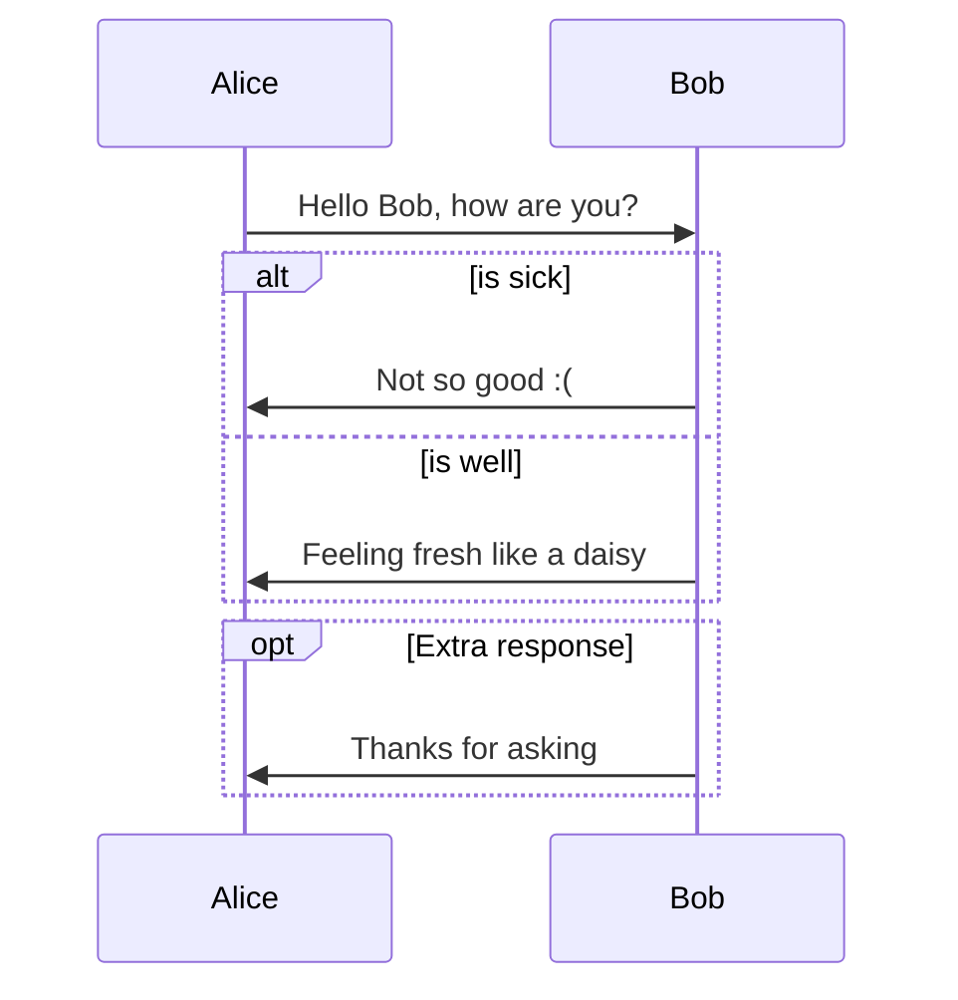
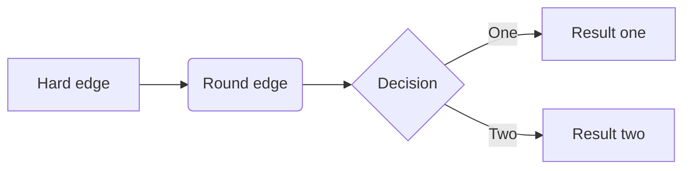
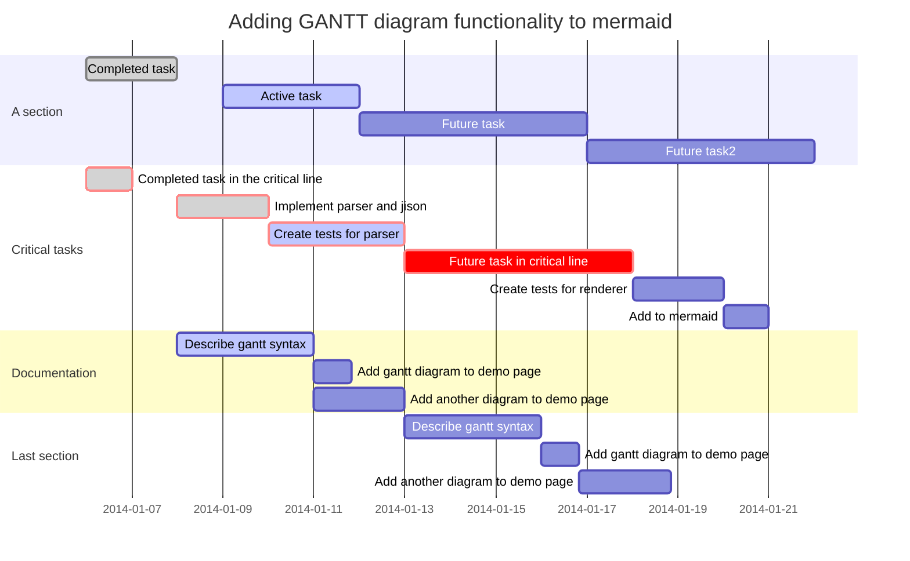

[Typora Support](http://support.typora.io/)

# Quick Strart


## Markdown Reference

### Block Elements

#### Task List

```markdown
- [ ] a task list item
- [ ] list syntax required
- [ ] normal **formatting**, @mentions, #1234 refs
- [ ] incomplete
- [x] completed
```

- [ ] a task list item
- [ ] list syntax required
- [ ] normal **formatting**, @mentions, #1234 refs
- [ ] incomplete
- [x] completed

#### Math Blocks
You can render LaTeX mathematical expressions using **MathJax**.

Input $$, then press ‘Return’ key will trigger an input field which accept Tex/LaTex source. Following is an example:

$$
\mathbf{V}_1 \times \mathbf{V}_2 =  \begin{vmatrix} 
\mathbf{i} & \mathbf{j} & \mathbf{k} \\
\frac{\partial X}{\partial u} &  \frac{\partial Y}{\partial u} & 0 \\
\frac{\partial X}{\partial v} &  \frac{\partial Y}{\partial v} & 0 \\
\end{vmatrix}
$$

In markdown source file, math block is LaTeX expression wrapped by ‘$$’ mark:

```latex
$$
\mathbf{V}_1 \times \mathbf{V}_2 =  \begin{vmatrix} 
\mathbf{i} & \mathbf{j} & \mathbf{k} \\
\frac{\partial X}{\partial u} &  \frac{\partial Y}{\partial u} & 0 \\
\frac{\partial X}{\partial v} &  \frac{\partial Y}{\partial v} & 0 \\
\end{vmatrix}
$$
```

### Span Elements

#### Images

```markdown


```

#### Emoji ``:happy:``
Input emoji with syntax :smile:.

User can trigger auto-complete suggestions for emoji by pressing ESC key, or trigger it automatically after enable it on preference panel. Also, input UTF8 emoji char directly from Edit -> Emoji & Symbols from menu bar is also supported.

#### Inline Math
To use this feature, first, please enable it in Preference Panel -> Markdown Tab. Then use ``$`` to wrap TeX command, for example: ``$\lim_{x \to \infty} \exp(-x) = 0$`` will be rendered as LaTeX command.

To trigger inline preview for inline math: input “$”, then press ESC key, then input TeX command, a preview tooltip will be visible like below:


#### Subscript
To use this feature, first, please enable it in Preference Panel -> Markdown Tab. Then use ~ to wrap subscript content, for example: H~2~O, X~long\ text~/

#### Superscript
To use this feature, first, please enable it in Preference Panel -> Markdown Tab. Then use ^ to wrap superscript content, for example: X^2^.

#### Highlight
To use this feature, first, please enable it in Preference Panel -> Markdown Tab. Then use == to wrap highlight content, for example: ==highlight==.

## Draw Diagrams With Markdown

[Draw Diagrams With Markdown](http://support.typora.io/Draw-Diagrams-With-Markdown/)

### Sequence

```sequence
Alice->Bob: Hello Bob, how are you?
Note right of Bob: Bot thinks
Bob->Alice: I am good thanks!
```

### Flow chart

```flow
st=>start: Start
op=>operation: Your Operation
cond=>condition: Yes or No?
e=>end

st->op->cond
cond(yes)->e
cond(no)->op
```

### Mermaid

#### Sequence



#### Flowchart



#### Gantt


